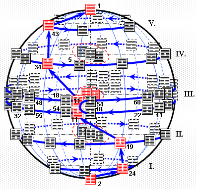

# Book of Changes

As `Classic of Changes` or `Book of Changes`, is an ancient Chinese divination text and the oldest of the Chinese classics. Possessing a history of more than two and a half millennia of commentary and interpretation, the [Yì Jīng](https://ctext.org/book-of-changes) is an influential text read throughout the world.

## Notes

An [Yì Jīng](https://ctext.org/book-of-changes) (Chinese: 易经) (or `I Ching`) interpretation is performed by making six binary decisions (a hexagram). This is called 'casting the I Ching'. These are written down as a stack of six solid or broken lines. This was traditionally done either by tossing yarrow stalks or coins, although there is no reason why the hexagrams can't be generated by some other means (such as a computer program).

There are actually four possible values for each of the lines; the two on/off values, and a line which changes from on to off or vice versa. Thus one cast of the I Ching can generate two different hexagrams, which adds depth to the interpretation. The sophistication of this method has not escaped modern interpretation, and the four-valued logic has been compared to the biochemistry of [DNA amino acid](https://www.genome.gov/genetics-glossary/Genetic-Code).

### [Donate with Nano](https://nano.to/nano_1epekqnnr185e6dparfchfy7zbthfddu7isatwqo9yoaejs6qztiza3rs8kr?title=Donate&success_url=https://88o.io/success?id={{id}}&cancel_url=https://88o.io/)

| ☷ | ☶ | ☵ | ☴ | ☳ | ☲ | ☱ | ☰ | ∞ |
|---|---|---|---|---|---|---|---|---|
| [䷁](0.0.md) | [䷖](0.1.md) | [䷇](0.2.md) | [䷓](0.3.md) | [䷏](0.4.md) | [䷢](0.5.md) | [䷬](0.6.md) | [䷋](0.7.md) | ☷ |
| [䷎](1.0.md) | [䷳](1.1.md) | [䷦](1.2.md) | [䷴](1.3.md) | [䷽](1.4.md) | [䷷](1.5.md) | [䷞](1.6.md) | [䷠](1.7.md) | ☶ |
| [䷆](2.0.md) | [䷃](2.1.md) | [䷜](2.2.md) | [䷺](2.3.md) | [䷧](2.4.md) | [䷿](2.5.md) | [䷮](2.6.md) | [䷅](2.7.md) | ☵ |
| [䷭](3.0.md) | [䷑](3.1.md) | [䷯](3.2.md) | [䷸](3.3.md) | [䷟](3.4.md) | [䷱](3.5.md) | [䷛](3.6.md) | [䷫](3.7.md) | ☴ |
| [䷗](4.0.md) | [䷚](4.1.md) | [䷂](4.2.md) | [䷩](4.3.md) | [䷲](4.4.md) | [䷔](4.5.md) | [䷐](4.6.md) | [䷘](4.7.md) | ☳ |
| [䷣](5.0.md) | [䷕](5.1.md) | [䷾](5.2.md) | [䷤](5.3.md) | [䷶](5.4.md) | [䷝](5.5.md) | [䷰](5.6.md) | [䷌](5.7.md) | ☲ |
| [䷒](6.0.md) | [䷨](6.1.md) | [䷻](6.2.md) | [䷼](6.3.md) | [䷵](6.4.md) | [䷥](6.5.md) | [䷹](6.6.md) | [䷉](6.7.md) | ☱ |
| [䷊](7.0.md) | [䷙](7.1.md) | [䷄](7.2.md) | [䷈](7.3.md) | [䷡](7.4.md) | [䷍](7.5.md) | [䷪](7.6.md) | [䷀](7.7.md) | ☰ |

|  | Nature | Feature | Body | Animal |  | 
|---| :-: | :--: | :--: | :--: | :-: | 
| ☷ | Earth | Receptive | Belly | Bull | Earth |
| ☶ | Mountain | Still | Hand | Dog | Earth |
| ☵ | Water | Sinking | Ear | Cattle | Water |
| ☴ | Wind | Pneumatic | Thigh | Rooster | Wood |
| ☳ | Thunder | Arousing | Foot | Dragon | Wood |
| ☲ | Fire | Clinging | Eye | Pheasant | Fire |
| ☱ | Marsh | Pleasing | Mouth | Ram | Metal |
| ☰ | Heaven | Bouncing | Head | Horse | Metal |

A line **⚊** is called `NINE`, undivided.

A line **⚋** is called `SIX`, divided.

Read the HEXAGRAM from bottom to top.

For example, **䷇** means: `SIX`, `SIX`, `SIX`, `SIX`, `SIX`, `NINE`, `SIX`.
 
| * | * | * | * | * | * | * | * | * | * |
| - | :-: | :-: | :-: | :-: | :-: | :-: | :-: | :-: | - |
| * | `01` | `02` | `03` | `04` | `05` | `06` | `07` | `08` | * |
| * | qián | kūn | zhūn | méng | xū | sòng | shī | bǐ | * |
| * | [䷀](en/e4b9beqian.md) | [䷁](en/e59da4kun.md) | [䷂](en/e5b1afzhun.md) | [䷃](en/e89299meng.md) | [䷄](en/e99c80xu.md) | [䷅](en/e8aebcsong.md) | [䷆](en/e5b888shi.md) | [䷇](en/e6af94bi.md) | * |
| * | 乾 | 坤 | 屯 | 蒙 | 需 | 讼 | 师 | 比 | * |
| * | `09` | `10` | `11` | `12` | `13` | `14` | `15` | `16` | * |
| * | xiǎo xù | lǚ | tài | pǐ | tóng rén | dà yǒu | qiān| yǜ | * |
| * | [䷈](en/e5b08fe7959cxiaoxu.md) | [䷉](en/e5b1a5lv.md) | [䷊](en/e6b3b0tai.md) | [䷋](en/e590a6pi.md) | [䷌](en/e5908ce4babatongren.md) | [䷍](en/e5a4a7e69c89dayou.md) | [䷎](en/e8b0a6qian.md) | [䷏](en/e8b1abyu.md) | * |
| * | 小畜 | 履 | 泰 | 否 | 同人 | 大有 | 谦 | 豫 | * |
| * | `17` | `18` | `19` | `20` | `21` | `22` | `23` | `24` | * |
| * | suí | gǔ | lín | guān | shì kè | bì | bō | fù | * |
| * | [䷐](en/e99a8fsui.md) | [䷑](en/e89b8agu.md) | [䷒](en/e4b8b4lin.md) | [䷓](en/e8a782guan.md) | [䷔](en/e599ace59791shike.md) | [䷕](en/e8b4b2bi.md) | [䷖](en/e589a5bo.md) | [䷗](en/e5a48dfu.md) | * |
| * | 随 | 蛊 | 临 | 观 | 噬嗑 | 贲 | 剥 | 复 | * |
| * | `25` | `26` | `27` | `28` | `29` | `30` | `31` | `32` | * |
| * | wú wàng | dà xù | yí | dà guò | kǎn | lí | xián | héng | * |
| * | [䷘](en/e697a0e5a684wuwang.md) | [䷙](en/e5a4a7e89384daxu.md) | [䷚](en/e9a290yi.md) | [䷛](en/e5a4a7e8bf87daguo.md) | [䷜](en/e59d8ekan.md) | [䷝](en/e7a6bbli.md) | [䷞](en/e592b8xian.md) | [䷟](en/e68192heng.md) | * |
| * | 无妄 | 大畜 | 颐 | 大过 | 坎 | 离 | 咸 | 恒 | * |
| * | `33` | `34` | `35` | `36` | `37` | `38` | `39` | `40` | * |
| * | dùn | dà zhuàng | jìn | míng yí | jiā rén | kuí | jiǎn | xiè | * |
| * | [䷠](en/e981afdun.md) | [䷡](en/e5a4a7e5a3aedazhuang.md) | [䷢](en/e6998bjin.md) | [䷣](en/e6988ee5a4b7mingyi.md) | [䷤](en/e5aeb6e4babajiaren.md) | [䷥](en/e79dbdkui.md) | [䷦](en/e8b987jian.md) | [䷧](en/e8a7a3xie.md) | * |
| * | 遯 | 大壮 | 晋 | 明夷 | 家人 | 睽 | 蹇 | 解 | * |
| * | `41` | `42` | `43` | `44` | `45` | `46` | `47` | `48` | * |
| * | sǔn | yì | guài | gòu | cuì | shēng | kùn | jǐng | * |
| * | [䷨](en/e68d9fsun.md) | [䷩](en/e79b8ayi.md) | [䷪](en/e5a4acguai.md) | [䷫](en/e5a7a4gou.md) | [䷬](en/e89083cui.md) | [䷭](en/e58d87sheng.md) | [䷮](en/e59bb0kun.md) | [䷯](en/e4ba95jing.md) | * |
| * | 损 | 益 | 夬 | 姤 | 萃 | 升 | 困 | 井 | * |
| * | `49` | `50` | `51` | `52` | `53` | `54` | `55` | `56` | * |
| * | gé | dǐng | zhèn | gèn | jiàn | guī mèi | fēng | lǚ | * |
| * | [䷰](en/e99da9ge.md) | [䷱](en/e9bc8eding.md) | [䷲](en/e99c87zhen.md) | [䷳](en/e889aegen.md) | [䷴](en/e6b890jian.md) | [䷵](en/e5bd92e5a6b9guimei.md) | [䷶](en/e4b8b0feng.md) | [䷷](en/e69785lv.md) | * |
| * | 革 | 鼎 | 震 | 艮 | 渐 | 归妹 | 丰 | 旅 | * |
| * | `57` | `58` | `59` | `60` | `61` | `62` |  `63` | `64` | * |
| * | xùn | duì | huàn | jié | zhōng fú  | xiǎo guò | jì jì | wèi jì | * |
| * | [䷸](en/e5b7bdxun.md) | [䷹](en/e58591dui.md) | [䷺](en/e6b6a3huan.md) | [䷻](en/e88a82jie.md) | [䷼](en/e4b8ade5ad9azhongfu.md) | [䷽](en/e5b08fe8bf87xiaoguo.md) | [䷾](en/e697a2e6b58ejiji.md) | [䷿](en/e69caae6b58eweiji.md) | * |
| * | 巽 | 兑 | 涣 | 节 | 中孚 | 小过 | 既济 | 未济 | * |
| * | * | * | * | * | * | * | * | * | * |

### [Jīng Shì Yì Zhuàn](jing/README_en.md)

- [中文版](README_CN.md)
