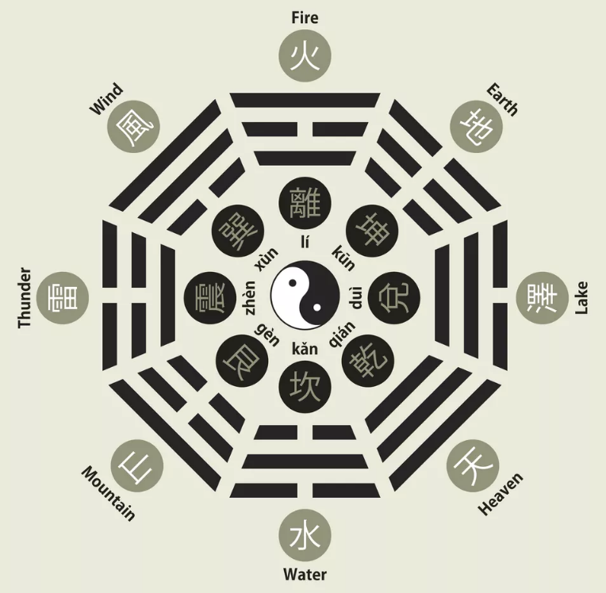

# 易之书

- [English Version](README.md)

《周易》是一部古老而又灿烂的文化瑰宝，古人用它来预测未来、决策国家大事、反映当前现象。

古人把三种爻组合在一起变成卦，卦的组合有八种，所以又称为《八卦》。

《八卦》的八种物质代表：

天[乾 ☰]、地[坤 ☷]、雷[震 ☳]、风[巽 ☴]、水[坎 ☵]、火[离 ☲]、山[艮 ☶]、泽[兑 ☱]。

[《易经·说卦》](https://ctext.org/dictionary.pl?if=en&id=81915&remap=gb)：
“是以立天之道曰阴与阳；立地之道曰柔与刚；立人之道曰仁与义；兼三才而两之，故《易》六画而成卦。”

[《京氏易传》](jing/README.md)：“八卦分阴阳，六位，五行。光明四通，变易立节，天地若不变易，不能通气。五行迭终，四时更废，变动不居，周流六虚，上下无常，刚柔相易。不可以为典要，惟变所适。吉凶共列于位，进退明乎机要，易之变化，六爻不可据，以随时所占。”

《易》中的八经卦﹐两两重复排列为六十四卦。

- **乾**为天（第1卦）：源动力刚健，利于开创伟业。
- **坤**为地（第2卦）：宽宏包容力强，利于生养万物。
- 水雷**屯**（第3卦）：有艰难险阻，宜于屯聚力量。
- 山水**蒙**（第4卦）：浑沌初开，适宜充实学养。
- 水天**需**（第5卦）：时机未到，要耐心等待。
- 天水**讼**（第6卦）：碰到口舌是非。
- 地水**师**（第7卦）：以正压邪，率众讨伐。
- 水地**比**（第8卦）：随和，亲善，与人和睦相处。
- 风天**小畜**（第9卦）：积累尚浅，不够充分。
- 天泽**履**（第10卦）：大力践行，礼节行事。
- 地天**泰**（第11卦）：通泰，通畅，诸事恒通。
- 天地**否**（第12卦）：受阻，闭塞，无能为力。
- 天火**同人**（第13卦）：随大流，从众为要。
- 火天**大有**（第14卦）：喜获丰收。
- 地山**谦**（第15卦）：谦逊谨慎，深藏不露。
- 雷地**豫**（第16卦）：欢快愉悦，心畅事宜。
- 泽雷**随**（第17卦）：步人后尘，归顺强者。
- 山风**蛊**（第18卦）：拨乱反正，不避亲贤。
- 地泽**临**（第19卦）：贵人莅临，高人惠顾。
- 风地**观**（第20卦）：考察，观望，三思而后行。
- 火雷**噬嗑**（第21卦）：坚持沟通，有效交流。
- 山火**贲**（第22卦）：内重礼仪，外树形象。
- 山地**剥**（第23卦）：去伪存真。
- 地雷**复**（第24卦）：迷途知返。
- 天雷**无妄**（第25卦）：无妄为，无过失。
- 山天**大畜**（第26卦）：积畜已久，准备充分。
- 山雷**颐**（第27卦）：颐养身心。
- 泽风**大过**（第28卦）：太过分，已遭损失。
- **坎**为水（第29卦）：坎险拦路。
- **离**为火（第30卦）：外露，炫耀，宜收敛。
- 泽山**咸**（第31卦）：心有灵犀，感应灵通。
- 雷风**恒**（第32卦）：恒久不变。
- 天山**遯**（第33卦）：逃遁，隐退。
- 雷天**大壮**（第34卦）：众目睽睽，招风惹火。
- 火地**晋**（第35卦）：晋升，前进。
- 地火**明夷**（第36卦）：老道沉稳，自觉规避风险。
- 风火**家人**（第37卦）：治家在先。
- 火泽**睽**（第38卦）：反目，背驰。
- 水山**蹇**（第39卦）：艰险，难关。
- 雷水**解**（第40卦）：解开，释放。
- 山泽**损**（第41卦）：损失，受损。
- 风雷**益**（第42卦）：收益，受益。
- 泽天**夬**（第43卦）：有缺陷，不完整
- 天风**姤**（第44卦）：邂逅，巧合，疏而不密。
- 泽地**萃**（第45卦）：出类拔萃。
- 地风**升**（第46卦）：上升，提升。
- 泽水**困**（第47卦）：受困，被围。
- 水风**井**（第48卦）：规划，约束，坚守。
- 泽火**革**（第49卦）：改变，革新。
- 火风**鼎**（第50卦）：独当一面，极致。
- **震**为雷（第51卦）：欲动，发动，行动。
- **艮**为山（第52卦）：壁垒，受阻。
- 风山**渐**（第53卦）：渐进，缓行。
- 雷泽**归妹**（第54卦）：结亲，结缘，缔结亲缘。
- 雷火**丰**（第55卦）：丰富，张扬。
- 火山**旅**（第56卦）：旅行，客居。
- **巽**为风（第57卦）：风行，上行下效 。
- **兑**为泽（第58卦）：谈话，愉悦。
- 风水**涣**（第59卦）：涣散，发散。
- 水泽**节**（第60卦）：节制，暂止。
- 风泽**中孚**（第61卦）：守正，诚信。
- 雷山**小过**（第62卦）：过火，可补救过失。
- 水火**既济**（第63卦）：心想事成，顺畅。
- 火水**未济**（第64卦）：事业未竟，尚需努力。

| * | * | * | * | * | * | * | * | * | * |
| - | :-: | :-: | :-: | :-: | :-: | :-: | :-: | :-: | - |
| * | 乾 | 坤 | 屯 | 蒙 | 需 | 讼 | 师 | 比 | * |
| * | [䷀](cn/e4b9beqian_cn.md) | [䷁](cn/e59da4kun_cn.md) | [䷂](cn/e5b1afzhun_cn.md) | [䷃](cn/e89299meng_cn.md) | [䷄](cn/e99c80xu_cn.md) | [䷅](cn/e8aebcsong_cn.md) | [䷆](cn/e5b888shi_cn.md) | [䷇](cn/e6af94bi_cn.md) | * |
| * | qián | kūn | zhūn | méng | xū | sòng | shī | bǐ | * |
| * | 小畜 | 履 | 泰 | 否 | 同人 | 大有 | 谦 | 豫 | * |
| * | [䷈](cn/e5b08fe7959cxiaoxu_cn.md) | [䷉](cn/e5b1a5lv_cn.md) | [䷊](cn/e6b3b0tai_cn.md) | [䷋](cn/e590a6pi_cn.md) | [䷌](cn/e5908ce4babatongren_cn.md) | [䷍](cn/e5a4a7e69c89dayou_cn.md) | [䷎](cn/e8b0a6qian_cn.md) | [䷏](cn/e8b1abyu_cn.md) | * |
| * | xiǎo xù | lǚ | tài | pǐ | tóng rén | dà yǒu | qiān| yǜ | * |
| * | 随 | 蛊 | 临 | 观 | 噬嗑 | 贲 | 剥 | 复 | * |
| * | [䷐](cn/e99a8fsui_cn.md) | [䷑](cn/e89b8agu_cn.md) | [䷒](cn/e4b8b4lin_cn.md) | [䷓](cn/e8a782guan_cn.md) | [䷔](cn/e599ace59791shike_cn.md) | [䷕](cn/e8b4b2bi_cn.md) | [䷖](cn/e589a5bo_cn.md) | [䷗](cn/e5a48dfu_cn.md) | * |
| * | suí | gǔ | lín | guān | shì kè | bì | bō | fù | * |
| * | 无妄 | 大畜 | 颐 | 大过 | 坎 | 离 | 咸 | 恒 | * |
| * | [䷘](cn/e697a0e5a684wuwang_cn.md) | [䷙](cn/e5a4a7e89384daxu_cn.md) | [䷚](cn/e9a290yi_cn.md) | [䷛](cn/e5a4a7e8bf87daguo_cn.md) | [䷜](cn/e59d8ekan_cn.md) | [䷝](cn/e7a6bbli_cn.md) | [䷞](cn/e592b8xian_cn.md) | [䷟](cn/e68192heng_cn.md) | * |
| * | wú wàng | dà xù | yí | dà guò | kǎn | lí | xián | héng | * |
| * | 遯 | 大壮 | 晋 | 明夷 | 家人 | 睽 | 蹇 | 解 | * |
| * | [䷠](cn/e981afdun_cn.md) | [䷡](cn/e5a4a7e5a3aedazhuang_cn.md) | [䷢](cn/e6998bjin_cn.md) | [䷣](cn/e6988ee5a4b7mingyi_cn.md) | [䷤](cn/e5aeb6e4babajiaren_cn.md) | [䷥](cn/e79dbdkui_cn.md) | [䷦](cn/e8b987jian_cn.md) | [䷧](cn/e8a7a3xie_cn.md) | * |
| * | dùn | dà zhuàng | jìn | míng yí | jiā rén | kuí | jiǎn | xiè | * |
| * | 损 | 益 | 夬 | 姤 | 萃 | 升 | 困 | 井 | * |
| * | [䷨](cn/e68d9fsun_cn.md) | [䷩](cn/e79b8ayi_cn.md) | [䷪](cn/e5a4acguai_cn.md) | [䷫](cn/e5a7a4gou_cn.md) | [䷬](cn/e89083cui_cn.md) | [䷭](cn/e58d87sheng_cn.md) | [䷮](cn/e59bb0kun_cn.md) | [䷯](cn/e4ba95jing_cn.md) | * |
| * | sǔn | yì | guài | gòu | cuì | shēng | kùn | jǐng | * |
| * | 革 | 鼎 | 震 | 艮 | 渐 | 归妹 | 丰 | 旅 | * |
| * | [䷰](cn/e99da9ge_cn.md) | [䷱](cn/e9bc8eding_cn.md) | [䷲](cn/e99c87zhen_cn.md) | [䷳](cn/e889aegen_cn.md) | [䷴](cn/e6b890jian_cn.md) | [䷵](cn/e5bd92e5a6b9guimei_cn.md) | [䷶](cn/e4b8b0feng_cn.md) | [䷷](cn/e69785lv_cn.md) | * |
| * | gé | dǐng | zhèn | gèn | jiàn | guī mèi | fēng | lǚ | * |
| * | 巽 | 兑 | 涣 | 节 | 中孚 | 小过 | 既济 | 未济 | * |
| * | [䷸](cn/e5b7bdxun_cn.md) | [䷹](cn/e58591dui_cn.md) | [䷺](cn/e6b6a3huan_cn.md) | [䷻](cn/e88a82jie_cn.md) | [䷼](cn/e4b8ade5ad9azhongfu_cn.md) | [䷽](cn/e5b08fe8bf87xiaoguo_cn.md) | [䷾](cn/e697a2e6b58ejiji_cn.md) | [䷿](cn/e69caae6b58eweiji_cn.md) | * |
| * | xùn | duì | huàn | jié | zhōng fú  | xiǎo guò |  jì jì | wèi jì | * |
| * | * | * | * | * | * | * | * | * | * |
