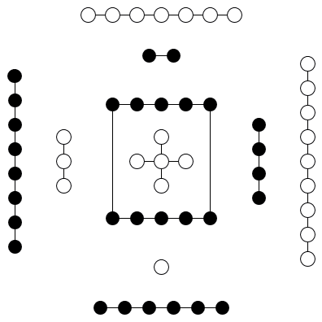
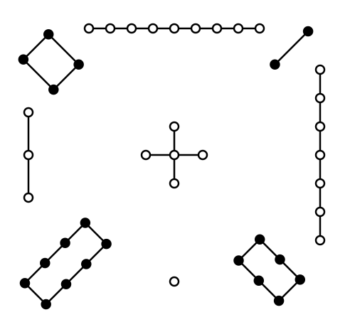

# APPENDIX VIII

<a id="p-14"/>

It is a moot question who first multiplied the figures from the trigrams universally ascribed to [Fú Xī](https://en.wikipedia.org/wiki/Fuxi) to the 64 hexagrams of the `Yì Jīng`([易经](https://ctext.org/book-of-changes/yi-jing))) The more common view is that it was [king Wén](https://en.wikipedia.org/wiki/King_Wen_of_Zhou).; but [Zhū Xī](https://en.wikipedia.org/wiki/Zhu_Xi), when he was questioned on the subject, rather inclined to hold that [Fú Xī](https://en.wikipedia.org/wiki/Fuxi) had multiplied them himself, but declined to say whether he thought that their names were as old as the figures themselves, or only dated from the twelfth century B.C. I will not venture to controvert his opinion about the multiplication of the figures, but I must think that the names, as we have them now, were from [king Wén](https://en.wikipedia.org/wiki/King_Wen_of_Zhou).

No Chinese writer has tried to explain why the framers stopped with the 64 hexagrams, instead of going on to `128 figures of 7 lines`, `256 of 8`, `512 of 9`, and so on indefinitely. No reason can be given for it, but the cumbrousness of the result, and the impossibility of dealing, after the manner of king Wăn, with such a mass of figures.

[The 73rd paragraph of Section I](appendix03s1.md#p-374), with but one paragraph between it and the two others which we have been considering, gives what may be considered a third account of the origin of the lineal figures: -- 'Heaven produced the spirit-like things (the tortoise and the divining plant), and the sages took advantage of them. (The operations of) heaven and earth are marked by so many changes and transformations, and the sages imitated them (by means of the [Yì Jīng](https://ctext.org/book-of-changes). Heaven hangs out its (brilliant) figures, from which are seen good fortune and bad, and the sages made their emblematic interpretations accordingly. The Ho gave forth the scheme or map, and the Lo gave forth the writing, of (both of) which the sages took advantage.'

The words with which we have at present to do are 'The `Hé`([河](https://ctext.org/dictionary.pl?if=en&char=%E6%B2%B3), that is, the Yellow River) gave forth the Map.' This map, according to tradition and popular belief, contained a scheme which served as a model to [Fú Xī](https://en.wikipedia.org/wiki/Fuxi) in making his 8 trigrams. Apart from this passage in the [Yì Jīng](https://ctext.org/book-of-changes), we know that Confucius believed in such a map, or spoke at least as if he did. In the `Record of Rites` it is said that '*the map was borne by a horse*;' and the thing, whatever it was, is mentioned in the [Shū Jīng](https://ctext.org/shang-shu) as still preserved at court, among other curiosities, in B.C. 1079. The story of it, as now current, is this, that `a dragon-horse` issued from the Yellow River, bearing on its back an arrangement of marks, from which [Fú Xī](https://en.wikipedia.org/wiki/Fuxi) got the idea of the trigrams.

<a id="p-15"/>

All this is so evidently fabulous that it seems a waste of time to enter into any details about it. My reason for doing so is a wish to take advantage of the map in giving such a statement of the rules observed in interpreting the figures as is necessary in this Introduction.



The map that was preserved, it has been seen, in the eleventh century B.C., afterwards perished, and though there was much speculation about its form from the time that the restoration of the ancient classics was undertaken in the [Hàn dynasty](https://en.wikipedia.org/wiki/Han_dynasty), the first delineation of it given to the public was in the reign of [Huī Zōng](https://en.wikipedia.org/wiki/Emperor_Huizong_of_Song) of the Sòng dynasty (A. D. 1101-1125). The most approved scheme of it is the following: -- It will be observed that the markings in this scheme are small circles, pretty nearly equally divided into dark and light. All of them whose numbers are odd are light circles, `1, 3, 5, 7, 9`; and all of them whose numbers are even are dark, -- `2, 4, 6, 8, 10`. This is given as the origin of what is said in [paragraphs 49 and 50 of Section I](appendix03s1.md#fr_262) about the numbers of heaven and earth. The difference in the colour of the circles occasioned the distinction of them and of what they signify into `yīng` and `yáng`, the `dark` and the `bright`, the `moon-like` and the `sun-like`; for the `sun` is called the `Great Brightness`(`Tài Yáng`[太阳](https://g.co/kgs/me9gT6)), and the `moon` is called the `Great Obscurity`(`Tài Yīng`[太阴](https://en.wikipedia.org/wiki/Moon)). I shall have more to say in the next chapter on the application of these names. [Fú Xī](https://en.wikipedia.org/wiki/Fuxi) in making the trigrams, and [king Wén](https://en.wikipedia.org/wiki/King_Wen_of_Zhou), if it was he who first multiplied them to the 64 hexagrams, found it convenient to use lines instead of the circles: -- the whole line (<font size="5">⚊</font>) for the bright circle (○), and the divided line (<font size="5">⚋</font>) for the dark (●). The first, the third, and the fifth lines in a hexagram, if they are 'correct' as it is called, should all be whole, and the second, fourth, and sixth lines should all be divided. `Yáng` lines are strong (or hard), and `Yīn` lines are weak (or soft). The former indicate vigour and authority; the latter, feebleness and submission. It is the part of the former to command; of the latter to obey.

<a id="p-16"/>

The lines, moreover, in the two trigrams that make up the hexagrams, and characterise the subjects which they represent, are related to one another by their position, and have their significance modified accordingly. The first line and the fourth, the second and the fifth,. the third and the sixth are all correlates; and to make the correlation perfect the two members of it should be lines of different qualities, one whole and the other divided. And, finally, the middle lines of the trigrams, the second and fifth, that is, of the hexagrams, have a peculiar value and force. If we have a whole line (<font size="5">⚊</font>) in the fifth place, and a divided line (<font size="5">⚋</font>) in the second, or vice versa, the correlation is complete. Let the subject of the fifth be the sovereign or a commander-in-chief, according to the name and meaning of the hexagram, then the subject of the second will be an able minister or a skilful officer, and the result of their mutual action will be most beneficial and successful. It is specially important to have a clear idea of the name of the hexagram, and of the subject or state which it is intended to denote. The significance of all the lines comes thus to be of various application, and will differ in different hexagrams.

<a id="p-17"/>

I have thus endeavoured to indicate how the lineal figures were formed, and the principal rules laid down for the interpretation of them. The details are wearying, but my position is like that of one who is called on to explain an important monument of architecture, very bizarre in its conception and execution. A plainer, simpler structure might have answered the purpose better, but the architect had his reasons for the plan and style which he adopted. If the result of his labours be worth expounding, we must not grudge the study necessary to detect his processes of thought, nor the effort and time required to bring the minds of others into sympathy with his.

My own opinion, as I have intimated, is, that the second, account of the origin of the trigrams and hexagrams is the true one. However the idea of the whole and divided lines arose in the mind of the first framer, we must start from them; and then, manipulating them in the manner described, we arrive, very easily, at all the lineal figures, and might proceed to multiply them to billions. We cannot tell who devised the third account of their formation from the map or scheme on the dragon-horse of the, Yellow River. Its object, no doubt, was to impart a supernatural character to the trigrams and produce a religious veneration for them. It may be doubted whether the scheme as it is now fashioned be the correct one, -- such as it was in the [Zhōu dynasty](https://en.wikipedia.org/wiki/Zhou_dynasty). The paragraph where it is mentioned, goes on to say -- 'The [Luò Shū](https://zh.wikipedia.org/wiki/河圖洛書#洛書的形成) produced the writing.' This writing was a scheme of the same character as the [Hé Tú](https://zh.wikipedia.org/wiki/河圖洛書#河圖的形成), but on the back of a tortoise, which emerged from the [river Luò](https://en.wikipedia.org/wiki/Luo_River_(Henan)), and showed it to [the Great Yǚ](https://en.wikipedia.org/wiki/Yu_the_Great), when he was engaged in his celebrated work of draining off the waters of the flood, as related in the [Shū Jīng](https://ctext.org/shang-shu). To the hero sage it suggested `the Great Plan`, an interesting but mystical document of the same classic, `a Treatise`, according to [Gaubil](https://en.wikipedia.org/wiki/Antoine_Gaubil), of `Physics, Astrology, Divination, Morals, Politics, and Religion`, the great model for the government of the kingdom. The accepted representation of this writing is the following: --

<a id="p-18"/>



But substituting numbers for the number of marks, we have

| 4 | 9 | 2 | 
| :-: | :-: | :-: |
| 3 | 5 | 7 | 
| 8 | 1 | 6 | 

This is nothing but the arithmetical puzzle, in which the numbers from `1 to 9` are arranged so as to make `15` in whatever way we add them. If we had the original form of '[the River Map](#p-15),' we should probably find it a numerical trifle, not more difficult, not more supernatural, than this magic square.

<a id="p-36"/>

We proceed to the second Appendix, which professes to do for the [duke of Zhōu](https://en.wikipedia.org/wiki/Duke_of_Zhou)'s symbolical exposition of the several lines what the `Tuàn Zhuàn`([彖传](https://ctext.org/book-of-changes/tuan-zhuan)) does for the entire figures. The work here, however, is accomplished with less trouble and more briefly. The whole bears the name of `Xiàng Zhuàn`([象传](https://ctext.org/book-of-changes/xiang-zhuan)), 'Treatise on the Symbols' or 'Treatise on the Symbolism (of the `Yì Jīng`([易经](https://ctext.org/book-of-changes/yi-jing))).' If there were reason to think that it came in any way from Confucius, I should fancy that I saw him sitting with a select class of his disciples around him. They read the [duke]((https://en.wikipedia.org/wiki/Duke_of_Zhou))'s Text column after column, and the master drops now a word or two, and now a sentence or two, that illuminate the meaning. The disciples take notes on their tablets, or store his remarks in their memories, and by and by they write them out with the whole of the, Text or only so much of it as is necessary. Whoever was the original lecturer, the Appendix, I think, must have grown up in this way.

It would not be necessary to speak of it at greater length, if it were not that the six paragraphs on the symbols of the [duke of Zhōu](https://en.wikipedia.org/wiki/Duke_of_Zhou) are always preceded by one which is called '[the Great Symbolism](https://ctext.org/book-of-changes/xiang-zhuan),' and treats of the trigrams composing the hexagram, how they go together to form the six-lined figure, and how their blended meaning appears in the institutions and proceedings of the great men and kings of former days, and of the superior men of all time. The paragraph is for the most part, but by no means always, in harmony with the explanation of the hexagram by [king Wén](https://en.wikipedia.org/wiki/King_Wen_of_Zhou), and a place in the `Tuàn Zhuàn`([彖传](https://ctext.org/book-of-changes/tuan-zhuan)) would be more appropriate to it. I suppose that, because it always begins with the mention of the two symbolical trigrams, it is made, for the sake of the symmetry, to form a part of the [treatise on the Symbolism](https://ctext.org/book-of-changes/xiang-zhuan) of the [Yì Jīng](https://ctext.org/book-of-changes/yi-jing).

I will give a few examples of the paragraphs of [the Great Symbolism](https://ctext.org/book-of-changes/xiang-zhuan). The first hexagram <font size="10">䷀</font> is formed by a repetition of the trigram <font size="5">☰</font> `Qián`([乾](https://ctext.org/dictionary.pl?if=en&char=乾)) representing heaven, and it is said on it: -- '*Heaven in its motion (gives) the idea of strength. The superior man, in accordance with this, nerves himself to ceaseless activity.*'

The second hexagram <font size="10">䷁</font> is formed by a repetition of the trigram <font size="5">☷</font>`Kūn`([坤](https://ctext.org/dictionary.pl?if=en&char=坤)) representing the earth, and it is said on it: -- '*The capacious receptivity of the earth is what is denoted by Kūn. The superior man, in accordance with this, with his large virtue, supports men and things.*'

<a id="p-37"/>

The [forty-fourth hexagram](e5a7a4gou.md), called <font size="10">䷫</font>`Gòu`([姤](https://ctext.org/dictionary.pl?if=en&char=姤)), is formed by the trigrams <font size="5">☴</font>`Xùn`([巽](https://ctext.org/dictionary.pl?if=en&char=巽)), representing wind, and <font size="5">☰</font>`Qián`([乾](https://ctext.org/dictionary.pl?if=en&char=乾)) representing heaven or the sky, and it is said on it: -- '*(The symbol of) wind, beneath that of the sky, forms Gòu. In accordance with this, the sovereign distributes his charges, and promulgates his announcements throughout the four quarters (of the kingdom).*'

The [fifty-ninth hexagram](e6b6a3huan.md), called <font size="10">䷺</font>`Huàn`([涣](https://ctext.org/dictionary.pl?if=en&char=涣)) is formed by the trigrams <font size="5">☵</font>`Kǎn`([坎](https://ctext.org/dictionary.pl?if=en&char=坎)), representing water, and <font size="5">☴</font>`Xùn`([巽](https://ctext.org/dictionary.pl?if=en&char=巽)), representing wind, and it is said on it: -- '*(The symbol of) water and (that of wind) above it form Huàn. The ancient kings, in accordance with this, presented offerings to God, and established the ancestral temple.*' The union of the two trigrams suggested to [king Wén](https://en.wikipedia.org/wiki/King_Wen_of_Zhou) the idea of dissipation in the alienation of men from the Supreme Power, and of the minds of parents from their children; a condition which the wisdom of the ancient kings saw could best be met by the influences of religion.

One more example. The [twenty-sixth hexagram](e5a4a7e89384daxu.md), called <font size="10">䷙</font>`Dà Xù`([大畜](https://ctext.org/dictionary.pl?if=en&char=大畜)), is formed of the trigrams <font size="5">☰</font>`Qián`([乾](https://ctext.org/dictionary.pl?if=en&char=乾)), representing heaven or the sky, and <font size="5">☶</font>`Gèn`([艮](https://ctext.org/dictionary.pl?if=en&char=艮)), representing a mountain, and it is said on it: -- '*(The symbol of) heaven in the midst of a mountain forms Dà Xù. The superior man, in accordance with this, stores largely in his memory the words of former men and their conduct, to subserve the accumulation of his virtue.*' We are ready to exclaim and ask, 'Heaven, the sky, in the midst of a mountain! Can there be such a thing?' and [Zhū Xī](https://en.wikipedia.org/wiki/Zhu_Xi) will tell us in reply, '*No, there cannot be such a thing in reality; but you can conceive it for the purpose of the symbolism.*'

From this and the other examples adduced from [the Great Symbolism](https://ctext.org/book-of-changes/xiang-zhuan), it is clear that, so far as its testimony bears on the subject, [the trigrams](Bagua-name-earlier.svg) of [Fú Xī](https://en.wikipedia.org/wiki/Fuxi) did not receive their form and meaning with a deep intention that they should serve as the basis of a philosophical scheme concerning the constitution of heaven and earth and all that is in them. In this Appendix they are used popularly, just as one
```
'Finds tongues in trees, books in the running brooks,
Sermons in stones, and good in everything.'
```

<a id="p-38"/>

The writer moralises from them in an edifying manner. There is ingenuity, and sometimes instruction also, in what he says, but there is no mystery. Chinese scholars and gentlemen, however, who have got some little acquaintance with western science, are fond of saying that all the truths of electricity, heat, light, and other branches of European physics, are in the eight trigrams. When asked how then they and their countrymen have been and are ignorant of those truths, they say that they have to learn them first from western books, and then, looking into the [Yì Jīng](https://ctext.org/book-of-changes/yi-jing), they see that they were all known to Confucius more than 2000 years ago. The vain assumption thus manifested is childish; and until the Chinese drop their hallucination about the [Yì Jīng](https://ctext.org/book-of-changes/yi-jing) as containing all things that have ever been dreamt of in all philosophies, it will prove a stumbling-block to them, and keep them from entering on the true path of science.
