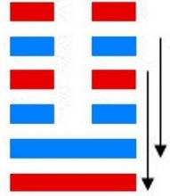
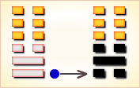
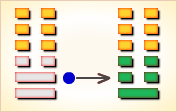
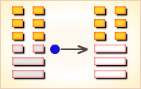
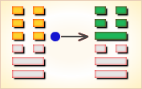
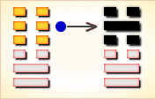
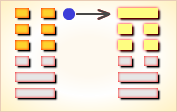

# 临 ䷒

临（䷒ lín）卦的代号是`6:0`，主卦是兑卦，阳数是`6`；客卦是坤卦，阳数是`0`。形势有利，主方应当紧紧抓住良好机遇果断地决策，积极行动，切不要错失良机。《临卦》的卦象是兑（泽）下，坤（地）上，为地在泽上之表象。泽上有地，地居高而临下，象征督导。君子由此受到启发，费尽心思地教导人民，并以其无边无际的盛德保护人民。《序卦传》说：“有事而后可大，故受之以临，临者大也。”因为发生事端，然后才可以大有发展，所以不能等待，应积极参与。

图中，红色表示当位的爻，天蓝色表示不当位的爻，箭头表示有应。

- 卦序：19

> 臨，元亨利貞，至于八月有凶。
>《彖》曰：臨，剛浸而長，說而順，剛中而應，大亨以正，天之道也；至于八月有凶，消不久也。
>《象》曰：澤上有地，臨。君子以教思无窮，容保民无疆。

> 初九，咸臨，貞吉。
>《象》曰：咸臨貞吉，志行正也。

> 九二，咸臨，吉，无不利。
>《象》曰：咸臨吉无不利，未順命也。

> 六三，甘臨，无攸利。既憂之，无咎。
>《象》曰：甘臨，位不當也，既憂之，咎不長也。

> 六四，至臨，无咎。
>《象》曰：至臨无咎，位當也。

> 六五，知臨，大君之宜，吉。
>《象》曰：大君之宜，行中之謂也。

> 上六，敦臨，吉，无咎。
>《象》曰：敦臨之吉，志在內也。

> 临（䷒ lín）卦是异卦，下兑上坤，相叠。坤为地，兑为泽，地高于泽，泽容于地。喻君主亲临天下，治国安邦，上下融洽。

>《象传》：池泽之水灌溉地面万物，相辅相成，生生不息。

> 诸事亨通，上下和合，前途有望，但不宜过于急进。

- 事业：正是成功的极好时机，务必抓紧，不可失去良机。但却不可就此满足，时运会很快消失，一定要从长计议，注意总结经验，团结他人，共同开拓新领域。
- 经商：会十分顺利，并有收获，但须随时注意市场动向，兢兢业业，防止出现意外的事故，尤其应妥善处理人际关系。
- 求名：自己的努力已到了收获的季节，应更加虚心，严格要求自己，谨慎小心地实现自己的目标。很可能出现意外，应以刚强的意志去从容对付，过于软弱将失去机会。
- 婚恋：加紧进行，全力以赴，双方以诚信相待，美满、和谐。
- 决策：头脑灵活，善于同他人交往，并有主见，具有领导才能。务必加强个人的全面修养，诚信待人，树立良好的个人威望，尤其要有远大的眼光，长久的计划，可以保证事业的发达和前程的光明。

临卦，坤上兑下，为[坤宫二世卦](../jing/kun.md#19)。临卦下兑为悦，上坤为顺，欢悦而顺从，保证可以亨通。以上临下，相佐相互；居安思危，时时慎戒。得此卦者，好运来到，诸事如意，人情和合，但行事不宜过于急进。

- 时运：活水流行，好运方来。
- 财运：经营有成，获利可期。
- 家宅：家业正旺；两姓和合。
- 身体：疾病拖延，不致危险。

> 临：表示大驾光临，贵人来到之意。主吉象。 临又为「君王临幸」之意，是上者对下者之象，在事业投资，为贵人相助之意。在感情则有期待而至的欢喜感。

> 解释：好事即将来临。

> 特性：待人热心，心胸开阔，乐于助人，尊重他人，体会别人心意，谦恭有礼。自然贵人多来帮助，财运丰厚。

> 运势：运势渐增，诸事亨通如意，前途有望，仕途有成，可得贵人相助，上下安合。以和顺可奏大功，宜诚心待人，可诸事顺畅，急进或忘形者，有破财之象。

- 家运：幸福圆满，切勿意气用事，否则有反。
- 疾病：病情较轻，为肠胃，口腔之疾，并防泌尿生殖系统病变。
- 胎孕：生贵子。求佛及家神则安。产妇慎饮食。
- 子女：得孝顺之儿女。
- 周转：可成。
- 买卖：防口舌，勿过急，和顺交易有利。
- 等人：有好消息且准时到。
- 寻人：西方或西南方，不必急，目下其人已动，自回。
- 失物：不能立即发现，很久才能找回。可能被埋在地下，是件会发声或震动的物件。
- 外出：在准备充分的情况下，立即行动，不必再犹豫。
- 考试：金榜题名。
- 诉讼：宜柔不宜刚，因本欲欺他人，反伤自己。
- 求事：顺利可成。
- 改行：吉利。
- 开业：开业正得其时，大吉大利。

### 初九：咸临，贞吉。《象》曰：咸临贞吉，志行正也。

以感化的政策治民。卜问得吉兆。《象传》：以感化的政策治民，治道贞正，自然吉利，因为居心端正，作风正派。

吉：得此爻者，会交好运，营谋称意。做官的会得到众人的拥戴，能升迁。读书人参加考试者必能考出佳绩。

- 时运：初交好运，守正大吉。
- 财运：新货推出，自然获利。
- 家宅：吉事临门；佳偶可成。
- 身体：初起之病，可保治愈。

初九爻动变得[第7卦：地水师](e5b888shi_cn.md)。

地水师䷆是异卦，下坎上坤，相叠。“师”指军队。坎为水、为险；坤为地、为顺，喻寓兵于农。兵凶战危，用兵乃圣人不得已而为之，但它可以顺利无阻碍地解决矛盾，因为顺乎形势，师出有名，故能化凶为吉。

### 九二：咸临，吉，无不利。《象》曰：咸临，吉无不利，未顺命也。

用温和的政策治民，吉利，无不吉利。《象传》：用温和的政策治民，吉利，无不吉利，因为百姓尚未驯化从命。

吉：得此爻者，营谋获利，但宜认清时机，不然不能成事，美中不足。做官的会光明磊落，地位清高。

- 时运：贵人相助，运气正佳。
- 财运：一再经营，依然获利。
- 家宅：福星高照；婚嫁亦吉。
- 身体：并无大碍；讼事未决。

九二爻动变得[第24卦：地雷复](e5a48dfu_cn.md)。

地雷复䷗是异卦，下震上坤，相叠。震为雷、为动；坤为地、为顺，动则顺，顺其自然。动在顺中，内阳外阴，循序运动，进退自如，利于前进。

### 六三：甘临，无攸利。即忧之，无咎。《象》曰：甘临，位不当也。即忧之，咎不长也。

用压服的政策治民，没有什么好处。如果有所忧悔，灾祸可以消除。《象传》：用压服的政策治民，正如六三阴爻不当居阳位一样，这样的君王不是称职的君主。如果能有所忧悔，其灾祸则可消除。

凶：得此爻者，有忧愁，会受苦劳累。做官的会受到小人的谗言攻击，志不能伸。

- 时运：知悔改正，后运可期。
- 财运：糖业有利，其余未必。
- 家宅：迁徙为宜；婚姻不合。
- 身体：药不对症，可服苦辛。

六三爻动变得[第11卦：地天泰](e6b3b0tai_cn.md)。

地天泰䷊是异卦，下乾上坤，相叠。乾为天，为阳；坤为地，为阴，阴阳交感，上下互通，天地相交，万物纷纭。反之则凶，万事万物，皆对立，转化，盛极必衰，衰而转盛，故应时而变者泰（通）。

### 六四：至临，无咎。《象》曰：至临无咎，位当也。

亲自理国治民，没有害处。《象传》：亲自理国治民，没有害处，正如六四阴爻居阴位一样。这样的君王是称职的君王。

平：得此爻者，人情和合，经营得利，但要成大事者，须谨慎而行，做好准备再进取。做官的会得到同僚的帮助。

- 时运：好运已到，有吉无凶。
- 财运：买卖得时，无往不利。
- 家宅：家业正旺；婚嫁合宜。
- 身体：危险之志，但仍可愈。

六四爻动变得[第54卦：雷泽归妹](e5bd92e5a6b9guimei_cn.md)。

雷泽归妹䷵是异卦，下兑上震，相叠。震为动、为长男；兑为悦、为少女。以少女从长男，产生爱慕之情，有婚姻之动，有嫁女之象，故称归妹。

### 六五：知临，大君之宜，吉。《象》曰：大君之宜，行中之谓也。

以明智治民，得君王之体，自然吉利。《象传》：得君王之体，因为六五之爻居上卦中位，像人行事得中正之道。

吉：得此爻者，万事如意。做官的会得到上司的赏识。

- 时运：正当好运，又有人助。
- 财运：了解商情，当然有利。
- 家宅：五福临门；宜室宜家。
- 身体：良医诊治，自然可愈。

六五爻动变得[第60卦：水泽节](e88a82jie_cn.md)。

水泽节䷻是异卦，下兑上坎，相叠。兑为泽，坎为水。泽有水而流有限，多必溢于泽外。因此要有节度，故称节。节卦与涣卦相反，互为综卦，交相使用。天地有节度才能常新，国家有节度才能安稳，个人有节度才能完美。

### 上六：敦临，吉，无咎。《象》曰：敦临之吉，志在内也。

以敦厚之道治民，吉利，自然无灾祸。《象传》：以敦厚之道治民，吉利，因为敦厚诚实之意存于内心。

吉：得此爻者，多获利，无往不利，但谨防气势太盛而变衰。做官的会得到上司的器重，委以重用。

- 时运：好运已止，忠厚无咎。
- 财运：贩卖内地，尚有利益。
- 家宅：忠厚肃穆。
- 身体：培养元气，自然健康。

上六爻动变得[第41卦：山泽损](e68d9fsun_cn.md)。

山泽损䷨是异卦，下兑上艮，相叠。艮为山；兑为泽。上山下泽，大泽浸蚀山根。损益相间，损中有益，益中有损。二者之间，不可不慎重对待。损下益上，治理国家，过度会损伤国基。应损则损，但必量力、适度。少损而益最佳。

# [Lín ䷒](e4b8b4lin.md)
