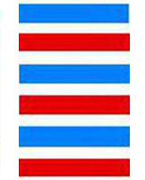

# 乾 ䷀

乾（䷀ qián）卦的代号是`7:7`，主卦和客卦都是`1`卦，**乾**卦。卦象是天，特性是强健。**乾**卦主显，是“显学”，[**坤**卦](e59da4kun.md)主隐，是隐学。两卦不可分割，乃是一个整体，是万物运动最本质的过程。**乾**卦讲的是一个事物从发生到繁荣的过程，即春生到夏长，与**坤**卦相反，**坤**卦讲秋收冬藏的过程。主方和客方都很强健，主卦和客卦的阳数比是`1:1`，是二个最大阳数的比，主客双方势均力敌，双方都有强大的力量，也都有同样的高亢缺点，可以是强健的竞争者，也可能是双赢的合作者，关键在于主方如何巧妙地处理。

> 困龙得水好运交，不由喜气上眉梢，一切谋望皆如意，向后时运渐渐高。

这个卦是同卦（下乾上乾）相叠。象征天，喻龙（德才的君子），又象征纯粹的阳和健，表明兴盛强健。**乾**卦是根据万物变通的道理，以“元、亨、利、贞”为卦辞，示吉祥如意，教导人遵守天道的德行。

图中，红色表示当位的爻，天蓝色表示不当位的爻。三条爻当位，三条爻不当位，**乾**卦的各条爻之间没有有应。

- 卦序：1

> 乾，元亨利貞。
>《彖》曰：大哉乾元，萬物資始，乃統天。雲行雨施，品物流形，大明終始，六位時成，時乘六龍以御天。乾道變化，各正性命，保合大和，乃利貞。首出庶物，萬國咸寧。
>《象》曰：天行健，君子以自強不息。潛龍勿用，陽在下也。見龍在田，德施普也。終日乾乾，反復道也。或躍在淵，進无咎也，飛龍在天，大人造也。亢龍有悔，盈不可久也。用九，天德不可為首也。
>《文言》曰：元者善之長也，亨者嘉之會也，利者義之和也，貞者事之幹也。君子，體仁足以長人，嘉會足以合禮，利物足以和義，貞固足以幹事，君子行此四德者，故曰：乾，元亨利貞。
>《文言》曰：乾元者，始而亨者也；利貞者，性情也。乾始能以美利利天下，不言所利，大矣哉。大哉乾乎，剛健中正，純粹精也；六爻發揮，旁通情也；時乘六龍，以御天也；雲行雨施，天下平也。

> 初九，潛龍，勿用。
>《象》曰：潛龍勿用，陽在下也。

> 九二，見龍在田，利見大人。
>《象》曰：見龍在田，德施普也。

> 九三，君子終日乾乾，夕惕若，厲无咎。
>《象》曰：終日乾乾，反復道也。

> 九四，或躍在淵，无咎。
>《象》曰：或躍在淵，進无咎也。

> 九五，飛龍在天，利見大人。
>《象》曰：飛龍在天，大人造也。

> 上九，亢龍有悔。
>《象》曰：亢龍有悔，盈不可久也。

> 用九，見群龍无首，吉。
>《象》曰：用九，天德不可為首也。

> 乾（䷀ qián）卦是同卦，下乾上乾，相叠。象征天，喻龙（德才的君子），又象征纯粹的阳和健，表明兴盛强健。**乾**卦是根据万物变通的道理，以“元、亨、利、贞”为卦辞，表示吉祥如意，教导人遵守天道的德行。

>《象传》：天行刚健，自强不息。

> 飞龙在天，名利双收之象，宜把握机会，争取成果。

- 事业：大吉大利，万事如意，心想事成，自有天佑，春风得意，事业如日中天。但阳气已达顶点，盛极必衰，务须提高警惕，小心谨慎。力戒骄傲，冷静处世，心境平和，如是则能充分发挥才智，保证事业成功。
- 经商：十分顺利，有发展向上的大好机会。但切勿操之过急，宜冷静分析形势，把握时机，坚持商业道德，冷静对待中途出现的困难，定会有满意的结果。
- 求名：潜在能力尚未充分发挥，只要进一步努力，克服骄傲自满情绪，进业修德，以渊博学识和高尚品质，成君子之名。
- 婚恋：阳盛阴衰，但刚柔可相济，形成美满结果。女性温柔者更佳。
- 决策：可成就大的事业。坚持此卦的刚健、正直、公允的实质，修养德行，积累知识，坚定信念，自强不息，必能克服困难，消除灾难。

乾象征天，六阳爻构成**乾**卦，为[乾宫本位卦](../jing/qian.md#1)。纯阳刚建，其性刚强，其行劲健，大通而至正，兆示大通而有利，但须行正道，方可永远亨通。刚健旺盛，发育之功；完事顺利，谨防太强。得此卦者，天行刚健，自强不息，名利双收之象，宜把握机会，争取成果。女人得此卦则有过于刚直之嫌。

- 时运：临事刚健，自强不息。
- 财运：施比受有福，不利买而利卖。
- 家宅：积善有余庆；女子过刚宜慎重。
- 身体：保健有恒。

> 乾：天，表示极阳之象，为纯卦、六冲卦，是大好、大坏的卦象。对事一般为吉象，为主管、负责任，可以任用担当大事，或开业当老板，得此卦都属吉象，只是必须有一个好的助理更佳，升官、考试、升迁都较有利。

> 解释：刚健稳固。

> 特性：积极，刚毅，努力，认真，有耐性，坚忍，正派，主动，慷慨，严律，重名誉。

> 运势：有地位擢升、名利双收之象，功名荣显得贵子。六亲和睦，凡事谦和为贵，可吉。

- 家运：繁昌兴隆，须小心口舌之争。
- 疾病：病情恶化，宜细心调养，注意头、脑、骨髓等病变。
- 胎孕：有不安之兆，宜小心保养。
- 子女：儿女健康，幸福有为。
- 周转：虽不成问题，尚宜心平气和来处理。
- 买卖：小利可得，大则勿取，勿太张扬为吉。
- 等人：一定会来。
- 寻人：已远走高飞，不易找到，在西北方向。
- 失物：可望寻回。
- 外出：利于出行，结伴而行更佳。
- 考试：有望取得好成绩。
- 诉讼：宜据理力争。
- 求事：有贵人提拔，可发展，称心。
- 改行：占得此卦不宜改行。
- 开业：开业者需要耐心观望。

### 初九：潜龙勿用。《象》曰：潜龙勿用，阳在下也。

潜藏的龙，无法施展。《象传》：潜藏的龙，无法施展，因为初九阳爻处在一卦的下位，所以压抑难伸。

平：得此爻者，宜沉稳待机，若一动作即生灾疾，谋事不利，谨防小人。做官的会有阻力。经商的会有阻滞。女命则兴家业，孕生子。

- 时运：培养实力，等待机会。
- 财运：宜守不宜攻。
- 家宅：娶妻小心。
- 身体：保养为宜。

初九爻动变得[第44卦：天风姤](e5a7a4gou.md)。

天风姤䷫是异卦，下巽上乾，相叠。乾为天，巽为风。天下有风，吹遍大地，阴阳交合，万物茂盛。姤（gǒu）卦与夬卦相反，互为“综卦”。姤即媾，阴阳相遇。但五阳一阴，不能长久相处。

### 九二：见龙在田，利见大人。《象》曰：见龙在田，德施普也。

龙出现在大地上，有利于会见贵族王公。《象传》：龙出现在大地上，喻指君子走出了压抑的低谷，正开始谋取能够广泛施予德泽的社会地位。

吉：得此爻者，会得到贵人的提拔。做官的会遇到明主，身居要职。读书人考试能获得佳绩。经商者获利。女命逢之，则又富又贵。

- 时运：得贵人之助，有发展机会。
- 财运：开始涨价，官方采购。
- 家宅：婚姻大吉。
- 身体：运动健身。

九二爻动变得[第13卦：天火同人](e5908ce4babatongren.md)。

天火同人䷌是异卦，下离上乾，相叠。乾为天，为君；离为火，为臣民百姓；上天下火，火性上升，同于天，上下和同，同舟共济，人际关系和谐，天下大同。

### 九三：君子终日乾乾，夕惕若；厉，无咎。《象》曰：终日乾乾，反复道也。

有才德的君子始终是白天勤奋努力，夜晚戒惧反省，虽然处境艰难，但终究没有灾难。《象传》：君子整日里勤奋努力，意思是反复行道，坚持不舍。

平：得此爻者，会往来不停，财利难获，凡事不认真计划，躁动者会有损失。做官的会身兼重职，且事多繁冗，如果能保持忧虑和谨慎的态度则没有过失。女命逢之，性躁，难成为贤内助。

- 时运：功名未显，戒慎免咎。
- 财运：日夜防范，可脱险获利。
- 家宅：勤俭保家；不宜攀结高亲。
- 身体：小心保养。

九三爻动变得[第10卦：天泽履](e5b1a5lv.md)。

天泽履䷉是异卦，下兑上乾，相叠。乾为天，兑为泽。以天喻君，以泽喻民。原文：“履（踩）虎尾，不咥（咬）人”。
因此，结果吉利。君上民下，各得其位。兑柔遇乾刚，所履危。履意为实践，卦义是脚踏实地的向前进取的意思。

### 九四：或跃在渊，无咎。《象》曰：或跃在渊，进无咎也。

龙也许跳进深潭，没有灾难。《象传》：龙也许跳进深潭，表示可以有所作为而没有灾难。

平：得此爻者，百为艰难。做官的会停缺待职，等待机会。女命逢之，则安乐富贵也。

- 时运：一举成名。
- 财运：物价高涨，可保无咎。
- 家宅：有一时振兴之象。
- 身体：继续健身。

九四爻动变得[第9卦：风天小畜](e5b08fe7959cxiaoxu.md)。

风天小畜䷈是异卦，下乾上巽，相叠。乾为天，巽为风。喻风调雨顺，谷物滋长，故卦名小畜（蓄）。力量有限，须待发展到一定程度，才可大有作为。

### 九五：飞龙在天，利见大人。《象》曰：飞龙在天，大人造也。

龙飞腾在空中，有利于会见贵族王公。《象传》：龙飞腾在空中，意味着君子大有所为。

吉：得此爻者，会遇到贵人，谋遂志得。做官的会飞黄腾达。女命则兼男权，难免孤独。

- 时运：直上云霄。
- 财运：五谷之类的贸易，物价飞升，有官府支持。
- 家宅：富贵之家。
- 身体：蒙天所召，不吉。

九五爻动变得[第14卦：火天大有](e5a4a7e69c89dayou.md)。

火天大有䷨是异卦，下乾上离，相叠。上卦为离，为火；下卦为乾，为天。火在天上，普照万物，万民归顺，顺天依时，大有所成。

### 上九：亢龙有悔。《象》曰：亢龙有悔，盈不可久也。

升腾到极限的龙会有灾祸之困。《象传》：升腾到极限的龙会有灾祸之困，这是警戒人们崇高、盈满是不可能长久保持的。

凶：得此爻者，有过刚取凶之祸，五十以后者不寿。做官的会退职，或遭贬。女命逢之，其性必悍，难成为贤内助。

- 时运：由满招损，退而自省。
- 财运：过盈则必有亏。
- 家宅：婚嫁不利。
- 身体：命在旦夕。

上九爻动变得[第43卦：泽天夬](e5a4acguai.md)。

泽天夬䷪是异卦，下乾上兑，相叠。乾为天为健；兑为泽为悦。泽气上升，决注成雨，雨施大地，滋润万物。五阳去一阴，去之不难，决（去之意）即可，故名为夬（guài），夬即决。

# [Qián ䷀](../en/e4b9beqian.md)
