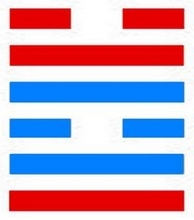
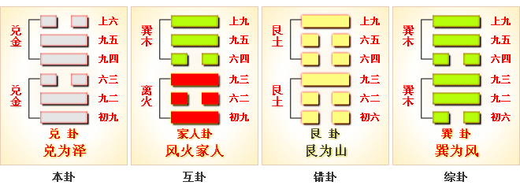
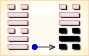
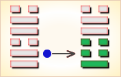
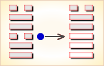
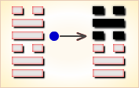
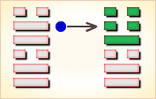
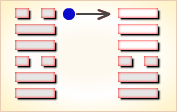

# 兑 ䷹

兑（䷹ duì）卦的代号是`6:6`。主卦和客卦都是`6`卦，兑卦，卦象是泽，特性是愉快，阳数都是`6`。主方和客方都积极主动，素质良好，态度随和，都取得了成功，享受成功的喜悦。双方在相互关系中，相互交换，互利双赢。兑为泽（泽卦）刚内柔外。这个卦是同卦，下泽上泽，相叠。泽为水。两泽相连，两水交流，上下相和，团结一致，朋友相助，欢欣喜悦。兑为悦也。同秉刚健之德，外抱柔和之姿，坚行正道，引导人民向上。

图中，红色表示当位的爻，天蓝色表示不当位的爻，兑卦的各条爻之间没有有应。

- 卦序：58

> 兌，亨，利貞。
>《彖》曰：兌，說也。剛中而柔外，說以利貞，是以順乎天而應乎人。說以先民，民忘其勞，說以犯難，民忘其死，說之大，民勸矣哉。
>《象》曰：麗澤，兌。君子以朋友講習。

> 初九，和兌，吉。
>《象》曰：和兌之吉，行未疑也。

> 九二，孚兌，吉，悔亡。
>《象》曰：孚兌之吉，信志也。

> 六三，來兌，凶。
>《象》曰：來兌之凶，位不當也。

> 九四，商兌未寧，介疾有喜。
>《象》曰：九四之喜，有慶也。

> 九五，孚于剝，有厲。
>《象》曰：孚于剝，位正當也。

> 上六，引兌。
>《象》曰：上六引兌，未光也。

> 兑（䷹ duì）卦是同卦，下兑上兑，相叠。泽为水。两泽相连，两水交流，上下相和，团结一致，朋友相助，欢欣喜悦。兑为悦也。同秉刚健之德，外抱柔和之姿，坚行正道，导民向上。

>《象传》：两泽相依，更得泽中映月，美景良辰，令人怡悦。

> 悲喜交集，有誉有讥，守正道，诸事尚可称意。

- 事业：由于善长人际关系，能团结他人，获得援助。因此，各项事业都十分顺利。只要本人坚持中正之道，动机纯正，是非分明，以诚心与人和悦，前途光明。
- 经商：很有利，可以取得多种渠道的支持。但在顺利时切莫忘记谨慎小心的原则，尤其警惕上小人的当。
- 求名：只要自己目的纯正，并有真才实学，一定可以受到多方面的热情帮助和资助，达到目的。
- 婚恋：彼此满意，成功的可能性很大。但千万不要过于坚持己见。
- 决策：为人聪颖，性格开朗，头脑灵活，心地善良，热心为公众服务，富有组织才能。因此，可以比较顺利地走上领导岗位。但一定要坚持中正原则，秉公办事，不得诌媚讨好上级，更不可欺压民众。永远保持谦虚品德，尤其不可过分自信，否则很容易为坏人包围。

兑卦兑上兑下，为[兑宫本位卦](../jing/dui.md#58)。兑为喜悦、取悦，又为泽，泽中之水可以滋润万物，所占的人会很吉利。泽润万物，双重喜悦；和乐群伦，确守正道。得此卦者，多喜庆之事，人情和合，但应坚守正道，否则犯灾。

- 时运：朋友支持，好好珍惜。
- 财运：有人扶助，获利不难。
- 家宅：友朋同住；因友成亲。
- 身体：熟医可治。

> 泽：表示少女纯真喜悦之象，却在纯真之中带有娇蛮、任性的态度。六冲卦象，大好大坏。忧喜参半！

> 解释：喜悦，高兴。

> 特性：细心，体贴，善解人意，口才佳，幽默感，宜从事公关，服务业。

> 运势：有喜亦有忧，有誉亦有讥，虽得吉庆如意，然应守持正道，否则犯灾。

- 家运：有和悦之气象，但要操守自律，行事不可越轨，有分寸可得吉运。若不操守自律，必犯色情之害而受殃。
- 疾病：久病则凶，注意生活检点，戒酒色。
- 胎孕：孕安。能带给家人喜悦，又与六亲和睦，有缘。但也不要过分溺爱才是。
- 子女：骨肉情深，和好幸福之象。
- 周转：可顺利，不须急也。
- 买卖：有反覆之象，然尽力必成，可得大利之交易。
- 等人：会来，且有喜讯相告。
- 寻人：很快可知其下落。向西方寻可得。
- 失物：遗失物似为金属或金钱，有望失而复得，但是迟一点。且多数已损毁或损失。
- 外出：一路平安，即使遇到困难也会有人帮助，解脱困境。
- 考试：成绩佳。
- 诉讼：似为两个女性及金钱之事惹起，宜有和事佬出面调解。
- 求事：得利，但亦不可太大意。
- 改行：吉利。
- 开业：吉利。

### 初九：和兑，吉。《象》曰：和兑之吉，行未疑也。

和睦欢喜，吉利。《象传》：和睦欢喜之所以吉利，因为人际邦交无所猜疑。

吉：得此爻者，人情和合，百谋皆遂。

- 时运：以和为贵，诸事皆吉。
- 财运：秋实可收，自然有利。
- 家宅：和乐融融；室家得宜。
- 身体：宽心无忧。

初九爻动变得周易[第47卦：泽水困](e59bb0kun.md)。

泽水困䷮是异卦，下坎上兑，相叠。兑为阴为泽喻悦；坎为阳为水喻险。泽水困，陷入困境，才智难以施展，仍坚守正道，自得其乐，必可成事，摆脱困境。

### 九二：孚兑，吉，悔亡。《象》曰：孚兑之吉，信志也。

优待俘虏，吉利，没有悔恨。《象传》：以诚信待人，人亦热忱待之，之所以吉利，因为互相之间有了信任。

吉：得此爻者，正当好运，事事和顺。做官的有升迁之兆。

- 时运：上下同心，自然吉祥。
- 财运：以信为本，可长可远。
- 家宅：与邻共富；阴阳相合。
- 身体：疑病得解。

九二爻动变得[第17卦：泽雷随](e99a8fsui.md)。

泽雷随䷐是异卦，下震上兑，相叠。震为雷，为动；兑为悦，动而悦就是“随”。随指相互顺从，己有随物，物能随己，彼此沟通。随必依时顺势，有原则和条件，以坚贞为前提。

### 六三：来兑，凶。《象》曰：来兑之凶，位不当也。

以使人归服为乐，蕴藏着凶险。《象传》：以使人归服为乐，蕴藏着凶险，因为力小而任大，德薄而欲多，所行必不当。

凶：得此爻者，会有意外之祸，甚者则失道忘身。做官的有听信谗言而遭辱之忧。

- 时运：奔走营求，虽成亦辱。
- 财运：无信之商，未来堪虑。
- 家宅：去伪存诚；先合后离。
- 身体：小心外祸。

六三爻动变得[第43卦：泽天夬](e5a4acguai.md)。

泽天夬䷪是异卦，下乾上兑，相叠。乾为天为健；兑为泽为悦。泽气上升，决注成雨，雨施大地，滋润万物。五阳去一阴，去之不难，决（去之意）即可，故名为夬（guài），夬即决。

### 九四：商兑，未宁，介疾有喜。《象》曰：九四之喜，有庆也。

商谈恢复邦交之事，尚未达成协议，但两国的矛盾分歧有了愈合的趋势。《象传》：九四爻辞所讲的喜，即是指将有喜庆之事。

平：得此爻者，从商获利，或进人口，不良者或有疾病，谋望不成。做官的会身居要职，升迁有望。

- 时运：奋斗将成，斟酌行止。
- 财运：忧心之事，商量解决。
- 家宅：多疾不安；再三说媒而成。
- 身体：心神不安，喜事舒怀。

九四爻动变得[第60卦：水泽节](e88a82jie.md)。

水泽节䷻是异卦，下兑上坎，相叠。兑为泽，坎为水。泽有水而流有限，多必溢于泽外。因此要有节度，故称节。节卦与涣卦相反，互为综卦，交相使用。天地有节度才能常新，国家有节度才能安稳，个人有节度才能完美。

### 九五：孚于剥，有厉。《象》曰：孚于剥，位正当也。

被剥国俘虏。剥国无理挑衅，必遭惩罚（对我方而言，坏事将变为好事）。《象传》：当被侵剥之时，仍以诚信待人，正如九五阳爻所象，其人秉行中正之道，必能逢凶化吉。

凶：得此爻者，时运不佳，多意外之祸。做官的会受到小人的诽谤。

- 时运：居安思危，常得其昌。
- 财运：虽有小损，信心仍在。
- 家宅：诚信为上。
- 身体：皮肤有疾，速治可愈。

九五爻动变得[第54卦：雷泽归妹](e5bd92e5a6b9guimei.md)。

雷泽归妹䷵是异卦，下兑上震，相叠。震为动、为长男；兑为悦、为少女。以少女从长男，产生爱慕之情，有婚姻之动，有嫁女之象，故称归妹。

### 上六：引兑。《象》曰：上六引兑，未光也。

引导大家和睦相处。《象传》：上六爻辞讲引导大家和睦相处，用意虽佳，但上六阴爻处一卦之尽头，像其人未必能一呼百应。

平：得此爻者，营谋不顺，谨防有忧。

- 时运：靠人扶持，平平之运。
- 财运：有人指引，稍有小利。
- 家宅：内忧外患；似非正聘。
- 身体：化解内邪，才可保全。

 上六爻动变得[第10卦：天泽履](e5b1a5lv.md)。

天泽履䷉是异卦，下兑上乾，相叠。乾为天，兑为泽，以天喻君，以泽喻民，原文：“履（踩）虎尾，不咥（咬）人”。因此，结果吉利。君上民下，各得其位。兑柔遇乾刚，所履危。履意为实践，卦义是脚踏实地的向前进取的意思。

# [Duì ䷹](../en/e58591dui.md)
