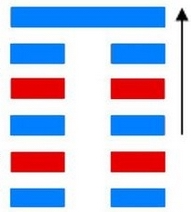
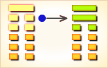

# 剥 ䷖

剥（䷖ bō）卦的代号是 `0:1`。主卦是坤卦，卦象是地，阳数是`0`；客卦是艮卦，卦象是山，阳数是`1`。“剥”的意思是剥落。主方应当阴中有阳，恰当采取主动措施，改变目前状况，否则只得忍受客方制约。剥卦的卦象为山地剥，顺势而止。

图中，红色表示当位的爻，天蓝色表示不当位的爻，箭头表示有应。

- 卦序：23

> 剝，不利有攸往。
>《彖》曰：剝，剝也，柔變剛也。不利有攸往，小人長也。順而止之，觀象也。君子尚消息盈虛，天行也。
>《象》曰：山附于地，剝，上以厚下安宅。

> 初六，剝牀以足，蔑貞，凶。
>《象》曰：剝床以足，以滅下也。

> 六二，剝牀以辨，蔑貞，凶。
>《象》曰：剝床以辨，未有與也。

> 六三，剝之无咎。
>《象》曰：剝之无咎，失上下也。

> 六四，剝牀以膚，凶。
>《象》曰：剝床以膚，切近災也。

> 六五，貫魚，以宮人寵，无不利。
>《象》曰：以宮人寵，終无尤也。

> 上九，碩果不食，君子得輿。小人剝廬。
>《象》曰：君子得輿，民所載也，小人剝廬，終不可用也。

> 剥（䷖ bō）卦是异卦，下坤上艮相叠。五阴在下，一阳在上，阴盛而阳孤；高山附于地。二者都是剥落象，故为“剥卦”。此卦阴盛阳衰，喻小人得势，君子困顿，事业败坏。

>《象传》：山附于地喻山石崩而落于地面上，五阴迫一阳，正义被损。

> 恶运缠身，宜重新部署，不宜自作聪明，防被女子及小人连累。

- 事业：时运不佳，乃大势所趋，个人只能顺应时势而暂停行动，静观待变，不可冒险，积极创造条件，增强实力，谨慎隐忍，勿与小人同流。时来运转，成就事业，为期不远。
- 经商：已从高峰转入低落，进入不景气时期，需要认真总结经验教训，进行整顿，尤其不可孤注一掷。景气形势一旦到来，可顺势从容再起。
- 求名：成功的可能性不大，不宜执意强求，应继续创造条件，努力提高自己，充实处世的本领，增强实力，待机东山再起。
- 婚恋：务须慎重考虑，除非有十分般配者，不要随便进行。双方应注意维护家庭的和睦。
- 决策：一生曲折较多，往往隐入不顺利的境况，甚至绝境，但可绝处逢生。只要冷静分析形势，顽强拼搏，一定会彻底改变命运，获得美好的结果，为他人惊羡。关键是不可急于求成，尤其不可冒险。须顺应时势，并防小人陷害。

剥卦，艮上，坤下，为[乾宫五世卦](jing/qian.md#23)。剥卦象征剥落，因山高倾危而剥落。此时为阴气极盛之时，君子宜谨慎隐忍，不可贸然行动。剥削蚀烂，灾情之忧；进取难成，顺时而止。得此卦者，时运不佳，多有损失，前进有阻，宜顺时而止，安份自守。

- 时运：时运不佳，安心自守。
- 财运：出口获利，剥人之财。
- 家宅：不离己宅，寄居可买。
- 身体：魂不附体，千万小心。

> 剥：表示剥落之意，主大凶象。地动山崩，一时群山崩落为平地，表示很严重的动荡、变化，而致使重大的伤害、不幸的产生。最易有急症、意外的血光之灾。事业、感情、婚姻，得此卦需有心理准备，所有之前的努力可能要重新再来了。唯此卦利于重新到外地发展，或另寻对象也可。

> 解释：剥削，剥落。

> 特性：反应灵敏，思想新颖，走在时代尖端，有研发长才，有意料之外的机会和柳暗花明之遭遇。

> 运势：运带破、带衰，有不利之灾祸，不可抱持野心，自作聪明，否则自掘坟坑。得此卦者，必有与欢场女子耗费钱财而又被陷害之苦恼，且有受部下连累而损财，为不得志之时运也。

- 家运：正处于没落之时，辛苦劳心，有心挽回者可得安，否则有别离之险象。
- 疾病：病情恶化之象，防头痛、肠胃、性病等疾。
- 胎孕：虚惊之凶象。
- 子女：缘薄，不和，体弱。
- 周转：无望。
- 买卖：难成。若成亦有损。
- 等人：不会来。
- 寻人：在东北方的山上或水边寻之。
- 失物：目前还隐藏在家中地上，可惜无法发现，不久会被扫走。
- 外出：暂缓为好。可在充分准备之后动身。
- 考试：落榜。
- 诉讼：因财而起纷争，小人当道，宜避之则吉。
- 求事：顺而止，要谨慎行事，不可粗心大意。
- 改行：不利，必损财。
- 开业：开业者有阻碍，切勿意气用事，否则有害，宜再待时。

### 初六：剥床以足，蔑贞，凶。《象》曰：剥床以足，以灭下也。

床足脱落。无须占问，这是凶险之象。《象传》：床足脱落，这是自毁根基。

凶：得此爻者，营谋不遂，或有手足之灾，或兄弟不睦，凶则家破身亡。做官的有升迁之机会，但宜见机行事。

- 时运：命当剥削，防有足疾。
- 财运：底部有损，减少损失。
- 家宅：基础不稳，防备下人。
- 身体：足部忧伤，小心诊治。

初六爻动变得[第27卦：山雷颐](e9a290yi_cn.md)。

山雷颐䷚是异卦，下震上艮，相叠。震为雷，艮为山。山在上而雷在下，外实内虚。春暖万物养育，依时养贤育民。阳实阴虚，实者养人，虚者为人养。自食其力。

### 六二：剥床以辨，蔑贞，凶。《象》曰：剥床以辨，未有与也。

六二：床板脱落。无须占问，这是凶险之象。《象传》：床板脱落，这是自毁辅佐。

凶：得此爻者，营谋不遂，或受到小人的侵辱，或受到他人的猜忌。做官的须防被贬职。

- 时运：日益低落，哑子黄莲。
- 财运：成本堆积，难以获利。
- 家宅：宜速变迁。
- 身体：卧床待医，防其不起。

六二爻动变得[第4卦：山水蒙](e89299meng_cn.md)。

山水蒙䷃是异卦，下坎上艮，相叠。艮是山的形象，喻止；坎是水的形象，喻险。卦形为山下有险，仍不停止前进，是为蒙昧，故称蒙卦。但因把握时机，行动切合时宜，因此，具有启蒙和通达的卦象。

### 六三：剥之，无咎。《象》曰：剥之无咎，失上下也。

割取邻国邻邑的土地人民，可以无灾祸。《象传》：割取邻国邻邑的土地人民，可以无灾祸，因为邻国邻邑的统治者已失去了上下臣民的支持。

平：得此爻者，难遇知己，生涯不顺，欲求名利，必须创新，此爻像父母妻子或有忧，须谨防。做官的会遇到明主或大官提拔。

- 时运：运虽不正，尚能自反。
- 财运：自行脱售，因而得利。
- 家宅：旧宅改造。
- 身体：消除火气。

六三爻动变得[第52卦：艮为山](e889aegen_cn.md)。

艮为山䷳是同卦，下艮上艮，相叠。艮为山，二山相重，喻静止。它和震卦相反。高潮过后，必然出现低潮，进入事物的相对静止阶段。静止如山，宜止则止，宜行则行。行止即动和静，都不可失机，应恰到好处，动静得宜，适可而止。

### 六四：剥床以肤，凶。《象》曰：剥床以肤，切近灾也。

剥取床上的垫席，这是凶险之象。《象传》：剥取床上的垫席，灾祸就在眼前。

凶：得此爻者，时运不佳，危难之时，多有争诉刑克之事。做官的须谨防小人的谗言，以免遭难。

- 时运：显然不佳，须防受伤。
- 财运：剥耗过多，意外之祸。
- 家宅：破败防塌。
- 身体：颇为凶险。

六四爻动变得[第35卦：火地晋](e6998bjin_cn.md)。

火地晋䷢是异卦，下坤上离，相叠。离为日，为光明；坤为地。太阳高悬，普照大地，大地卑顺，万物生长，光明磊落，柔进上行，喻事业蒸蒸日上。

### 六五：贯鱼，以宫人宠，无不利。《象》曰：以宫人宠，终无尤也。

宫人依次当夕受宠，无所不利。《象传》：宫人依次当夕受宠，秩序不乱，厚薄均匀，因而终无忧患。

吉：得此爻者，人情和合，营谋得时，家和福生，妇人进财。做官的升高进职，居要位。读书人、学子考试必能考出佳绩。

- 时运：气运堂皇，事无不利。
- 财运：利润甚丰，海产犹佳。
- 家宅：妇女持家。
- 身体：内亏之症，爱惜身体。

六五爻动变得[第20卦：风地观](e8a782guan_cn.md)。

风地观䷓是异卦，下坤上巽，相叠。风行地上，喻德教遍施。观卦与临卦互为综卦，交相使用。在上者以道义观天下；在下者以敬仰瞻上，人心顺服归从。

### 上九：硕果不食，君子得舆，小人剥庐。《象》曰：君子得舆，民所载也；小人剥庐，终不可用也。

劳者不得食，不劳者得食；君子乘坐华丽的车子，小人的草屋不蔽风雨。《象传》：君子乘坐华丽的车辆，这是老百姓沉重的负担。小人的破屋不蔽风雨，这种取象表明终究难保平安。

平：得此爻者，须谨慎，踏实稳重者可无忧。商人生意买卖会不错。做官的会有权柄。

- 时运：眼前衰落，一年方起。
- 财运：卖出尚可，买入必剥。
- 家宅：忠厚可保，刻薄无屋。
- 身体：饮食不进，小心调养。

上九爻动变得[第2卦：坤为地](e59da4kun_cn.md)。

坤为地䷁是同卦，下坤上坤，相叠。阴性。象征地（与乾卦相反），顺从天，承载万物，伸展无穷无尽。坤卦以雌马为象征，表明地道生育抚养万物，而又依天顺时，性情温顺。它以“先迷后得”证明“坤”顺从“乾”，依随“乾”，才能把握正确方向，遵循正道，获取吉利。

# [Bō ䷖](e589a5bo.md)
