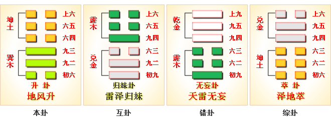
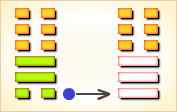
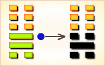
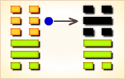

# 升 ䷭

升（䷭ shēng）卦的代号是 `3:0`，主卦是**巽**卦，卦象是风，阳数是`3`；客卦是**坤**卦，卦象是地，阳数是`0`。“升”，提升。主方在消极被动状态下，应当阴中有阳，适时采取主动，利用客方对自己的依赖，更强地控制客方，维护和增加自己的利益。**升**卦谈的是上升之卦，亦犹其爻辞所说的“升阶”之义。但是，从此卦卦辞的“南征吉”和爻辞的“升虚邑”以及其它爻辞的用语来看，此卦仍属用兵侵伐之卦。也即是说，此卦谈的是在兼并时期侵伐其它邦国时所应该注意到的一些问题。

> 士人来占必得名，生意买卖也兴隆，匠艺逢之交易好，农间庄稼亦收成。

这个卦是异卦（下**巽**上**坤**）相叠。**坤**为地、为顺；**巽**为木、为逊。大地生长树木，逐的成长，日渐高大成材，喻事业步步高升，前程远大，故名“升”。

图中，红色表示当位的爻，天蓝色表示不当位的爻，箭头表示有应。

- 卦序：46

> 升，元亨，用見大人，勿恤，南征吉。
>《彖》曰：柔以時升，巽而順，剛中而應，是以大亨；用見大人，勿恤，有慶也；南征吉，志行也。
>《象》曰：地中生木，升。君子以順德，積小以高大。

> 初六，允升大吉。
>《象》曰：允升大吉，上合志也。

> 九二，孚乃利用禴，无咎。
>《象》曰：九二之孚，有喜也。

> 九三，升虛邑。
>《象》曰：升虛邑，无所疑也。

> 六四，王用亨于岐山，吉，无咎。
>《象》曰：王用亨于岐山，順事也。

> 六五，貞吉，升階。
>《象》曰：貞吉升階，大得志也。

> 上六，冥升，利于不息之貞。
>《象》曰：冥升在上，消不富也。

>《象传》：树木从地上不断向上，有进升之势。

> 名利双收，发展开运之象，宜向南方发展。

- 事业：十分顺利，不断发展，依时而进，逐步上升，前程远大，但应逐步发展，切莫因顺利而冒进。谨慎小心，修养德行，追随有德行的前辈，真诚对待事业。
- 经商：遵守商业道德，从小处着手，逐渐开拓，通过自己的勤劳，真诚竞争，稳重为好，切莫冒失而成大错。
- 求名：努力学习，加强修养，以自己的聪明才智，必能得志，若有人引荐，前途更为广阔。但应注意节制。
- 婚恋：双方以诚相待，逐步培养情感，一定可以成功。
- 决策：如意随愿。聪明、灵活、具有良好的成功基础，严格要求自己，谦虚和顺，虚心向长辈求教，逐步、稳健地发展自己的事业，将犹如树木的成长，终于会成栋梁之才。但在成长过程中，务必处处谨慎，坚持真诚和正直，大胆前进。

**升**卦，**坤**上**巽**下，为[震宫四世卦](../jing/zhen.md#46)。**升**卦的意思就是上升、长进，为出暗向明，积小成大的亨达之象。升腾上进，畅行其志；出暗向明，遂渐升进。得此卦者，运气升腾，诸事皆积极向上发展，谋事有成，名利双收。

- 时运：大地春回，日益高升。
- 财运：储蓄积财，可成富人。
- 家宅：改造大厦；以妾作嫡。
- 身体：肝火渐旺，早些调养。

> 升：表示一种情势有如乘风而起，会越来越旺。树木从地上不断向上，有进升之势。

> 解释：逐渐高升。

> 特性：有计划安排自己的人生，做事考虑周详，待人谦和，追求新的知识。喜欢多彩人生，重生活品味。

> 运势：诸事向上发展，开运之象，南方有吉庆，可名利双收也。

- 家运：渐进而升至繁荣，积小以成大之吉运。
- 疾病：病情重，注意腹部，胆管之疾。
- 胎孕：不宜修造动土，修造必犯产母。
- 子女：子女渐有成功之象，可贺。
- 周转：勿太过急，可成。
- 买卖：多有利，应于亥卯日。
- 等人：迟到。
- 寻人：动身则见，但恐自身有阻，与他人同去可，宜向北方。会自己回来。
- 失物：不易寻回，失物有被束之高阁的可能。
- 外出：十分顺利，尤其是南行，不会有灾祸。
- 考试：进步，进取有利。
- 诉讼：宜持平和态度处理，可争取主动，胜算在握。
- 求事：有利。
- 改行：吉利。
- 开业：吉利，渐渐获利。

### 初六：允升，大吉。《象》曰：允升大吉，上合志也。

前进发展，大吉大利。《象传》：前进发展，大吉大利，是说尚能契合心意。

吉：得此爻者，名利双收，营谋遂心。做官的晋升有望。

- 时运：名利双收，所求皆遂。
- 财运：货价涨升，大可获利。
- 家宅：乔迁之喜；两姓好合。
- 身体：有病即治，不可拖延。

初六爻动变得[第11卦：地天泰](e6b3b0tai.md)。

地天泰䷊是异卦，下乾上坤，相叠。乾为天，为阳；坤为地，为阴。阴阳交感，上下互通，天地相交，万物纷纭。反之则凶，万事万物，皆对立，转化，盛极必衰，衰而转盛，故应时而变者泰（通）。

### 九二：孚乃利用禴，无咎。《象》曰：九二之孚，有喜也。

春祭宜用俘虏作为人牲，则无灾祸。《象传》：九二爻辞讲祭祀鬼神必以忠信，从而将有喜庆之事。

平：得此爻者，常人有喜，病者安，谋事可成。做官的有升迁之机。

- 时运：正当好运，喜事临门。
- 财运：诚信经营，可保获利。
- 家宅：必有喜事；阴阳合德。
- 身体：最好祈神。

九二爻动变得[第15卦：地山谦](e8b0a6qian.md)。

地山谦䷎是异卦，下艮上坤，相叠。艮为山，坤为地。地面有山，地卑（低）而山高，是为内高外低。比喻功高不自居，名高不自誉，位高不自傲。这就是谦。

### 九三：升虚邑。《象》曰：升虚邑，无所疑也。

登临于建立在大丘之上的城邑。《象传》：登临于建立在大丘之上的城邑，登高望远，所见甚明，故无所疑惑。

平：得此爻者，营谋遂意。做官的会身居要位，读书人可成名。

- 时运：越来越好，不必担心。
- 财运：货物集散，财力可期。
- 家宅：先虚后实；空房独守。
- 身体：虚弱之症。

九三爻动变得[第7卦：地水师](e5b888shi.md)。

地水师䷆是异卦，下坎上坤，相叠。“师”指军队。坎为水、为险；坤为地、为顺，喻寓兵于农。兵凶战危，用兵乃圣人不得已而为之，但它可以顺利无阻碍地解决矛盾，因为顺乎形势，师出有名，故能化凶为吉。

### 六四：王用亨于岐山，吉，无咎。《象》曰：王用亨于岐山，顺事也。

周王在岐山祭祀鬼神。筮遇此爻，吉利，并无灾祸。《象传》：周王在岐山祭祀鬼神，之所以吉而无灾祸，因为这是顺乎天理之事。

吉：得此爻者，得山林之利，隐者有山林之乐。做官的会升迁，身居要职。

- 时运：升迁在即，感谢神明。
- 财运：货物充裕，财神相助。
- 家宅：祭告宅神。
- 身体：虔诚祷告。

六四爻动变得[第32卦：雷风恒](e68192heng.md)。

雷风恒䷟是异卦，下巽上震，相叠。震为男、为雷；巽为女、为风。震刚在上，巽柔在下。刚上柔下，造化有常，相互助长。阴阳相应，常情，故称为恒。

### 六五：贞吉，升阶。《象》曰：贞吉升阶，大得志也。

占得吉兆，所占之事将逐步发展。《象传》：信守正道，自然吉利，其事业必然逐步发展，说明其志愿得伸，目的达到。

吉：得此爻者，正行好运，大愿可成。做官的会高升。

- 时运：大愿可成，功名皆吉。
- 财运：经营得中，利益不断。
- 家宅：步步高升；攀结高亲。
- 身体：病情升高。

六五爻动变得[第48卦：水风井](e4ba95jing.md)。

水风井䷯是异卦，下巽上坎，相叠。坎为水；巽为木。树木得水而蓬勃生长。人靠水井生活，水井由人挖掘而成。相互为养，井以水养人，经久不竭，人应取此德而勤劳自勉。

### 上六：冥升，利于不息之贞。《象》曰：冥升在上，消不富也。

深夜不眠，勤勉不息地工作则符合此吉兆。《象传》：上六爻辞讲深夜不眠，因为上六之爻据一卦之首，爻位孤悬，其人虽处高位，但环境不利，不过，勤于职守则可以消灾得福。

平：得此爻者，有贪得无厌之祸。做官的会告休。

- 时运：好运已过，预备退路。
- 财运：经营困难，人财两失。
- 家宅：难免中落；难以偕老。
- 身体：可能归天。

上六爻动变得[第18卦：山风蛊](e89b8agu.md)。

山风蛊䷑是异卦，下巽上艮，相叠。与随卦互为综卦。蛊本意为事，引申为多事、混乱。器皿久不用而生虫称“蛊”，喻天下久安而因循、腐败。必须革新创造，治理整顿，挽救危机，重振事业。

# [Shēng ䷭](../en/e58d87sheng.md)
