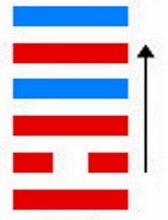
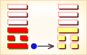

# 同人 ䷌

同人（䷌ tóng rén）卦的代号是`5:7`，主卦是`5`卦，**离**卦；客卦是`7`卦，**乾**卦。**离**卦的卦象是火，特性是光明而依附，阳数是`5`；**乾**卦的卦象是天，特性是强健，阳数是`7`。同人卦，阐释和同的原则。此卦的主要精神是首先应当破除一家、一族的私见，重视大同，不计较小异，本着大公无私的精神，以道义为基础，于异中求同，积极的广泛与人和同，才能实现大同世界的理想。正义必然使邪恶屈服，但障碍必须果敢的排除。同人的意思是会同他人。主方在积极主动地行动的时候，由于本身素质不佳，不得不会同他人，取得他人支持和帮助。

> 心中有事犯猜疑，谋望从前不着实，幸遇明人来指引，诸般忧闷自消之。

这个卦是异卦（下离上乾）相叠，乾为天，为君；离为火，为臣民百姓，上天下火，火性上升，同于天，上下和同，同舟共济，人际关系和谐，天下大同。

图中，红色表示当位的爻，天蓝色表示不当位的爻，箭头表示有应。

- 卦序：13

> 同人于野，亨，利涉大川，利君子貞。
>《彖》曰：同人，柔得位得中而應乎乾，曰同人。同人曰，同人于野，亨，利涉大川，乾行也。文明以健，中正而應，君子正也，唯君子為能通天下之志。
>《象》曰：天與火，同人。君子以類族辨物。

> 初九，同人于門，无咎。
>《象》曰：出門同人，又誰咎也。

> 六二，同人于宗，吝。
>《象》曰：同人于宗，吝道也。
> 二三子：［卦曰］：「同人于宗，貞藺。」孔子曰：「此言亓所同唯亓室人，而…故曰貞藺。」

> 九三，伏戎于莽，升其高陵，三歲不興。
>《象》曰：伏戎于莽，敵剛也；三歲不興，安行也。

> 九四，乘其墉，弗克攻。吉。
>《象》曰：乘其墉，義弗克也。其吉，則困而反則也。

> 九五，同人，先號咷而後笑，大師克，相遇。
>《象》曰：同人之先，以中直也；大師相遇，言相克也。
>《繫辭》：同人「先號咷而後笑」，子曰：「君子之道，或出或處，或默或語。二人同心，其利斷金，同心之言，其臭如蘭。」

> 上九，同人于郊，无悔。
>《象》曰：同人于郊，志未得也。本文取自易學網。

> 同人（䷌ tóng rén）卦是异卦，下离上乾，相叠。乾为天，为君；离为火，为臣民百姓，上天下火，火性上升，同于天，上下和同，同舟共济，人际关系和谐，天下大同。

>《象传》：二人同心，其利断金，君子正心诚意，与人和同之象。

> 如意吉祥，与人共事，上下皆和，又得长辈提拔。

- 事业：顺利、平安，尤其是在与他人的合作方面会十分成功，宜广泛开展人际活动，建立广泛的联系，克服狭隘的门户之见，照顾各方面的利益，求大同，存小异，坚持正确的原则，必能成就大事业。
- 经商：以真诚合作、精诚团结的态度与同行共事，公平竞争，必可获得自己应得的利益。
- 求名：自己必须刻苦努力，尤其要取得师长和志同道合的朋友指教、帮助，自己虚心进取，完全能够达到目的。
- 婚恋：多情、善交际，认识的异性朋友多，故需慎重选择，注意维护双方关系和家庭和睦。
- 决策：性格开朗、乐观，为人热情，人际关系好，社交能力强，要善于同他人合作，尤其要协调多方面的关系，要有原则性，与不良风气斗争，有魄力，敢作敢为，富有自我奉献精神，并具有统御能力，适于担任一定的负责。

同人卦乾上离下，为[离宫归魂卦](../jing/li.md#13)。同人卦象征交结情深，两人契义，同心断金。主所求皆得，事事称心。人类相亲，与人和同；所求皆得，无不称心。得此卦者，吉祥如意，与人合作共事更佳，上下同心，谋事有成。

- 时运：朋友支持，升迁顺利。
- 财运：合资有利，可以进取。
- 家宅：合家欢喜。
- 身体：燥热之症，另求良医。

> 同人：表示有志一同，相和而成。主吉象。理念相同共处愉快。事业投资、感情皆是和睦融洽。最适合找人合伙事业或寻求认同自己理念的吉卦。

> 解释：结合志同道合的人集思广益。

> 特性：喜团体生活户外活动，有领导才能，善交际，人际关系佳。有幽默感。

> 运势：得此卦为诸事开通、平安、吉祥、如意之象，有同情心，互爱、亨通之象，故宜好好掌握时机，维持盛泰。若有稍涉偏私或为私情之爱则有破兆，应以事业为重。

- 家运：上下和乐，运势亨通，可得意外之财，宜把握良机，努力求取。
- 疾病：病轻，不久可愈，注意心脏，头肺等疾。
- 胎孕：无碍。与六亲和睦，得缘之吉卦。
- 子女：上下皆能和睦之象。
- 周转：顺利，并可进取大业，利也。
- 买卖：利益大，与人共事吉。
- 等人：一定会来，且会带来好消息。
- 寻人：此人非故意出走，自己会回来。
- 失物：遗失似文件眼镜等物，可能被压在底层，尽快找寻，则可取回。
- 外出：很平安、顺利，并可以结交新朋友，获得帮助。
- 考试：成绩优良。
- 诉讼：凡事以和为贵。
- 求事：吉利。
- 改行：吉利亨通。
- 开业：吉利亨通。

### 初九：同人于门，无咎。《象》曰：出门同人，又谁咎也。

聚集大众于王门，将行大事，没有灾祸。《象传》：君王走出王门与国人打成一片，谁又会遭受灾祸呢？

平：得此爻者，能与人合伙经营获利，或出家远行，或修造门户，或在他处学习。做官的或会受到重用，或有升迁之机。

- 时运：眼前平顺，外出经营。
- 财运：不宜开店，可以行商。
- 家宅：家人和睦。
- 身体：避地调养，可以无碍。

初九爻动变得[第33卦：天山遁](e981afdun.md)。

天山遁䷠是异卦，下艮上乾，相叠。乾为天，艮为山。天下有山，山高天退。阴长阳消，小人得势，君子退隐，明哲保身，伺机救天下。

### 六二：同人于宗，吝。《象》曰：同人于宗，吝道也。

聚同族于宗庙，卜祷凶吉，因为面临艰难。《象传》：仅仅聚同族于宗庙，这是狭隘的宗法原则。

凶：得此爻者，事多不定，与宗人朋友多不和，相互多猜忌，面和心不合，容易起是非。做官的没有升迁之机，需耐心等待。

- 时运：相忌者多，未能顺遂。
- 财运：大宗买卖，留心出纳。
- 家宅：长子之力，勤俭起家。
- 身体：魂归宗庙，未可多言。

六二爻动变得[第1卦：乾为天](e4b9beqian.md)。

乾为天䷀是同卦，下乾上乾，相叠。象征天，喻龙（德才的君子），又象征纯粹的阳和健，表明兴盛强健。乾卦是根据万物变通的道理，以“元、亨、利、贞”为卦辞，表示吉祥如意，教导人遵守天道的德行。

### 九三：伏戎于莽，升其高陵，三岁不兴。《象》曰：伏戎于莽，敌刚也，三岁不兴，安行也。

将军队隐蔽在深山密林，并且占领了制高点，但长时期不能取胜。《象传》：将军队隐蔽在深山密林，因为敌人太强大。长时期不能取胜，怎能有所作为呢？

凶：得此爻者，或有丧亲，或有诉讼打官司之患。做官的须防被免职之忧。

- 时运：潜心三年，再谋其事。
- 财运：可开山林，三年获利。
- 家宅：须防盗贼。
- 身体：不良于行。

九三爻动变得[第25卦：天雷无妄](e697a0e5a684wuwang.md)。

天雷无妄䷘是异卦，下震上乾，相叠。乾为天为刚为健；震为雷为刚为动。动而健，刚阳盛，人心振奋，必有所得，但唯循纯正，不可妄行。无妄必有获，必可致福。

### 九四：乘其墉，弗克攻，吉。《象》曰：乘其墉，义弗克也，其吉，则困而反则也。

爬上了敌人的城墙，城还没有攻下来，继续攻打才能获胜。《象传》：爬上了敌人的城墙，从道义上讲应该停士攻城。之所以继续攻打为吉利，因为困守之敌可能逞其狡诈。

平：得此爻者，亲友之间会互相猜忌，荣中有辱，结果会好些，凡事须多加提防则可吉祥。做官的若能兢兢业业，则有提拔之机遇，或会受到表彰。

- 时运：退守不动，反而吉祥。
- 财运：守货不售，将可获利。
- 家宅：修缮房屋围墙。
- 身体：虽有凶险，终究无害。

九四爻动变得[第37卦：风火家人](e5aeb6e4babajiaren.md)。

风火家人䷤是异卦，下离上巽，相叠。离为火；巽为风。火使热气上升，成为风。一切事物皆应以内在为本，然后伸延到外。发生于内，形成于外。喻先治家而后治天下，家道正，天下安乐。

### 九五：同人，先号啕而后笑，大师克相遇。《象》曰：同人之先，以中直也。大师相遇，言相克也。

聚集起来的大众先哭嚎后欢笑，因为大军及时增援，大获胜仗。《象传》：聚集起来的大众之所以先哭后笑（战斗转败为胜），因为筮遇此爻，九五居上卦之中位，像人得贞正之道，势必化凶为吉。大军会师，是说我军压倒了敌人。

平：得此爻者，先难后易，是非不一。做官的会先贬后升。

- 时运：辛苦有成，得偿心愿。
- 财运：小有挫折，终有大利。
- 家宅：不必惊惶，终于平安。
- 身体：先危后安。

九五爻动变得[第30卦：离为火](e7a6bbli.md)。

离为火䷝是同卦，下离上离，相叠。离者丽也，附着之意，一阴附丽，上下二阳，该卦象征火，内空外明。离为火、为明，太阳反复升落，运行不息，柔顺为心。

### 上九：同人于郊，无悔。《象》曰：同人于郊，志未得也。

聚众于郊外，致祭于神灵祝贺胜利，自然没有悔咎。《象传》：聚众于郊外，援助不广，尚不得行其志。

平：得此爻者，宜守常，不宜激进。做官的则多有出差的机会。

- 时运：闲散之地，诸事无碍。
- 财运：郊外立业，暂时无利。
- 家宅：平顺无灾。
- 身体：恐无生机。

上九爻动变得[第49卦：泽火革](e99da9ge.md)。

泽火革䷰是异卦，下离上兑，相叠。离为火、兑为泽，泽内有水。水在上而下浇，火在下而上升。火旺水干，水大火熄。二者相生亦相克，必然出现变革。变革是宇宙的基本规律。

# [Tóng Rén ䷌](../en/e5908ce4babatongren.md)
