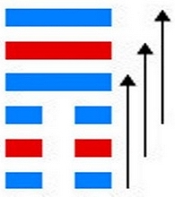
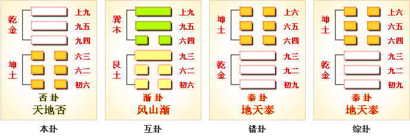
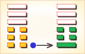
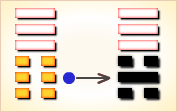
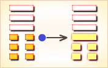
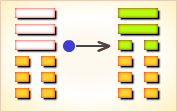
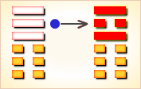
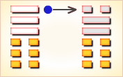

# 否 ䷋

否（䷋ pǐ）卦的代号是`0:7`。**否**卦的主卦是`0`卦，**坤**卦；客卦是`7`卦，**乾**卦。“否”，不是，否定。否定不一定是坏事。**坤**卦的卦象是地，**乾**卦的卦象是天。地接受天上的光和热，抚育万物生长，这不是坏事；不过，地上的一切必须顺从天的变化，受控于天，地自己的个性被否定了。在主客双方关系的例子中，地象征主方，天象征客方，主方必须顺应客方而变化。否卦，天地否，不交不通。否卦，阐释由安泰到混乱，由通畅到闭塞，小人势长，君子势消的黑暗时期，终于到来的应对原则。当此反常时期，君子应当提高警觉，巩固团结，坚定立场，伸张正义，以防患于未然；当小人势力显露衰败迹象时，也不可轻举妄动，必须谨慎，集中力量，把握时机，给以致命的一击。

> 虎落陷坑不堪言，进前容易退后难，谋望不遂自己便，疾病口舌事牵连。

这个卦是异卦（下坤上乾）相叠，其结构同[泰 ䷊](e6b3b0tai.md)卦相反，系阳气上升，阴气下降，天地不交，万物不通。它们彼此为“综卦”，表明泰极而否，否极泰来，互为因果。

图中，红色表示当位的爻，天蓝色表示不当位的爻，箭头表示有应。

- 卦序：12

> 否之匪人，不利君子貞，大往小來。
>《彖》曰：否之匪人，不利君子貞，大往小來，則是天地不交而萬物不通也，上下不交而天下无邦也。內陰而外陽，內柔而外剛，內小人而外君子，小人道長，君子道消也。
>《象》曰：天地不交，否。君子以儉德辟難，不可榮以祿。

> 初六，拔茅茹，以其彙。貞吉，亨。
>《象》曰：拔茅貞吉，志在君也。

> 六二，包承，小人吉，大人否亨。
>《象》曰：大人否亨，不亂群也。

> 六三，包羞。
>《象》曰：包羞，位不當也。

> 九四，有命无咎，疇離祉。
>《象》曰：有命无咎，志行也。

> 九五，休否，大人吉。其亡其亡，繫于苞桑。
>《象》曰：大人之吉，位正當也。
>《繫辭》：子曰：危者安其位者也，亡者保其存者也，亂者有其治者也，是故，君子安而不忘危，存而不忘亡，治而不忘亂，是以身安而國家可保也。易曰：「其亡其亡，繫于苞桑。」

> 上九，傾否，先否後喜。
>《象》曰：否終則傾，何可長也。

> 否（䷋ pǐ）卦是异卦，下坤上乾，相叠。其结构同泰卦相反，系阳气上升，阴气下降，天地不交，万物不通。它们彼此为“综卦”，表明泰极而否，否极泰来，互为因果。

>《象传》：天气上升，地气下降，天地之气不交，主闭塞不通。

> 上下不和，百事不通，凡事宜忍，须知否极泰来。

- 事业：陷入逆境，事业处于衰退阶段，多有不顺利。受小人干扰而不得志，多挫折。应坚持正道，勿与小人合流，团结志同道合者，自保以等待时机。保持自信心，戒慎恐惧，形势定会好转，事业终能成功。
- 经商：遇到强大的竞争对手，处于不利地位，信息不灵造成重大损失。应格外小心谨慎，坚持守势，等待有利时机到来，再努力发展自己的事业。
- 求名：条件还不成熟，再努力一阵子，并得到他人的帮助，理想可以实现。
- 婚恋：容易出现节外生枝的事情，甚至发生挫折和变故，双方若都充满信心，好的结果会出现。
- 决策：本人聪慧，精明，勤奋努力，但不注意人际关系，加上小人的排斥，命运或遭厄运。意志坚强，具有奋斗精神，且克服了不足，尽管付出的代价很高，必能成全事业。

否卦乾上坤下，为[乾宫三世卦](../jing/qian.md#12)。否象征闭塞不通，是不吉之兆。否卦中，阴阳不交，是一切都不和谐之象。大往小来，闭塞不通；否极泰来，修德避难。得此卦者，万物闭塞之象，上下不合，诸事不顺，凡事宜忍，须待时运好转而有为。

- 时运：诸事不顺，不可妄动。
- 财运：适宜买入，后可获利。
- 家宅：勤俭免祸；仳离之象。
- 身体：气血不通，节制饮食。

> “否”表示不好、坏掉了。主凶象。“否”显现出阴阳之气不协调，在人及事方面诸多不被认同，有内外不合、众说纷纭的现象，因此事事难以进行，最好此时能彼此互相退让静下心来理性的沟通，方能转吉。婚姻、感情，已有个性、意见的冲突产生，若不能好好退让协商，恐有离异分手的结局。

> 解释：处在困境中。

> 特性：自尊心强，个性刚烈，不服输，反应快，学习能力强，高傲不亦亲近。财运佳，有领导才能，与上司不易相处。

> 运势：凶且衰，君子以险德避难，不可荣以禄也。运势不通达，诸事不顺，有损失且波折多。故宜守固正道，若稍偏差，则灾害至也。

- 家运：夫妻彼此不能协调，是非很多，劫财又带衰，慎之。
- 疾病：占病为凶兆，病在脑、肺及肠胃等，慎防癌症。
- 胎孕：不安。
- 子女：与双亲感情不睦，任其自然发展吧。
- 周转：告贷无门。
- 买卖：多有损失，但有贵人应在午未申日。
- 等人：不会来，因别的事情而违约。
- 寻人：因感情不睦而出走，去向不明，难寻。东南方。
- 失物：寻不回。
- 外出：会遇到不少麻烦和困难，宜推迟或提前行动。
- 考试：不理想。
- 诉讼：各走极端，有口难言，宜及时求和。
- 求事：先难后易，须有耐心去争取胜利，否则凶。
- 改行：难如愿。
- 开业：最好另择吉日。然此卦有先难之困，若能舒之则利。

### 初六：拔茅茹，以其汇，贞吉，亨。《象》曰：拔茅贞吉，志在君也。

连根拔掉茅草，及其同类，占得此爻则吉利，亨通。《象传》：连根拔掉茅草，占得此爻吉利，比喻其志在清理君侧，为国尽忠。

平：得此爻者，宜守旧，小人得势之时，爻辞虽好，但须谨防小人牵连之事。做官的受职者待缺，当权者防扰。

- 时运：合伙谋事，家有吉祥。
- 财运：新设商业，用人谨慎。
- 家宅：亲戚同住；可以照应。
- 身体：传染之症，但无大碍。

初六爻动变得[第25卦：天雷无妄](e697a0e5a684wuwang.md)。

天雷无妄䷘是异卦，下震上乾，相叠。乾为天为刚为健；震为雷为刚为动。动而健，刚阳盛，人心振奋，必有所得，但唯循纯正，不可妄行。无妄必有获，必可致福。

### 六二：包承，小人吉；大人否，亨。《象》曰：大人否，享，不乱群也。

厨中有肉，这对老百姓来说是吉利，对贵族来说并不是通泰的表现。《象传》：贵族身处窘境，则能心怀惩戒，使其安守本分。

平：得此爻者，宜忍耐，宽容待人，不然会生是非。做官的宜低调行事。

- 时运：宽容待人，万事皆吉。
- 财运：买卖皆利，讼则上诉。
- 家宅：老人有疾无害。
- 身体：修身养性。

六二爻动变得[第6卦：天水讼](e8aebcsong.md)。

天水讼䷅是异卦，下坎上乾，相叠。同需卦相反，互为“综卦”。乾为刚健，坎为险陷。刚与险，健与险，彼此反对，定生争讼。争讼非善事，务必慎重戒惧。

### 六三：包羞。《象》曰：包羞，位不当也。

厨中有美味。《象传》：心怀羞愧，因为才德不称其位。

凶：得此爻者，须防是非争诉之扰。做官的会退休离职。

- 时运：谨慎自守，以避羞辱。
- 财运：用人不当，暗中损耗。
- 家宅：行为不检，家门有羞。
- 身体：寒中带热，远求良医。

六三爻动变得[第33卦：天山遁](e981afdun.md)。

天山遁䷠是异卦，下艮上乾，相叠。乾为天，艮为山。天下有山，山高天退。阴长阳消，小人得势，君子退隐，明哲保身，伺机救天下。

### 九四：有命无咎，畴离祉。《象》曰：有命无咎，志行也。

君王有赏赐之命，没有灾害，谁能得到赏赐呢?《象传》：君王有赏赐之命，没有灾害，说明君王论功行赏，臣下尽职效力，各行其志。

吉：得此爻者，家产日增，吉庆安乐。做官的会得到朋友和同僚之助，或升迁，或进财。

- 时运：好运来到，谋事可成。
- 财运：打定主意，转亏为盈。
- 家宅：家运转吉。
- 身体：体质尚强。

九四爻动变得[第20卦：风地观](e8a782guan.md)。

风地观䷓是异卦，下坤上巽，相叠。风行地上，喻德教遍施。观卦与临卦互为综卦，交相使用。在上者以道义观天下；在下者以敬仰瞻上，人心顺服归从。

### 九五：休否，大人吉；其亡其亡，系于苞桑。《象》曰：大人之吉，位正当也。

警戒覆亡，贵族王公如此存心则吉利。危险呵，危险，国家命运好像系在柔弱的苞草、桑枝上一样。《象传》：九五爻辞讲贵族王公安不忘危，则吉利。因为九五之爻居上卦中位，像其人忧国忧君，才德正当其位。

吉：得此爻者，旧祸已去，好运将至，诸事皆吉。做官的会身居重位。

- 时运：安不忘危，诸事皆吉。
- 财运：机会尚佳，慎选伙伴。
- 家宅：祖业深厚。
- 身体：小心保养。

九五爻动变得[第35卦：火地晋](e6998bjin.md)。

火地晋䷢是异卦，下坤上离，相叠。离为日，为光明；坤为地。太阳高悬，普照大地，大地卑顺，万物生长，光明磊落，柔进上行，喻事业蒸蒸日上。

### 上九：倾否，先否后喜。《象》曰：否终则倾，何可长也。

短暂的恶运，先遇恶运后交好运。《象传》：恶运快终了，好运岂迢遥。命运交变之际，什么力量可以制止呢？

平：得此爻者，将会转好运，久困者利可期，久讼者讼事解。做官的失职者复职，闲缺者会走马上任。

- 时运：亨通如意，讼事可结。
- 财运：秋冬有利，春夏不利。
- 家宅：迁居大吉。
- 身体：即可病愈，须防复发。

上九爻动变得[第45卦：泽地萃](e89083cui.md)。

泽地萃䷬是异卦，下坤上兑，相叠。坤为地、为顺；兑为泽、为水。泽泛滥淹没大地，人众多相互斗争，危机必四伏。务必顺天任贤，未雨绸缪，柔顺而又和悦，彼此相得益彰，安居乐业。萃，聚集、团结。
　　　　　　　　
# [Pǐ ䷋](../en/e590a6pi.md)
