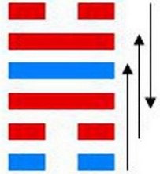

# 咸 ䷞

咸（䷞ xián）卦的代号是`1:6`，主卦是**艮**卦，卦象是山，阳数是`1`；客卦是**兑**卦，卦象是泽，阳数是`6`。山泽通气，咸的意思是“感应”，例如少年男女相爱心灵的感应、物理上的电磁感应等。“咸”的意思是加一点“咸味”，主卦与客卦的阳数比是`1:6`。主弱客强，主方不是“感受”客方的身体，而是伺机消耗客方实力，依靠仅仅有的一点微薄力量，维护自己的利益和生存。

> 运去黄金失色，时来棒槌发芽，月令极好无差，且喜心宽意大。

这个卦是异卦（下艮上兑）相叠。艮为山；泽为水。兑柔在上，艮刚在下，水向下渗，柔上而刚下，交相感应。感则成。

图中，红色表示当位的爻，天蓝色表示不当位的爻，箭头表示有应。

- 卦序：31

> 咸，亨，利貞，取女吉。
>《彖》曰：咸，感也。柔上而剛下，二氣感應以相與，止而說，男下女，是以亨，利貞，取女吉也。天地感而萬物化生，聖人感人心而天下和平。觀其所感，而天地萬物之情可見矣。
>《象》曰：山上有澤，咸，君子以虛受人。

> 初六，咸其拇。
>《象》曰：咸其拇，志在外也。

> 六二，咸其腓，凶，居吉。
>《象》曰：雖凶居吉，順不害也。

> 九三，咸其股，執其隨，往吝。
>《象》曰：咸其股，亦不處也。志在隨人，所執下也。

> 九四，貞吉，悔亡。憧憧往來，朋從爾思。
>《象》曰：貞吉悔亡，未感害也；憧憧往來，未光大也。

> 九五，咸其脢，无悔。
>《象》曰：咸其脢，志末也。

> 上六，咸其輔頰舌。
>《象》曰：咸其輔頰舌，滕口說也。

> 咸（䷞ xián）卦是异卦，下艮上兑，相叠。艮为山；泽为水。兑柔在上，艮刚在下，水向下渗，柔上而刚下，交相感应。感则成。

>《象传》：少男在少女之下，彼此感应，象征新婚，两性交感。

> 如意吉祥，但勿为不正当感情而意乱情迷。

- 事业：和为贵，和则万事兴，务以诚感人，以诚待人。广泛交往朋友，谦虚礼让。树立大志向，坚持主见，不可盲目随大流。不利时应安居待机，不可妄动强求。
- 经商：有利可图。但应以纯正之心，以诚待人，加强合作。市场若不景气，决不可妄动，不可强求，而应静待发展，虚心听取不同意见。
- 求名：志向应宏大，脚踏实地，虚心请教他人，使人悦而应，帮助、重用自己。切莫自我封闭，更不得冷漠孤僻，以广阔的胸怀发展自身。
- 婚恋：成功的可能性极大。双方很有感情，但动机务必纯正，婚姻方可幸福、永久。
- 决策：吉祥如意。人际关系好，善于交际。以真诚的态度，无私的心去处世，不会有不利的地方。与他人合作应坚持原则。办事不可优柔寡断。不顺利时，应停止行动，总结经验，以图发展。待人诚恳，但不可与玩弄口舌的小人交往，防止受骗。

咸卦兑上艮下，为[兑宫三世卦](../jing/dui.md#31)。咸为感应，万物皆有感应，男女感应，夫妇康宁，感应之事，无有不亨。两性交感，正道感应；物击则鸣，识时知机。得此卦者，宜谦虚待人，则会吉祥如意，谋事可成。但勿为不正当感情而意乱情迷。

- 时运：谦虚待人，可保功名。
- 财运：转运贩卖，必可图利。
- 家宅：知其所止；两性合好。
- 身体：虚弱宜补。

> 咸：表示感动。主吉象。感，有如青春男女，清纯无暇的感情，心心相印有感而发的情感，得此卦者，与感情有非常大的关系，也可引伸为对一种理念的认同和欣赏。咸，并无利欲的情色纠葛，是属于比较「感性的」一种感觉。对男女之间的感情，是最大的吉象。

> 解释：合和。

> 特性：罗曼蒂克型，异性缘佳，感情丰富，六亲缘浓，口才佳，贵人多助。

> 运势：吉祥如意。但勿为不正当的感情而意乱迷惑，或过于冲动。然得此卦时，会有男贪女爱之争，非名正者必遭损，宜慎之。

- 家运：目前非常融洽，而后亦然。如夫妇间另有不正当之交往者，宜明哲保家，避免有越轨情事为宜。
- 疾病：防泌尿系统病，肠胃病及性病等，须疗养得法，否则不利。
- 胎孕：有兴家和泰之运。
- 子女：感情极融洽，幸福。
- 周转：可成。
- 买卖：交易可成有利。
- 等人：会带来好消息。
- 寻人：因色情之事出走，不久会出现。其人有在住处动身不得之忧，恐有些是非。
- 失物：尽速找寻，可以取回，延误时机，则找不回来。
- 外出：虽希望外出，但暂时不宜远行。待时机成熟时再出行。
- 考试：成绩佳。
- 诉讼：提防桃色纠纷，诸事宜和解，有贵人相助。
- 求事：皆能如偿所愿。
- 改行：吉利，可进行。
- 开业：大吉大利。

### 初六：咸其拇。《象》曰：咸其拇，志在外也。

伤其大脚趾。《象传》：大脚趾在动，说明其志在于出行。

平：得此爻者，行事过急，多难成就。做官的须修身养性，等待机会，京官出，闲官起。

- 时运：捷足先登，一举成名。
- 财运：货物已办，尚未发行。
- 家宅：迁居外地；结亲之始。
- 身体：足疾医治。

初六爻动变得[第49卦：泽火革](e99da9ge.md)。

泽火革䷰是异卦，下离上兑相叠。离为火、兑为泽，泽内有水。水在上而下浇，火在下而上升。火旺水干，水大火熄。二者相生亦相克，必然出现变革。变革是宇宙的基本规律。

### 六二：咸其腓，凶，居吉。《象》曰：虽凶居吉，顺不害也。

伤其腿肚子，这是凶兆。小腿负伤，不宜出门，安居不动，自然平安。《象传》：虽遇凶兆，但安居不动，则可以转凶为吉。顺从贞卜之象可以避免灾害。

平：得此爻者，奔波徒劳，宜静不宜动。做官的在位者吉，出差者有险。

- 时运：退守为要，依人成事。
- 财运：不宜行商，可以坐贾。
- 家宅：婚事有变；顺守则吉。
- 身体：无法步行。

六二爻动变得[第28卦：泽风大过](e5a4a7e8bf87daguo.md)。

泽风大过䷛是异卦，下巽上兑，相叠。兑为泽、为悦，巽为木、为顺。泽水淹舟，遂成大错。阴阳爻相反，阳大阴小，行动非常，有过度形象，内刚外柔。

### 九三：咸其股，执其随，往吝。《象》曰：咸其股，亦不处也。志在随人，所执下也。

伤其股，并伤及股下之肉。带伤出行，定遭灾难。《象传》：挪动其大腿说明他不安所处。但是其志向不过是追随他人，可见他所持的主张也卑下，不足取。

平：得此爻者，最好退守，做官的谨防被贬。

- 时运：最好退守，声名不彰。
- 财运：合资困难，主事不力。
- 家宅：随人他迁不宜；所处非佳偶。
- 身体：勿陷情欲。

九三爻动变得[第45卦：泽地萃](e89083cui.md)。

泽地萃䷬是异卦，下坤上兑，相叠。坤为地、为顺；兑为泽、为水。泽泛滥淹没大地，人众多相互斗争，危机必四伏。务必顺天任贤，未雨绸缪，柔顺而又和悦，彼此相得益彰，安居乐业。萃，聚集、团结。

### 九四：贞吉悔亡，憧憧往来，朋从尔思。《象》曰：贞吉悔亡，未感害也。憧憧往来，未光大也。

贞卜吉利，无所悔恨。纷沓往来，朋友们都顺从你的意旨。《象传》：贞正，吉利，无所悔恨，因为没有蒙受损害。虽然有几个朋友纷沓往来，但还是要耗费不少心思。

平：得此爻者，朋友相助，可谋小事，大事有困难，心绪不定。做官的秉公执政，升迁有望。

- 时运：功名显达，不正则恶。
- 财运：见利忘义，争夺不休。
- 家宅：谨慎交际；须防不贞。
- 身体：心神恍惚，最好静养。

九四爻动变得[第39卦：水山蹇](e8b987jian.md)。

水山蹇䷦是异卦，下艮上坎，相叠。坎为水，艮为山。山高水深，困难重重，人生险阻，见险而止，明哲保身，可谓智慧。蹇，跋行艰难。

### 九五：咸其脢，无悔。《象》曰：咸其脢，志末也。

伤其背肉，但没有灾祸。《象传》：耸动其背，作出背负重物的反应，看来其志在卑微之事。

平：得此爻者，人情不合，营谋微小。做官的多与同僚不睦。

- 时运：所求未成，稍待时日。
- 财运：已有感应，不必担心。
- 家宅：可保平安。
- 身体：有病将愈，且可增寿。

九五爻动变得[第62卦：雷山小过](e5b08fe8bf87xiaoguo.md)。

雷山小过䷽是异卦，下艮上震，相叠。艮为山，震为雷。过山雷鸣，不可不畏惧。阳为大，阴为小，卦外四阴超过中二阳，故称“小过”，小有越过。

### 上六：咸其辅，颊，舌。《象》曰：咸其辅颊舌，滕口说也。

伤其腮帮、脸颊、舌头。《象传》：伤其腮帮、脸颊、舌头，这是翻腾口说招引的灾祸。

平：得此爻者，多口舌之争，防止被他人诽谤，从事演讲、技艺、评论者吉。做官的或遭言责。

- 时运：口才过人，心存正直。
- 财运：口舌之祸，不可不慎。
- 家宅：口角之争；媒人夸张。
- 身体：胡言乱语，祷之求安。

上六爻动变得[第33卦：天山遁](e981afdun.md)。

天山遁䷠是异卦，下艮上乾相叠。乾为天，艮为山。天下有山，山高天退。阴长阳消，小人得势，君子退隐，明哲保身，伺机救天下。
　　　　　　　　　　　　　　　　　　　　　　　　　　　　　　　　
# [Xián ䷞](../en/e592b8xian.md)
