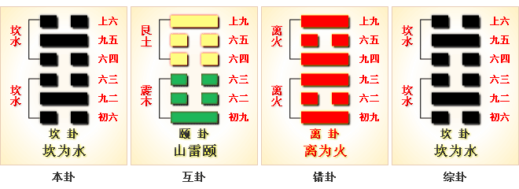

# 坎 ䷜

坎（䷜ kǎn）卦的代号是`2:2`，主卦和客卦都是**坎**卦，卦象是水，阳数是`2`。“坎”，低陷不平的地方，坑穴。**坎**卦，坎为水，行险用险，上下卦。两滴水在一起，还是水，双方的危险和困难合在一起，还是危险和困难。主方应当谨慎行事，诚恳地维持与客方联系，做到互利双赢，共同克服困难。

> 一轮明月照水中，只见影儿不见踪，愚夫当财下去取，摸来摸去一场空。

这个卦是同卦（下**坎**上**坎**）相叠。**坎**为水、为险，两坎相重，险上加险，险阻重重。一阳陷二阴。所幸阴虚阳实，诚信可豁然贯通。虽险难重重，却方能显人性光彩。

图中，红色表示当位的爻，天蓝色表示不当位的爻。**坎**卦中没有有应关系。

- 卦序：29

> 習坎，有孚，維心亨，行有尚。
>《彖》曰：習坎，重險也。水流而不盈，行險而不失其信。維心亨，乃以剛中也；行有尚，往有功也。天險不可升也，地險山川丘陵也，王公設險以守其國，險之時用大矣哉。
>《象》曰：水洊至，習坎。君子以常德行，習教事。

> 初六，習坎，入于坎窞，凶。
>《象》曰：習坎入坎，失道凶也。

> 九二，坎有險，求小得。
>《象》曰：求小得，未出中也。

> 六三，來之坎坎，險且枕，入于坎窞，勿用。
>《象》曰：來之坎坎，終无功也。

> 六四，樽酒，簋貳，用缶，納約自牖，終无咎。
>《象》曰：樽酒簋貳，剛柔際也。

> 九五，坎不盈，祗既平，无咎。
>《象》曰：坎不盈，中未大也。

> 上六，係用徽纏，寘于叢棘，三歲不得，凶。
>《象》曰：上六失道，凶三歲也。

>《象传》：两水重叠，坎水为险，进固险，退亦险，进退两难。

> 危机重重，宜沉著应付，保持心境开朗，凡事莫与人争。

- 事业：陷入重重艰难险阻之中，险况丛生。既不得冒险，也不可束手待毙，应以积极态度，努力创造条件，改变处境，化险为夷。务必实心实意，充满信心，不图侥幸，不辞艰险，宜静观待变，运用智慧，突破险境，转危为安。
- 经商：十分不利，甚至陷入面临破产的境地，但内心应沉着踏实，保持头脑冷静，身陷险境而心不陷，勿轻举妄动，先求自保以观变，把握时机以脱险。
- 求名：不为他人理解，怀才不遇，千万不可自暴自弃。不改初衷，泰然自若，循序渐进，终可为人理解和发现。
- 婚恋：多遭不利，应冷静分析原因，积极改变自身条件。双方同舟共济，共渡难关。
- 决策：不幸。然而是转运前的考验。只要能不因困境而失常，且不图侥幸，保持信心，勿自陷险境。镇定自若，不轻举妄动，洞察时机，必可转危为安，成出险之功。

**坎**卦，坎上坎下，为[坎宫本位卦](../jing/kan.md#29)。坎为陷入、陷阱，为险难之境。此时应坚持信心，才能豁然贯通。艰难危险，重险重陷；事多困阻，谨慎行事。得此卦者，运气不佳，多难危险，事多困阻，宜谨言慎行，退守保安。

- 时运：逐步升迁，随时防患。
- 财运：财如流水，商运亨通。
- 家宅：邻居营造；亲上加亲。
- 身体：水泻之症，虔心祷告。

> 坎：水。表示陷溺被水淹灭之意，主凶象，四大难卦第二卦。困难已到来了，此时正在挣扎中，随时会被淹灭而破散。若能破釜沉舟、奋力一击，或许尚有转机，需积极找求贵人，才会有生机。

> 解释：漂浮，被情所困。

> 特性：不安定感，好冒险，投机，变换工作环境，爱情多困扰不顺。

> 运势：危机重重，宜容忍自重，保持心境开朗，沉着应付，则可有脱险之机。吃得苦中苦，方为人上人，凡事莫与人争长短，否则有不幸灾害。

- 家运：时运不济，陷于困境之中，不和，且有分裂之忧，凡事宜慎重行事。
- 疾病：病重宜速治，否则难救，注意肾脏，膀胱生殖器病。
- 胎孕：临产有虚惊，难产之象。
- 子女：子女多劳苦，宜忍辱负重，会有出人头地的一天。子女宜防水厄之灾。
- 周转：难成。
- 买卖：亏损。
- 等人：不来。
- 寻人：此人因家庭不和或不得志而出走，速寻北方水边。
- 失物：找不回来。有失窃可能，或沉在水底。因坎水有困难之意。
- 外出：大胆外出，另辟新路，必有所成，且得到他人相助。
- 考试：不理想。
- 诉讼：有盗贼之讼，或田土之争，有理说不清，凶象。
- 求事：不利。
- 改行：不宜，应暂时守住本行。
- 开业：开业者不利，有陷入困难之象。

### 初六：习坎，入于坎窞。凶。《象》曰：习坎入坎，失道凶也。

坎坑之中又有坎坑，陷入重坑之中，凶险。《象传》：“坎坑之中又有坎坑，陷入重坑当中”，不行坦途，偏要走险道，必招致灾殃。

凶：得此爻者，时运不佳，宜防跌入陷阱灾难之中。做官的须防小人。

- 时运：侥幸求名，反而受损。
- 财运：贩卖失利，有去无回。
- 家宅：不安之屋；婚姻小心。
- 身体：求医失当，情况危急。

初六爻动变得[第60卦：水泽节](e88a82jie.md)。

水泽节䷻是异卦，下兑上坎，相叠。兑为泽，坎为水。泽有水而流有限，多必溢于泽外。因此要有节度，故称节。节卦与涣卦相反，互为综卦，交相使用。天地有节度才能常新，国家有节度才能安稳，个人有节度才能完美。

### 九二：坎有险，求小得。《象》曰：求小得，未出中也。

坑坑坎坎，道有险阻。敢于行险道，或小有收获。《象传》：敢于行险道，或小有收获，因为九二之爻居下卦的中位，像人尚未偏离正道。

平：得此爻者，有小成就，女命或为侍妾，凶者防险难或生心腹血气之疾。做官的会有小的成就，大事不成。

- 时运：小试有利，不可图大。
- 财运：小心经营，可有小利。
- 家宅：防止河岸。
- 身体：医治有效，但难全好。

九二爻动变得[第8卦：水地比](e6af94bi.md)。

水地比䷇是异卦，下坤上坎，相叠。坤为地，坎为水。水附大地，地纳河海，相互依赖，亲密无间。此卦与师卦完全相反，互为综卦。它阐述的是相亲相辅，宽宏无私，精诚团结的道理。

### 六三：来之坎坎，险且枕，入于坎窞，勿用。《象》曰：来之坎坎，终无功也。

向坑坎走来，这坑坎既险又深，陷入重坎之中，非常不利。《象传》：来到这多坎之地，终无功利。

凶：得此爻者，多坎坷，多争诉之事。做官的宜退守。

- 时运：守住困穷，以待未来。
- 财运：航行受阻，暂时守成。
- 家宅：填满坎陷；求婚不成。
- 身体：不宜过劳。

六三爻动变得[第48卦：水风井](e4ba95jing.md)。

水风井䷯是异卦，下巽上坎，相叠。坎为水；巽为木。树木得水而蓬勃生长。人靠水井生活，水井由人挖掘而成。相互为养，井以水养人，经久不竭，人应取此德而勤劳自勉。

### 六四：樽酒簋贰，用缶，纳约自牖，终无咎。《象》曰：樽酒簋贰，刚柔际也。

用铜樽盛酒，用圆簋盛饭。然而对于关押在坎窖里的犯人，只须用瓦盆子就行了，牢饭从天窗里送进取出，其人遭此噩运，但最后还是没有危险。《象传》：“平时享受美食美器，此时用瓦盆子吃牢饭”，爻象表明六四阴爻处于九五阳爻之卞，像人被强者所压，受此磨难。

平：得此爻者，多喜事，或有结婚之喜。做官的多饮食之乐。

- 时运：春风得意，欢宴嘉宾。
- 财运：造酒之业，颇为顺利。
- 家宅：节俭持家；婚姻吉祥。
- 身体：最好祷告。

六四爻动变得[第47卦：泽水困](e59bb0kun.md)。

泽水困䷮是异卦，下坎上兑，相叠。兑为阴为泽喻悦；坎为阳为水喻险。泽水困，陷入困境。才智难以施展，仍坚守正道，自得其乐，必可成事，摆脱困境。

### 九五：坎不盈，只既平，无咎。《象》曰：坎不盈，中未大也。

坎坑虽没有填满，小山头却被锄平。没有灾难。《象传》：小山头虽锄平，但坎坑尚未填满，说明道路不平，未成坦途。

平：得此爻者，平淡无常，宜养精蓄锐。做官的没有危难，职位无忧。

- 时运：不可自大，功名有限。
- 财运：不谈近利，考虑长远。
- 家宅：景观可喜；门当户对。
- 身体：平心静气。

九五爻动变得[第7卦：地水师](e5b888shi.md)。

地水师䷆是异卦，下坎上坤，相叠。“师”指军队。坎为水、为险；坤为地、为顺，喻寓兵于农。兵凶战危，用兵乃圣人不得已而为之，但它可以顺利无阻碍地解决矛盾，因为顺乎形势，师出有名，故能化凶为吉。

### 上六：系用徵纆，寘于丛棘，三岁不得，凶。《象》曰：上六失道，凶三岁也。

把犯人用绳索捆紧，投入周围有丛棘的监狱中，三年不得释放，这是凶险之事。《象传》：上六爻辞所描述的，正说明官吏违背正道，违法囚人，历时三年之久。

凶：得此爻者，须防牢狱之灾。做官的须防职权旁落之忧。

- 时运：意外之灾，小心牢狱。
- 财运：纺织生意，三年有成。
- 家宅：整修家园；良缘须待三年。
- 身体：不易动弹，安心静养。

上六爻动变得[第59卦：风水涣](e6b6a3huan.md)。

风水涣䷺是异卦，下坎上巽，相叠。风在水上行，推波助澜，四方流溢。涣，水流流散之意。象征组织和人心涣散，必须用积极的手段和方法克服，战胜弊端，挽救涣散，转危为安。

# [Kǎn ䷜](../en/e59d8ekan.md)
