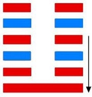
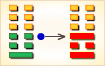
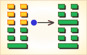
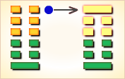

# 复 ䷗

复（䷗ fù）卦的代号是`4:0`，主卦是震卦，卦象是雷，阳数是`4`；客卦是坤卦，卦象是地，阳数是`0`。“复”，反复。主方面临发展好机会，应当坚韧不拔反复探索，摸索经验，寻求正确方向。复卦，地雷复，寓动于顺。这个卦是异卦，下震上坤，相叠。震为雷、为动；坤为地、为顺，动则顺，顺其自然。复卦，阐释恢复的原则。恢复的原则，必须根绝过去的错误，重新回复到善道。恢复的法则，应当从小的过失开始，过失尚未严重之前，及时反省改善，否则积重难返。

图中，红色表示当位的爻，天蓝色表示不当位的爻，箭头表示有应。

- 卦序：24

> 復，亨，出入无疾，朋來无咎，反復其道，七日來復，利有攸往。
>《彖》曰：復，亨。剛反，動而以順行，是以出入无疾，朋來无咎，反復其道，七日來復，天行也。利有攸往，剛長也。復，其見天地之心乎。
>《象》曰：雷在地中，復，先王以至日閉關，商旅不行，后不省方。

> 初九，不遠復，无祇悔，元吉。
>《象》曰：不遠之復，以脩身也。
>《繫辭》：子曰：顏氏之子，其殆庶幾乎！有不善未嘗不知，知之未嘗復行也。易曰：「不遠復，无祇悔，元吉。」

> 六二，休復，吉。
>《象》曰：休復之吉，以下仁也。

>六三，頻復，厲，无咎。
>《象》曰：頻復之厲，義无咎也。

> 六四，中行獨復。
>《象》曰：中行獨復，以從道也。

> 六五，敦復，无悔。
>《象》曰：敦復无悔，中以自考也。

> 上六，迷復，凶，有災眚，用行師，終有大敗，以其國君，凶，至于十年不克征。
>《象》曰：迷復之凶，反君道也。

> 复（䷗ fù）卦是异卦，下震上坤，相叠。震为雷、为动；坤为地、为顺，动则顺，顺其自然。动在顺中，内阳外阴，循序运动，进退自如，利于前进。

>《象传》：雷在地中振发，喻春回大地，一元始，万象更生。

> 开运亨通之象，万事不宜急进，按部就班可成。

- 事业：已经渡过了困难时期，开始进入积极行动的阶段。但务必抓住时机，当机立断，却不可急躁，且应时常反省个人行动，严于修身，勇往直前，可望成功。
- 经商：可大胆投资，与志同道合的伙伴坦诚合作，打开市场，勿因挫折而退缩。更可以打入外地，坚持商业道德，循序渐进，一定会有所赢利。
- 求名：时机正在成熟，不要急于求成，继续奠定基础，机遇一旦到来，务必要抓住，必将转运。最忌自伤意志。
- 婚恋：顺利。但切不可性急，应冷静考虑。家庭的美满幸福，靠严于律己维持。
- 决策：性格活泼，精力旺盛，但因急躁情绪会造成事业损失。一定要冷静思考，勇于改正错误，必能重振事业。此时应抓住时机，明确方向，灵活机敏，脚踏实地改变处境。一旦出现意外，宜当机立断，暂行退让。如能准确驾驶自己，努力奋斗，成就事业十分顺利。

复卦，坤上震下，为[坤宫初世卦](jing/qian.md#24)。复代表阴阳去而复返，使万物生生不息，预示已逝去的可能会再回来。

循环往复，生机复萌；成功在望，性急即败。得此卦者，时运好转，顺势而为，谋事可成，但不宜过于急进。

- 时运：好运初来，静待发动。
- 财运：暂停售物，必可获利。
- 家宅：待春再迁；婚嫁初春可成。
- 身体：有痰上火，冬令宜防。

> 复：表示重复再来、周而复始之意。是个状况卦，吉凶未定。好事会重复，但坏事也会重复再来的。此卦显现一种循环的状态，可能是好、也可能是坏。

> 解释：一年复始、万象更新。

> 特性：为最佳辅佐人才，做事谨慎，调理分明，精企划，组织，
一生财运丰足，乐于助人，排解别人困难，人缘佳。

> 运势：一阳来复，万事苏伸，不久就会好转。初时不宜急进，脚踏实地则有一本万利、开运亨通之象也。

- 家运：昌隆茂盛，渐曙光明之象。
- 疾病：病防发，但可治，为肝、肠胃、神经系统病变。
- 胎孕：主产母有惊惧之灾。
- 子女：辛劳之后必得享福，儿女将来会出人头地。
- 周转：难求，反覆终可入手。
- 买卖：有是非，故勿太急，可有利。
- 等人：会迟到。
- 寻人：自身反覆终人不动，但七日内可回。
- 失物：有失而得之可能。
- 外出：无灾无祸，且有收获。
- 考试：愈考愈好。
- 诉讼：多人之事，但经多次扰攘才可解决。
- 求事：勿太急，可成。
- 改行：可行，但宜沉着，勿急躁。
- 开业：开业者可行，但宜沉着，勿急躁。

### 初九：不远复，无只悔，元吉。《象》曰：不远之复，以修身也。

出外不远就返回，没有大的过失，大吉大利。《象传》：出外不远就返回，比喻能时时反省，严于修身。

吉：得此爻者，万事如意，经营获利。做官的会位高权重。读书人会取得佳绩。

- 时运：好运渐起，一切顺利。
- 财运：赚回所损，不必懊恼。
- 家宅：旧业复兴；婚嫁又成。
- 身体：静养可复。

初九爻动变得[第2卦：坤为地](e59da4kun_cn.md)。

坤为地䷁是同卦，下坤上坤，相叠。阴性。象征地（与乾卦相反），顺从天，承载万物，伸展无穷无尽。坤卦以雌马为象征。表明地道生育抚养万物，而又依天顺时，性情温顺。它以“先迷后得”证明“坤”顺从“乾”，依随“乾”，才能把握正确方向，遵循正道，获取吉利。

### 六二：休复，吉。《象》曰：休复之吉，以下仁也。圆满而归，吉利。《象传》：圆满而归之所以吉利，是能够去位让贤。

吉：得此爻者，与人共利，事业兴旺，病者痊愈。做官的遭贬者会复职。

- 时运：择善而从，万事皆吉。
- 财运：与人共利，事业兴旺。
- 家宅：和睦兴家。
- 身体：再请旧医。

六二爻动变得[第19卦：地泽临](e4b8b4lin_cn.md)。

地泽临䷒是异卦，下兑上坤，相叠。坤为地，兑为泽。地高于泽，泽容于地。喻君主亲临天下，治国安邦，上下融洽。

### 六三：频复，厉，无咎。《象》曰：频复之厉，义无咎也。

愁眉苦脸地回来，是遇到了危险，知难而退可以无灾祸。《象传》：虽然愁眉苦脸地回来，但已脱离危险，理应没有灾祸。

平：得此爻者，事多反复，阴阳差错，时好时坏。做官的职位不稳定，更变无定。

- 时运：时好时坏，自己把握。
- 财运：有盈有亏，全在自己。
- 家宅：迁移不定。
- 身体：身体屡治屡发，虽危无害。

六三爻动变得[第36卦：地火明夷](e6988ee5a4b7mingyi_cn.md)。

地火明夷䷣是异卦，下离上坤，相叠。离为明，坤为顺；离为日；坤为地。日没入地，光明受损，前途不明。环境困难，宜遵时养晦，坚守正道，外愚内慧，韬光养晦。

### 六四：中行独复。《象》曰：中行独复，以从道也。

中途独自返回。《象传》：中途独自返回，这是返回到道义上来。

平：得此爻者，好运可期，营谋得利。做官的会复职。

- 时运：虽想振作，力有未逮。
- 财运：谋划虽精，资本不足。
- 家宅：女多男少；宜从前媒。
- 身体：宜从初治之医。

六四爻动变得[第51卦：震为雷](e99c87zhen_cn.md)。

震为雷䷲是同卦，下震上震，相叠。震为雷，两震相叠，反响巨大。可消除沉闷之气，亨通畅达。平日应居安思危，怀恐惧心理，不敢有所怠慢，遇到突发事变，也能安然自若，谈笑如常。

### 六五：敦复，无悔。《象》曰：敦复无悔，中以自考也。

经过考察，决定返回，可以无悔。《象传》：经过考察，决定返回，可以无悔，意思是从内心用正道检察自己。

吉：得此爻者，会有积蓄，但要谨防父亲出意外。做官的有升职之机会。

- 时运：宽厚处之，有功无悔。
- 财运：资本充足，来回获利。
- 家宅：光大祖业。
- 身体：精气皆老，不必过滤。

六五爻动变得[第3卦：水雷屯](e5b1afzhun_cn.md)。

水雷屯䷂是异卦，下震上坎，相叠。震为雷，喻动；坎为雨，喻险。雷雨交加，险象丛生，环境恶劣。“屯”原指植物萌生大地，万物始生，充满艰难险阻，然而顺时应运，必欣欣向荣。

### 上六：迷复，凶，有灾眚。用行师，终有大败，以其国君凶，至于十年不克征。《象》曰：迷复之凶，反君道也。

迷途难返，凶险，有灾祸。筮遇此爻，出兵打仗，终有大败，连累国君遭遇凶险，元气大伤，十年后还不能再举征伐。《象传》：迷途难返遭遇凶险，这是由于君王违反君道。

凶：得此爻者，做事乖张，诸事不顺，静吉动凶。做官的会过于贪婪权力而有损。

- 时运：做事乖张，谨慎免祸。
- 财运：诸事不顺，难以复业。
- 家宅：居者不利。
- 身体：难以保全。

上六爻动变得[第27卦：山雷颐](e9a290yi_cn.md)。

山雷颐䷚是异卦，下震上艮，相叠。震为雷，艮为山。山在上而雷在下，外实内虚。春暖万物养育，依时养贤育民。阳实阴虚，实者养人，虚者为人养。自食其力。

# [Fù ䷗](e5a48dfu.md)
