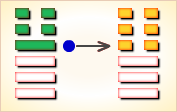

# 大壮 ䷡

大壮（䷡ dà zhuàng）卦的代号是`7:4` 。主卦是`7`卦，乾卦，卦象是天；客卦是`4`卦，震卦，卦象是雷。威力强大的主方，面对刚刚出现的新生力量，无疑可以轻易摆布客方，但是，也可能滥用自己的力量，给自己带来麻烦，“大壮”有过于强壮之意，告诫主方不要过分滥用权力。大壮卦，雷天大壮，壮勿妄动。这个卦是异卦，下乾上震，相叠。震为雷；乾为天。乾刚震动。天鸣雷，云雷滚， 声势宏大，阳气盛壮，万物生长。刚壮有力故曰壮。大而且壮，故名大壮。四阳壮盛，积极而有所作为，上正下正，标正影直。

图中，红色表示当位的爻，天蓝色表示不当位的爻，箭头表示有应。

- 卦序：34

> 大壯，利貞。
>《彖》曰：大壯，大者壯也，剛以動，故壯。大壯利貞，大者正也。正大而天地之情可見矣。
>《象》曰：雷在天上，大壯，君子以非禮弗履。

> 初九，壯于趾，征凶，有孚。
>《象》曰：壯于趾，其孚窮也。

> 九二，貞吉。
>《象》曰：九二貞吉，以中也。

> 九三，小人用壯，君子用罔，貞厲。羝羊觸藩，羸其角。
>《象》曰：小人用壯，君子罔也。

> 九四，貞吉，悔亡。藩決不羸，壯于大輿之輹。
>《象》曰：藩決不羸，尚往也。

> 六五，喪羊于易，无悔。
>《象》曰：喪羊于易，位不當也。

> 上六，羝羊觸藩，不能退、不能遂，无攸利，艱則吉。
>《象》曰：不能退，不能遂，不詳也。艱則吉，咎不長也。

> 大壮（䷡ dà zhuàng）卦是异卦，下乾上震相叠。震为雷；乾为天。乾刚震动。天鸣雷，云雷滚，声势宏大，阳气盛壮，万物生长。刚壮有力故曰壮。大而且壮，故名大壮。四阳壮盛，积极而有所作为，上正下正，标正影直。

>《象传》：雷声响亮，光明天际，为正大光明之象，又为强烈地动之象，为六冲卦之一。

> 运势虽强，但已届极盛之时，宜心平气和，否则反招失败，须知物极必反。

- 事业：处世凭智不凭力，有勇更有谋，切忌蛮干，该守不守，自取其凶。不可逞强，否则自取凶险。对小人应有防犯，尤其不得忽视小人的奸诈。对事业应勇往直前，但切忌冒进。
- 经商：处在高涨阶段，形势很好。但决不可逞强，更不可妄动，应主动增强与他人的合作。提高警惕，认识物极必反的道理，做事业衰退的准备。
- 求名：务必注意妥善地运用自己的力量，不可自恃刚健强壮而冒进，尤其不可自负。适当发挥自己的才干，加上外力的援助，必有所作为。
- 婚恋：决不可因自己条件好而高傲。切勿错过好姻缘。
- 决策：强健适中，不可过分消耗自己的力量。在事业顺利的时刻，尤其不可妄动。更应注意，很可能已经处于进退维谷的状态，务必自保待机，及早有所准备。

大壮卦，震上乾下，为[坤宫四世卦](../jing/kun.md#34)。此卦中的大壮表示壮大，阳隆盛，象征君子，君子壮大当然亨通。光明正大，强盛壮大；容忍和气，切忌冲动。得此卦者，运势过于强盛，宜心平气和，谨慎行事，否则必生过失。

- 时运：成名不难，不可骄傲。
- 财运：得价即售，不可过贪。
- 家宅：小心防火；相敬如宾。
- 身体：保养脚部。

> 大壮：表示天上打雷、声势浩大，行动迅速、积极之象。此卦一般以吉处藏凶来论。因为对人、对事最忌冲动。此卦有过于不理性冲动之象，容易犯错。尤其有血光之祸，被人殴打、伤害之意。得此卦者，凡事再三思为吉。

> 解释：声势浩荡。

> 特性：爱冒险，领导欲强，喜怒易形于色，不喜欢太平淡安定的工作生活。金钱支出大方，朋友人缘不错。

> 运势：刚强过盛者，若不思正与顺，则有躁动之害耳。虽运势强大，时至当盛之期，但忌血气方刚。处事欠思虑而遭破运，宜力持和平、顺气，勿得罪人，否则会因此而招来失败，切勿贪妄。

- 家运：已壮大且富有，但亦有似成而空之感。
- 疾病：生平少病者遇此卦则不利，注意急性呼吸道感染和脑疾等。
- 胎孕：子母有难非喜。
- 子女：儿女有自视太高，目中无人之情。
- 周转：勿再三借贷，如此反而不利。
- 买卖：可成功与获大利，但往后要小心，有反遭不利之情况。
- 等人：迟来。
- 寻人：为斗气而出走，若寻找途中不见，则难查下落，东方或西北方。
- 失物：不能取回。
- 外出：慎重外出，不可莽撞，否则不吉利。
- 考试：有好成绩，但勿太骄傲。
- 诉讼：忌与人斗气，宜和解收场，否则两败俱伤。
- 求事：可顺利，勿太刚强行事。
- 改行：可，不过勿太勉强。
- 开业：吉利。

### 初九：壮于趾，征凶，有孚。《象》曰：壮于趾，其孚穷也。

伤于脚趾。筮遇此爻，出征则凶，但尚有收获。《象传》：自恃兵强，侵略他国，虽有收获，但信用扫地。

凶：得此爻者，会有争诉，动则凶，须防足疾。做官的须防小人的谗言而受辱。

- 时运：有勇无谋，功名必卑。
- 财运：不能慎思，必遭损失。
- 家宅：不可迁移；防女足疾。
- 身体：慎择良医。

初九爻动变得[第32卦：雷风恒](e68192heng.md)。

雷风恒䷟是异卦，下巽上震，相叠。震为男、为雷；巽为女、为风。震刚在上，巽柔在下。刚上柔下，造化有常，相互助长。阴阳相应，常情，故称为恒。

### 九二：贞吉。《象》曰：九二贞吉，以中也。

卜问得吉兆。《象传》：九二爻辞讲贞正吉利，因为九二之爻居下卦中位，像人守中正之道。

吉：得此爻者，营谋得意。做官的中庸处事，心中无愧。

- 时运：中庸处世，受到肯定。
- 财运：货价合宜，自然获利。
- 家宅：地位适中；婚姻吉祥。
- 身体：滋补得宜。

九二爻动变得[第55卦：雷火丰](e4b8b0feng.md)。

雷火丰䷶是异卦，下离上震，相叠。电闪雷鸣，成就巨大，喻达到顶峰，如日中天。告戒：务必注意事物向相反方面发展，盛衰无常，不可不警惕。

### 九三：小人用壮，君子用罔，贞厉。羝羊触藩，羸其角。《象》曰：小人用壮，君子罔也。

小人捕兽凭气力，君子捕兽靠网围。卜问得险兆。公羊以角撞藩，结果被篱笆卡住。《象传》：小人捕兽凭气力，君子捕兽靠网围。

凶：得此爻者，或有官司之事，或家中有丧，人财不利。做官的多祸难，进退难安。

- 时运：临事而惧，谦退受益。
- 财运：不必垄断，否则大耗。
- 家宅：过高易震；夫妻反目。
- 身体：血气过刚，防有不测。

九三爻动变得[第54卦：雷泽归妹](e5bd92e5a6b9guimei.md)。

雷泽归妹䷵是异卦，下兑上震，相叠。震为动、为长男；兑为悦、为少女。以少女从长男，产生爱慕之情，有婚姻之动，有嫁女之象，故称归妹。

### 九四：贞吉，悔亡；藩决不羸，壮于大舆之輹。《象》曰：藩决不羸，尚往也。

卜问得吉兆，没有悔恨。因为公羊冲决篱笆，摆脱了拘系，但又被车轮撞伤，不能乱冲乱撞了。《象传》：冲决篱笆，摆脱掏系，恐其冲撞别处。

吉：得此爻者，常人得福，久静者必动，动则吉。做官的闲职者复职，进取如意。

- 时运：前途无阻，功名亦显。
- 财运：满载而归，何乐不为。
- 家宅：赶快整修；不是佳偶。
- 身体：恐有不测。

九四爻动变得[第11卦：地天泰](e6b3b0tai.md)。

地天泰䷊是异卦，下乾上坤，相叠。乾为天，为阳；坤为地，为阴。阴阳交感，上下互通，天地相交，万物纷纭。反之则凶，万事万物，皆对立，转化，盛极必衰，衰而转盛，故应时而变者泰（通）。

### 六五：丧羊于易，无悔。《象》曰：丧羊于易，位不当也。

丧羊于狄。筮遇此爻，没有大的灾祸。《象传》：丧羊于狄，因为六五阴爻而居处阳位，是所处不当，像人所处环境不适当，将蒙受损失。

凶：得此爻者，一筹莫展，不能得利，病者有丧身之兆。做官的会荒于政务。

- 时运：亡羊补牢，晚年有望。
- 财运：恐有小失，尚无大碍。
- 家宅：不宜畜牧；婚礼不成。
- 身体：不吉之象。

六五爻动变得[第43卦：泽天夬](e5a4acguai.md)。

泽天夬䷪是异卦，下乾上兑，相叠。乾为天为健；兑为泽为悦。泽气上升，决注成雨，雨施大地，滋润万物。五阳去一阴，去之不难，决（去之意）即可，故名为夬（guài），夬即决。

### 上六：羝羊触藩，不能退，不能遂，无攸利。艰则吉。《象》曰：不能退，不能遂，不详也；艰则吉，咎不长也。

羊角插进了篱笆，退不了，进不了，处境不利。但是，目前虽处于艰难之中，最终可以化解逢吉。《象传》：不能退，不能进，陷入进退维谷之中，这是遭逢不祥。虽陷入艰难之中，最终可以化解逢吉，是说灾难不会长久。

平：得此爻者，进退两难，多是非争诉，宜守常。做官的宜退不宜进，恐有遭贬之危。

- 时运：早些退休，以免后悔。
- 财运：原想发财，难以保本。
- 家宅：艰难自守；先苦后乐。
- 身体：进退两难。

上六爻动变得[第14卦：火天大有](e5a4a7e69c89dayou.md)。

火天大有䷃是异卦，下乾上离，相叠。上卦为离，为火；下卦为乾，为天。火在天上，普照万物，万民归顺，顺天依时，大有所成。

# [Dà Zhuàng ䷡](e5a4a7e5a3aedazhuang.md)
