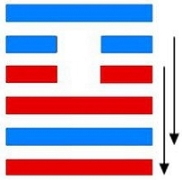

# 大畜 ䷙

大畜（䷙ dà xù）卦的代号是`7:1`，主卦是乾卦，卦象是天，阳数是`7`；客卦是艮卦，卦象是山，阳数是`1`。主卦和客卦的阳数比是`7:1`。主方应当把客方像动物畜养起来，驯服它，但不是消灭它。

图中，红色表示当位的爻，天蓝色表示不当位的爻，箭头表示有应。

- 卦序：26

> 大畜，利貞，不家食吉，利涉大川。
>《彖》曰：大畜，剛健篤實，輝光日新其德，剛上而尚賢，能止健，大正也。不家食吉，養賢也；利涉大川，應乎天也。
>《象》曰：天在山中，大畜。君子以多識前言往行，以畜其德。

> 初九，有厲，利已。
>《象》曰：有厲利已，不犯災也。

> 九二，輿說輹。
>《象》曰：輿說輹，中无尤也。

> 九三，良馬逐，利艱貞，曰閑輿衛，利有攸往。
>《象》曰：利有攸往，上合志也。

> 六四，童牛之牿，元吉。
>《象》曰：六四元吉，有喜也。

> 六五，豶豕之牙，吉。
>《象》曰：六五之吉，有慶也。

> 上九，何天之衢，亨。
>《象》曰：何天之衢，道大行也。

> 大畜（䷙ dà xù）卦是异卦，下乾上艮，相叠。乾为天，刚健；艮为山，笃实。畜者积聚，大畜意为大积蓄。为此不畏严重的艰难险阻，努力修身养性以丰富德业。

>《象传》：天之大而在山之中，以小阻大，以阴畜阳，为止为养。

> 处事不可好高骛远，宜脚踏实地，可成大业，忌目空一切。

- 事业：务必端正行为，修养德行。行为应大胆、果断，但需适可而止，注意休整，决不可冒险闯进。宜注意吸收前人的经验教训，有所畏而不行，否则必有危害。再取得成就之后，应适可而止，不可贪图眼前小利而走向反面。
- 经商：本着循序渐进的原则，把握正当的商业道德，会有重大收获。此时，切忌贪心不足，而应见机而退，保守事业，深思熟虑，再图发展，一味自信冒进，决不可取。
求名：注意积累学问，提高德行，勿三天打鱼两天晒网，持之以恒，且以学问、知识报效国家，抱负终将实现。
- 婚恋：顺利。建立在共同勤俭持家的基础上，相互坦诚而待，美满幸福。
- 决策：蓄财的人，但决不可抱投机取巧心理，得靠个人诚实工作，多动心机，真诚与他人合作，共创事业，困难时仍应持正道，尤其不可粗心大意，牢记成就大阻力也大的道理。

大畜卦，艮上乾下，为[艮宫二世卦](../jing/gen.md#26)。畜为积蓄之意，艮为止，提示人们要停止下来积蓄力量，多主吉。以阳畜阴，制止欲进；坚守正道，先凶后吉。得此卦者，宜坚守正道，脚踏实地，务实行事，方可成就大业。切勿骄傲自满，目空一切。

- 时运：守静二年，方可展运。
- 财运：暂时株守，良机必至。
- 家宅：家业日隆；婚姻大吉。
- 身体：健康有力。

> 大畜：表示会有很多的积蓄、不动产的来到，吉相之卦。可以考虑较大的投资案，只是现金周转可能会较不利。蓄也有守财小气之象。

> 解释：大有积蓄。

> 特性：反应快，追求新知，不断创新，研究新事物，待人谦虚，修养好。贵人多助，容易少年发达，年轻就会有所成就。

> 运势：大凡诸事不可好高鹜远，脚踏实地、务实行事，始能成就大业。以蓄德为主可吉，若因得势而气盛凌人，目空一切者，终招失败之象。

- 家运：须知蓄者以备急需也。明此道理，持之力行，则可亨通。
- 疾病：病虽重，但可治，防胸肺，腹或手部之病，易积劳成疾。
- 胎孕：占得此卦主生贵子。
- 子女：儿女必声扬家风，可得幸福之象。
- 周转：可成。
- 买卖：再谈可成交 ，且有获大利之象也。
- 等人：不会来。
- 寻人：途中虚险，若一人等待必有凶。若是出走者，不必寻，会自回。
- 失物：有机会寻回。似是在圆形有盖盛存之物中。
- 外出：不宜守于家中，出行必得，且畅通无阻。不过应处处小心谨慎。
- 考试：上榜。
- 诉讼：因房地产引起，有破财之象，但纠纷可解。
- 求事：不利，宜再待时。
- 改行：不宜。
- 开业：开业者要有不怕挫折之决心全力以赴，有利可得。

### 初九：有厉，利已。《象》曰：有厉利已，不犯灾也。

将有危险，祭祀鬼神则能化凶为吉。《象传》：将有危险，停止所为则能化凶为吉，因为这样就不会犯灾触难。

凶：得此爻者，宜守旧，不然会有不测之祸。做官的宜退居闲职，或退位。

- 时运：采取守势，等待援兵。
- 财运：等待帮手，方可获利。
- 家宅：屋宅忌高；夫顺妻吉。
- 身体：有病无虞。

初九爻动变得[第18卦：山风蛊](e89b8agu.md)。

山风蛊䷑是异卦，下巽上艮，相叠。与随卦互为综卦。蛊本意为事，引申为多事、混乱。器皿久不用而生虫称“蛊”，喻天下久安而因循、腐败。必须革新创造，治理整顿，挽救危机，重振事业。

### 九二。舆说輹。《象》曰：舆说輹，中无尤也。

车辐脱落，车轮坏了。《象传》：车辐脱落车轮坏了，九二之爻居下卦中位，这种爻象表明毕竟没有忧患。

凶：得此爻者，须谨防是非，或有足疾、腰疾。

- 时运：以退为进，可保无患。
- 财运：早些脱手，减少损失。
- 家宅：谨慎守业；贵婿大吉。
- 身体：腹痛难愈，但无大碍。

九二爻动变得[第22卦：山火贲](e8b4b2bi.md)。

山火贲䷕是异卦，下离上艮，相叠。离为火为明；艮为山为止。文明而有节制。贲卦论述文与质的关系，以质为主，以文调节。贲，文饰、修饰。

### 九三：良马逐，利艰贞。曰闲舆卫，利有攸往。《象》曰：利有攸往，上合志也。

良马交配。占问艰难之事吉利。每天练习防卫性车战。有所往则有利。《象传》：有所往则有利，所往必得，尚可符合心意。

平：得此爻者，会得到长辈的重用，或知己相助，前运辛苦，后可有获。做官的会有实权。

- 时运：临事而惧，马到成功。
- 财运：买卖合宜，有利可图。
- 家宅：勤俭兴家；男女合志。
- 身体：谨慎调养，可保无碍。

九三爻动变得[第41卦：山泽损](e68d9fsun.md)。

山泽损䷨是异卦，下兑上艮，相叠。艮为山；兑为泽。上山下泽，大泽浸蚀山根。损益相间，损中有益，益中有损。二者之间，不可不慎重对待。损下益上，治理国家，过度会损伤国基。应损则损，但必量力、适度。少损而益最佳。

### 六四。童豕之牿，元吉。《象》曰：六四元吉，有喜也。

将木棒横缚在好斗公牛的犄角上。筮遇此爻，大吉大利。《象传》：六四爻辞讲的大吉大利，是指将有喜庆之事。

吉：得此爻者，营谋有望，财富增加。做官的会有升迁之喜。

- 时运：得人赏识，可以升迁。
- 财运：新货到手，蓄积有利。
- 家宅：新居有路；少年联姻。
- 身体：防小儿病。

六四爻动变得[第14卦：火天大有](e5a4a7e69c89dayou.md)。

风天小畜䷍是异卦，下乾上离，相叠。上卦为离，为火；下卦为乾，为天。火在天上，普照万物，万民归顺，顺天依时，大有所成。

### 六五：豮豕之牙，吉。《象》曰：六五之吉，有庆也。

将好奔突的大猪圈起来，吉利。《象传》：六五爻辞讲的吉利，是指有吉庆之事。

吉：得此爻者，营谋遂意，多有喜庆之事。做官的会高升。

- 时运：不可躁进，定而后动。
- 财运：得人支持，买卖有利。
- 家宅：住屋风水；婚姻合宜。
- 身体：调养节制。

六五爻动变得[第9卦：风天小畜](e5b08fe7959cxiaoxu.md)。

风天小畜䷈是异卦，下乾上巽，相叠。乾为天，巽为风。喻风调雨顺，谷物滋长，故卦名小畜（蓄）。力量有限，须待发展到一定程度，才可大有作为。

### 上九：何天之衢，亨。《象》曰：何天之衢，道大行也。

得到上天的福佑，大吉大利。《象传》：得到上天的福佑，行事畅通无阻。

吉：得此爻者，万事如意，心想事成，好运连连。做官的会得到上司的提拔，或被举荐而高升。读书人会进取成名。

- 时运：青云直上，可喜可贺。
- 财运：毫无阻碍，大获其利。
- 家宅：道旁吉宅；天作之合。
- 身体：健康平安。

上九爻动变得[第11卦：地天泰](e6b3b0tai.md)。

地天泰䷊是异卦，下乾上坤，相叠。乾为天，为阳；坤为地，为阴。阴阳交感，上下互通，天地相交，万物纷纭。反之则凶，万事万物，皆对立，转化，盛极必衰，衰而转盛，故应时而变者泰（通）。

# [Dà Xù ䷙](e5a4a7e89384daxu.md)
