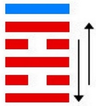
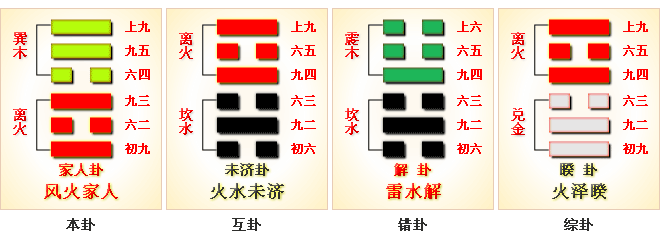
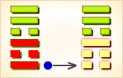
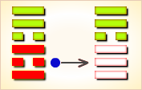
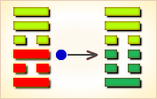
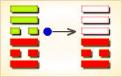
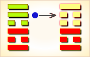
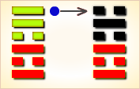

# 家人 ䷤

家人（䷤ jiā rén）卦的代号是`5:3`。主卦是`5`卦，离卦；客卦是`3`卦，巽卦，主卦和客卦的阳数比是`5:3`。家人指家长。主卦是离卦，光明而依附，如家长操劳家务而依赖全家人员配合；客卦是巽卦，有力而顺从，如家庭成员顺从家长。《家人》象征家庭：特别注重女人在家中的作用，如果她能够坚守正道，始终如一，将会非常有利。《家卦》的卦象是离（火）下，巽（风）上，为风从火出之表象，象征着外部的风来自于本身的火，就像家庭的影响和作用都产生于自己内部一样。君子应该特别注意自己的一言一行，说话要有根据和内容，行动要有准则和规矩，不能朝三暮四和半途而废。

图中，红色表示当位的爻，天蓝色表示不当位的爻，箭头表示有应。

- 卦序：37

> 家人，利女貞。
>《彖》曰：家人，女正位乎內，男正位乎外，男女正，天地之大義也。家人有嚴君焉，父母之謂也。父父，子子，兄兄，弟弟，夫夫，婦婦，而家道正。正家，而天下定矣。
>《象》曰：風自火出，家人，君子以言有物，而行有恆。

> 初九，閑有家，悔亡。
>《象》曰：閑有家，志未變也。

> 六二，无攸遂，在中饋，貞吉。
>《象》曰：六二之吉，順以巽也。

> 九三，家人嗃嗃，悔厲吉。婦子嘻嘻，終吝。
>《象》曰：家人嗃嗃，未失也。婦子嘻嘻，失家節也。

> 六四，富家，大吉。
>《象》曰：富家大吉，順在位也。

> 九五，王假有家，勿恤，吉。
>《象》曰：王假有家，交相愛也。

> 上九，有孚威如，終吉。
>《象》曰：威如之吉，反身之謂也。

> 家人（䷤ jiā rén）卦是异卦，下离上巽，相叠。离为火；巽为风。火使热气上升，成为风。一切事物皆应以内在为本，然后伸延到外。发生于内，形成于外。喻先治家而后治天下，家道正，天下安乐。

>《象传》：风吹火之象，助火之威，喻家人同心协力，发展事业。

> 平安大吉，与人合作则易成，更有喜庆之象，如添丁婚嫁等。

- 事业：成功与否取决于家庭的情况。严格治家，防止“后院”起火出现意外事故，这是事业成功的先决条件。夫妇和睦，共同合作，必可脱贫致富。事业应由内而外，循序渐进，持之以恒，而后必有所成。
- 经商：以治家方式用于商业活动。对待公司员工应严宽结合，以严为主。宜集中领导，主事一人，共同合作，日积月累。
- 求名：以勤苦努力和安贫乐道为主，更应有家庭的支持。家道兴盛的同时，个人的事业也就容易成功。
- 婚恋：和睦的家庭，是一切的基础，而妻子又是家道的根本。择妻应慎重，和乐兴家。
- 决策：因好的家庭和妻子的支持而顺利成功，务必保持这种优势，否则，由盛转衰在顷刻之间。尤其应预防家庭变故。持家重在谦和待人，勤俭积蓄以致富。亲人相互和睦、友好。

家人卦，巽上离下，为[巽宫二世卦](jing/xun.md#37)。家人卦为家庭和睦、和合之象，多主吉。人心内向，家道兴隆；严正有恒，不能移心。得此卦者，与人合作共事者会有利，且多有喜事之象，家庭和睦者，能同心协力，发展事业。

- 时运：旺运当头，言行小心。
- 财运：囤积货品，后有高价。
- 家宅：小心火灾；亲上加亲。
- 身体：痰多气喘，难以根治。

> 家人：表示同为一家人，主小吉之象。事事以家人为重之意，如事业投资均需一家人合作共事为佳。感情，为成家之吉象。

> 解释：家人离散，吉中带凶。

> 特性：为人热忱，待人谦恭有礼貌，善交际，外表积极内心保守。喜家庭生活，爱小孩小动物。

> 运势：平安无事，且有喜事之象，与家人共事者大利。

- 家运：万事畅达如意，和乐之象。
- 疾病：注意心脏或胆病，必须小心调理。
- 胎孕：不碍。
- 子女：儿女孝顺。
- 周转：难调，但可成，宜找自家亲人为佳。谨守诚信可无阻。
- 买卖：有超值的利益可得，交易可成。
- 等人：会来，且有吉事相告。
- 寻人：因赌气出走，不久便见。
- 失物：会出现。隐藏在家中。可能是被家人收起来了。
- 外出：在家千日好，外出一时难，准备充分后再行动。
- 考试：上榜有名。
- 诉讼：虽产生大疑虑，若行事合理则无碍。
- 求事：有良好机会，勿失。
- 改行：勿急。
- 开业：开业者可照计划而行，吉利也。

### 初九：闲有家，悔亡。《象》曰：闲有家，志未变也。

防范家庭出现意外事故，没有悔恨。《象传》：防范家庭出现意外事故，就是警惕未然事变。

平：得此爻者，谋事有成，未婚者会结婚，老者不利于寿。做官的闲职者会晋升有实权，当职者则权力旁落。

- 时运：好运初来，自我检点。
- 财运：初做生意，严守商规。
- 家宅：有规有矩；清白之家。
- 身体：有病就治，一拖难医。

初九爻动变得[第53卦：风山渐](e6b890jian_cn.md)。

风山渐䷴是异卦，下艮上巽，相叠。艮为山，巽为木。山上有木，逐渐成长，山也随着增高。这是逐渐进步的过程，所以称渐，渐即进，渐渐前进而不急速。

### 六二：无攸遂，在中馈，贞吉。《象》曰：六二之吉，顺以巽也。

妇女在家中料理家务，安排饍食，没有失误，这是吉利之象。《象传》：六二爻辞之所以称吉利，因为六二阴爻居九三阳爻之下，像妇人对男人顺从而又谦逊。

吉：得此爻者，营谋成家，多喜事。做官的会荣华富贵。

- 时运：因人成事，尚可如意。
- 财运：贩运粮食，可以获利。
- 家宅：妇人当家。
- 身体：胃口尚好，可以无碍。

六二爻动变得[第9卦：风天小畜](e5b08fe7959cxiaoxu_cn.md)。

风天小畜䷈是异卦，下乾上巽，相叠。乾为天，巽为风。喻风调雨顺，谷物滋长，故卦名小畜（蓄）。力量有限，须待发展到一定程度，才可大有作为。

### 九三：家人嗃嗃，悔厉，吉；妇子嘻嘻，终吝。《象》曰：家人嗃嗃，未失也；妇子嘻嘻，失家节也。

贫困之家，众口嗷嗷待哺，这是愁苦之事，但能辛勤劳作，可以脱贫致富。而富贵之家，骄奢淫逸，妻室儿女只知嬉笑作乐，终将败落。《象传》：贫困之家，而能辛勤劳作，未失正派家风。富贵之冢，一味嬉笑作乐，则有失勤俭之道。

凶：得此爻者，忧喜参半，谨防沉迷于享乐中。做官的严而少宽恕之恩。

- 时运：刻苦有成，逸乐则废。
- 财运：内外皆齐，尚可自保。
- 家宅：家规严肃；两姓相从。
- 身体：凉剂解厄。

九三爻动变得[第42卦：风雷益](e79b8ayi_cn.md)。

风雷益䷩是异卦，下震上巽，相叠。巽为风；震为雷。风雷激荡，其势愈强，雷愈响，风雷相助互长，交相助益。此卦与损卦相反。它是损上以益下，后者是损下以益上。二卦阐述的是损益的原则。

### 六四。富家，大吉。《象》曰：富家大吉，顺在位也。

幸福家庭，大吉大利。《象传》：幸福家庭，大吉大利，因为六四阴爻居于九五阳爻之下，像家人和顺而各守其职。

吉：得此爻者，时运正佳，贵人提拔，孤寡见亲。做官的仕途顺利，升迁有望。

- 时运：发财保家，正当好运。
- 财运：利市三倍，其富可知。
- 家宅：富豪之家。
- 身体：过于肥胖，减之即愈。

六四爻动变得[第13卦：天火同人](e5908ce4babatongren_cn.md)。

天火同人䷌是异卦，下离上乾，相叠。乾为天，为君；离为火，为臣民百姓。上天下火，火性上升，同于天。上下和同，同舟共济，人际关系和谐，天下大同。

### 九五：王假有家，勿恤，吉。《象》曰：王假有家，交相爱也。

君王到家庙祭祀祖先，不要忧虑，祖先福佑家人，凡事吉利。《象传》：君王到臣民之家，说明君臣交相爱护。

吉：得此爻者，营谋得利，会得到贵人的提携。做官的显贵，进取有望。

- 时运：人心感通，自然吉祥。
- 财运：奉公营商，利润可保。
- 家宅：高门大宅；嫁入豪门。
- 身体：肝火过旺，调养心气。

九五爻动变得[第22卦：山火贲](e8b4b2bi_cn.md)。

山火贲䷕是异卦，下离上艮，相叠。离为火为明；艮为山为止。文明而有节制。贲卦论述文与质的关系，以质为主，以文调节。贲，文饰、修饰。

### 上九：有孚威如，终吉。《象》曰：威如之吉，反身之谓也。

君上掌握杀罚之权，威风凛凛，权柄不移，终归吉利。《象传》：上九爻辞讲杀罚立威，终归吉利，因为君上能够内省己身，外树威望。

吉：得此爻者，营谋称意，女命更好。做官的位高权重，读书人进取成名。

- 时运：万物皆吉，好运将尽。
- 财运：商道之正，有利有名。
- 家宅：一乡之望；两姓和睦。
- 身体：运动健身。

上九爻动变得[第63卦：水火既济](e697a2e6b58ejiji_cn.md)。

水火既济䷾是异卦，下离上坎，相叠。坎为水，离为火，水火相交，水在火上。水势压倒火势，救火大功告成。既，已经；济，成也。既济就是事情已经成功，但终将发生变故。

# [Jiā Rén ䷤](e5aeb6e4babajiaren.md)
