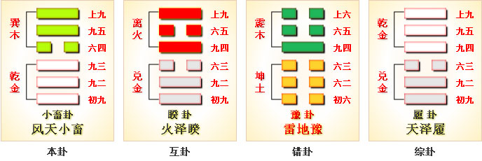
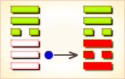

# 小畜 ䷈

小畜（䷈ xiǎo xù）卦的代号是`7:3`。主卦是`7`卦，乾卦，卦象是天，天的特性是强健。客卦是`3`卦，巽卦，卦象是风，风的特性是顺从。这并不意味强健的主方可以让客方顺从主方，因为，风仍然有强大的能量，只是顺从在前进方向上可以通过的路，并不顺从在与前进方向不通，或者没有开通的路。巽卦的中爻和上爻是阳爻，表示客方仍然有很强的力量，只有下爻是阴爻，消极被动，这并不意味着主方可以让客方无条件地顺从。所以，在当前双方关系中，主方应当积蓄力量，伺机而动。“小畜”的意思是：少许积蓄。

图中，红色表示当位的爻，天蓝色表示不当位的爻，箭头表示有应。

- 卦序：9

> 小畜，亨，密雲不雨，自我西郊。
>《彖》曰：小畜，柔得位而上下應之，曰小畜。健而巽，剛中而志行，乃亨。密雲不雨，尚往也；自我西郊，施未行也。
>《象》曰：風行天上，小畜，君子以懿文德。

> 初九，復自道，何其咎，吉。
>《象》曰：復自道，其義吉也。

> 九二，牽復，吉。
>《象》曰：牽復在中，亦不自失也。

> 九三，輿說輻，夫妻反目。
>《象》曰：夫妻反目，不能正室也。

> 六四，有孚，血去惕出，无咎。
>《象》曰：有孚惕出，上合志也。

> 九五，有孚攣如，富以其鄰。
>《象》曰：有孚攣如，不獨富也。

> 上九，既雨既處，尚得載，婦貞厲。月幾望，君子征凶。
>《象》曰：既雨既處，德積載也；君子征凶，有所疑也。

> 小畜（䷈ xiǎo xù）卦是异卦，下乾上巽，相叠。乾为天，巽为风。喻风调雨顺，谷物滋长，故卦名小畜（蓄）。力量有限，须待发展到一定程度，才可大有作为。

>《象传》：蓄养之量有限，力不从心，故宜忍耐蓄养实力，静待时机。

> 运势反覆，有口舌之争，但难于短期内解决，须忍耐，静待时机。

- 事业：时机尚不成熟，应当耐心而积极地积存力量，切不可冒险行动。遇到挫折不可灰心，鼓起勇气战胜困难，坚持原则，加强团结合作，提前做好各项准备，会有所成。
- 经商：已有一定的基础，但有失去危险，一定要特别慎重，争取与他人真诚合作，共同获利，决不贪心，适可而止，但更不能满足现状，不图进取。
- 求名：树立远大目标，尽最大努力去争取，虚心求教他人，取得真诚帮助，实现自己的理想，警惕小人的破坏。
- 婚恋：双方必须十分忠诚，第三者插足的现象极有可能发生。
- 决策：不很顺利，前进途中会遇到一些意想不到的困难。但由于本人性格坚强，具有战胜不利条件的意志。因此，可以实理自己的理想。但极有可能遭到小人的伤害，必须得到志同道合者的真诚相助，才能可能排除障碍。对所得应满足，适可而止，切不可过度追求，以免满招损。

小畜卦，巽上乾下，为[巽宫初世卦](jing/xun.md#9)。小畜为小的蓄积、小的阻碍，阳盛而阴不足，以致不得不暂时停顿，但终究还能亨通。力量寡弱，阻止前进；藏器待时，耐心推进。得此卦者，力量薄弱，运势反覆，宜蓄养实力，静待时机，急进则有险，凡事须耐心推进。

- 时运：平平无奇，受人牵制。
- 财运：外表不错，内多耗损。
- 家宅：小康，须防口舌；娶得淑女。
- 身体：风火之症；小孩吉，大人凶。

> 小畜：表示小有积蓄。是个小吉卦，事事不可贪大，投资理财均需保守为佳。健康无碍，平顺。

> 解释：稍有积蓄。

> 特性：上进心，求知欲强，思想灵敏，察言观色，善解人意，追求精神层次，美好事物。有艺术美学方面天分。

> 运势：有蓄聚、阻止之意。一阴畜五阳，虽有云雨而不下，雨之不下，大地不能得到滋润，故此运势有反覆、有口舌、又难以急调，诸事宜忍耐，等待时机。尤其女人得此卦更应在行为上，对事或对人有所节制。

- 家运：不和且多是非，衰而不振，多劳，要耐心应对，以待时机。雨过天必晴。
- 疾病：危，重病，注意肝胆，头部病变。
- 胎孕：宜防流产。
- 子女：因子女而劳碌之象，但晚年有福也。
- 周转：有女人从中阻碍，不成也。
- 买卖：景气不好，买卖难成或利薄。
- 等人：不会来，临时变卦。
- 寻人：因感情或家庭不和出走，只在原处。东南或西北之向。
- 失物：似乎遗失的是金器或现金支票等物，有被硬物夹住，或者第三格的地方。
- 外出：准备尚未充分，不得仓促出行，尤其忌长途旅行，会有意外的灾害。应另择他日外出。
- 考试：不理想。
- 诉讼：会因证据不足而败诉。
- 求事：希望渺小。
- 改行：不宜。
- 开业：不宜，已开业者则困难、口舌多。

### 初九：复自道，何其咎？吉。《象》曰：复自道，其义吉也。

由原路返回，有什么灾祸？吉利。《象传》：由原路返回，其含义是吉利。

平：得此爻者，宜守旧业，不宜创新。谋事者，须防猜忌疑惑之祸。做官的会闲位复职。

- 时运：退守自保，无灾无难。
- 财运：守稳旧业，不宜创新。
- 家宅：不求于外，家道自亨。
- 身体：安静休养，可以复原。

初九爻动变得[第57卦：巽为风](e5b7bdxun_cn.md)。

巽为风䷸是同卦，下巽上巽，相叠。巽为风，两风相重。长风不绝，无孔不入。巽亦为顺、谦逊的态度和行为，可无往不利。

### 九二。牵复，吉。《象》曰：牵复在中，亦不自失也。

牵引着返回，吉利。《象传》：牵引着返回，吉利，因为九二之爻处于下卦中位，像人操行中正，自然不会有错失。

吉：得此爻者，有人相助，营谋遂意。做官的有升迁之机会。

- 时运：因人成事，获利大吉。
- 财运：创业守成，两皆为宜。
- 家宅：兄弟和睦，家道兴隆。
- 身体：旧疾复发，小心调养。

九二爻动变得[第37卦：风火家人](e5aeb6e4babajiaren_cn.md)。

风火家人䷤是异卦，下离上巽，相叠。离为火；巽为风。火使热气上升，成为风。一切事物皆应以内在为本，然后伸延到外。发生于内，形成于外。喻先治家而后治天下，家道正，天下安乐。

### 九三：舆说辐，夫妻反目。《象》曰：夫妻反目，不能正室也。

车子坏了一个轮子。夫妻互相口角。《象传》：夫妻口角，说明不能治理家庭。

凶：得此爻者，荣而见辱，进而见退，或有足目之疾，或夫妻反目，或君臣疏远，或朋友是非，血气损伤。

- 时运：阴盛阳衰，内外不安。
- 财运：逆向操作，可以获利。
- 家宅：家庭不和，婚姻不利。
- 身体：阴阳不察，慎择良医。

九三爻动变得[第61卦：风泽中孚](e4b8ade5ad9azhongfu_cn.md)。

风泽中孚䷼是异卦，下兑上巽，相叠。孚本义孵，孵卵出壳的日期非常准确，有信的意义。卦形外实内虚，喻心中诚信，所以称中孚卦。这是立身处世的根本。

### 六四。有孚，血去惕出，无咎。《象》曰：有孚惕出，上合志也。

捕获了俘虏，战争危险暂时消除了，但仍须保持警惕，才能没有灾难。《象传》：捕获了俘虏，保持着警惕，说明尚能统一意志。

平：得此爻者，心诚者，人情和合，营谋颇遂。做官的会得到上司的提拔，久任者，能转运。

- 时运：切忌争斗，出门远避；升迁靠长官提拔。
- 财运：利西北，不利东南；邻里相助。
- 家宅：管理得宜，否则受累。
- 身体：宽解治之，燥烈之药不宜。

六四爻动变得[第1卦：乾为天](e4b9beqian_cn.md)。

乾为天䷀是同卦，下乾上乾，相叠。象征天，喻龙（德才的君子），又象征纯粹的阳和健，表明兴盛强健。乾卦是根据万物变通的道理，以“元、亨、利、贞”为卦辞，表示吉祥如意，教导人遵守天道的德行。

### 九五：有孚挛如，富以其邻。《象》曰：有孚挛如，不独富也。

捕获俘虏，串连搁缚，这些财物与邻邑同享。《象传》：捕获俘虏，串连捆缚，财物与邻邑同享，并非一人独享。

吉：得此爻者，能得到他人的帮助，百谋称心。做官的会得到上级的赏识，下属的拥戴，德高望重。

- 时运：一时亨通，无往不利。
- 财运：百货聚积，自有大利。
- 家宅：既富且贵，惠及邻里。
- 身体：手足麻痹之症。

九五爻动变得[第26卦：山天大畜](e5a4a7e89384daxu_cn.md)。

山天大畜䷙是异卦，下乾上艮，相叠。乾为天，刚健；艮为山，笃实。畜者积聚，大畜意为大积蓄。为此不畏严重的艰难险阻，努力修身养性以丰富德业。

### 上九：既雨既处，尚德载。妇贞厉。月几望，君子征凶。《象》曰：既雨既处，德积载也。君子征凶，有所疑也。

久雨新停，还赶得上栽种作物。妇女占得此爻则凶险。夏历某月十四日君子离家出行也有危险。《象传》：久雨新停，未误农时，当能丰登满载。君子离家出行有凶险，因为对充满危险的旅途缺乏了解。

平：得此爻者，会受到小人的骚扰，宜修德养身，不妄进者，则可免灾。妇女占得此爻则凶，君子离家出行有凶险。

- 时运：长期梦想，终可如愿。
- 财运：得利则止，切忌过贪。
- 家宅：前困后亨。
- 身体：须防营养过多。

上九爻动变得[第5卦：水天需](e99c80xu_cn.md)。

水天需䷄是异卦，下乾上坎，相叠。下卦是乾，刚健之意；上卦是坎，险陷之意。以刚逢险，宜稳健之妥，不可冒失行动，观时待变，所往一定成功。
　　
# [Xiǎo Xù ䷈](e5b08fe7959cxiaoxu.md)
