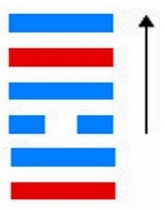
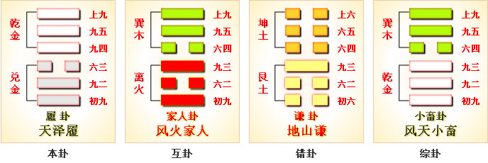
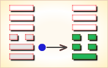
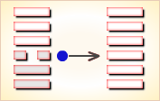
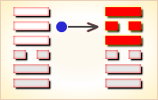

# 履 ䷉

履（䷉ lǚ）卦的代号是`6:7`。主卦是**兑**卦，卦象是泽，阳数是`6`；客卦是**乾**卦，卦象是天，阳数是`7`。天泽履，君子坦荡荡。在《说文》中有这样的解释：“履，足所依也。”也就是说履是实践、行动的意思。履卦的上卦是乾，是刚健之君，而下卦是泽，是恩泽的意思。也就是指这种行为一定要有礼，更要有理，只有做到这一点，才是真正的刚健。

> 凤凰落在西歧山，去鸣几声出圣贤，天降文王开基业，富贵荣华八百年。

这个卦是异卦（下兑上乾）相叠，乾为天；兑为泽，以天喻君，以泽喻民，原文：“履（踩）虎尾、不（咬）人。”因此，结果吉利。君上民下，各得其位。兑柔遇乾刚，所履危。履意为实践，卦义是脚踏实地的向前进取的意思。君子在人际交往中只要能做到刚健守中，就可以将坏事变为好事，让恶的事物也呈现出好的一面，那么再大的艰难也能平安度过。

图中，红色表示当位的爻，天蓝色表示不当位的爻，箭头表示有应。

- 卦序：10

> 履虎尾，不咥人，亨。
>《彖》曰：履，柔履剛也。說而應乎乾，是以履虎尾，不咥人，亨。剛中正，履帝位而不疚，光明也。
>《象》曰：上天下澤，履，君子以辯上下，定民志。

> 初九，素履，往，无咎。
>《象》曰：素履之往，獨行願也。

> 九二，履道坦坦，幽人貞吉。
>《象》曰：幽人貞吉，中不自亂也。

> 六三，眇能視，跛能履。履虎尾，咥人凶。武人為于大君。
>《象》曰：眇能視，不足以有明也；跛能履，不足以與行也；咥人之凶，位不當也；武人為于大君，志剛也。

> 九四，履虎尾，愬愬，終吉。
>《象》曰：愬愬終吉，志行也。

> 九五，夬履，貞厲。
>《象》曰：夬履貞厲，位正當也。

> 上九，視履，考祥其旋，元吉。
>《象》曰：元吉在上，大有慶也。

> 履（䷉ lǚ）卦是异卦，下兑上乾，相叠。乾为天，兑为泽，以天喻君，以泽喻民，原文：“履（踩）虎尾，不咥（咬）人”。因此，结果吉利。君上民下，各得其位。兑柔遇乾刚，所履危。履意为实践，卦义是脚踏实地的向前进取的意思。

>《象传》：柔弱遇刚强，欲行却难行之象，难且危也。

> 先劳而后逸，始惊而后安，百事不宜急进，须以和待人，有惊无险。

- 事业：起初很不顺利，受到种种威胁，若能提高警惕，谨小慎微，脚踏实地，逐个地去克服困难，不改变自己的决心，一定可以达到目的。办事有自知之明，务必量力而行，不可不顾实际，尤其不得逞强，急于求成。
- 经商：宜待观动静，勿为小利而动摇自己计划，尤其不得贪得无厌，遵循商业道德，了解全面信息。
- 求名：务必有恒心，孜孜以求，不为财富利诱，不为世俗干扰，坚持自己的志向和理想，可以取得成功。
- 婚恋：双方安贫乐道，可和睦相处，若一方为富贵所动，会发生婚变。
- 决策：诸事必须小心慎重，不利的情况经常会出现，但若能处理得好，总会是有惊无险，化险为夷。为此，办事必须认认真真，遵循正道，虚心听取别人的建议，量力而行，切莫自负逞强，一定会有好的结果。

履卦，乾上兑下，为[艮宫五世卦](../jing/gen.md#10)。履为履行之意，又寓意礼，提示占筮者要兢兢戒惧，遵守礼节，这样才有惊无险。步履不安，困难危险；谦虚自重，敬慎事主。得此卦者，困难时期，多坎坷不顺，万事不宜急进，须循序渐进，谨慎行事。

- 时运：依序升进，不可攀缘。
- 财运：明察货品，待时而售。
- 家宅：门庭严整。
- 身体：疏通气血。

> 履：表示战战兢兢、如履薄冰而行，却是有惊无险。为小凶带吉之象。 履又为「礼」也。得此卦者，需尽快反省自己的态度，对人、对事、对长辈是否有轻忽、不敬之意。虽有危急之事幸好能平安度过。

> 解释：只要履行契约承诺则吉。

> 特性：竞争，积极，冒险，热枕，独立，自立自强，有骨气。

> 运势：先劳而后逸，始惊而后安，百事不宜急进，须以和待人，有惊无险。

- 家运：新婚而刚建立家庭者，多碍、劳苦。但此卦有先苦后甜之象，和气可生财，过些时日即可雨过天晴也。
- 疾病：病虽重，但注意调理亦可愈，防头、口、肺等疾。
- 胎孕：临盆产妇占得则吉，否则有受惊吓之象，需安胎。
- 子女：初运有劳苦，障碍、困难之象，但以后能获得幸福也。
- 周转：虽有些困难，但不必急躁，谦恭而施则可成也。
- 买卖：虽有是非但终可成，牛马猴之月或日方成。
- 等人：迟来。
- 寻人：走失之人有生命危险，在西方或西北方向，难寻，须争取时效。申未日可见。
- 失物：赶快去找有可能寻回，留意行过的路上，或者有鞋的地方。
- 外出：有惊无险，可以外出，但非紧急情况可以缓行。
- 考试：不理想。
- 诉讼：敌强而我弱之象，宜步步为营。
- 求事：有贵人提拔，可发展，称心。
- 改行：不宜。
- 开业：不宜。

### 初九：素履，往无咎。《象》曰：素履之往，独行愿也 。

以朴素坦白的态度处世，没有灾害。《象传》：以朴素坦白的态度处世，是说能独行其志愿。

平：得此爻者，营谋有计，则财利日增。做官的若修德养身，则有升迁之机。

- 时运：等待时机，自有成就。
- 财运：守好旧业，久必获利。
- 家宅：门庭吉祥。
- 身体：慢跑有益。

初九爻动变得[第6卦：天水讼](e8aebcsong.md)。

天水讼䷅是异卦，下坎上乾，相叠。同需卦相反，互为“综卦”。乾为刚健，坎为险陷。刚与险，健与险，彼此反对，定生争讼。争讼非善事，务必慎重戒惧。

### 九二：履道坦坦，幽人贞吉。《象》曰：幽人贞吉，中不自乱也。

行道之人，胸怀坦荡；隐居之人，长逢吉兆。《象传》：隐居之人洁身守正，因为他们秉性中正，不被世俗所惑。

平：得此爻者，安然自乐，修身养性。做官的会有全身而退之兆。

- 时运：高尚其志，修身以道。
- 财运：物价稳定，稍有小利。
- 家宅：分析财产，小心损耗。
- 身体：保养眼睛。

九二爻动变得[第25卦：天雷无妄](e697a0e5a684wuwang.md)。

天雷无妄䷘是异卦，下震上乾，相叠。乾为天为刚为健；震为雷为刚为动。动而健，刚阳盛。人心振奋，必有所得，但唯循纯正，不可妄行。无妄必有获，必可致福。

### 六三：眇能视，跛能履。履虎尾，咥人，凶。武人为于大君。《象》曰：眇能视，不足以有明也。跛能履，不足以与行也。咥人之凶，位不当也。武人为于大君，志刚也。

瞎了眼睛却要看物，跛了脚却要行走，这是勉为其难，犹如踩着虎尾巴，终将为虎所伤。这是凶险之事。武人纂夺国政，同样是凶险之事。《象传》：瞎了眼睛却要看物，其视力不足以辨物。跛了脚却要行走，其脚力不足以行路。老虎之所以伤人，因为六三阴爻而居于阳位，所处不当。武人纂夺国政，这是僭越犯上，以六三之位而行九五之志，必遭祸殃。

凶：得此爻者，会有争诉，囚狱之扰，甚者家破人亡。做官的则会有被贬职之祸。

- 时运：退守为宜，妄动则凶。
- 财运：被人欺弄，货物滞销。
- 家宅：暗昧不明，以小凌大。
- 身体：保养眼睛与脚部。

六三爻动变得[第1卦：乾为天](e4b9beqian.md)。

乾为天䷀是同卦，下乾上乾，相叠。象征天，喻龙（德才的君子），又象征纯粹的阳和健，表明兴盛强健。乾卦是根据万物变通的道理，以“元、亨、利、贞”为卦辞，表示吉祥如意，教导人遵守天道的德行。

### 九四：履虎尾，愬愬，终吉。《象》曰：愬愬终吉，志行也。

踩着虎尾巴，但能遇险知惧，最后仍吉利。《象传》：恐惧警惕，终归于吉，说明虽历磨难，但志愿得行。

平：得此爻者，会有危险，宜温和自持，可免灾祸。做官的会有虎符将帅之兆。读书人将会取得不错的佳绩。

- 时运：温和笃实，终可免祸。
- 财运：不急求售，终获利益。
- 家宅：平稳持家。
- 身体：谨慎走路。

九四爻动变得[第61卦：风泽中孚](e4b8ade5ad9azhongfu.md)。

风泽中孚䷅是异卦，下兑上巽，相叠。孚本义孵，孵卵出壳的日期非常准确，有信的意义。卦形外实内虚，喻心中诚信，所以称中孚卦。这是立身处世的根本。

### 九五：夬履，贞厉。《象》曰：夬履贞厉。位正当也。

行为急躁莽撞；卜其行事有危险之象。《象传》：行为急躁莽撞，卜其行事有危险之象，但九五阳爻居上卦中位，正当其位。因而虽险不凶。

凶：得此爻者，躁动妄行者，则祸患将至，甚者有性命之忧。做官的会功高盖主，而不赏。

- 时运：拨云见日，勿忘艰苦。
- 财运：和衷共济，惜售有利。
- 家宅：居安思危，可保平安。
- 身体：由危转安。

九五爻动变得[第38卦：火泽睽](e79dbdkui.md)。

火泽睽䷥是异卦，下兑上离，相叠。离为火；兑为泽。上火下泽，相违不相济。克则生，往复无空。万物有所不同，必有所异，相互矛盾。睽即矛盾。

### 上九：视履考祥，其旋元吉。《象》曰：元吉在上，大有庆也。

行为审慎，遇事周密反复地考虑，大吉。《象传》：大吉大利，因为上九之爻居全卦之首。预兆其人将有重大喜庆之事。

吉：得此爻者，财利可获。做官的宜退而以享安静和平之福。读书人努力者可获佳绩。

- 时运：晚运亨通，福寿双全。
- 财运：往来经营，无不有利。
- 家宅：积善之家才有余庆。
- 身体：天年有限。

上九爻动变得[第58卦：兑为泽](e58591dui.md)。

兑为泽䷹是同卦，下兑上兑，相叠。泽为水。两泽相连，两水交流。上下相和，团结一致，朋友相助，欢欣喜悦。兑为悦也。同秉刚健之德，外抱柔和之姿，坚行正道，导民向上。
　　　　　　　　　　　　　　　　　　　　　　
# [Lǚ ䷉](../en/e5b1a5lv.md)
