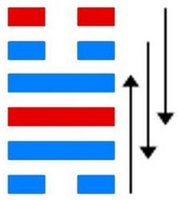
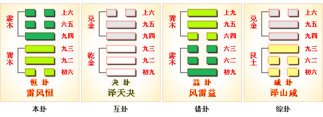

# 恒 ䷟

恒（䷟ héng）卦的代号是`3:4`。主卦是`3`卦，**巽**卦，卦象是风，阳数是`3`；客卦是`4`卦，**震**卦，卦象是雷，阳数是`4`。恒：亨，无咎，利贞。利有攸往。雷风恒，恒心有成。**恒**卦，通达，没有过失。有所往则有利。恒，卦名。本卦为异卦相叠，巽下震上。上卦为震，震为雷，下卦为巽，巽为风。从自然界看，风雷激荡，使宇宙常新。从社会上看，震为阳，巽为阴，阳上阴下，正像君贵民贱，男萼女卑，所谓永恒不变的封建纲常。“君子”应该坚守此道，持之以恒。所以卦名曰恒。恒，《说文》：“恒，常也。”

鱼翁寻鱼运气好，鱼来撞网跑不了，别人使本挣不来，谁想一到就凑和。

这个卦是异卦（下巽上震）相叠。震为男、为雷；巽为女、为风。震刚在上，巽柔在下。刚上柔下，造化有常，相互助长。阴阳相应，常情，故称为恒。

图中，红色表示当位的爻，天蓝色表示不当位的爻，箭头表示有应。

- 卦序：32

> 恒，亨，无咎，利貞，利有攸往。
>《彖》曰：恒，久也。剛上而柔下，雷風相與，巽而動，剛柔皆應，恒。恒，亨，无咎，利貞，久於其道也。天地之道，恒久而不已也，利有攸往，終則有始也，日月得天而能久照，四時變化而能久成，聖人久於其道而天下化成，觀其所恒而天地萬物之情可見矣。
>《象》曰：雷風，恒，君子以立不易方。

> 初六，浚恒，貞凶，无攸利。
>《象》曰：浚恒之凶，始求深也。

> 九二，悔亡。
>《象》曰：九二悔亡，能久中也。

> 九三，不恒其德，或承之羞，貞吝。
>《象》曰：不恒其德，无所容也。

> 九四，田无禽。
>《象》曰：久非其位，安得禽也。

> 六五，恒其德貞，婦人吉，夫子凶。
>《象》曰：婦人貞吉，從一而終也。夫子制義，從婦凶也。

> 上六，振恒，凶。
>《象》曰：振恒在上，大无功也。

> 恒（䷟ héng）卦是异卦，下巽上震相叠。震为男、为雷；巽为女、为风。震刚在上，巽柔在下。刚上柔下，造化有常，相互助长。阴阳相应，常情，故称为恒。

>《象传》：震者为动，宜向外发展，巽为入，为内向，一内一外，各居本位，故能永恒不变，喻夫妇之道。

> 万事亨通，能恒久努力，安守本份则吉，妄动则招灾。

- 事业：诸事无不成于恒，持之以恒，必有成效。恒乃成功之本。为此，务必动机纯正，守静而勿躁动，不可急于求成，也不可固守死道，应从个人实际出发。最忌人云亦云，最宜随机应变。如此，诸事顺而成。
- 经商：大胆行动，有所往必有所利。注意市场行情和周围的情况。随时变化经营策略，但不得改变常理常道，坚持慎重选择的方向，勿追随潮流。忌不自量而冒险强求。
- 求名：有始有终，善始善终，立于正道，坚持不懈，学习方面尤应提高涵养，必可成。
- 婚恋：好事多磨，有曲折，唯不可见异思迁，和睦相处，勿固执己见。
- 决策：循序渐进，不要在一开始时期望过高，但不能因此放弃追求，应脚踏实地，从实际也发，不要好高骛远，更不可不自量，勿冒险激进，勿反复无常。坚信宇宙常新，不断修正自己的见解，补充新内容。

**恒**卦，震上巽下，为[震宫三世卦](../jing/zhen.md#32)。**恒**卦的意思就是要坚持、恒定、有恒心，这样才能获得亨通。经常恒久，长久不变；君子以利，不易其方。得此卦者，须立身正道，坚守不易，持续努力，必能亨通。缺少毅力，朝三暮四者则不会成功。

- 时运：努力耕耘，不可躁进。
- 财运：贸易之地，不可更改。
- 家宅：方向不改；百年好合。
- 身体：气喘有痰，仍服旧方。

> 恒：表示维持不变的迹象。是个状况卦，吉凶未定。显示一种会持续很长久的一种状况。好的或坏的情形，都将会再持续下去。事业投资、感情婚姻都不宜在此时做任何的计划或变动。

> 解释：要有恒心。

> 特性：主动，积极，坚忍，百折不挠，律己严，反应快，追求成功，理财佳，组织能力好。

> 运势：诸事亨通而没有犯错方能恒久。其象利于正常固守，并须有毅力持行。雷风者，知守常则吉，妄动者则不能亨通。

- 家运：全家上下均各循正轨而行，幸福家庭也。
- 疾病：为慢性及须长期治疗之疾。注意肝之疾。
- 胎孕：胎有烦恼，但无碍。
- 子女：与双亲感情融治，幸福之至。
- 周转：不成问题。
- 买卖：有贵人，得力终成。利益双收。
- 等人：迟到。
- 寻人：外出之人平安无事，会自己回来。
- 失物：不能寻回。
- 外出：果敢行动，有利。
- 考试：会得高分。
- 诉讼：小人招祸，但宜速战速决，不利拖延，宜和解。
- 求事：向东南有利。
- 改行：忌做无妄之事，需注意风险。
- 开业：吉利可行。

### 初六：浚恒，贞凶，无攸利。《象》曰：浚恒之凶，始求深也。

掘进不止，卜问凶险，没有什么好处。《象传》：掘进不止之所以凶险，因为冒险求深，必遭崩塌之祸。

凶：得此爻者，人情乖离，前途渺茫，静守可免祸。做官的难于受到上司的赏识。

- 时运：安分知足，求荣反辱。
- 财运：得利即售，勿贪高价。
- 家宅：华丽难久；勿求攀结。
- 身体：运动伤害，操之过急。

初六爻动变得[第34卦：雷天大壮](e5a4a7e5a3aedazhuang.md)。

雷天大壮䷡是异卦，下乾上震相叠。震为雷；乾为天。乾刚震动。天鸣雷，云雷滚，声势宏大，阳气盛壮，万物生长。刚壮有力故曰壮。大而且壮，故名大壮。四阳壮盛，积极而有所作为，上正下正，标正影直。

### 九二：悔亡。《象》曰：九二悔亡，能久中也。

没有悔恨。《象传》：九二爻辞说没有悔恨，因为能坚守中正之道。

平：得此爻者，安分守己则无忧。做官的宜洁身自爱，谨慎行事。

- 时运：稳住阵脚，可以免祸。
- 财运：苦撑待变，将可回本。
- 家宅：位置不利，须待十年。
- 身体：尚称平顺。

九二爻动变得[第62卦：雷山小过](e5b08fe8bf87xiaoguo.md)。

雷山小过䷽是异卦，下艮上震相叠。艮为山，震为雷。过山雷鸣，不可不畏惧。阳为大，阴为小，卦外四阴超过中二阳，故称“小过”，小有越过。

### 九三：不恒其德，或承之羞，贞吝。《象》曰：不恒其德，无所容也。

不能保持其德行，必然蒙受耻辱。卜问得艰难之兆。《象传》：不能保持其德行，反复无常，无人信任，必然落到无所容身的地步。

凶：得此爻者，须防小人诽谤，争诉之扰。做官的须防被贬。

- 时运：三心二意，如何成功。
- 财运：没有恒业，难以获利。
- 家宅：不利久居；难以偕老。
- 身体：运动无恒，如何健康。

九三爻动变得[第40卦：雷水解](e8a7a3xie.md)。

雷水解䷧是异卦，下坎上震相叠。震为雷、为动；坎为水、为险。险在内，动在外。严冬天地闭塞，静极而动。万象更新，冬去春来，一切消除，是为解。

### 九四：田无禽。《象》曰：久非其位，安得禽也。

畋猎无所获。《象传》：长久处于不适宜的环境，怎会有收获？

凶：得此爻者，营谋费力，难以成事。做官的时运不济，有所退步。

- 时运：不得正位，徒劳无功。
- 财运：地方不对，如何有利。
- 家宅：方位不利；配偶不和。
- 身体：服药谨慎。

九四爻动变得[第46卦：地风升](e58d87sheng.md)。

地风升䷭是异卦，下巽上坤相叠。坤为地、为顺；巽为木、为逊。大地生长树木，逐渐成长，日渐高大成材。喻事业步步高升，前程远大，故名“升”。

### 六五：恒其德，贞。妇人吉，夫子凶。《象》曰：妇人贞吉，从一而终也。夫子制义，从妇凶也。

操行一贯。卜得妇人吉利，丈夫凶险。《象传》：爻辞讲妇人操守贞洁则吉利，这是符合从夫以终其身的道理。丈夫则因事制义，其道多方，如果以妇德来约束男子，则必遭凶险。

凶：得此爻者，多招毁谤，有所损失。做官的多阿谀权势而有失。

- 时运：迷恋感情，因小失大。
- 财运：只见小利，如何致富。
- 家宅：女强男弱；女占喜，男占凶。
- 身体：男女异命。

六五爻动变得[第28卦：泽风大过](e5a4a7e8bf87daguo.md)。

泽风大过䷛是异卦，下巽上兑相叠。兑为泽、为悦，巽为木、为顺，泽水淹舟，遂成大错。阴阳爻相反，阳大阴小，行动非常，有过度形象，内刚外柔。

### 上六：振恒，凶。《象》曰：振恒在上，大无功也。

久动不息，凶险。《象传》：统治者朝令夕改，政令无常，其结果必所向无功。

凶：得此爻者，求名望利，小能成，大则无功，女人不利夫子。做官的会很劳累，多动少静。

- 时运：功名已尽，不可妄动。
- 财运：不愿结算，无利可言。
- 家宅：旧宅不改；再娶必凶。
- 身体：小心保养。

上六爻动变得[第50卦：火风鼎](e9bc8eding.md)。

火风鼎䷱是异卦，下巽上离相叠。燃木煮食，化生为熟，除旧布新的意思。鼎为重宝大器，三足稳重之象。煮食，喻食物充足，不再有困难和困扰。在此基础上宜变革，发展事业。

# [Héng ䷟](../en/e68192heng.md)
