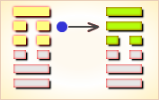

# 损 ䷨

损（䷨ sǔn）卦的代号是`6:1`。主卦是**兑**卦，卦象是泽，阳数是`6`；客卦是**艮**卦，卦象是山，阳数是`1`。主卦和客卦的阳数比是`6`比`1`，主方占绝对优势，主方利用自己的优势给客方造成损失，然而客方态度强硬，主方应当恰当给于客方一些利益以获取更多利益。山泽损，损益制衡。

> 时动不至费心多，比作推车受折磨，山路崎岖吊下耳，做插右按按不着。

这个卦是异卦（下**兑**上**艮**）相叠。**艮**为山；**兑**为泽。上山下泽，大泽浸蚀山根。损益相间，损中有益，益中有损。二者之间，不可不慎重对待。损下益上，治理国家，过度会损伤国基。应损则损，但必量力、适度。少损而益最佳。此卦与[益 ䷩](e79b8ayi.md)卦相反，互为综卦。

图中，红色表示当位的爻，天蓝色表示不当位的爻，箭头表示有应。

- 卦序：41

> 損，有孚，元吉，无咎可貞，利有攸往。曷之用，二簋可用享。
>《彖》曰：損，損下益上，其道上行，損而有孚，元吉。无咎，可貞，利有攸往，曷之用，二簋可用享，二簋應有時，損剛益柔有時，損益盈虛，與時偕行。
>《象》曰：山下有澤，損，君子以懲忿窒欲。

> 初九，已事遄往，无咎，酌損之。
>《象》曰：已事遄往，尚合志也。

> 九二，利貞，征凶。弗損，益之。
>《象》曰：九二利貞，中以為志也。

> 六三，三人行，則損一人。一人行，則得其友。
>《象》曰：一人行，三則疑也。
>《繫辭》：易曰：「三人行，則損一人，一人行，則得其友。」言致一也。

> 六四，損其疾，使遄有喜，无咎。
>《象》曰：損其疾，亦可喜也。

> 六五，或益之十朋之龜，弗克違，元吉。
>《象》曰：六五元吉，自上祐也。

> 上九，弗損，益之，无咎，貞吉。利有攸往，得臣无家。
>《象》曰：弗損益之，大得志也。

>《象传》：山高水深，各得其所，因损得益之象。

> 现况诸事不顺，有破财之象，虽先损失，但后反而得益，因祸得福。

- 事业：开拓事业要有所投入，投入多少应事先精心算计，力求损益得当。诸事皆应有节度，切忌欺诈、贪婪。天下事克己最难，务必严格要求自己，刻苦奋斗，手段灵活，争取事业成功。
- 经商：全面调查市场行情，计算投入和收益的比例。不必过于计较利润的多少，获利即可。真诚与他人合作，彼此信任，手段灵活，切勿自我封闭。
- 求名：为了成长进步，务必有所投入，且应付诸实践。以损增益，成就理想。
- 婚恋：全面权衡对方的长处与短处，应从大处着眼。
- 决策：为人聪颖，善于权衡利弊。顺应自然发展规律，积极主动与他人合作，助人为乐，适度投入，资助他人，而自己要宁俭勿奢。如此，诸事都可以十分顺利。

**损**卦，**艮**上**兑**下，为[艮宫三世卦](../jing/gen.md#41)。**损**象征损益、减少，为损己之兆，多主不吉，但只要坚守诚信，就会有利。损下益上，损盈益虚；先难后易，量入为出。得此卦者，损己利人，虽然开始会有所不顺，但付出总会有所回报，因祸得福之象。

- 时运：心平气和，才有发展。
- 财运：和气生财，损己利人。
- 家宅：地势宜平；夫妇得正。
- 身体：修身养性。

> 损：表示小有损失也，主凶中带吉之象。「赛翁失马、焉之非福」是此卦最好的解释。投资、事业、借贷、感情皆是失意不顺之时，然对事要有信心，学得经验将可得到更好的结果。若将要投资则不可。

> 解释：有所损害、损失。

> 特性：心地善良，富同情心，悲天悯人，体贴他人，善于照顾，安慰别人。牺牲小我，完成大我精神，生活节俭，大方助人。

> 运势：诸事不如意，若倾于利欲不当之心则有灾，散财之损。必须能够悟其所损，方能挽回局势。与人共事商量则可收损失之象。

- 家运：正处于受损之时，审慎挽救颓势也。
- 疾病：现况病情虽重，积极治疗可愈。身体较衰弱，注意肠胃、咽喉、贫血等疾。
- 胎孕：产母有凶象。
- 子女：儿女多诚实孝顺，幸福之格。
- 周转：可达目的。
- 买卖：虽有损，但终得利。
- 等人：可能会迟到。
- 寻人：在东北或西方友人家中，可寻。否则会自回。
- 失物：不能寻回。
- 外出：有益可行。注意节省费用，防止损多于益。
- 考试：多努力，榜上可题名。
- 诉讼：有斗争之象，损失破财，和解反而获益。
- 求事：可慢慢受重用。
- 改行：可行，勿急躁，宜周密行事。
- 开业：吉利，宜有耐力。

### 初九：已事遄往，无咎，酌损之。《象》曰：已事遄往，尚合志也。

祭祀大事，得赶快去参加，这才不会有灾难。祭品过丰，可以酌情减损。《象传》：“祭祀大事，得赶快去参加”，这是体现了敬畏鬼神的心意。

平：得此爻者，谋事得当，可获利，不良者，或因酒食误事。做官的会因为工作忙碌而顾不得家庭，声望日盛。

- 时运：加进努力，或仍有望。
- 财运：判断准确，自有利益。
- 家宅：早些迁移；即日迎娶。
- 身体：立即行动。

初九爻动变得[第4卦：山水蒙](e89299meng.md)。

山水蒙䷃是异卦，下坎上艮，相叠。艮是山的形象，喻止；坎是水的形象，喻险。卦形为山下有险，仍不停止前进，是为蒙昧，故称蒙卦。但因把握时机，行动切合时宜，因此，具有启蒙和通达的卦象。

### 九二：利贞，征凶。弗损，益之。《象》曰：九二利贞，中以为志也。

吉利的卜问。征伐他国则凶。因为这样作对于他国非但不能损伤，反而有利。《象传》：九二爻辞讲的吉利的卜问，因为九二之爻居下卦中位，像人行事以处正守贞为心。

凶：得此爻者，宜谨守勿动。做官的时机未成熟，难于升迁。

- 时运：中庸处世，自有好运。
- 财运：货物合宜，应可获利。
- 家宅：守之则吉；门当户对。
- 身体：平常状态。

九二爻动变得[第27卦：山雷颐](e9a290yi.md)。

山雷颐䷚是异卦，下震上艮，相叠。震为雷，艮为山。山在上而雷在下，外实内虚。春暖万物养育，依时养贤育民。阳实阴虚，实者养人，虚者为人养。自食其力。

### 六三：三人行，则损一人；一人行，则得其友。《象》曰：一人行，三则疑也。

三人同行，难免意见分岐，必有一人被孤立。一人独行，孤单无助，则主动邀人作伴。《象传》：一人独行，凡事自作主张，事无掣肘。三人同行，遇事各持己见，滋生疑惑。

平：得此爻者，合力经营，获利者多，未婚者配。做官的与同僚关系融洽，进取有望。

- 时运：双月有利，不可贪多。
- 财运：一人独资，不会损失。
- 家宅：一家二丁；得偶为吉。
- 身体：寡欲修身。

六三爻动变得[第26卦：山天大畜](e5a4a7e89384daxu.md)。

山天大畜䷙是异卦，下乾上艮，相叠。乾为天，刚健；艮为山，笃实。畜者积聚，大畜意为大积蓄。为此不畏严重的艰难险阻，努力修身养性以丰富德业。

### 六四：损其疾，使遄有喜，无咎。《象》曰：损其疾，亦可喜也。

要消除疾病，赶快求巫祭神，病就会有好转，必无灾难。《象传》：“求巫祭神消除疾病”，也是可喜之事。

平：得此爻者，多喜庆之事，有灾者转好运，有病者愈，有忧者转喜。做官的闲职者将被起复。

- 时运：小灾之后，转忧为喜。
- 财运：减少货物，信之有利。
- 家宅：阴气过剩，祈祷可安；婚姻可喜。
- 身体：立即就医，否则堪虑。

六四爻动变得[第38卦：火泽睽](e79dbdkui.md)。

火泽睽䷥是异卦，下兑上离，相叠。离为火；兑为泽。上火下泽，相违不相济。克则生，往复无空。万物有所不同，必有所异，相互矛盾。睽即矛盾。

### 六五：或益之，十朋之龟，弗克违。元吉。《象》曰：六五元吉，自上佑也。

有人送给他价值十朋的大龟，这不能拒而不收，得龟用于占卜这是大吉之事。《象传》：六五爻辞讲的大吉大利，因为上天保佑他，赐以灵龟，所以大吉。

吉：得此爻者，运势大好，财利丰富。做官的会得到领导的赞赏和提拔。读书人会取得佳绩。

- 时运：运势大好，意外之助。
- 财运：利润自来，不必推辞。
- 家宅：家业兴隆；天作之合。
- 身体：病愈得财。

六五爻动变得[第61卦：风泽中孚](e4b8ade5ad9azhongfu.md)。

风泽中孚䷼是异卦，下兑上巽，相叠。孚本义孵，孵卵出壳的日期非常准确，有信的意义。卦形外实内虚，喻心中诚信，所以称中孚卦。这是立身处世的根本。

### 上九：弗损，益之，无咎。贞吉。利有攸往，得臣无家。《象》曰：弗损益之，大得志也。

不要减损，不要增益，一任其旧，没有灾难，卜问得吉兆。筮遇此爻，有所往则必获利，将得到一单身奴隶。《象传》：不要减损，不要增益，公允执中，如此行事，平生志愿当能实现。

吉：得此爻者，贵人扶持，财利可期。做官的会得到下属的爱戴，领导的器重。

- 时运：一帆风顺，所图可成。
- 财运：物价平平，获利不少。
- 家宅：不必改造。
- 身体：出外求医。

上九爻动变得[第19卦：地泽临](e4b8b4lin.md)。

地泽临䷒是异卦，下兑上坤，相叠。坤为地，兑为泽，地高于泽，泽容于地。喻君主亲临天下，治国安邦，上下融洽。

# [Sǔn ䷨](../en/e68d9fsun.md)
