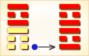

# 旅 ䷷

旅（䷷ lǚ）卦的代号是`1:5`。主卦是`1`卦，**艮**卦，卦象是山，特性是被动和阻止，阳数是`1`；客卦是`5`卦，**离**卦，卦象是火，特性是明亮和依赖，阳数是`5`。“旅”，出行的，在外作客的，旅行。主方像山一样静止不动，比喻为旅店，聪敏爱动的客方比喻为旅客。此卦以旅店和旅客的关系比拟当前的主客双方关系。**旅**卦，火山旅，依义顺时。

> 飞鸟树上垒窝巢，小人使计举火烧，君占此卦为不吉，一切谋望枉徒劳。

这个卦是异卦（下**艮**上**离**）相叠。此卦与[丰 ䷶](e4b8b0feng.md)相反，互为“综卦”。山中燃火，烧而不止，火势不停地向前蔓延，如同途中行人，急于赶路。因而称**旅**卦。

图中，红色表示当位的爻，天蓝色表示不当位的爻，箭头表示有应。

- 卦序：56

> 旅，小亨，旅貞吉。
>《彖》曰：旅，小亨，柔得中乎外而順乎剛，止而麗乎明，是以小亨，旅貞吉也，旅之時義大矣哉。
>《象》曰：山上有火，旅，君子以明慎用刑而不留獄。

> 初六，旅瑣瑣，斯其所取災。
>《象》曰：旅瑣瑣，志窮災也。

> 六二，旅即次，懷其資，得童僕貞。
>《象》曰：得童僕貞，終无尤也。

> 九三，旅焚其次，喪其童僕，貞厲。
>《象》曰：旅焚其次，亦以傷矣。以旅與下，其義喪也。

> 九四，旅于處，得其資斧，我心不快。
>《象》曰：旅于處，未得位也；得其資斧，心未快也。

> 六五，射雉，一矢亡，終以譽命。
>《象》曰：終以譽命，上逮也。

> 上九，鳥焚其巢，旅人先笑後號咷，喪牛于易，凶。
>《象》曰：以旅在上，其義焚也；喪牛于易，終莫之聞也。

>《象传》：火烧山野，火头遍布，
所到之处，无一幸免，火头尤如行旅之人，无所定处。

> 诸事变动不定，此时只好坚守信心，多参考他人意见，否则必有凶。

- 事业：正处于创业、发展的阶段，各种困难很多。只要能坚持中正的方针，依正道办事，注意调查，处处小心谨慎，并根据情况的变化，采取应变措施，事业可顺利前进。
- 经商：市场行情犹如旅途一样，意想不到的情况，会随时发生。因此，首先应采取慎重的原则，不要冒险。但也不应缩手缩脚，尤其不要猜疑。开发市场之前，应进行充分的调查研究。
- 求名：根据时代的要求，丰富自己的知识和能力，不断提高自己，并且争取得到他人的相助。
- 婚恋：双方的不确定因素较多，如确有感情，可顺其发展，再行确定。婚姻美满。
- 决策：人生处于多变状态，一定要眼光远大，树立大志向，不断地充实自己，以诚心实意和谦虚的态度去待人处事，勿计较一时得失，广泛交际朋友。人生旅途十分顺利。

**旅**卦，**离**上**艮**下，为[离宫初世卦](../jing/li.md#56)。旅为做客、旅游之意，先主乐而后悲啼。旅途穷困，飘摇不定；小望可成，宏愿难求。得此卦者，事多变动，如在异乡，小事可成，大事难成，宜谨守常规。

- 时运：谨慎防灾，升用在即。
- 财运：出外经营，不可积货。
- 家宅：小心火灾；即日成亲。
- 身体：肝火过旺，性命交关。

> 旅：表示旅行、不定、不安稳之意。旅行者常居无定所，表示事事皆在浮动之中，虽不现凶象，但也是很令人烦心的。投资理财、感情、婚姻，大慨都是游戏的心态吧。

> 解释：在火山口旅游，非常危险。

> 特性：一生多外出旅行运，喜欢多变化事物，重效率，享受，亦多桃花运，异性缘浓。兴趣广泛，爱尝试冒险。

> 运势：诸事变动不定，此时只好坚守信心，多参考他人意见，否则必有凶。

- 家运：内面不和，是非多，意见不一。家运衰也。
- 疾病：病情变化不定，宜速就医。
- 胎孕：多是夜间产。
- 子女：骨肉无情，不幸之兆。
- 周转：小数目可，大数目不成。
- 买卖：多碍难成，或交易不成。
- 等人：临时变意不会来。
- 寻人：此人为情所困，意志消沉而远离也，难寻。
- 失物：尽快去找，应可寻回，失物似在屋舍之外，留意镜子之类物体，可提供线索。
- 外出：很顺利，且经常出行。因此，要时时注意安全。
- 考试：很差。
- 诉讼：宜速战速决，时间一拖则不利。
- 求事：白费心神。
- 改行：不利。
- 开业：开业者不得时机。

### 初六：旅琐琐，斯其所取灾。《象》曰：旅琐琐，志穷灾也。

旅人三心二意，进退犹豫，最后还是离开住所，结果自遭灾祸。《象传》：旅人三心二意，说明其人四处碰壁，精神疲惫。

凶：得此爻者，运气不佳，须防祸难。做官的有才但不能受到上司的重用。

- 时运：所得有限，修行为宜。
- 财运：本小利微，小心灾祸。
- 家宅：谨慎免灾；小户联姻。
- 身体：病初即治。

初六爻动变得[第30卦：离为火](e7a6bbli.md)。

离为火䷝是同卦，下离上离，相叠。离者丽也，附着之意。一阴附丽，上下二阳，该卦象征火，内空外明。离为火、为明，太阳反复升落，运行不息，柔顺为心。

### 六二：旅即次，怀其资，得童仆，贞。《象》曰：得童仆贞，终无尤也。

旅人来到市场，带着钱财，买来一男仆，卜问得吉兆。《象传》：买一男仆，卜问得吉兆，看来这笔买卖没有问题。

吉：得此爻者，运气转好，营谋有成。做官的显耀。

- 时运：运势中正，名利皆得。
- 财运：生财有道，做客无忧。
- 家宅：寄居亦福；富室赘婿。
- 身体：旅途有恙，受人照料。

六二爻动变得[第50卦：火风鼎](e9bc8eding.md)。

火风鼎䷱是异卦，下巽上离，相叠。燃木煮食，化生为熟，除旧布新的意思。鼎为重宝大器，三足稳重之象。煮食，喻食物充足，不再有困难和困扰。在此基础上宜变革，发展事业。

### 九三：旅焚其次，丧其童仆，贞厉。《象》曰：旅焚其次，亦以伤矣。以旅与下，其义丧也。

旅人来到着火的市场上，新买的男仆乘乱跑掉。卜问得险兆。《象传》：旅人来到着火的市场，岂不遭受损失。因为旅人带着男仆同往，男仆乘乱跑掉是很自然的。

凶：得此爻者，运势转坏，多灾多难。做官的有离职之忧。

- 时运：运势颠倒，危难不少。
- 财运：不必求利，早些防祸。
- 家宅：小心防火；难以偕老。
- 身体：孩子或童仆难保。

九三爻动变得[第35卦：火地晋](e6998bjin.md)。

火地晋䷢是异卦，下坤上离，相叠。离为日，为光明；坤为地。太阳高悬，普照大地，大地卑顺，万物生长。光明磊落，柔进上行，喻事业蒸蒸日上。

### 九四：旅于处，得其资斧，我心不快。《象》曰：旅于处，未得位也。得其资斧，心未快也。

旅人回到客居之处，因为赚了不少钱，心中不踏实。《象传》：旅人回到客居之处，这不是恰当的住处。赚了不少钱，恐怕抢劫，自然心中不踏实。

凶：得此爻者，在外者会有所成就，但美中不足，有忧惨是非之事发生。从商者会获利。

- 时运：一时有困，来年再说。
- 财运：获利有限，心中不平。
- 家宅：地位不适；不是正室。
- 身体：忧郁不欢。

九四爻动变得[第52卦：艮为山](e889aegen.md)。

艮为山䷳是同卦，下艮上艮，相叠。艮为山，二山相重，喻静止。它和**震**卦相反。高潮过后，必然出现低潮，进入事物的相对静止阶段。静止如山，宜止则止，宜行则行。行止即动和静，都不可失机，应恰到好处，动静得宜，适可而止。

### 六五：射雉一矢亡，终以誉命。《象》曰：终以誉命，上逮也。

射野鸡，一发命中，其人因而博得善时的美名。《象传》：终于博得善射的美名，众口传誉，上面的人也知道了。

吉：得此爻者，会得到老者的帮助，事有所成。

- 时运：晚运甚佳，值得恭喜。
- 财运：小失大得，有利有名。
- 家宅：可称美善；佳偶天成。
- 身体：殉难受奖。

六五爻动变得[第33卦：天山遁](e981afdun.md)。

天山遁䷠是异卦，下艮上乾，相叠。乾为天，艮为山。天下有山，山高天退。阴长阳消，小人得势，君子退隐，明哲保身，伺机救天下。

### 上九：鸟焚其巢，旅人先笑后号啕。丧牛于易，凶。《象》曰：以旅在上，其义焚也。丧牛于易，终莫之闻也。

鸟儿的巢窠被焚烧，周人的邑落被抢劫，四处流落的周人啊，美好的生活已成往事，悲惨的现实即在眼前，狄人牵着牛羊去，往后的日子怎么过。《象传》：以商旅身份而身登高爵，非分之极，其居室被焚毁是意料之中的事，牛羊在易地被抢劫，也没有人来体恤安慰，是理所应当。

凶：得此爻者，先好后坏，或迁居修造以避灾难，或有目疾，或会遭火灾。做官的难保其位，有先得后失之忧。

- 时运：有失无得，乐极生悲。
- 财运：小利大损，十分凶险。
- 家宅：覆巢之险；先喜后悲。
- 身体：属牛者凶。

上九爻动变得[第62卦：雷山小过](e5b08fe8bf87xiaoguo.md)。

雷山小过䷽是异卦，下艮上震，相叠。艮为山，震为雷，过山雷鸣，不可不畏惧。阳为大，阴为小，卦外四阴超过中二阳，故称“小过”，小有越过。

# [Lǚ ䷷](../en/e69785lv.md)
