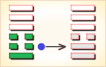
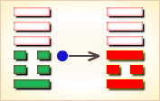

# 无妄 ䷘

无妄（䷘ wú wàng）卦的代号是`4:7`卦。主卦是`4`卦震卦，卦象是雷，阳数是`4`，特性是运动，表明主方在积极主动地探索前进。客卦是`7`卦乾卦，卦象是天，阳数是`7`，特性是力量和权威。“妄”（wàng）胡乱，荒诞不合理：轻举妄动。“无妄”，不测，意外。天雷无妄，无妄而得。由于客方力量强大，可能不适当使用权力，给主方造成意想不到麻烦。

飞鸟失机落笼中，纵然奋飞不能腾，目下只宜守本分，妄想扒高万不能。

这个卦是异卦（下震上乾）相叠。乾为天为刚为健；震为雷为刚为动。动而健，刚阳盛，人心振奋，必有所得，但唯循纯正，不可妄行。无妄必有获，必可致福。

图中，红色表示当位的爻，天蓝色表示不当位的爻，箭头表示有应。

- 卦序：25

> 无妄，元亨利貞。其匪正有眚，不利有攸往。
>《彖》曰：无妄，剛自外來而為主於內，動而健，剛中而應，大亨以正，天之命也，其匪正有眚，不利有攸往。无妄之往，何之矣。天命不祐，行矣哉。
>《象》曰：天下雷行，物與无妄。先王以茂對，時育萬物。

> 初九，无妄往，吉。
>《象》曰：无妄之往，得志也。

> 六二，不耕穫，不菑畬，則利有攸往。
>《象》曰：不耕穫，未富也。

> 六三，无妄之災。或繫之牛，行人之得，邑人災也。
>《象》曰：行人得牛，邑人災也。

> 九四，可貞，无咎。
>《象》曰：可貞无咎，固有之也。

> 九五，无妄之疾，勿藥有喜。
>《象》曰：无妄之藥，不可試也。

> 上九，无妄行，有眚，无攸利。
>《象》曰：无妄之行，窮之災也。

> 无妄（䷘ wú wàng）卦是异卦，下震上乾，相叠。乾为天为刚为健；震为雷为刚为动。动而健，刚阳盛，人心振奋，必有所得，但唯循纯正，不可妄行。无妄必有获，必可致福。

>《象传》：雷动于天，阳气舒发，为真实无虚妄之意。

> 凡事宜守正，若行为不检者，必招灾祸。

- 事业：贵自知之明，从个人实际出发，不抱非分之想，脚踏实地，勤奋努力，检点行为，防意外灾祸。不计较得失，诚心追求，待机而动，事业必成。
- 经商：切勿勉为其难，遵循市场规律，讲究商业道德，屏弃投机心理，勿贪暴利，经过辛勤努力，日积月累，必将成功。
- 求名：以良好的动机，刻苦努力，丢弃幻想，但问耕耘，不问收获，终将有所获。
- 婚恋：双方务以诚相待，绝不可抱以轻率的态度，亦不宜急于求成、顺其发展，水到渠成。
- 决策：精力充沛，富有上进心，可有作为。但务必勤勉努力，诚心诚恳，奋发向上，刻苦钻研。不可因小有成就而得意忘形。不必追求所得，而应追求实干。遵循规律办事，等待时机再行动。尤其应清除非份的念头。这样，可实现自己的理想。

无妄卦，乾上震下，为[巽宫四世卦](../jing/xun.md#25)。无妄卦为天雷震响之象，表示事与愿违，可能会有小的灾祸，但先凶后吉。不欺不妄，真实至诚；顺乎自然，福禄深宏。得此卦者，顺其自然，守正道者，诸事皆宜。但行为不检者，必招灾祸。

- 时运：正当好运，诸事皆宜。
- 财运：货到财来，自然开心。
- 家宅：屋运甚旺；门当户对。
- 身体：保持运动，自可消化。

> 无妄：表示不要有一些空幻的想法，或是你的想法可能有点虚妄不切实际，主小凶。建议凡事要务实、踏实一点。也表示目前所处的状况，是有一厢情愿的心态，或是有点「妄想症」的不切实际心理。

> 解释：无妄之灾。

> 特性：言词犀利，易生是非，愤世嫉俗，不流俗，求知欲强，重精神层面。

> 运势：无妄的道理是提醒要真实无虚，踏实。故若做事操守而能坚贞固执者吉。若不行正道，行为不检点者，必然有灾祸至也。切忌沉醉于利、欲之中，慎之。

- 家运：有不和之情况，因受外界诱惑而心乱，须谨慎，否则导致破运。
- 疾病：不宜意气用事，应尽力疗养为宜，属呼吸系统，头、足之疾病。
- 胎孕：或有惊，终无碍。
- 子女：注意与其父不和而离家出走。
- 周转：诚心有望，不诚免谈。
- 买卖：若不要过份苛求，有利。
- 等人：一定会来。但有不欢而散之象，宜以和为贵。
- 寻人：已走远，不易寻找，东北或西北之向。
- 失物：找不到，似已遗失。
- 外出：不存妄想则平安无事。为谋私利或邪念而行则大为不利，不宜行。
- 考试：笔试有利，口试不利。
- 诉讼：因女人或死亡之事起纷争，宜和解，否则招凶。
- 求事：毫无头绪，勿过于草率为宜。
- 改行：不宜勉强。
- 开业：开业者可行。

### 初九：无妄，往吉。《象》曰：无妄之往，得志也。

不要妄行非正，吉利。《象传》：没有悖妄的行为，因为所有行动受到意志的控制。

吉：得此爻者，营谋得利。做官的会得到上司的赞许，百姓的爱戴。

- 时运：株守不宜，出而有为。
- 财运：行商有利，坐贾不宜。
- 家宅：迁居为宜；婿可入赘。
- 身体：出外就医。

初九爻动变得[第12卦：天地否](e590a6pi.md)。

天地否䷋是异卦，下坤上乾，相叠。其结构同泰卦相反，系阳气上升，阴气下降。天地不交，万物不通。它们彼此为“综卦”，表明泰极而否，否极泰来，互为因果。

### 六二：不耕获，不菑畲，则利有攸往。《象》曰：不耕获，未富也。

不耕种就想收获，不开荒地就想种熟地。这些妄谬的行径怎能有利?《象传》：不耕种而想收获，这种空妄的念头不能带来财富。

吉：得此爻者，正当好运，不劳而获。富人进财多，商人出外获利。当官的会升官。读书人会取得佳绩。

- 时运：适得正运，意外之财。
- 财运：不谋而获，大利到手。
- 家宅：承继家产；招赘之亲。
- 身体：自然痊愈。

六二爻动变得[第10卦：天泽履](e5b1a5lv.md)。

天泽履䷉是异卦，下兑上乾，相叠。乾为天，兑为泽，以天喻君，以泽喻民。原文：“履（踩）虎尾，不咥（咬）人”。因此，结果吉利。君上民下，各得其位。兑柔遇乾刚，所履危。履意为实践，卦义是脚踏实地的向前进取的意思。

### 六三：无妄之灾。或系之牛，行人之得，邑人之灾。《象》曰：行人得牛，邑人灾也。

意外的灾难。比喻说有人将牛系在不该系的地方，行人顺手牵牛获意外之得，邑人失牛受到意外之灾。《象传》：行人意外得牛，邑人意外蒙灾。

凶：得此爻者，无妄之灾，破财损身。做官的不宜进取。

- 时运：尴尬之期，小心意外。
- 财运：防备别人，以免耗财。
- 家宅：外人侵占；远人结亲。
- 身体：外人传染，小心防治。

六三爻动变得[第13卦：天火同人](e5908ce4babatongren.md)。

天火同人䷌是异卦，下离上乾，相叠。乾为天，为君；离为火，为臣民百姓。上天下火，火性上升，同于天，上下和同，同舟共济，人际关系和谐，天下大同。

### 九四：可贞，无咎。《象》曰：可贞无咎，固有之也。

称心的占问，没有灾难。《象传》：具有贞正的品德，没有灾难，理应如此。

平：得此爻者，宜守旧，图谋有实，不致虚浮。做官的宜守职，勿妄动。

- 时运：气运平顺，妄动有咎。
- 财运：坚守旧业，可以获利。
- 家宅：保持祖业。
- 身体：安静调养，下月可愈。

九四爻动变得[第42卦：风雷益](e79b8ayi.md)。

风雷益䷩是异卦，下震上巽，相叠。巽为风；震为雷。风雷激荡，其势愈强，雷愈响，风雷相助互长，交相助益。此卦与损卦相反。它是损上以益下，后者是损下以益上。二卦阐述的是损益的原则。

### 九五：无妄之疾，勿药有喜。《象》曰：无妄之药，不可试也。

患意外之病，不要忙乱服药，自可痊愈。《象传》：出人意外的药物，不可随便服用。

平：得此爻者，营谋有成，病得愈，或有生育之喜。做官的纵有祸难，也会不辩自明，不解自释。

- 时运：气运正好，不必介意。
- 财运：不忧物价，心平气和。
- 家宅：防备倾倒。
- 身体：不必担心。

九五爻动变得[第21卦：火雷噬嗑](e599ace59791shike.md)。

火雷噬嗑䷔是异卦，下震上离，相叠。离为阴卦；震为阳卦。阴阳相交，咬碎硬物，喻恩威并施，宽严结合，刚柔相济。噬嗑为上下颚咬合，咀嚼。

### 上九：无妄，行有眚，无攸利。《象》曰：无妄之行，穷之灾也。

不要胡作妄行！将有灾殃，没有好处。《象传》：谬妄的行为，是绝望无聊的表现。

平：得此爻者，好运已过，不可妄动，否则是非迭生，唯有变通可免祸。做官的妄动有被贬职之忧。

- 时运：好运已终，不可妄动。
- 财运：暂时静守，勿再投资。
- 家宅：慎勿迁移。
- 身体：年老颐养。

上九爻动变得[第17卦：泽雷随](e99a8fsui.md)。

泽雷随䷐是异卦，下震上兑，相叠。震为雷，为动；兑为悦，动而悦就是“随”。随指相互顺从，己有随物，物能随己，彼此沟通。随必依时顺势，有原则和条件，以坚贞为前提。

# [Wú Wàng ䷘](../en/e697a0e5a684wuwang.md)
