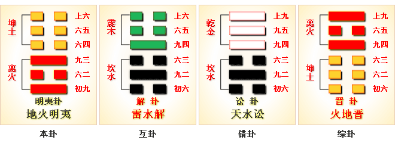
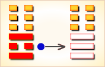
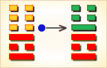
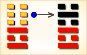

# 明夷 ䷣

明夷（䷣ míng yí）卦的代号是`5:0`。主卦是离卦，卦象是火，阳数是`5`；客卦是坤卦，卦象是地，阳数是`0`。“明夷”是失意的意思。主方应当保持目前状态，积极主动，态度强硬地谋求发展和开拓，逐渐地，情况会向更有利于主方的方面变化。明夷卦，地火明夷，晦而转明。

图中，红色表示当位的爻，天蓝色表示不当位的爻，箭头表示有应。

- 卦序：36

> 明夷，利艱貞。
>《彖》曰：明入地中，明夷。內文明而外柔順，以蒙大難，文王以之。利艱貞，晦其明也。內難而能正其志，箕子以之。
>《象》曰：明入地中，明夷。君子以莅眾，用晦而明。

> 初九，明夷于飛，垂其翼，君子于行，三日不食，有攸往，主人有言。
>《象》曰：君子于行，義不食也。

> 六二，明夷，夷于左股，用拯馬壯吉。
>《象》曰：六二之吉，順以則也。

> 九三，明夷于南狩，得其大首，不可疾貞。
>《象》曰：南狩之志，乃得大也。

> 六四，入于左腹，獲明夷之心，于出門庭。
>《象》曰：入于左腹，獲心意也。

> 六五，箕子之明夷，利貞。
>《象》曰：箕子之貞，明不可息也。

> 上六，不明晦，初登于天，後入于地。
>《象》曰：初登于天，照四國也；後入于地，失則也。

> 明夷（䷣ míng yí）卦是异卦，下离上坤，相叠。离为明，坤为顺；离为日；坤为地。日没入地，光明受损，前途不明，环境困难，宜遵时养晦，坚守正道，外愚内慧，韬光养晦。

>《象传》：太阳掩没在坤地之下，大地黑暗，有失明之象。

> 百事阻滞，小人加害，遇事多迷惑，宜守，静待时机而动。

- 事业：处于不利的环境，宜心境坦然地处置险恶的条件，增强心理素质，承受各种压力。表面柔顺小心，内心洞察事理，当离去则离去，避免灾祸，脱离危险。防患于未然，坚持逆境中奋斗。
- 经商：认真观察市场动态，待机行动，但须坚持商业道德，即使处于不利情况下，也要冒险向前，特别是要向南方发展，会大有收获。
- 求名：内心保持大志，行动刻苦忍耐，奋斗于逆境，自守其志，收敛聪明而不外露，于混乱中更应坚持正义，守愚藏拙。
- 婚恋：必须全面分析对方情况，不能因小失大。注意大节。
- 决策：处在不佳的状况下，环境困难，前途不明。但若能坦处厄运，能伸能屈，前景会变光明。尤其应加强修养，隐忍行志，外愚内慧，可以遇难呈祥。如能谨慎行事，处处小心，更能有所作为。

明夷卦，坤上离下，为[坎宫游魂卦](jing/kan.md#36)。明夷即明德被伤，象征君子受厄，此时百事宜息，静观待变。日入地中，光明被伤；万事阻滞，等待时运。得此卦者，时运不佳，事事劳苦，宜坚守正道，忍耐自重，等待时机。

- 时运：明哲保身，以避灾厄。
- 财运：明无利润，暗中分红。
- 家宅：父子分居为宜；不是明媒正娶。
- 身体：肝大郁积，注意保养。

> 明夷：表示火入坑中，阳气被阴气所伤害，被小人所重伤，主大凶象。诸事不宜，运背之时。

> 解释：浑沌不明。

> 特性：朋友多，心慈，重友谊，喜追求高层次的境界，理智和感情常矛盾。有时会牺牲一切，去完成自己的理想。

> 运势：逆势下降，时运未济，万事劳苦，逢小人加害，光明受到掩蔽而失光明，所以多艰难之运也。有万事阻滞，遇事迷惑、受灾。故宜守贞固之道，忍耐自重，等待时机 。

- 家运：衰弱、多劳，家人受累，恐有诈欺、官符。须知邪恶之人定有因果，凡事心地坦荡可渡难关也。
- 疾病：凶象。为潜伏已久之疾，注意心脏、腹部之疾或神经病。
- 胎孕：产母有惊。
- 子女：受子女牵连，陷于痛苦深渊之中。
- 周转：不成。
- 买卖：难成，用谋方就。
- 等人：不来。
- 寻人：西南或南方，虽在附近但难寻。
- 失物：不能立即寻回。正当要遗忘这件事时，会意外地有所发现。
- 外出：最好不要马上行动，再等待一个时期，做好充分准备。
- 考试：无望。
- 诉讼：败象，宜和解了事，愈争愈苦。
- 求事：日下无希望，须再待时，需防被骗、失财、失身。
- 改行：不利。
- 开业：不宜，亦不成事。

### 初九：明夷于飞，垂其翼。君子于行，三日不食。有攸往，主人有言。《象》曰：君子于行，义不食也。

“鹈鹕在飞翔，停栖在沼畔。君子离家走，三日无食粮。”筮遇此爻，有所往，则必遭主人谴责。《象传》：君子在旅途中，依礼义不能蒙羞受食。

平：得此爻者，或有手足之伤，善者有进财纳福之喜。做官的有飞黄腾达之象，但谨防有失。

- 时运：未能腾达，善自保全。
- 财运：资本有损，主人烦言。
- 家宅：最好迁居；婚姻不谐。
- 身体：食道有疾，或病在手。

初九爻动变得[第15卦：地山谦](e8b0a6qian_cn.md)。

地山谦䷎是异卦，下艮上坤，相叠。艮为山，坤为地。地面有山，地卑（低）而山高，是为内高外低，比喻功高不自居，名高不自誉，位高不自傲。这就是谦。

### 六二：明夷，夷于左股，用拯马壮，吉。《象》曰：六二之吉，顺以则也。

鹈鹕，鹈鹕，伤于左股，君子负伤，因马获救。吉利。《象传》：六二爻辞所讲的吉利，是因为六二阴爻处于九三阳爻之下，正像马顺从主人善体人意。

吉：得此爻者，常人或有难，但会得贵人之助。做官的会有实权，能当大任。读书人会取得好成绩。

- 时运：贵人相助，幸免于难。
- 财运：策划不当，难免损失。
- 家宅：修缮完整；妇有足疾。
- 身体：左足受伤。

六二爻动变得[第11卦：地天泰](e6b3b0tai_cn.md)。

地天泰䷊是异卦，下乾上坤，相叠。乾为天，为阳；坤为地，为阴。阴阳交感，上下互通，天地相交，万物纷纭。反之则凶，万事万物，皆对立，转化，盛极必衰，衰而转盛，故应时而变者泰（通）。

### 九三：明夷于南狩，得其大首，不可疾，贞。《象》曰：南狩之志，乃大得也。

在南方的猎区，拉弓射箭，获得一些大野兽。筮遇此爻，占问疾病则不利。《象传》：决心在南方狩猎，大称其意。

平：得此爻者，有修屋宇造作之兆。不良者，左股或有伤，多忧愁分离之患。

- 时运：退守南方，可以得志。
- 财运：耐心经营，终见光明。
- 家宅：乡里富家；得其佳偶。
- 身体：南方修养较宜。

九三爻动变得[第24卦：地雷复](e5a48dfu_cn.md)。

地雷复䷗是异卦，下震上坤，相叠。震为雷、为动；坤为地、为顺，动则顺，顺其自然。动在顺中，内阳外阴，循序运动，进退自如，利于前进。

### 六四。入于左腹，获明夷之心，出于门庭。《象》曰：入于左腹，获心意也。

回到深隐之处吧！走出居室，进入社会，就感到环境的险恶，退隐的念头油然而生。《象传》：回到深隐之处，就满足了退隐的心意。

平：得此爻者，出外营谋者会顺利，妇人有孕者生男，不良者或生心腹之疾。做官的闲职者会复职，在职者，多出外任职，韬光养晦者必出身成名。

- 时运：出明入暗，出门为宜。
- 财运：外出经商，称心致富。
- 家宅：路有阻碍；妇已有孕。
- 身体：心腹之症，出门求医。

六四爻动变得[第55卦：雷火丰](e4b8b0feng_cn.md)。

雷火丰䷶是异卦，下离上震，相叠。电闪雷鸣，成就巨大，喻达到顶峰，如日中天。告戒：务必注意事物向相反方面发展，盛衰无常，不可不警惕。

### 六五：箕子之明夷，利贞。《象》曰：箕子之贞，明不可息也。

殷亡后，箕子逃到东方邻国避难，卜问得吉兆。《象传》：箕子退隐守正，他的光辉形像千古不灭。

平：得此爻者，难逢知己，或有家难之祸。做官的须修德养性可保无忧。

- 时运：君子固穷，未来通达。
- 财运：历经艰难，方可获利。
- 家宅：亲族失和；罢婚为宜。
- 身体：精神症状。

六五爻动变得[第63卦：水火既济](e697a2e6b58ejiji_cn.md)。

水火既济䷾是异卦，下离上坎，相叠。坎为水，离为火。水火相交，水在火上，水势压倒火势，救火大功告成。既，已经；济，成也。既济就是事情已经成功，但终将发生变故。

### 上六：不明晦。初登于天，后入于地。《象》曰：初登于天，照四国也。后入于地，失则也。

阳光消失了，天黑了。太阳初升，君子进仕之象；太阳隐没，君子退隐之象。《象传》：太阳初升，君子进仕，光照四方。太阳隐没，君子引退，国无楷模。

凶：得此爻者，先喜后忧，老者或不寿。做官的防止遭人流言，或被贬。

- 时运：先好后坏，收敛为宜。
- 财运：货价宜平，才有信用。
- 家宅：地势太低；先富后贫。
- 身体：上火下泄，殊为难治。

上六爻动变得[第22卦：山火贲](e8b4b2bi_cn.md)。

山火贲䷕是异卦，下离上艮，相叠。离为火为明；艮为山为止。文明而有节制。贲卦论述文与质的关系，以质为主，以文调节。贲，文饰、修饰。

# [Míng Yí ䷣](e6988ee5a4b7mingyi.md)
