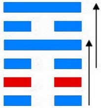
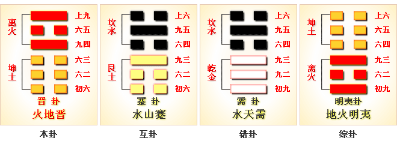
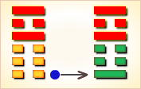
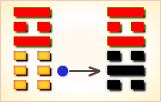
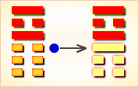
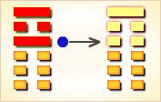
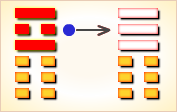
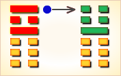

# 晋 ䷢

晋（䷢ jìn）卦的代号是`0:5`。**坤**卦是主卦，阳数是`0`；**离**卦是客卦，阳数是`5`。主卦的卦象是大地，客卦的卦象是火焰、太阳。大地是被动的，主方是被动的，晋是被动的，不是自己要晋升就晋升，而是必须由客方来晋升。晋是好事，但又不一定是好事。**晋**卦的主旨，在于论述如何上晋的为官之道。卦辞以康侯受赐为喻，说明上晋之臣为君王所赏识，六爻爻辞分别讲述了上晋的几种情况，其三爻讲述的众允；悔亡，说明求晋之人既注重求得君王赏识，也注重获得民众的拥护，只有获得民众的拥护，才不会有遭到民众反对的悔恨。

> 锄地锄去苗里草，谁想财帛将人找，一锄锄出银子来，这个运气也算好。

这个卦是异卦（下**坤**上**离**）相叠。**离**为日，为光明；**坤**为地。太阳高悬，普照大地，大地卑顺，万物生长，光明磊落，柔进上行，喻事业蒸蒸日上。

图中，红色表示当位的爻，天蓝色表示不当位的爻，箭头表示有应。

- 卦序：35

> 晉，康侯用錫馬蕃庶，晝日三接。
>《彖》曰：晉，進也。明出地上，順而麗乎大明，柔進而上行，是以康侯用錫馬蕃庶，晝日三接也。
>《象》曰：明出地上，晉。君子以自昭明德。

> 初六，晉如摧如，貞吉。罔孚，裕无咎。
>《象》曰：晉如摧如，獨行正也；裕无咎，未受命也。

> 六二，晉如愁如，貞吉，受茲介福，于其王母。
>《象》曰：受茲介福，以中正也。

> 六三，眾允，悔亡。
>《象》曰：眾允之，志上行也。

> 九四，晉如鼫鼠，貞厲。
>《象》曰：鼫鼠貞厲，位不當也。

> 六五，悔亡，失得勿恤，往，吉无不利。
>《象》曰：失得勿恤，往有慶也。

> 上九，晉其角，維用伐邑，厲吉无咎，貞吝。
>《象》曰：維用伐邑，道未光也。

>《象传》：日出地面，普照大地，有光明上进之象。

> 事业、名望、财运皆吉，所谓有加官晋爵之兆。

- 事业：顺利。应遵守正道，迎难而上，克敌制胜，因势利导。树立良好的人际关系，深得人心。全力以赴，不得有丝毫犹豫不决，更忌优柔寡断，而应败不馁，勇往直前。注意和衷共济，共同前进。
- 经商：行情好，市场竞争顺利。但也会遇到一些困难，要迎难而上，因势利导，克敌制胜，争取众人支持。前进中的挫折不可免，只要动机纯正，必可转危为安。
- 求名：经过刻苦努力与奋斗，已具备开拓事业的基础，却因无人引荐，暂时不得志，决不可因此自暴自弃，须耐心等待时机。同时，更加积极地创造条件。
- 婚恋：吉星高照。会有理想的结果，但决不可自恃条件优越而抱无所谓的态度或过于挑剔。
- 决策：处于不断上升的形势，不会有过大的阻力。但务必争取众人信任，获取人心，再接再厉，只要动机纯正，克服侥幸心理，必有喜从天降。

**晋**卦，**离**上**坤**下，为[乾宫游魂卦](../jing/qian.md#35)。晋取前进、晋见、晋升之意，上离下坤，为太阳普照大地，万物和顺之象，多主吉。日出地上，万物进展；赏赐隆重，百谋皆遂。得此卦者，如旭日东升，气运旺盛，收入颇丰，谋事可成，百事如意。

- 时运：好运新来，步步高升。
- 财运：光亮之业，最有利润。
- 家宅：阳光之屋。
- 身体：自知之明。

> 晋：表示进取也，主吉象。火为太阳，所以是「日出于大地、光明乍现」，阳光准备要照耀大地，一片欣欣向荣之象。事业投资、升迁、婚姻、感情均是有雨过天晴，奋发向上的吉象。

> 解释：很明白，很明亮。

> 特性：荣誉心重，固执，爱面子，外华内虚，喜领导他人。

> 运势：事业繁荣，声誉渐高，于人、事、物均获宏利之际，与人共事者吉。但要知进德虚怀，即是诸凡对人、事宜谨守德操，不可傲溢心怀，否则有破象也。但财运旺。

- 家运：虽如日中天，切不可过于骄纵、蛮横，若为人不行正道，虽然光明就在眼前，且兴隆幸福，又难免夫妇失和，家运不振。
- 疾病：久病者凶，近病无妨，注意胃肠、心脏之疾。
- 胎孕：平。
- 子女：多才智，聪明而贤孝。
- 周转：可获得强大资金。
- 买卖：进取得利，并获得巨财。
- 等人：女者会来，男者不一定会来。
- 寻人：见于西南方或南方。
- 失物：动作快，可以寻回来。似是在地上的箱子之类藏着。
- 外出：克服犹豫心理，大胆前进，可无往而不顺。
- 考试：科甲登榜。
- 诉讼：最终能圆满解决。
- 求事：受人提拔，可有成就。
- 改行：可行。
- 开业：吉利。

### 初六：晋如，摧如，贞吉。罔孚，裕，无咎。《象》曰：晋如摧如，独行正也。裕无咎，未受命也。

攻击敌人，打垮敌人，卜问得吉兆。胜利之师没有捕捉俘虏，没有抢掠财物，不会有灾难。《象传》：攻击敌人，打垮敌人，这是因为将帅能遵循正道，所以取得了胜利。从容部署，克敌制胜，没有灾难，说明将帅能因势制宜，独断于心。

平：得此爻者，忧愁参半，静则吉，动则凶。做官的不宜进取，须防流言。

- 时运：耐心等待，不必急进。
- 财运：稍待时日，可获大利。
- 家宅：吉屋可居；婚姻缓成。
- 身体：宽心解怀。

初六爻动变得[第21卦：火雷噬嗑](e599ace59791shike.md)。

火雷噬嗑䷔是异卦，下震上离，相叠。离为阴卦；震为阳卦。阴阳相交，咬碎硬物，喻恩威并施，宽严结合，刚柔相济。噬嗑为上下颚咬合，咀嚼。

### 六二：晋如，愁如，贞吉。受兹介福，于其王母。《象》曰：受之介福，以中正也。

攻击敌人，压倒敌人，卜问得吉兆。因为得到了先祖母的庇佑获得大福。《象传》：之所以受此大福，因为六二之爻居下卦中位，像人得中正之道。

吉：得此爻者，求谋称意，多得母亲扶助，或得妻财。做官的守正者会进取。

- 时运：所求多阻，守正必亨。
- 财运：守住低潮，自然受福。
- 家宅：迁居与老人同住；婚姻稍待。
- 身体：多听老人言。

六二爻动变得[第64卦：火水未济](e69caae6b58eweiji.md)。

火水未济䷿是异卦，下坎上离，相叠。离为火，坎为水。火上水下，火势压倒水势，救火大功未成，故称未济。《周易》以乾坤二卦为始，以既济、未济二卦为终，充分反映了变化发展的思想。

### 六三：众允，悔亡。《象》曰：众允之，志上行也。

万众一心，全力进攻，无所悔恨。《象传》：众人信任，其志向就会实现。

平：得此爻者，得朋友之助，营谋遂意，但谨防意外之险。做官的有升迁之机。

- 时运：众人悦服，自无懊恼。
- 财运：双方和睦，买卖皆利。
- 家宅：气氛和谐；两性融洽。
- 身体：团体运动；讼事调解。

六三爻动变得[第56卦：火山旅](e69785lv.md)。

火山旅䷷是异卦，下艮上离，相叠。此卦与丰卦相反，互为“综卦”。山中燃火，烧而不止，火势不停地向前蔓延，如同途中行人，急于赶路。因而称旅卦。

### 九四：晋如鼫鼠，贞厉。《象》曰：鼫鼠贞厉，位不当也。

攻击敌人而胆小如鼠，卜问得凶兆。《象传》：攻击敌人而胆小如鼠，卜问得凶兆，因为九四阳爻而居阴位，像人处于不利的地位。

凶：得此爻者，时运不佳，或有争诉。做官的不宜进取，有阻力，须守正。

- 时运：守正为宜，耍诈必凶。
- 财运：贪财必败，见好就收。
- 家宅：耗失过多；婚姻不正。
- 身体：疥疮或呕血，皆危。

九四爻动变得[第23卦：山地剥](e589a5bo.md)。

山地剥䷖是异卦，下坤上艮，相叠。五阴在下，一阳在上，阴盛而阳孤；高山附于地。二者都是剥落象，故为“剥卦”。此卦阴盛阳衰，喻小人得势，君子困顿，事业败坏。

### 六五：悔亡，失得勿恤，往吉，无不利。《象》曰：失得勿恤，往有庆也。

无所悔恨，吃了败仗，不要气馁。只要再接再厉，终必转败为胜。无所不利。《象传》：受到挫失，不要气馁，勇往直前，定有喜庆降临。

吉：得此爻者，好运到来，营谋获利。做官的有升迁之喜。

- 时运：灾去福来，无意得之。
- 财运：前有小失，今可大得。
- 家宅：屋运转好；婚姻吉祥。
- 身体：已无大碍。

六五爻动变得[第12卦：天地否](e590a6pi.md)。

天地否䷋是异卦，下坤上乾，相叠。其结构同泰卦相反，系阳气上升，阴气下降。天地不交，万物不通。它们彼此为“综卦”，表明泰极而否，否极泰来，互为因果。

### 上九：晋其角，维用伐邑，厉吉无咎，贞吝。《象》曰：维用伐邑，道未光也。

攻击敌人，必须较量敌我双方的力量，可以考虑攻击敌人的城邑。但其结局难料：或许危险，或许吉利，或许没有灾难，或许正践凶兆。《象传》：考虑到攻击敌人的城邑，这说明王道未能广泛实行，以致属邑叛乱。

平：得此爻者，有修屋宇之喜，不良者有争诉之忧。做官的有食邑之荣。

- 时运：好运将终，防有事故。
- 财运：同业纷争，幸可无咎。
- 家宅：邻里不安；始争终和。
- 身体：保养头部；罢讼为吉。

上九爻动变得[第16卦：雷地豫](e8b1abyu.md)。

雷地豫䷏是异卦，下坤上震，相叠。坤为地，为顺；震为雷，为动。雷依时出，预示大地回春。因顺而动，和乐之源。此卦与谦卦互为综卦，交互作用。
　　　
# [Jìn ䷢](../en/e6998bjin.md)
