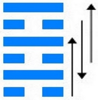
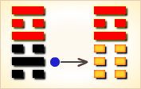
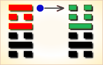

# 未济 ䷿

未济（䷿ wèi jì）卦的代号是`2:5`。主卦是`2`卦，坎卦，卦象是水，阳数是`2`；客卦是`5`卦，离卦，卦象是火，阳数是`5`。未济以未能渡过河为喻，阐明“物不可穷”的道理。未济䷿是既济䷾的综卦，下坎上离，离为火，坎为水。火向上炎，水往下润，两两不相交。卦中也是三阴三阳，两两相应，有同舟共济之象，故此卦“亨”但六爻均位不正，阴差阳错，就像小狐过河尾向上舒，可刚要到河边尾巴就被沾湿了，没有过去，以此喻事情尚未完结，还要向前发展。未济卦说明主方处境困难，受客方制约，为客方服务，在这种形势下应当做什么。

图中，天蓝色表示不当位的爻，箭头表示有应。未济卦中没有当位的爻。

- 卦序：64

> 未濟，亨。小狐汔濟，濡其尾，无攸利。
>《彖》曰：未濟亨，柔得中也；小狐汔濟，未出中也；濡其尾，无攸利，不續終也，雖不當位，剛柔應也。
>《象》曰：火在水上，未濟，君子以慎辨物居方。

> 初六，濡其尾，吝。
>《象》曰：濡其尾，亦不知極也。

> 九二，曳其輪，貞吉。
>《象》曰：九二貞吉，中以行正也。

> 六三，未濟，征凶，利涉大川。
>《象》曰：未濟征凶，位不當也。

> 九四，貞吉，悔亡。震用伐鬼方，三年有賞于大國。
>《象》曰：貞吉悔亡，志行也。

> 六五，貞吉，无悔。君子之光，有孚，吉。
>《象》曰：君子之光，其暉吉也。

> 上九，有孚于飲酒，无咎。濡其首，有孚失是。
>《象》曰：飲酒濡首，亦不知節也。

> 未济（䷿ wèi jì）卦是异卦，下坎上离，相叠。离为火，坎为水。火上水下，火势压倒水势，救火大功未成，故称未济。《周易》以乾坤二卦为始，以既济、未济二卦为终，充分反映了变化发展的思想。

>《象传》：水性下注，火势向上，水火不交，阴阳不得正位，未能完成和未能成功之意。

> 运气欠佳，但必须耐心突破难关，终可成功，有初凶后吉之象。

- 事业：处于最后的关键时刻，成功与否就在眼前，因此务必不可掉以轻心。自我节制非常重要，坚持到底，必要时也可能慎重地进行适度冒险，以成就事业。
- 经商：市场处于大变动的前夕，前景如何尚不明显。这是最为艰苦的时期，头脑必须冷静，切勿冒险，不可行动过度，适度节制，观察动向，决定行动。
- 求名：长期的努力和追求即会有结果。在成败的关键时刻应泰然自若，听天由命，顺其自然。
- 婚恋：已经渡过了困难阶段，再慎重地加把劲，会有美满的结果。
- 决策：此卦的意思是“未完成”，表明前途无量，有充分发展的可能。因此，必须坚持中正的原则，以明智、中庸、诚信、谦逊的态度，成就事业。面对人生，唯有勤勤恳恳，极力尽人事，听天命，不必过分计较成功与否。

未济卦，离上坎下，为[离宫三世卦](../jing/li.md#64)。未济就是未完成，此卦爻位不正，形象上极端恶劣，但变化在酝酿之中，未来充满希望。不能资助，待时而动；由小而大，不可躁进。得此卦者，运势不通，诸事不能如愿，宜由小及大，稳步进取，要耐心去突破难关，则终可成功。

- 时运：运势颠倒，务必谨慎。
- 财运：诸事不顺，步步为营。
- 家宅：改变方向；门户不合。
- 身体：血脉不顺，用药谨慎。

> 未济：表示阴阳不调和，气血不顺。人事情绪不顺应是最大的影响主因，幸好此卦会有否极泰来之变化，一切均会雨过天晴，值的等待。

> 解释：快要获利。

> 特性：思想高远，又缺乏耐性，神经质，情绪不稳定，内心易有冲突感，孤独感，悲观，感性。宜往艺术哲学宗教发展。

> 运势：气运不通，诸事不能如愿，有初衰后盛之象。凡事要有耐心去突破难关，前途将大有可望。与人共谋事者，终有大利，可为之。

- 家运：初运不振，耐心熬过辛苦的路，可得幸福。
- 疾病：病情不稳定，注意心肾不交、失眠、血液等病。
- 胎孕：平安。
- 子女：子女迟得，但终有繁荣之象，将来都能振奋家声，以慰祖德。
- 周转：有不少困难，成败各半。
- 买卖：初限不佳，渐有好转之象。
- 等人：虽迟到，但有吉兆。
- 寻人：负气出走，会自己回来。
- 失物：不能寻回。
- 外出：积极行动，十分有利。
- 考试：不错，有好成绩。
- 诉讼：宜拖延时间，日久可得贵人之助，和解了事。
- 求事：枉费心机，无希望，再等候时机。
- 改行：可进行。
- 开业：勿因初时不佳而灰心，生意会转兴隆。

### 初六：濡其尾，吝。《象》曰：濡其尾，亦不知极也。

涉水渡河，沾湿了衣尾，前进有困难。《象传》：涉水渡河，沾湿了衣尾，见微知巨，再冒险前进，是不知儆戒。

凶：得此爻者，经营不利，涉水行舟者，谨防溺水之患。做官的仕途有阻，不能前进。

- 时运：鲁莽行事，无路可走。
- 财运：不记教训，谋财无方。
- 家宅：门户方位不正；团聚不易。
- 身体：病在下身。

初六爻动变得[第38卦：火泽睽](e79dbdkui_cn.md)。

火泽睽䷥是异卦，下兑上离，相叠。离为火；兑为泽。上火下泽，相违不相济。克则生，往复无空。万物有所不同，必有所异，相互矛盾。睽即矛盾。

### 九二：曳其轮，贞吉。《象》曰：九二贞吉，中以行正也。

提着腰带涉水过河。卜问得吉兆。《象传》：九二爻辞讲贞吉，因为九二阳爻处下卦中位，像人行事遵循正道。

吉：得此爻者，安份守纪者，谋望遂意。做官的克服困难者，晋升有望。

- 时运：上下相得，无往不利。
- 财运：用心经营，满载而归。
- 家宅：美善之家；必得贤妇。
- 身体：胸腹阻滞。

九二爻动变得[第35卦：火地晋](e6998bjin_cn.md)。

火地晋䷢是异卦，下坤上离，相叠。离为日，为光明；坤为地。太阳高悬，普照大地。大地卑顺，万物生长，光明磊落，柔进上行，喻事业蒸蒸日上。

### 六三：未济，征凶，利涉大川。《象》曰：未济征凶，位不当也。

渡不了河，出行有凶险。不利于涉水渡河。《象传》：渡不了河，出行有凶险，因为六三阴爻居阳位，像人处境不利。

凶：得此爻者，宜见机行事，不宜妄动。做官的有因人成事之美。在商旅则涉川历险而利可获。

- 时运：见机而作，妄动则凶。
- 财运：把握良机，船运有利。
- 家宅：安居为宜；迎娶为吉。
- 身体：预防祸祟，渡川以解。

六三爻动变得[第50卦：火风鼎](e9bc8eding_cn.md)。

火风鼎䷱是异卦，下巽上离，相叠。燃木煮食，化生为熟，除旧布新的意思。鼎为重宝大器，三足稳重之象。煮食，喻食物充足，不再有困难和困扰。在此基础上宜变革，发展事业。

### 九四：贞吉，悔亡，震用伐鬼方。三年有赏于大国。《象》曰：贞吉悔亡，志行也。

吉利的贞卜，没有悔恨。大动干戈，助殷讨伐鬼方，费时三年，打败了它，获得殷国的奖赏。《象传》：吉利的卜问，没有悔恨，说明志得意行。

吉：得此爻者，会得好人提举，获利丰厚。做官的会受到重用，名利双全。读书人会取得佳绩。

- 时运：志得意满，名利双全。
- 财运：远方经营，利润可观。
- 家宅：安居乐业；二年成婚。
- 身体：可保三年。

九四爻动变得[第4卦：山水蒙](e89299meng_cn.md)。

山水蒙䷃是异卦，下坎上艮，相叠。艮是山的形象，喻止；坎是水的形象，喻险。卦形为山下有险，仍不停止前进，是为蒙昧，故称蒙卦。但因把握时机，行动切合时宜，因此，具有启蒙和通达的卦象。

### 六五：贞吉，无悔，君子之光。有孚，吉。《象》曰：君子之光，其晖吉也。

吉利的贞卜，没有悔恨。打了胜仗，捕获了俘虏，这是君子的光荣，吉利。《象传》：君子光荣，君子光明正大，自然吉利。

吉：得此爻者，谋望有成，财利丰厚。做官的能得到升迁。

- 时运：运势正旺，诸事皆吉。
- 财运：官方业务，获利稳定。
- 家宅：大吉之家；婚姻必成。
- 身体：神清气爽。

 
六五爻动变得[第6卦：天水讼](e8aebcsong_cn.md)。

天水讼䷅是异卦，下坎上乾，相叠。同需卦相反，互为“综卦”。乾为刚健，坎为险陷。刚与险，健与险，彼此反对，定生争讼。争讼非善事，务必慎重戒惧。

### 上九：有孚于饮酒，无咎。濡其首，有孚失是。《象》曰：饮酒濡首，亦不知节也。

捕获了俘虏，饮酒庆贺。没有灾难，但酗酒闹事，头发都淋湿了。俘虏乘机作乱，将他们杀了。《象传》：酗酒闹事头发都淋湿，也太不知节制了。

平：得此爻者，行险而顺，不良者有溺水之厄，纵酒之灾。做官的有望升迁。

- 时运：能知节俭，可保无虞。
- 财运：量入为出，永享其富。
- 家宅：勤俭持家；相敬如宾。
- 身体：饮食失节，不可不慎。

 
上九爻动变得[第40卦：雷水解](e8a7a3xie_cn.md)。

雷水解䷧是异卦，下坎上震，相叠。震为雷、为动；坎为水、为险。险在内，动在外。严冬天地闭塞，静极而动。万象更新，冬去春来，一切消除，是为解。

# [Wèi Jì ䷿](e69caae6b58eweiji.md)
