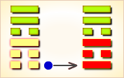
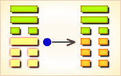

# 渐 ䷴

渐（䷴ jiàn）卦的代号是`1:3`。主卦是艮卦，阳数是`1`，卦象是山，特性是被动和阻止；客卦是巽卦，阳数是`3`，卦象是风，特性是顺从。“渐”（jiàn），慢慢地，一点一点地：逐渐。主方像山一样静止不动，阻止游移不定的客方，而客方则顺从形势，逐渐变化状态。卦辞的“渐：女归，吉，利贞”，是说作为循序渐进的《渐》卦，它有如同女子出嫁一样，如能按照女子出嫁程序那样一步一步走，那就很吉祥，也宜于贞正。

图中，红色表示当位的爻，天蓝色表示不当位的爻，箭头表示有应。

- 卦序：53

> 漸，女歸吉，利貞。
>《彖》曰：漸之進也，女歸吉也。進得位，往有功也。進以正，可以正邦也。其位剛得中也。止而巽，動不窮也。
>《象》曰：山上有木，漸，君子以居賢德善俗。

> 初六，鴻漸于干。小子厲，有言，無咎。
>《象》曰：小子之厲，義无咎也。

> 六二，鴻漸于磐，飲食衎衎，吉。
>《象》曰：飲食衎衎，不素飽也。

> 九三，鴻漸于陸，夫征不復，婦孕不育，凶，利禦寇。
>《象》曰：夫征不復，離群醜也；婦孕不育，失其道也；利用禦寇，順相保也。

> 六四，鴻漸于木，或得其桷，无咎。
>《象》曰：或得其桷，順以巽也。

> 九五，鴻漸于陵，婦三歲不孕，終莫之勝，吉。
>《象》曰：終莫之勝，吉，得所願也。

> 上九，鴻漸于陸，其羽可用為儀，吉。
>《象》曰：其羽可用為儀，吉，不可亂也。

> 渐（䷴ jiàn）卦是异卦，下艮上巽，相叠。艮为山，巽为木。山上有木，逐渐成长，山也随着增高。这是逐渐进步的过程，所以称渐，渐即进，渐渐前进而不急速。

>《象传》：山上种有树木，逐渐生长，比喻循序渐进。

> 逐渐走向光明前途，凡事宜打根基，可得吉庆，但须防色情之难及文书错失。

- 事业：在经过一个相对静止的时期后，重新开始了事业的新阶段。这时最怕的是急躁冒进，务必循序上进，脚踏实地。同时注意品德修养，以沉着、谦逊的态度对待事业，可无往而不利。
- 经商：正处在稳步向前发展的阶段，要把握时机，既不可盲目乐观，也不要停步不前，而应采取逐步前进的策略，量力而行。遵守商业道德，以良好的服务，开拓市场。
- 求名：效法树木植根山上，逐渐生长的精神。在品德和学业两个方面，扎扎实实地提高自己。同时，肩负起改善社会风俗的责任。求名应以渐进为宜，切不可急进。
- 婚恋：不可操之过急。幸福、美满，夫妻白头和谐。
- 决策：时来运转的时刻已经到来，切莫错过良机。务必小心谨慎，渐进有益有利。以谦和的态度处世，可以得到强有力的支持，会获得重大成功。

渐卦，巽上艮下，为[艮宫归魂卦](../jing/gen.md#53)。渐为渐进，筮遇此卦，女嫁则吉，举事有利。循序渐进，积少成多；渐进即利，性急即败。得此卦者，逐步开运，凡事宜循序渐进，则谋事可成，不宜急进，性急则败。

- 时运：时来运转，可以得意。
- 财运：逐渐得利，多行善事。
- 家宅：君子居之；贤女可妻。
- 身体：安居调养。

> 渐：表示循序渐进，不可心急之意，主吉象。好事慢慢在进行中，一切遵循正理常规即可，事业投资均能有收益。感情婚姻，更是结果收成，欢喜结局之时。

> 解释：逐渐好转。

> 特性：感觉细腻，思想敏锐，重品味，讲情调之人，爱追求变化的事物，口才佳。反应快，为人热心，财运丰厚。

> 运势：逐渐顺利，光明开运之象。凡事务必掌握时机，循序渐进，可得吉庆。须防款项交易之差错及色情之灾。

- 家运：渐曙光明、幸福之象，诸事宜以顺乎自然为吉，反则有克也。
- 疾病：恶化之象，注意胃、肠、背痛等。
- 胎孕：无碍。
- 子女：儿女多坚强笃实，态度温顺，将来有成就。
- 周转：不成亦勿放弃，久调可成。
- 买卖：渐进有利，过急不利，欲速则不达。
- 等人：迟到。
- 寻人：在东南或东北二方，过些时日可寻得。
- 失物：多数不能寻回。
- 外出：准备充分，从容外出，一路平安。
- 考试：会取得好成绩。
- 诉讼：宜进不宜退，据理力争可胜。
- 求事：可寻得良好工作。
- 改行：吉利。
- 开业：吉利，渐有发展之象。

### 初六：鸿渐于干，小子厉。有言，无咎。《象》曰：小子之厉，义无咎也。

鸿雁走进了山涧。筮遇此爻，警惕小孩顽皮，遭遇危险，应该加以谴责，则没有灾难。《象传》：小孩顽皮遭遇危险，因为有家长呵责制止，理应不会出事故。

凶：得此爻者，运气不佳，谋为不利。

- 时运：初行好运，要有耐心。
- 财运：有约在先，宜防小人。
- 家宅：尚无大碍；女长男少。
- 身体：大人没事，小孩就医。

初六爻动变得[第37卦：风火家人](e5aeb6e4babajiaren.md)。

风火家人䷤是异卦，下离上巽，相叠。离为火；巽为风。火使热气上升，成为风。一切事物皆应以内在为本，然后伸延到外。发生于内，形成于外。喻先治家而后治天下，家道正，天下安乐。

### 六二：鸿渐于磐，饮食衎衎，吉。《象》曰：饮食衎衎，不素饱也。

鸿雁走上水边高地，饱饮饱食，自得喜乐。筮遇此爻，吉利。《象传》：饱饮饱食，自得喜乐，喻指其人，自食其力，从不白吃白喝。

吉：得此爻者，无往不利，随处皆安。

- 时运：嘉宾安乐，名利皆有。
- 财运：日益增加，稳若磐石。
- 家宅：和乐相处；百年偕老。
- 身体：饮食过度之症。

六二爻动变得[第57卦：巽为风](e5b7bdxun.md)。

巽为风䷸是同卦，下巽上巽，相叠。巽为风，两风相重，长风不绝，无孔不入。巽亦为顺、谦逊的态度和行为，可无往不利。

### 九三：鸿渐于陆，夫征不复，妇孕不育，凶。利御寇。《象》曰：夫征不复，离群丑也。妇孕不育，失其道也。利用御寇，顺相保也。

鸿雁走到旱地上。筮遇此爻，丈夫出征可能不再回返，妇女怀孕可能流产，这是凶险之兆。但有利于抵御敌寇。《象传》：丈夫出征不再回返，说明其人掉队遇险。妇女怀孕而流产，说明其人失其保胎之道。利于抵御敌寇，说明国人能够同心同德，保家卫国。

凶：得此爻者，多惊扰，人情不睦，盗贼侵害。做官的上进有阻力，有被贬之忧。

- 时运：运势不正，须防有祸。
- 财运：不易得利，防有盗贼。
- 家宅：不利生产，须防离散。
- 身体：生产时恐难两全。

九三爻动变得[第20卦：风地观](e8a782guan.md)。

风地观䷓是异卦，下坤上巽，相叠。风行地上，喻德教遍施。观卦与临卦互为综卦，交相使用。在上者以道义观天下；在下者以敬仰瞻上，人心顺服归从。

### 六四：鸿渐于木，或得其桷，无咎。《象》曰：或得其桷，顺以巽也。

鸿雁飞到树木上，有的停息在河边堆放的桷木上。筮遇此爻，没有灾难。《象传》：有的鸿雁停息在河边堆放的桷木上之所以没有灾难，因为六四阴爻居于九五阳爻之下，像人有驯服而又谦逊之德。

平：得此爻者，利于修造，自给自足。做官的须随遇而安，升迁无定。

- 时运：随遇而安，可以免咎。
- 财运：利润甚微，保本即可。
- 家宅：可能寡居。
- 身体：肝火过盛。

六四爻动变得[第33卦：天山遁](e981afdun.md)。

天山遁䷠是异卦，下艮上乾，相叠。乾为天，艮为山。天下有山，山高天退。阴长阳消，小人得势，君子退隐，明哲保身，伺机救天下。

### 九五：鸿渐于陵，妇三岁不孕，终莫之胜，吉。《象》曰：终莫之胜，吉，得所愿也。

鸿雁走到山陵上。筮遇此爻，妻子多年不能怀孕，但始终不会被人取代，吉利。《象传》：始终没有被人取代，吉利，妻子实现了与其丈夫和谐白头的愿望。

吉：得此爻者，先难后易，做官的多招诽谤，先暗后明。

- 时运：运势中正，三年必成。
- 财运：眼前平平，三年大发。
- 家宅：可以安居；得子稍迟。
- 身体：三年可愈。

九五爻动变得[第52卦：艮为山](e889aegen.md)。

艮为山䷳是同卦，下艮上艮，相叠。艮为山，二山相重，喻静止。它和震卦相反。高潮过后，必然出现低潮，进入事物的相对静止阶段。静止如山，宜止则止，宜行则行。行止即动和静，都不可失机，应恰到好处，动静得宜，适可而止。

### 上九：鸿渐于陆，其羽可用为仪，吉。《象》曰：其羽可用为仪，吉，不可乱也。

鸿雁走到山头上，它的羽毛可用来编织舞具。这是吉利之兆。《象传》：鸿雁的羽毛可用来编织舞具，这是吉利之兆，编织舞具的羽毛应该纯而不杂，像人心志不乱。

吉：得此爻者，得人荐举，谋望有成，祸患不侵，多福多利。做官的大运来到，会得到重用。读书人会取得好成绩。

- 时运：大运来到，谋望有成。
- 财运：货美价高，自然获利。
- 家宅：辉煌可观；婚姻吉祥。
- 身体：健康活泼。

上九爻动变得[第39卦：水山蹇](e8b987jian.md)。

水山蹇䷦是异卦，下艮上坎，相叠。坎为水，艮为山。山高水深，困难重重。人生险阻，见险而止，明哲保身，可谓智慧。蹇，跋行艰难。

# [Jiàn ䷴](e6b890jian.md)
