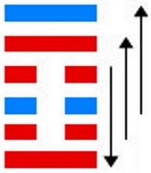
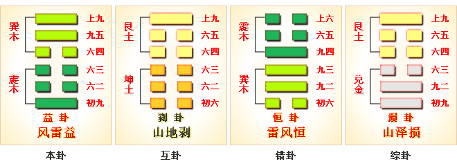
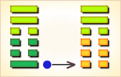
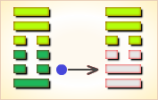
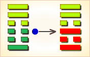
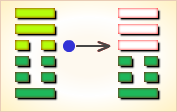

# 益 ䷩

益（䷩ yì）卦的代号是`4:3`，主卦是`4`卦，震卦；客卦是`3`卦，巽卦。益，表明这个卦所代表的状态对主方有益。震卦的卦象是雷，主方积极主动，雷厉风行。巽卦的卦象是风，风顺从而有力。由于客方顺从主方，主方有可能利用客方的力量而得到益处。益卦，风雷益，损上益下，上上卦。这个卦是异卦，下震上巽，相叠。巽为风；震为雷。风雷激荡，其势愈强，雷愈响，风雷相助互长，交相助益。益卦䷩与损卦䷨相反。它是损上以益下，后者是损下以益上。二卦阐述的是损益的原则。

图中，红色表示当位的爻，天蓝色表示不当位的爻，箭头表示有应。

- 卦序：42

> 益，利有攸往，利涉大川。
>《彖》曰：益，損上益下，民說无疆，自上下下，其道大光。利有攸往，中正有慶；利涉大川，木道乃行。益動而巽，日進无疆，天施地生，其益无方，凡益之道，與時偕行。
>《象》曰：風雷，益，君子以見善則遷，有過則改。

> 初九，利用為大作，元吉，无咎。
>《象》曰：元吉无咎，下不厚事也。

> 六二，或益之十朋之龜，弗克違，永貞吉，王用享于帝，吉。
>《象》曰：或益之，自外來也。

> 六三，益之用凶事，无咎。有孚中行，告公用圭。
>《象》曰：益用凶事，固有之也。

> 六四，中行，告公從，利用為依遷國。
>《象》曰：告公從，以益志也。

> 九五，有孚惠心，勿問元吉，有孚惠我德。
>《象》曰：有孚惠心，勿問之矣；惠我德，大得志也。

> 上九，莫益之，或擊之。立心勿恒，凶。
>《象》曰：莫益之，偏辭也；或擊之，自外來也。

> 益（䷩ yì）卦是异卦，下震上巽，相叠。巽为风；震为雷。风雷激荡，其势愈强，雷愈响，风雷相助互长，交相助益。此卦与损卦相反。它是损上以益下，后者是损下以益上。二卦阐述的是损益的原则。

>《象传》：强风配快雷，声威增长之象，长男配长女，夫妇合体，增益儿孙之象。

> 现正当吉运，可得贵人之助而成功，宜施惠于人，施比受更有福。

- 事业：大胆投入，勇于支持他人事业，必相得益彰。勇敢前进，敢作敢为。只要心地善良、纯洁、谦虚，事业必定与日俱增，前程无可限量。助人宜即时，要在应急。开拓事业，内部团结一致，人心所向，树立恒心，不怕冒险犯难。
- 经商：勿追求小利，让利于顾客，反而必获丰厚利润，切忌贪心不足！在遇到危险时应向他人求教，争取诚实的援助。
- 求名：真心实意地施惠于他人，自己必然可以得到诚心诚意的回报，并且获得支持，事业必成。
- 婚恋：相亲相爱，良缘天定。
- 决策：心胸开阔，乐于助人。人际关系好，得到众人的支持。自己贵在树立恒心，克服三心二意。尤其要向比自己优秀的人学习，借助对方的力量，充实和发展自己。树立必要的冒险精神。平日要施善于人。因此，即使遇到危险也会得到他人救助。

益卦，巽上震下，为[巽宫三世卦](../jing/xun.md#42)。益卦为损益、收益之意，利有所往，利涉大川，多主吉。损上益下，奋发有为；进取成名，商贾获利。得此卦者，正当好运，奋发图进，得人帮助，能获名利。

- 时运：得意之时，改旧换新。
- 财运：贸易要快，才有利益。
- 家宅：小心风雷；婚姻好合。
- 身体：肝火太盛。

> 益：表示利益、好处，是由上对下的一种好的给予，主吉象。对事业投资都有相当的帮助，可得贵人来相助、扶持。

> 解释：有利益，有好处。

> 特性：重大我，轻小我，热心公益，爱热闹场合，团体事务协调工作。
对自己的生活要求少，在朋友口碑中不错。

> 运势：乘盛吉之运，可得他人之助而诸事顺畅，家业有成。大致吉利之运也。

- 家运：有喜悦之象，发达之意。
- 疾病：可治愈，提防肝胆、肠胃之疾，或性病等。
- 胎孕：胎有不安。
- 子女：得家人之喜爱，天真顽皮。
- 周转：可成。
- 买卖：可得大利。
- 等人：迟来。因有好事相告。
- 寻人：难逢，防有害。若出走者会自回。
- 失物：有望可寻回。
- 外出：有利可获。大胆外出行动。
- 考试：成绩优良，父母有喜悦之象。
- 诉讼：有牢狱之灾，或事因女人、房地产引起，宜和解。
- 求事：大好时机，勿错过。
- 改行：有利。
- 开业：开业者则大有利图。

### 初九：利用为大作，元吉，无咎。《象》曰：元吉无咎，下不厚事也。

筮遇此爻，利于大兴土木，大吉大利，并无灾祸。《象传》：大吉大利，并无灾祸，因为百姓努力工作，加快了工程进度。

吉：得此爻者，大事可成，万事称心。做官的会高升，读书人会取得大的成绩。

- 时运：大事可为，无不如意。
- 财运：有人有谋，大利在前。
- 家宅：新宅宽大，婚姻大吉。
- 身体：健康无虞。

初九爻动变得[第20卦：风地观](e8a782guan.md)。

风地观䷓是异卦，下坤上巽，相叠。风行地上，喻德教遍施。观卦与临卦互为综卦，交相使用。在上者以道义观天下；在下者以敬仰瞻上，人心顺服归从。

### 六二：或益之，十朋之龟，弗克违，永贞吉。王用享于帝，吉。《象》曰：或益之，自外来也。

有人赐予价值十朋的大龟，不可拒违其命。卜问得长久的吉兆。君王祭祀天帝，吉利。《象传》：有人赐予我们宝龟，说明这大宝龟是从外面送来的。

吉：得此爻者，商贾获利，福份多多。做官的仕途一帆风顺，读书人进取成名。

- 时运：意外得财，又能守住。
- 财运：如有神助，必得厚利。
- 家宅：安居之家；百年好合。
- 身体：祈祷可愈。

六二爻动变得[第61卦：风泽中孚](e4b8ade5ad9azhongfu.md)。

风泽中孚䷼是异卦，下兑上巽，相叠。孚本义孵，孵卵出壳的日期非常准确，有信的意义。卦形外实内虚，喻心中诚信，所以称中孚卦。这是立身处世的根本。

### 六三：益之用凶事，无咎。有孚中行，告公用圭。《象》曰：益用凶事，固有之也。

因为武王逝世，增加祭祀鬼神的祭物，没有灾祸。武庚乘国丧作乱，周公发兵征讨，大获胜仗，抓获俘虏。中衍向周公报告，从而举行祭祀。《象传》：因为有丧事，增加祭祀鬼神的祭物，这是自然之理。

平：得此爻者，常人获利，不良者大凶，官灾祸患并至。做官的会受到重用，委以重职。

- 时运：先苦后甘，讲信修睦。
- 财运：欲求富贵，必须冒险。
- 家宅：逢凶化吉；苦中成婚。
- 身体：有惊无险。

六三爻动变得[第37卦：风火家人](e5aeb6e4babajiaren.md)。

风火家人䷤是异卦，下离上巽，相叠。离为火；巽为风。火使热气上升，成为风。一切事物皆应以内在为本，然后伸延到外。发生于内，形成于外。喻先治家而后治天下，家道正，天下安乐。

### 六四。中行，告公从。利用为依迁国。《象》曰：告公从，以益志也。

中衍向周公报告了处理殷室遗民之事，周公听从了，顺利地将殷商遗民分封给各封国。《象传》：周公听从了王命，说明君臣上下团结更加巩固。

平：得此爻者，或会迁居，或有修造，诉者利，官者伸。做官的会被领导委以重任。

- 时运：眼前有难，暂避为宜。
- 财运：改迁他处，另开店面。
- 家宅：最好迁移；另找媒人。
- 身体：外地就医。

六四爻动变得[第25卦：天雷无妄](e697a0e5a684wuwang.md)。

天雷无妄䷘是异卦，下震上乾，相叠。乾为天为刚为健；震为雷为刚为动。动而健，刚阳盛，人心振奋，必有所得。但唯循纯正，不可妄行。无妄必有获，必可致福。

### 九五：有孚惠心，勿问元吉。有孚惠我德。《象》曰：有孚惠心，勿问之矣。惠我德，大得志也。

捕获了很多俘虏，安抚他们，不必追究，大吉大利。这些俘虏，将感戴我的恩德。《象传》：捕获了很多俘虏，安抚他们，不要追究他们的责任，使他们感戴我的恩德，说明这样可以笼络人心。

吉：得此爻者，谋望称意，事多顺利。做官的会遇到明主，仕途顺利。

- 时运：存心仁厚，实至名归。
- 财运：兼顾道义，利益长久。
- 家宅：善人之居；非亲即友。
- 身体：保养得宜。

九五爻动变得[第27卦：山雷颐](e9a290yi.md)。

山雷颐䷚是异卦，下震上艮，相叠。震为雷，艮为山。山在上而雷在下，外实内虚。春暖万物养育，依时养贤育民。阳实阴虚，实者养人，虚者为人养。自食其力。

### 上九：莫益之，或击之，立心勿恒，凶。《象》曰：莫益之，偏辞也。或击之，自外来也。

没有人帮助他，还有人攻击他。在这种情况下，立志不坚定，就要坏事。《象传》：没有人帮助他，这是周遍之辞，表示根本没有相助者。有人攻击他，说明这攻击来自外部。

凶：得此爻者，贪图名利，或有意外之祸，刑克损伤之灾。做官的因为贪求名位，或被贬职。

- 时运：贪求名位，意外之祸。
- 财运：专求己利，必生争端。
- 家宅：不可久居；不易偕老。
- 身体：无恒之凶。

上九爻动变得[第3卦：水雷屯](e5b1afzhun.md)。

水雷屯䷂是异卦，下震上坎，相叠。震为雷，喻动；坎为雨，喻险。雷雨交加，险象丛生，环境恶劣。“屯”原指植物萌生大地，万物始生，充满艰难险阻，然而顺时应运，必欣欣向荣。

# [Yì ䷩](yi.md)
