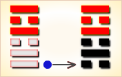
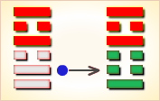
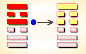
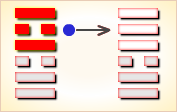
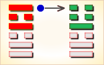

# 暌 ䷥

睽（䷥ kuí）卦的代号是`6:5`，其主卦是`6`卦，兑卦，卦象是泽，特性是愉快；客卦是`5`卦，离卦，卦象是火，特性是光明而依赖。睽，离上兑下。茂盛的河泽地带，燃起了一堆火，斜视一眼，挺别扭。主客双方关系很别扭，这是睽卦对当前形势的描述。

> 此卦占来运气歹，如同太公作买卖，贩猪牛快贩羊迟，猪羊齐贩断了宰。

这个卦是异卦（下兑上离）相叠。离为火；兑为泽。上火下泽，相违不相济。克则生，往复无空。万物有所不同，必有所异，相互矛盾。睽即矛盾。

图中，红色表示当位的爻，天蓝色表示不当位的爻，箭头表示有应”。

- 卦序：38

> 睽，小事吉。
>《彖》曰：睽，火動而上，澤動而下，二女同居，其志不同行。說而麗乎明，柔進而上行，得中而應乎剛，是以小事吉。天地睽而其事同也，男女睽而其志通也，萬物睽而其事類也，睽之時用大矣哉。
>《象》曰：上火下澤，睽，君子以同而異。

> 初九，悔亡，喪馬勿逐，自復。見惡人，无咎。
>《象》曰：見惡人，以辟咎也。

> 九二，遇主于巷，无咎。
>《象》曰：遇主于巷，未失道也。

> 六三，見輿曳，其牛掣，其人天且劓，无初有終。
>《象》曰：見輿曳，位不當也。无初有終，遇剛也。

> 九四，睽孤，遇元夫，交孚，厲无咎。
>《象》曰：交孚无咎，志行也。

> 六五，悔亡，厥宗噬膚，往何咎。
>《象》曰：厥宗噬膚，往有慶也。

> 上九，睽孤，見豕負塗，載鬼一車。先張之弧，後說之弧。匪寇婚媾，往遇雨則吉。
>《象》曰：遇雨之吉，群疑亡也。

> 睽（䷥ kuí）卦是异卦，下兑上离，相叠。离为火；兑为泽。上火下泽，相违不相济。克则生，往复无空。万物有所不同，必有所异，相互矛盾。睽即矛盾。

>《象传》：离火向上，兑泽则向下，一上一下，两相乖违，又二女同居，不得正之象。

> 气运欠佳，诸事难成，有水火不容之象，宜处变不惊。

- 事业：事业开创困难，处境艰辛。如能志同道合，相互信任，目的可以达到。但起初成功的多是小事，小事积累可成大事。事成于协力合作，败于众志相异。应加强团结，委曲以求相通，最忌内部相互猜疑。
- 经商：应以心平气和的态度投入市场竞争，求大同而存小异。对竞争对手不应敌视，可和而不流，群而不党。尤其不能惹起纠纷，极力避免灾祸。
- 求名：以真诚的心努力上进。对于恶人必要时亦不可完全不交往，应采取宽大包容的态度，适度往来。对志同道合者也不必完全一致，可异中求同。
- 婚恋：双方必须真诚相待。否则，第三者极易介入，夫妻相疑则家破。
- 决策：处于矛盾、对应状态。必须注意以宽宏大度、平和、柔顺的态度对待人生。这样才能心平气和，柔而上进。认清合必有离，离必有合；同中有异，异中有同的道理。否则，刚极暴躁，明极生疑。暴疑皆可致命。

睽卦，离上兑下，为[艮宫四世卦](../jing/gen.md#38)。睽象征乖离、乖异，筮遇此卦，大事不吉，小事顺利。人心外向，背道而驰；难以成事，不宜大举。得此卦者，运气不佳，水火不容，相互矛盾，诸事难成。

- 时运：上下不通，以正处之。
- 财运：人弃我取，尚有小利。
- 家宅：迁避为宜；择而娶之。
- 身体：上火下湿，实在难治。

> 睽：表示乖危、叛逆、背离之象，主凶象。意见不合，彼此争斗、任性、不协调。事事均不顺，且有被出卖的危险，注意犯小人。

> 解释：防小人。

> 特性：经常事与愿违，个性敏锐，理想化，感情与理智容易矛盾冲突，易生孤独感，宜往专技艺术发展。

> 运势：水火不相容，则气运不通，势行低落，诸事难成。凡事有违叛之时，若能处变不惊，不逞强出头，尚可转危为安。有家内不和，亲友疏散之情。宜力持温和，忍耐去克服困难，始可渡危。

- 家运：困苦离亲之象，不和睦之情。家运衰颓，虽可得小利，但也入不敷出。
- 疾病：轻症宜速就医，重症则危，更防断症错误，注意心脏，寒热失调之症。
- 胎孕：无碍。
- 子女：子女不和，有骨肉无情之不幸，且其子女六亲缘薄无靠。
- 周转：难以如愿。
- 买卖：多阻碍，难成，若成者亦必损。
- 等人：不会来。
- 寻人：因口角负气出走，其志不同故不易寻。
- 失物：不能找回。有失窃的可能。
- 外出：顺利。途中可以得到善人相助。
- 考试：落榜。
- 诉讼：宜速求和解，迟则理屈辞穷。
- 求事：无希望。
- 改行：不宜。
- 开业：不利。

### 初九：悔亡，丧马勿逐，自复。见恶人，无咎。《象》曰：见恶人，以辟咎也。

不必悔恨，丢失了马匹，不必寻找，它自会回来，途中碰见坏人，也不会有灾祸。《象传》：遇见坏人之所以无灾祸，意在消除恶人的恶意。

平：得此爻者，营谋先失而后得，人事先离而后合，谨防凶恶之灾患。做官的闲职者复职，被贬者复升。

- 时运：好运初至，顺其自然。
- 财运：不必多虑，后必大亨。
- 家宅：平顺无咎；耐心等待。
- 身体：没有大碍。

### 初九变卦：火泽睽 变卦 火水未济

初九爻动变得[第64卦：火水未济](e69caae6b58eweiji.md)。

火水未济䷿是异卦，下坎上离，相叠。离为火，坎为水。火上水下，火势压倒水势，救火大功未成，故称未济。《周易》以乾坤二卦为始，以既济、未济二卦为终，充分反映了变化发展的思想。

### 九二：遇主于巷，无咎。《象》曰：遇主于巷，未失道也。

遇着了热情好客的主人，没有灾难。《象传》：遇着了热情好客的主人，这说明没有迷失道路。

平：得此爻者，会得知己，营谋遂意。做官的会遇到明主，升迁有望。

- 时运：风云际会，勇往直前。
- 财运：遭遇财主，共同经营。
- 家宅：贵人来访；小心私情。
- 身体：得遇良医。

九二爻动变得[第21卦：火雷噬嗑](e599ace59791shike.md)。

火雷噬嗑䷔是异卦，下震上离，相叠。离为阴卦；震为阳卦。阴阳相交，咬碎硬物，喻恩威并施，宽严结合，刚柔相济。噬嗑为上下颚咬合，咀嚼。

### 六三：见舆曳，其牛掣。其人天且劓，无初有终。《象》曰：见舆曳，位不当也；无初有终，遇刚也。

看见一辆拉货的车，拉车的牛一俯一仰拉得很费劲，赶车的人是一个烙了额，割了鼻的奴隶。起初车子陷着不动，后来终于拉动了。《象传》：看见一个烙额割鼻的奴隶在拉车，爻象表明：六三阴爻而居于阳位，所处不当，像人落入了悲苦的境地。起初不顺，结局倒好，因为六三阴爻上进遇到九四阳爻，像人得到强者的帮助。

凶：得此爻者，谋望有阻，险中求安，先迷后顺。不良者有骨肉刑伤之厄。做官的须防小人的谗言。

- 时运：恐有刑伤，苦撑三年。
- 财运：人和不易，无利可图。
- 家宅：朝西为宜；先疑后释。
- 身体：面上有疮，久后自愈。

六三爻动变得[第14卦：火天大有](e5a4a7e69c89dayou.md)。

火天大有䷍是异卦，下乾上离，相叠。上卦为离，为火；下卦为乾，为天。火在天上，普照万物，万民归顺，顺天依时，大有所成。

### 九四：睽孤，遇元夫。交孚，厉无咎。《象》曰：交孚无咎，志行也。

旅人孤单地行路，遇上一个跛子，一同被抓住，情形危险，但终无灾祸。《象传》：交相信任，必无灾难，说明其志得行，目的达到。

平：得此爻者，能得到朋友的帮助，转危为安，求婚者必配。做官的会得到同僚的推荐，升迁有机。

- 时运：孤僻个性，朋友相助。
- 财运：进退两难，旧友帮忙。
- 家宅：四周荒凉。
- 身体：目疾求医。

九四爻动变得[第41卦：山泽损](e68d9fsun.md)。

山泽损䷨是异卦，下兑上艮，相叠。艮为山；兑为泽。上山下泽，大泽浸蚀山根。损益相间，损中有益，益中有损。二者之间，不可不慎重对待。损下益上，治理国家，过度会损伤国基。应损则损，但必量力、适度。少损而益最佳。

### 六五：悔亡，厥宗噬肤，往何咎。《象》曰：厥宗噬肤，往有庆也。

没有悔恨。瞧见同族宗人在吃肉，孤单的旅人欣然结伴同行，一路平安无事。《象传》：同族宗人在吃肉，前往，必有喜庆之事。

平：得此爻者，经营获利，抬举有人。不良者，亲朋怨恶，骨肉刑伤，官司牵连。做官的会获得成就与名望，读书人会取得佳绩。

- 时运：同宗相助，可以放心。
- 财运：须防合伙，自己端正。
- 家宅：旧屋可居；亲上加亲。
- 身体：皮肤毛病，不难治好。

六五爻动变得[第10卦：天泽履](e5b1a5lv.md)。

天泽履䷉是异卦，下兑上乾，相叠。乾为天，兑为泽，以天喻君，以泽喻民。原文：“履（踩）虎尾，不咥（咬）人”。因此，结果吉利。君上民下，各得其位。兑柔遇乾刚，所履危。履意为实践，卦义是脚踏实地的向前进取的意思。

### 上九：睽孤，见豕负涂，载鬼一车。先张之弧，后说之弧，匪寇婚媾。往遇雨则吉。《象》曰：遇雨之吉，群疑亡也。

旅人孤单地行路，见一头大猪伏在路上，又遇上一辆大车，上面满载着打扮得奇形怪状的人。旅人搭弓欲射，后来又放下弓箭。因为这伙人不是强盗，而是去订婚的。旅人照常行进，遇上大雨，但一切平安。《象传》：上九爻辞讲的旅人途遇婚媾之人，开始相互猜疑，几致动武，后来相安无事，照常旅行。这是因为双方疑惧消失了。

平：得此爻者，遭污受诬，先损后益。做官的须防被诽谤之忧。

- 时运：运转之时，正心诚意。
- 财运：秋雨之后，方可获利。
- 家宅：防有作祟；婚姻终和。
- 身体：因疑成病，解疑无碍。

上九爻动变得[第54卦：雷泽归妹](e5bd92e5a6b9guimei.md)。

雷泽归妹䷵是异卦，下兑上震，相叠。震为动、为长男；兑为悦、为少女。以少女从长男，产生爱慕之情，有婚姻之动，有嫁女之象，故称归妹。　
　　　　　　　　　　　　　　　　　　　　　　　　　　　　　　　　　
# [Kuí ䷥](../en/e79dbdkui.md)
