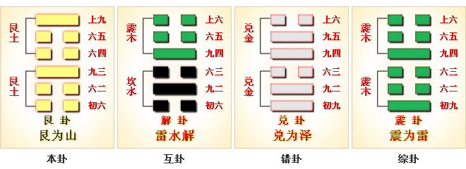

# 艮 ䷳

艮（䷳ gèn）卦的代号是`1:1`。主卦和客卦都是艮卦，卦象是山，阳数是`1`。艮，代表山。两座山不可能合并成一座山，但是，主客双方在一起相处，不能不相互影响，不能不相互往来。主方应当在可能的情况下采取适当主动措施改善双方关系，同时保持强硬态度，耐心地等待客方变化。艮卦谈的乃是如何抑止自己言行的卦。也即是当行则行，当止则止；当说则说，不当说则不说，一切必须审慎抑止为是。除此之外，没有别的。

图中，红色表示当位的爻，天蓝色表示不当位的爻。艮卦的爻没有有应关系。

- 卦序：52

> 艮其背，不獲其身。行其庭，不見其人，无咎。
>《彖》曰：艮，止也，時止則止，時行則行，動靜不失其時，其道光明。艮其止，止其所也。上下敵應，不相與也，是以不獲其身。行其庭不見其人，无咎也。
>《象》曰：兼山，艮，君子以思不出其位。

> 初六，艮其趾，无咎，利永貞。
>《象》曰：艮其趾，未失正也。

> 六二，艮其腓，不拯其隨，其心不快。
>《象》曰：不拯其隨，未退聽也。

> 九三，艮其限，列其夤，厲熏心。
>《象》曰：艮其限，危薰心也。

> 六四，艮其身，无咎。
>《象》曰：艮其身，止諸躬也。

> 六五，艮其輔，言有序，悔亡。
>《象》曰：艮其輔，以中正也。

> 上九，敦艮，吉。
>《象》曰：敦艮之吉，以厚終也。

> 艮（䷳ gèn）卦是同卦，下艮上艮，相叠。艮为山，二山相重，喻静止。它和震卦相反。高潮过后，必然出现低潮，进入事物的相对静止阶段。静止如山，宜止则止，宜行则行。行止即动和静，都不可失机，应恰到好处，动静得宜，适可而止。

>《象传》：两重高山并峙，故宜止不宜进，阻塞之象。

> 凡事不宜妄动，前路受阻，只好待机而动。

- 事业：在经过一段发展后，应进行调整，暂时停止行动，总结经验教训。不可因贪名利而妄进。自我克制，自我约束，谨言慎行，不要盲目追求他人。经过休整后，在适当时机到来时，再大显身手。
- 经商：进入停滞不前的状态，切勿盲目冒进，而宜适时停止，进入安静退守，不要受外界干扰，尤其是应该保持内心和理智上的宁静，更不要轻易与他人合作。等待时机，必有光明前途。
- 求名：应保持纯正的目的，静守正道。勿为功名诱惑，秉守忠厚，可得成功。
- 婚恋：重感情，彼此以诚相待，可白头到老。
- 决策：性格沉静、内向，不喜好活动，也不善于交际，为人忠诚老实，讲信义。注意听取他人的建议，明哲保身。机遇不到，不宜积极活动，该止则止，勿抱不切实际的想法。

艮卦，艮上艮下，为[艮宫本位卦](../jing/gen.md#52)。艮为停止的意思，为钱财散失之象，需谨慎提防。停留阻止，无可再进；随份勿贪，不可强求。得此卦者，前路受阻，不宜妄进，宜守待机。

- 时运：运势平平，不宜妄进。
- 财运：守好本业，不可贪财。
- 家宅：不宜改造；命由前定。
- 身体：带病延年。

> 艮：山。表示停止、退守之意，六冲纯卦，主大好大坏之象。凡事应当知进退、量力而为。有如登山越岭般，需充分审视自己的体能，和山上的情势，绝不可强行逞能，适时的休息，方能平安度过。得此卦时应有大事或障碍、不顺阻挡在前，若能保守、修身养性则安，反则为凶。

> 解释：不动，自己改变。

> 特性：耐性佳，保守经营，努力奋斗，老成持重，有偏财运，精于计划分析，处事有条理，公私分明，择善固执。

> 运势：应当洁身自爱，依赖心不要太重，否则不利。凡事不可轻举妄动，诸事宜守，相辅得吉。儒家有言：『静亦定，动亦定』，此非言死等，宜中正德行，固守贞常之道，凡事有定之理也。

- 家运：不和，家运停滞不发，改正自己以谋求开运之道，内有动荡、困境。
- 疾病：难治，注意肠胃血管硬化及结核病。
- 胎孕：难产之虞。
- 子女：子女多有不和、不相辅之数。
- 周转：难成。
- 买卖：有些小是非，失利之象，但可成。
- 等人：不会来。
- 寻人：西南方，难寻。
- 失物：可以寻回，但要等一段时间。藏在家中、旅馆、寺院、山中某处。
- 外出：慎重为好，宜另择佳日。
- 考试：落榜。
- 诉讼：因小事而化大，宜速求和，忌土姓人。
- 求事：固守本份为宜。
- 改行：不利。
- 开业：开业不宜，须再待时。

### 初六：艮其趾，无咎。利永贞。《象》曰：艮其趾，未失正也。

歇脚养息，不要轻举妄动，自然无灾难，这是长期吉利的贞兆。《象传》：歇脚养息，不要轻举妄动，远离不义，不失正道，自然永远吉利。

平：得此爻者，宜守本份，不要纵欲。做官的保守己职者无失。

- 时运：初交好运，退守无咎。
- 财运：知足常乐，多行善事。
- 家宅：可以长住；百年好合。
- 身体：足疾就医。

初六爻动变得[第22卦：山火贲](e8b4b2bi.md)。

山火贲䷕是异卦，下离上艮，相叠。离为火为明；艮为山为止。文明而有节制。贲卦论述文与质的关系，以质为主，以文调节。贲，文饰、修饰。

### 六二：艮其腓，不拯其随，其心不快。《象》曰：不拯其随，未退听也。

停立不行，但腿部肌肉还是负伤。心里很不愉快。《象传》：腿部肌肉还是负伤，因为其人固执己见，没有退回来，听取别人的意见。

凶：得此爻者，运势受阻，或奔波在外，多劳苦；或有足疾。做官的得不到他人的帮助，不宜上进。

- 时运：运途受阻，缺少援手。
- 财运：止而不售，难免心忧。
- 家宅：不宜迁居；避开此婚。
- 身体：药物难治。

六二爻动变得[第18卦：山风蛊](e89b8agu.md)。

山风蛊䷑是异卦，下巽上艮，相叠。与随卦互为综卦。蛊本意为事，引申为多事、混乱。器皿久不用而生虫称“蛊”，喻天下久安而因循、腐败。必须革新创造，治理整顿，挽救危机，重振事业。

### 九三：艮其限，列其夤，厉薰心。《象》曰：艮其限，危薰心也。

卸掉重担，保护腰部，但是胁间肉却已裂开了，引退不及时，则罹凶险。这是由于为名利所惑，不能迅速引退卸职所招致的灾祸。《象传》：“卸掉重担，保护腰部，胁间肉却已裂开了，引退不及时，则罹凶险”，危险是由为名利迷惑所致。

凶：得此爻者，不顺之时，危难不安。

- 时运：顺时可成，不可勉强。
- 财运：闭关自守，难免穷困。
- 家宅：往来为宜；不拘门户。
- 身体：血脉不通。

九三爻动变得[第23卦：山地剥](e589a5bo.md)。

山地剥䷖是异卦，下坤上艮，相叠。五阴在下，一阳在上，阴盛而阳孤；高山附于地。二者都是剥落象，故为“剥卦”。此卦阴盛阳衰，喻小人得势，君子困顿，事业败坏。

### 六四：艮其身，无咎。《象》曰：艮其身，止诸躬也。

引退保身，没有灾祸。《象传》：引退保身，是说其人注意力全部集中在自身的安危上，所以不会招惹灾难。

平：得此爻者，宜安分守常，不可有非分之想。

- 时运：无得无失，保身无咎。
- 财运：可以保本，另得良机。
- 家宅：平安无事；婚姻平平。
- 身体：带病延年。

六四爻动变得[第56卦：火山旅](e69785lv.md)。

火山旅䷷是异卦，下艮上离，相叠。此卦与丰卦相反，互为“综卦”。山中燃火，烧而不止。火势不停地向前蔓延，如同途中行人，急于赶路。因而称旅卦。

### 六五：艮其辅，言有序，悔亡。《象》曰：艮其辅，以中正也。

闭口少言，讲话有分寸，自然没有悔恨。《象传》：闭口少言，讲话有分寸，没有悔恨，因为六五之爻居上卦中位，像人谨守中正之道。

平：得此爻者，正人君子，人情和合，谋望遂意。做官的会居要职。

- 时运：言谈中正，自然可取。
- 财运：保密为要，商机可成。
- 家宅：位得中正；慎防巧言。
- 身体：口能发声，病即可治。

六五爻动变得[第53卦：风山渐](e6b890jian.md)。

风山渐䷴是异卦，下艮上巽，相叠。艮为山，巽为木。山上有木，逐渐成长，山也随着增高。这是逐渐进步的过程，所以称渐，渐即进，渐渐前进而不急速。

### 上九：敦艮，吉。《象》曰：敦艮之吉，以厚终也。

注意保护自己的脑袋，首级不失，自然吉利。《象传》：爻辞讲以忠厚为归宿之所以吉利，因为上九之爻为一卦之终爻，像人秉守忠厚，必得善终。

吉：得此爻者，多福多利，但易防不吉之事。做官的会升迁，读书人会取得佳绩。

- 时运：好上加好，自然吉祥。
- 财运：上手生意，获利自多。
- 家宅：世代忠厚；婚姻吉祥。
- 身体：体质厚实。

上九爻动变得[第15卦：地山谦](e8b0a6qian.md)。

地山谦䷎是异卦，下艮上坤，相叠。艮为山，坤为地。地面有山，地卑（低）而山高，是为内高外低。比喻功高不自居，名高不自誉，位高不自傲。这就是谦。

# [Gèn ䷳](../en/e889aegen.md)
