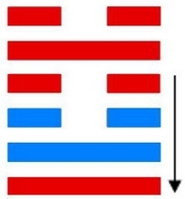
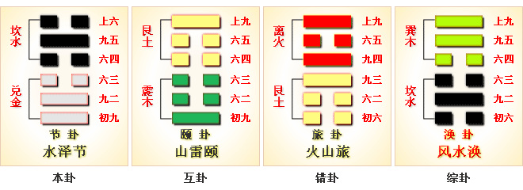
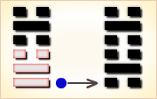
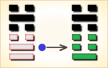
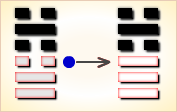
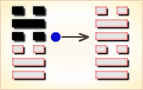
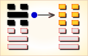
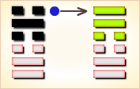

# 节 ䷻

节（䷻ jié）卦的代号是`6:2`。主卦是`6`卦，兑卦，卦象是泽，特性是愉快；客卦是`2`卦，坎卦，卦象是水，特性是危险和困难。“节”指节制。水泽节，万物有节。这个卦是异卦，下兑上坎，相叠。兑为泽，坎为水。泽有水而流有限，多必溢于泽外。因此要有节度，故称节。节卦与涣卦相反，互为综卦，交相使用。天地有节度才能常新，国家有节度才能安稳，个人有节度才能完美。主方在享受成功的愉快，而客方则处于困难之中，主方是应当帮助客方渡过困难时期，还是趁客方困难之机扩张，主方必须慎重考虑，要有适当节制，不然，会有损失。

图中，红色表示当位的爻，天蓝色表示不当位的爻，箭头表示有应。

- 卦序：60

> 節，亨，苦節不可貞。
>《彖》曰：節亨，剛柔分而剛得中。苦節不可貞，其道窮也。說以行險，當位以節，中正以通。天地節而四時成，節以制度，不傷財，不害民。
>《象》曰：澤上有水，節。君子以制數度，議德行。

> 初九，不出戶庭，无咎。
>《象》曰：不出戶庭，知通塞也。

> 九二，不出門庭，凶。
>《象》曰：不出門庭凶，失時極也。

> 六三，不節若，則嗟若，无咎。
>《象》曰：不節之嗟，又誰咎也。

> 六四，安節，亨。
>《象》曰：安節之亨，承上道也。

> 九五，甘節，吉。往有尚。
>《象》曰：甘節之吉，居位中也。

> 上六，苦節，貞凶，悔亡。
>《象》曰：苦節貞凶，其道窮也。

> 节（䷻ jié）卦是异卦，下兑上坎，相叠。兑为泽，坎为水。泽有水而流有限，多必溢于泽外。因此要有节度，故称节。节卦与涣卦相反，互为综卦，交相使用。天地有节度才能常新，国家有节度才能安稳，个人有节度才能完美。

>《象传》：泽为池沼，坎水在上，喻蓄积及约束水份不使流失，但水位过高，则成泛滥。

> 有志不能伸，诸事必须节制，不宜过份，更要戒酒色。

- 事业：正处在发展时期，一定要注意切勿冒进。但更不应放弃良好的机遇，只要坚持遵道守义的原则，可大胆行动。这样，事业可以继续兴旺发达。
- 经商：市场行情好，对自己很有利，应该努力开拓，勿失去机会。不过，头脑一定要冷静，投入应有限度，适可而止，该收则收。
- 求名：严格要求自己，办事知道节度，不走极端，可以通行无阻，顺利前进。
- 婚恋：不要陷入情不自禁的地步，顺其自然会有好结果。
- 决策：抓住机遇，勿失良机。适当节制自己的行动，不可勉强，更不可冒险，恰如其分。一切不可拘泥，该变就变。但是，该节制的时候一定要节制。节制必须有限度，过于节制就成为苦，不会有好的结果，这叫适得其反，务必十分注意。

节卦，坎上兑下，为[坎宫初世卦](jing/kan.md#60)。节说明需节制、节约，停止挥霍，这样才能居家康宁。操守节度，适可而止；审时度势，能知变通。得此卦者，宜安分守己，切忌贪心不足，诸事必须节制，不宜过份，更要戒酒色。

- 时运：品行端正，名利自成。
- 财运：正派经营，富裕可求。
- 家宅：富有之家；婚姻吉祥。
- 身体：节制饮食。

> 节：表示节制之象。主是个状况卦，吉凶未定之象。卦中所现，提醒卜卦之人，事事有过于放纵之象，尤其是在金钱方面，投资理财需节制有守为安。感情则要多留意自己的言行举止，已有过份之态或对对方过于放纵之势。

> 解释：节制，节约。

> 特性：理想高远，但与现实差距大，不过却有恒久的耐力，有志者是竟成。宽以待人，严以律己，社会声誉不错。

> 运势：有志不能伸，诸事必须节制，不宜过份，更要戒酒色。

- 家运：谨守做人处事的规范，则可得平安和乐之家庭。
- 疾病：注意泌尿及消化系病变，宜速就医。
- 胎孕：可求神保产母，否则有厄。
- 子女：儿女多温柔孝顺。但若长辈行为不检反招破，得不偿失也。
- 周转：远水难救近火。无望。
- 买卖：不得时也。
- 等人：不来，或须久等。
- 寻人：人说皆是虚言。有所藏身，不必去寻。想回来自己会回来。
- 失物：不能寻回。
- 外出：大胆外出顺利。
- 考试：须力求上进，不可怠忽。
- 诉讼：局势僵持不下，宜让则讼可解。
- 求事：再待时机，成功率小。
- 改行：不宜。
- 开业：开业宜缓图，计划周详后方可。

### 初九：不出户庭，无咎。《象》曰：不出户庭，知通塞也。

筮遇此爻，杜门不出，没有灾祸。《象传》：杜门不出，因为其人知道所行必不通。

平：得此爻者，进取不利，宜守旧。

- 时运：闭门修行，平安是福。
- 财运：不利行商，可以开店。
- 家宅：可以安居；夫妇得当。
- 身体：安居静养。

 

初九爻动变得[第29卦：坎为水](e59d8ekan_cn.md)。

坎为水䷜是同卦，下坎上坎，相叠。坎为水、为险，两坎相重，险上加险，险阻重重。一阳陷二阴。所幸阴虚阳实，诚信可豁然贯通。虽险难重重，却方能显人性光彩。

### 九二。不出门庭，凶。《象》曰：不出门庭，失时极也。

筮遇此爻，杜门不出，也有凶险。《象传》：杜门不出，也有凶险，因为坐失良机，错误已极。

凶：得此爻者，时运不佳，事多乖离，宜动不宜静。做官的不得时运。

- 时运：因循自误，坐失良机。
- 财运：错过时机，不赚反赔。
- 家宅：屋内无人；旷怨难免。
- 身体：行走艰难。

 

九二爻动变得[第3卦：水雷屯](e5b1afzhun_cn.md)。

水雷屯䷂是异卦，下震上坎，相叠。震为雷，喻动；坎为雨，喻险。雷雨交加，险象丛生，环境恶劣。“屯”原指植物萌生大地，万物始生，充满艰难险阻，然而顺时应运，必欣欣向荣。

### 六三：不节若，则嗟若。无咎。《象》曰：不节之嗟，又谁咎也。

不节俭则困穷，处困穷则知悔过，知悔过则可以无灾难。《象传》：奢侈带来了悔恨，这是谁之过？

平：得此爻者，多辛苦，少收获。

- 时运：得而后失，叹息无奈。
- 财运：不知守财，咎由自取。
- 家宅：先富后贫；先喜后悲。
- 身体：饮食不节致病。

 

六三爻动变得[第5卦：水天需](e99c80xu_cn.md)。

水天需䷄是异卦，下乾上坎，相叠。下卦是乾，刚健之意；上卦是坎，险陷之意。以刚逢险，宜稳健之妥，不可冒失行动，观时待变，所往一定成功。

### 六四。安节，亨。《象》曰：安节之亨，承上道也。

安于节俭遵礼的生活，通泰。《象传》：安于节俭遵礼的生活之所以吉利，是因为顺从了君上的旨意。

吉：得此爻者，秉公守法，安于正道，福利可获。做官的会得到上司的欣赏，升迁有望。

- 时运：平安是福，听命行事。
- 财运：安居外地，一切节俭。
- 家宅：平安无事；夫妻平顺。
- 身体：病由口入。

 

六四爻动变得[第58卦：兑为泽](e58591dui_cn.md)。

兑为泽䷹是同卦，下兑上兑，相叠。泽为水。两泽相连，两水交流，上下相和，团结一致，朋友相助，欢欣喜悦。兑为悦也。同秉刚健之德，外抱柔和之姿，坚行正道，导民向上。

### 九五：甘节，吉，往有尚。《象》曰：甘节之吉，居位中也。

以节俭遵礼为乐，吉利。秉此而行，所往必得别人资助。《象传》：以节俭遵礼为乐之所以吉利，因为九五之爻，所居恰当，像人居德行义，自然获得人家资助。

吉：得此爻者，正当好运，谋望有成。

- 时运：苦尽甘来，功名必显。
- 财运：贩米外地，获利必丰。
- 家宅：正直节俭；百年好合。
- 身体：节食可治。

 

九五爻动变得[第19卦：地泽临](e4b8b4lin_cn.md)。

地泽临䷒是异卦，下兑上坤，相叠。坤为地，兑为泽，地高于泽，泽容于地。喻君主亲临天下，治国安邦，上下融洽。

### 上六。苦节，贞凶。悔亡。《象》曰：苦节贞凶，其道穷也。

以节俭遵礼为苦，卜问得凶兆，其人将为家道败落而悔恨。《象传》：以节俭遵礼为苦，卜问得凶兆，正如上六阴爻孤悬一卦之尽头，像人走入穷困不通的境地。

凶：得此爻者，不得天时，名利皆无。做官的不知变通，前途渺茫。

- 时运：不知变通，贫困一生。
- 财运：失去良机，怨叹无用。
- 家宅：开明为宜；顽固难处。
- 身体：病势垂危。

 

上六爻动变得[第61卦：风泽中孚](e4b8ade5ad9azhongfu_cn.md)。

风泽中孚䷼是异卦，下兑上巽，相叠。孚本义孵，孵卵出壳的日期非常准确，有信的意义。卦形外实内虚，喻心中诚信，所以称中孚卦。这是立身处世的根本。

# [Jié ䷻](e88a82jie.md)
