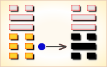

# 萃 ䷬

萃（䷬ cuì）卦的代号是`0:6`，主卦是坤卦，卦象是地，阳数是`0`；客卦是兑卦，卦象是泽，阳数是`6`。这个卦是异卦相叠，下坤上兑。坤为地、为顺；兑为泽、为水。上泽下地，泽地萃。象征荟萃聚集。泽泛滥淹没大地，人众多相互斗争，危机必四伏，务必顺天任贤，未雨绸缪，柔顺而又和悦，彼此相得益彰，安居乐业。萃，聚集、团结。《萃》卦是论述君王与天下贤士及英雄豪杰聚萃于朝廷一堂之卦，此卦中谈了君王们应如何在这些聚萃中发挥作用以及如何应付一些发生的情况。客方强而愉快，主方在客方的带动下，与客方相聚在一起，萃。聚会在一起，主方是被动的，不过主方乃可以从中受益。

图中，红色表示当位的爻，天蓝色表示不当位的爻，箭头表示有应。

- 卦序：45

> 萃，亨，王假有廟。利見大人，亨，利貞，用大牲吉，利有攸往。
>《彖》曰：萃，聚也。順以說，剛中而應，故聚也。王假有廟，致孝享也；利見大人，亨，聚以正也；用大牲，吉，利有攸往，順天命也。觀其所聚，而天地萬物之情可見矣。
>《象》曰：澤上於地，萃，君子以除戎器，戒不虞。

> 初六，有孚不終，乃亂乃萃。若號，一握為笑，勿恤，往无咎。
>《象》曰：乃亂乃萃，其志亂也。

> 六二，引吉，无咎。孚乃利用禴。
>《象》曰：引吉无咎，中未變也。

> 六三，萃如嗟如，无攸利，往无咎，小吝。
>《象》曰：往无咎，上巽也。

> 九四，大吉无咎。
>《象》曰：大吉无咎，位不當也。

> 九五，萃有位，无咎，匪孚。元永貞，悔亡。
>《象》曰：萃有位，志未光也。

> 上六，齎咨涕洟，无咎。
>《象》曰：齎咨涕洟，未安上也。

> 萃（䷬ cuì）卦是异卦，下坤上兑，相叠。坤为地、为顺；兑为泽、为水。泽泛滥淹没大地，人众多相互斗争，危机必四伏，务必顺天任贤，未雨绸缪，柔顺而又和悦，彼此相得益彰，安居乐业。萃，聚集、团结。

>《象传》：泽在地上，水聚于泥土中，滋养草木，生长茂盛。

> 吉运昌盛，又得长辈提携，事业大利，但须防财务纠纷。

- 事业：兴旺发达，团结和睦。正在蒸蒸日上，但水多泛滥，人多竞争必然激烈。盛则必衰，切勿骄傲，谨慎小心为好。但也不得犹豫不决，宜勇往直前，开拓新的业务。务必以高尚的品德服众。
- 经商：真诚合作，团结互助。鼓励是事业兴旺发达的标志。大胆开拓市场，稳妥前进，有备无患，必可取得不断发展。
- 求名：光靠个人努力，建树不会很大，定要取得他人的帮助，加上个人的条件方可达到理想的境界。
- 婚恋：勿急于求成，相亲相爱，美满幸福。
- 决策：善于团结他人共同合作，具有领导才能。但心胸宽阔，眼光务必远大，以诚信、中正为本，不失原则，尤其要严格要求自己，宽容他人，遭到他人反对时，应认真反省自己，得出教训，以这种心境处世为人，终生可平安，事业必通达。

萃卦，兑上坤下，为[兑宫二世卦](../jing/dui.md#45)。此卦指水在地上聚集成泽以滋润万物，造福于民。占得此卦，利于见大人，祭祀用大牲畜则吉利。物产丰富，聚合丰盛；得贵接引，无往不利。得此卦者，运气大好，能得到贵人的帮助，获利丰厚，无往不利。

- 时运：安不忘危，自可无忧。
- 财运：财聚之象，有聚有散。
- 家宅：防水入屋；洁身自爱。
- 身体：胸腹水涨，早些调理。

> 萃：表示精华聚集之意，主吉中带小凶之状况卦。有经过挑选、或是在因缘际会下，而重新再一起共事的意义。

> 解释：人才聚集。

> 特性：富同情心，慈悲心，被动，略消极，乏耐性，博学不专。人缘佳，易有情爱困扰。

> 运势：昌隆，得信于人，承上辈照顾，事业吉昌，但宜小心财务上的纠纷。

- 家运：家庭融洽如意。防财务歧见之意外。
- 疾病：凶象，宜速诊治，防胸腹及咽喉之病变。
- 胎孕：胎安。然产母病多，注意保养身体。
- 子女：手足相敬如宾。
- 周转：可得到上辈支持。
- 买卖：可获利。
- 等人：一定会来，且有佳音相告。
- 寻人：会自己回来，不用担心。
- 失物：多半能失而复得。
- 外出：出行虽可能遇到小麻烦，但不要害怕，应以大局为重，积极行动。
- 考试：常保佳绩。
- 诉讼：宜解不宜结。
- 求事：可顺利，有成就。
- 改行：吉利。
- 开业：开业适时，可按计划进行。

### 初六：有孚不终，乃乱乃萃。若号，一握为笑。勿恤，往无咎《象》曰：乃乱乃萃，其志乱也。

捕获了俘虏，却又逃跑了，引起纷乱和忧虑，大家呼喊着四处追捕。终于追回了，又高兴得嘻嘻哈哈，用不着担忧了。占得此爻，大胆前往，没有灾难。《象传》：混乱啊，憔悴啊，其人神志昏乱。

平：得此爻者，会受到小人的陷害，先凶后吉，宜谨慎从事。做官的会被贬职。

- 时运：一顺一逆，得人援手。
- 财运：聚散不定，可以免咎。
- 家宅：不可久居；始乱终弃。
- 身体：心神混乱，求医可治。

初六爻动变得[第17卦：泽雷随](e99a8fsui.md)。

泽雷随䷐是异卦，下震上兑，相叠。震为雷，为动；兑为悦，动而悦就是“随”。随指相互顺从，己有随物，物能随己，彼此沟通。随必依时顺势，有原则和条件，以坚贞为前提。

### 六二：引吉，无咎。孚乃利用禴。《象》曰：引吉无咎，中未变也。

占得此爻，长时间吉利，没有灾难。占问祭祀，贞兆显示：春祭要用俘虏作人牲才好。《象传》：“长时间吉利，没有灾难”，因为六二阴爻居于下卦中位，象人坚守正道，绝不改变。

吉：得此爻者，正当好运，贵人提举，营谋得利。做官的得人引荐，能升迁。

- 时运：中正之运，得人援引。
- 财运：合作有利，虔心酬神。
- 家宅：祖上积德；婚姻可订。
- 身体：勤练气功。

六二爻动变得[第47卦：泽水困](e59bb0kun.md)。

泽水困䷮是异卦，下坎上兑，相叠。兑为阴为泽喻悦；坎为阳为水喻险。泽水困，陷入困境，才智难以施展，仍坚守正道，自得其乐，必可成事，摆脱困境。

### 六三：萃如，嗟如，无攸利。往无咎，小吝。《象》曰：往无咎，上巽也。

忧愁嗟叹。占得此爻，无所利。出行则无灾难，但有小小的麻烦。《象传》：出行无灾难，因为六三阴爻居于九四阳爻之下，像臣下顺从君上，行为谨慎。

凶：得此爻者，家里不安，六亲有损，老者多凶。做官的在位不得安宁，出外则艰辛。

- 时运：运途平凡，须防小人。
- 财运：转运他处，可以无咎。
- 家宅：迁居为宜；怨偶之叹。
- 身体：胸部不适，注意排泄。

六三爻动变得[第31卦：泽山咸](e592b8xian.md)。

泽山咸䷞是异卦，下艮上兑，相叠。艮为山；泽为水。兑柔在上，艮刚在下，水向下渗，柔上而刚下，交相感应。感则成。

### 九四：大吉，无咎。《象》曰：大吉无咎，位不当也。

大吉大利，没有灾难。《象传》：贞兆本来是大吉大利，但结果仅仅是没有灾难，因为九四阳爻而居阴位，像人才小德薄而居高位，论其官运则谓亨通，论其居官则求无灾祸而已。

平：得此爻者，不从正道者，会有凶祸，惟大德君子，可改过得福。做官的须防他人猜忌，宜弃高就低，急流勇退为吉。

- 时运：虽然大顺，德不称位。
- 财运：大利当前，收敛为善。
- 家宅：兴旺平安；门第有差。
- 身体：外强中干。

九四爻动变得[第8卦：水地比](e6af94bi.md)。

水地比䷇是异卦，下坤上坎，相叠。坤为地，坎为水。水附大地，地纳河海，相互依赖，亲密无间。此卦与师卦完全相反，互为综卦。它阐述的是相亲相辅，宽宏无私，精诚团结的道理。

### 九五：萃有位，无咎。匪孚，元永贞，悔亡。《象》曰：萃有位，志未光也。

瘁心力于其职守，没有灾祸。不轻易责罚别人，卜问长期的吉凶，贞兆显示：没有大的悔恨。《象传》：瘁心力于其职守，结果仅仅是没有灾祸，因为才具驽下，不能有所建树。

平：得此爻者，人情不合，营谋有阻。做官的不得人心，其志未光。

- 时运：有位有权，更应修德。
- 财运：虽有利润，须守其正。
- 家宅：聚族而居；可称贵婿。
- 身体：心神不宁，最好静养。

九五爻动变得[第16卦：雷地豫](e8b1abyu.md)。

雷地豫䷏是异卦，下坤上震，相叠。坤为地，为顺；震为雷，为动。雷依时出，预示大地回春。因顺而动，和乐之源。此卦与谦卦互为综卦，交互作用。

### 上六。赍咨涕洟，无咎。《象》曰：赍咨涕洟，未安上也。

叹息流涕，忧心忡忡，但没有灾难。《象传》：叹息流涕，忧心忡仲，因为上六之爻居于一卦的尽头，孤悬无据，像人虽居高位，但如履薄冰，惊恐度日。

凶：得此爻者，事多烦扰，不能安宁，或上下无情，长幼忧愁，名利成虚。

- 时运：年老运退，待人援手。
- 财运：无利可图，幸有救援。
- 家宅：家室不安；生离死别。
- 身体：悲恸致病，放宽心思。

上六爻动变得[第12卦：天地否](e590a6pi.md)。

天地否䷋是异卦，下坤上乾，相叠。其结构同泰卦相反，系阳气上升，阴气下降，天地不交，万物不通。它们彼此为“综卦”，表明泰极而否，否极泰来，互为因果。

# [Cuì ䷬](e89083cui.md)
