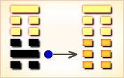

# 蒙 ䷃

蒙（䷃  méng）卦的代号是`2:1`，主卦是**坎**卦，卦象是水，阳数是`2`；客卦是**艮**卦，卦象是山，阳数是 `1`。
主方应当按客方需要作对客方有利的事，在条件可能情况下，作些对自己有益的事。**蒙**卦象征启蒙，亨通。不是我有求于幼童，而是幼童有求于我，第一次向我请教，我有问必答，如果一而再、再而三地没有礼貌地乱问，则不予回答。利于守正道。

> 卦中爻象犯小耗，君子占之运不高，婚姻合伙有琐碎，做事必然受苦劳。

这个卦是异卦（下**坎**上**艮**）相叠。**艮**是山的形象，喻止；**坎**是水的形象，喻险。卦形为山下有险，仍不停止前进，是为蒙昧，故称**蒙**卦。但因把握时机，行动切合时宜，因此，具有启蒙和通达的卦象。

图中，红色表示当位的爻，天蓝色表示不当位的爻，箭头表示有应。

- 卦序：4

> 蒙，亨，匪我求童蒙，童蒙求我。初筮告，再三瀆，瀆則不告，利貞。
>《彖》曰：蒙，山下有險，險而止，蒙。蒙，亨，以亨行，時中也。匪我求童蒙，童蒙求我，志應也。初筮告，以剛中也。再三瀆，瀆則不告，瀆蒙也。蒙以養正，聖功也。
>《象》曰：山下出泉，蒙，君子以果行育德。

> 初六，發蒙，利用刑人。用說桎梏，以往吝。
>《象》曰：利用刑人，以正法也。

> 九二，包蒙吉，納婦吉，子克家。
>《象》曰：子克家，剛柔接也。

> 六三，勿用取女，見金夫，不有躬，无攸利。
>《象》曰：勿用取女，行不順也。

> 六四，困蒙，吝。
>《象》曰：困蒙之吝，獨遠實也。

> 六五，童蒙，吉。
>《象》曰：童蒙之吉，順以巽也。

> 上九，擊蒙。不利為寇，利禦寇。
>《象》曰：利用禦寇，上下順也。

>《象传》：蒙者，昏而无所见也，故宜“启蒙”。

> 初时迷惑不知方向，须忍耐待机而动，凡事多听取别人意见，则运可通。

- 事业：事业开始，混乱无序，危机四伏，以勇敢坚毅的行动可以扭转局面。然而必须接受严格教育，培养这种奋发图强的精神。务必脚踏实地，最忌好高骛远，否则会陷入孤立无援的境地。
- 经商：务必小心谨慎，不得急功近利，尤其应树立高尚的商业道德，以良好的信誉提高竞争力而取胜。
- 求名：必须接受良好的基础教育，陶冶情操。且动机纯正，可以达到目的。
- 婚恋：注意考察对方品德，不可以金钱为诱铒。夫妻需相互宽容、理解。
- 决策：有时会陷入迷惘困顿的境地，加上胆小、不果断，往往误事。如能接受长辈的教诲，甚至严酷的考验，抛弃疑惧的心理，等待适当时机，必然一帆风顺。

蒙卦，艮上坎下，为[离宫四世卦](../jing/li.md#4)。蒙即蒙昧，主回还往复，疑惑不前，多忧愁过失，乃是凶卦。智慧未开，蒙昧闭塞；犹豫不决，缺乏果断。得此卦者，智慧犹如童蒙，不辨是非，迷失方向；若能顺贤师良友之教，启其聪明则亨通。

- 时运：蓄积德行，出而用世。
- 财运：矿山生意，果决则吉。
- 家宅：君子居吉；婚姻之始。
- 身体：驱去邪热，可保平安。

> 蒙：表示被蒙蔽不明之意。主小凶象。事情迷蒙不明，不宜轻信于人，此卦易犯小人，需诚心求教于有智慧经验的友人长者，受其启蒙开智慧，方能转危而安。若是一意而行必现大凶象。

> 解释：被蒙蔽、被欺瞒。

> 特性：喜欢追求新的知识，过平稳生活，做事谨慎，对下属要求较严，领导统御能力略差。宜防受朋友之拖累蒙蔽。

> 运势：气运不发，多迷惑。初时不顺，须忍耐待机，渐可佳。切勿贸然行事或为人认保、作保，否则必有损失。凡事宜从上辈教诲，则运可通也。

- 家运：初时辛苦，上下无法沟通，只要以诚相待，必有开运之时。
- 疾病：病情不明，反覆难治。为肠胃、腹水之疾及传染病。
- 胎孕：胎孕无碍。
- 子女：应注重子女教养，将来方得幸福之象。
- 周转：困难，防止上当受骗。
- 买卖：不利，有损失。
- 等人：可能走错路，会迟到。
- 寻人：受诱惑而出走，因本身蒙昧无知而受骗。在东北或北方，日前难寻。
- 失物：遍寻不获。似乎在大门下陷之处遗失，忘记带走，可试问人。
- 外出：等候有利时机再行动，等待期间应积极做准备。
- 考试：不理想。
- 诉讼：因外人引起事端，目下未明，有理讲不清。
- 求事：未能如愿，再等时机。
- 改行：改行不宜
- 开业：开业者不宜。再等一段时间，筹备好资金再做打算。

### 初六：发蒙，利用刑人，用说桎梏。以往，吝。《象》曰：利用刑人，以正法也。

启蒙教育，教育学生开发生产，教师用受刑之人作榜样，给犯人脱去手铐脚镣。往前走有困难。《象传》：以刑罚惩治罪人是有利的，可以以此来整肃法纪。

凶：得此爻者，多有官诉，亲朋不和，多争斗，终能脱解。做官的为教育之职，或为司法系统之职。

- 时运：求荣反辱，收敛自己。
- 财运：避免兴讼，得理即止。
- 家宅：谨慎持家；可能罢婚。
- 身体：恐有外伤。

初六爻动变得[第41卦：山泽损](e68d9fsun.md)。

山泽损䷨是异卦，下兑上艮，相叠。艮为山；兑为泽。上山下泽，大泽浸蚀山根。损益相间，损中有益，益中有损。二者之间，不可不慎重对待。损下益上，治理国家，过度会损伤国基。应损则损，但必量力、适度。少损而益最佳。

### 九二：包蒙吉。纳妇吉。子克家。《象》曰：子克家，刚柔接也。

教育包容，这是吉兆。筮遇此爻，娶迎妻子，吉利。男女能相配成家。《象传》：男女相配成家，因为九二、六三两爻相近，表示阴阳刚柔相交会。

吉：得此爻者，人情和合，百事有成，或结婚，或生子孙，有财有福。做官的会守住官职。

- 时运：有财有福，子可继业。
- 财运：广纳财物，售至外地。
- 家宅：妻贤子孝，可振家业。
- 身体：柔软体操。

九二爻动变得[第23卦：山地剥](e589a5bo.md)。

山地剥䷖是异卦，下坤上艮，相叠。五阴在下，一阳在上，阴盛而阳孤；高山附于地。二者都是剥落象，故为“剥卦”。此卦阴盛阳衰，喻小人得势，君子困顿，事业败坏。

### 六三：勿用娶女，见金夫，不有躬。无攸利。《象》曰：勿用娶女，行不顺也。

不要抢劫女子为婚，会遭到武装者的抵抗，丢掉性命，没有什么好处。《象传》：不能聘娶女子，六三之爻居于九二之上，这是以柔乘刚之象，象征着以女虐男，这是悖逆不顺的。

凶：得此爻者，会生是非，小则破财，大则伤身。做官的会因为贪婪而自取其辱。

- 时运：见财忘义，声名破败。
- 财运：小则破财，大则伤身。
- 家宅：妻强夫弱，恐有不安；不宜婚嫁。
- 身体：小心饮食。

六三爻动变得[第18卦：山风蛊](e89b8agu.md)。

山风蛊䷑是异卦，下巽上艮，相叠。与随卦互为综卦。蛊本意为事，引申为多事、混乱。器皿久不用而生虫称“蛊”，喻天下久安而因循、腐败。必须革新创造，治理整顿，挽救危机，重振事业。

### 六四。困蒙，吝。《象》曰：困蒙之吝，独远实也。

教育脱困，太可惜。《象传》：为蒙昧无知所困扰，因为离群索居，远离生活。

凶：得此爻者，人情淡薄，经营受阻。静无灾，动有损。做官的因为无人赏识而难以晋升。

- 时运：远水近火，无济于事。
- 财运：缺乏资本，难免穷困。
- 家宅：地处偏僻，生活困苦。
- 身体：体质虚弱，阴寒之症。

六四爻动变得[第64卦：火水未济](e69caae6b58eweiji.md)。

火水未济䷿是异卦，下坎上离，相叠。离为火，坎为水。火上水下，火势压倒水势，救火大功未成，故称未济。《周易》以乾坤二卦为始，以既济、未济二卦为终，充分反映了变化发展的思想。

### 六五：童蒙，吉。《象》曰：童蒙之吉，顺以巽也。

教育少年儿童，吉利。《象传》：幼稚蒙昧的人之所以吉利，是因为柔顺服从。

吉：得此爻者，依附贵人、良师者百事顺遂，谋望可成。

- 时运：功名未成，得良师则吉。
- 财运：无法独立，须靠人经营。
- 家宅：幼年定亲。
- 身体：听人指导锻炼。

六五爻动变得[第59卦：风水涣](e6b6a3huan.md)。

风水涣䷺是异卦，下坎上巽，相叠。风在水上行，推波助澜，四方流溢。涣，水流流散之意。象征组织和人心涣散，必须用积极的手段和方法克服，战胜弊端，挽救涣散，转危为安。

### 上九：击蒙。不利为寇，利御寇。《象》曰：利用御寇，上下顺也。

教育击打，不应当作匪寇，而要抵御匪寇。《象传》：有利于防御盗寇，因为上九阳爻居于一卦之首，说明臣下顺从拥戴。防御盗寇之举，获得众人支持，必能胜利。

平：得此爻者，宜守旧，须谨防争讼，寇盗之扰。做官的会有司寇之名职。

- 时运：宜守不宜攻，与人和睦。
- 财运：顺取为宜，买卖相洽。
- 家宅：妇道贵顺，家道和平。
- 身体：保养为宜。

上九爻动变得[第7卦：地水师](e5b888shi.md)。

地水师䷆是异卦，下坎上坤，相叠。“师”指军队。坎为水、为险；坤为地、为顺，喻寓兵于农。兵凶战危，用兵乃圣人不得已而为之。但它可以顺利无阻碍地解决矛盾，因为顺乎形势，师出有名，故能化凶为吉。

# [Méng ䷃](../en/e89299meng.md)
