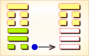

# 蛊 ䷑

蛊（䷑ gǔ）卦的代号是`3:1`。主卦是巽卦，卦象是风，阳数是`3`；客卦是艮卦，卦象是山，阳数是`1`。“蛊”的意思是祸乱。蛊卦，表示积弊已久，整弊治乱。蛊卦下卦为风，上卦为艮，两卦结合风行山止。打旋而邪，盛极而衰，凡事必须防患于未然，才有利于涉大江大川，用甲前三日和用甲后三日比喻天时之运转，时事之变化，最后天下大治，长久而治安。

图中红色表示当位的爻，天蓝色表示不当位的爻，箭头表示有应。

- 卦序：18

> 蠱，元亨，利涉大川，先甲三日，後甲三日。
>《彖》曰：蠱，剛上而柔下，巽而止，蠱。蠱元亨，而天下治也；利涉大川，往有事也；先甲三日，後甲三日，終則有始，天行也。
>《象》曰：山下有風，蠱。君子以振民育德。

> 初六，幹父之蠱，有子，考无咎。厲終吉。
>《象》曰：幹父之蠱，意承考也。

> 九二，幹母之蠱，不可貞。
>《象》曰：幹母之蠱，得中道也。

> 九三，幹父之蠱，小有悔，无大咎。
>《象》曰：幹父之蠱，終无咎也。

> 六四，裕父之蠱，往見吝。
>《象》曰：裕父之蠱，往未得也。

> 六五，幹父之蠱，用譽。
>《象》曰：幹父用譽，承以德也。

> 上九，不事王侯，高尚其事。
>《象》曰：不事王侯，志可則也。

> 蛊（䷑ gǔ）卦是异卦(下巽上艮)相叠，与随卦互为综卦。蛊本意为事，引申为多事、混乱。器皿久不用而生虫称“蛊”，喻天下久安而因循、腐败，必须革新创造，治理整顿，挽救危机，重振事业。

>《象传》：风入山下，闭而不出，即物腐生虫，意气不通，因循败事。

> 诸事不如意，艰难迷惑，宜大胆革新，否则引来内忧外患。

- 事业：运气处于不佳状态，或因外界条件，或因个人因素所致。唯有谨慎分析原因，找出弊端，坚决，大胆，不惜冒险，战胜阻力。这时一要头脑冷静，二要向高明的人请教，必能创造业绩。
- 经商：诸多不利困扰着自己，不宜继续走老路。应全面分析市场动向，当机立断，另外找寻出路。
求名：会遇到许多困难和不利，应看作是对自己的考验，要以百倍的勇气，继续奋斗。同时，虚心寻找自己的不足，加以补救。
- 婚恋：不顺利。双方如情投意合，则应全力以赴促成此事，夫妇应共同努力维系家庭。
- 决策：生不逢时，家道或事业有中落现象，个人陷入多事之秋。唯有正视现实，勤奋勉励，不屈不挠，有所作为，甚至不惜冒险，挽救败落状况。必要时还需耐心等待时机。

蛊卦，艮上巽下，为[巽宫归魂卦](../jing/xun.md#18)。蛊是指皿中食物因腐败而生虫，筮遇此卦，半凶半吉。三蛊在器，事物败坏；辛勤丁宁，转危为安。得此卦者，艰难迷惑之时，事事不如意；宜大胆革新，奋发图强，艰苦努力，可转危为安。

- 时运：力图振作，可改旧观。
- 财运：不宜堆积，应即贩卖。
- 家宅：整顿家风，恐有私情，生育不顺。
- 身体：蛊毒之症，小心咒诅。

> 蛊：表示受到蛊惑、毒害。主大凶象。蛊毒是因内在腐朽而生虫化毒，显示问题的根因存在已久，却未诚实面对处理而导致愈来愈严重。易做出错误的决策，慨大都被人所迷惑、而一时心神错乱引致祸事。

> 解释：中蛊毒，无可救药。

> 特性：内心犹豫，猜疑心重，
多事之秋，宜大胆革新。

> 运势：诸事不如意、积弊已深，未能进展，气运杂乱。逢此宜鼓起勇气，大胆加以革新，有内忧外患之象。

- 家运：家庭易生烦心之事，不彻底改革有破家、损财之象。
- 疾病：宜把握治疗时机，冬季占得险象，为内脏恶性疾病。
- 胎孕：胎有惊。
- 子女：双亲不堪其忧之苦象耳。
- 周转：信用不好，周转无望。
- 买卖：交易不成，另谋生计为要。
- 等人：中途有变，不会来。
- 寻人：因家庭感情失和而出走，或与人私奔，于东南或东北。
- 失物：找不回来，遗失似是木制工艺品，在门口或旅馆遗失，或者是寄失了。
- 外出：宜推迟或提前。否则会出现危险，务必小心谨慎。
- 考试：落榜。
- 诉讼：慎防桃色纠纷，会拖一段时间，不易解决。
- 求事：不利。
- 改行：弃旧迎新，或革新内部人事。
- 开业：开业者不宜，有损财或官符之灾。

### 初六：干父之蛊，有子，考无咎。厉，终吉。《象》曰：干父之蛊，意承考也。

继承父业，有一个孝顺的儿子，固然没有灾害，即使遇到危险，最后乃吉利。《象传》：继承父业，意思是继承其父遗志。

吉：得此爻者，会得到祖先的庇佑，营谋遂意。做官的会受到重任，改革创新。

- 时运：克勤克俭，前途光明。
- 财运：重整旧业，可以得利。
- 家宅：改造旧宅;婚嫁可喜。
- 身体：初无大碍，无子不利。

初六爻动变得[第26卦：山天大畜](e5a4a7e89384daxu.md)。

山天大畜䷙是异卦，下乾上艮，相叠。乾为天，刚健;艮为山，笃实。畜者积聚，大畜意为大积蓄。为此不畏严重的艰难险阻，努力修身养性以丰富德业。

### 九二：干母之蛊，不可贞。《象》曰：干母之蛊，得中道也。

继承母业，则吉凶不可卜问。《象传》：继承母业，九二处下卦中位，爻象显示其人得中正之道。

平：得此爻者，改旧从新，则会如意。女命勤俭持家，性忠直者多福。

- 时运：顺势而行，不可草率。
- 财运：旧债积弊，缓和处理。
- 家宅：母系擅权，忍耐协调;可得佳妇。
- 身体：大人寒症，小孩补气。

九二爻动变得[第52卦：艮为山](e889aegen.md)。

艮为山䷳是同卦，下艮上艮，相叠。艮为山，二山相重，喻静止。它和震卦相反。高潮过后，必然出现低潮，进入事物的相对静止阶段。静止如山，宜止则止，宜行则行。行止即动和静，都不可失机，应恰到好处，动静得宜，适可而止。
　　
### 九三：干父之蛊，小有悔，无大咎。《象》曰：干父之蛊，终无咎也。

继承父业，即使稍有过错，也不会出大问题。《象传》：继承父业，最终不会遭逢灾难。

凶：得此爻者，躁进者有失，不听信谗言者则无难。

- 时运：痛改前非，仍有未来。
- 财运：重立旧业，小损大利。
- 家宅：改造住宅。
- 身体：应可痊愈。

九三爻动变得[第4卦：山水蒙](e89299meng.md)。

山水蒙䷃是异卦，下坎上艮，相叠。艮是山的形象，喻止；坎是水的形象，喻险。卦形为山下有险，仍不停止前进，是为蒙昧，故称蒙卦。但因把握时机，行动切合时宜，因此，具有启蒙和通达的卦象。

### 六四：裕父之蛊，往见吝。《象》曰：裕父之蛊，往未得也。

光大父业，施行起来困难重重。《象传》：光大父业（困难重重），施行之中未尽得当。

凶：得此爻者，事事见忧，有足疾。

- 时运：不可因循，否则自误。
- 财运：未能除弊，难以获利。
- 家宅：父业难保。
- 身体：急救内患，以免不治。

六四爻动变得[第50卦：火风鼎](e9bc8eding.md)。

火风鼎䷱是异卦，下巽上离，相叠。燃木煮食，化生为熟，除旧布新的意思。鼎为重宝大器，三足稳重之象。煮食，喻食物充足，不再有困难和困扰。在此基础上宜变革，发展事业。

### 六五：干父之蛊，用誉。《象》曰：干父之蛊，承以德也。

继承父业，博得了赞誉。《象传》：继承父业而博得了赞誉，因为继承了其父的美好品德。

吉：得此爻者，多喜庆之事，家中或进人口。做官的进取有望，名誉远播。

- 时运：自行振作，仍可扬名。
- 财运：改善旧业，仍然有利。
- 家宅：努力兴家，嫁娶高亲。
- 身体：应觅名医。

六五爻动变得[第57卦：巽为风](e5b7bdxun.md)。

巽为风䷸是同卦，下巽上巽，相叠。巽为风，两风相重，长风不绝，无孔不入，巽义为顺。谦逊的态度和行为可无往不利。
　
### 上九：不事王侯，高尚其事。《象》曰：不事王侯，志可则也。

不服务于王侯，因为其人看重自身价值。《象传》：不服务于王侯，这种志趣可以效法。

平：得此爻者，宜守旧，好运者，多遇尊贵，能获得提拔。做官的宜退守，或告休。

- 时运：以退为进，较为有利。
- 财运：不必急售，获利可期。
- 家宅：住在高处;良缘天成。
- 身体：大限将至，安其天年。

上九爻动变得[第46卦：地风升](e58d87sheng.md)。

地风升䷭是异卦，下巽上坤，相叠。坤为地、为顺；巽为木、为逊。大地生长树木，逐的成长，日渐高大成材。喻事业步步高升，前程远大，故名“升”。

# [Gǔ ䷑](e89b8agu.md)
