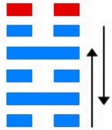
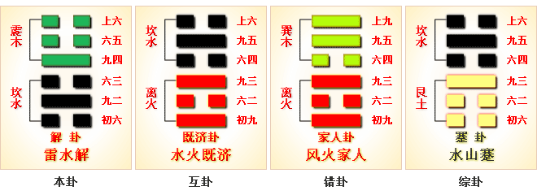
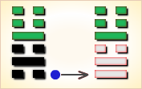
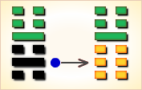
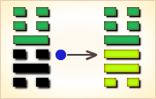
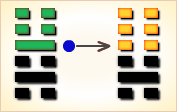
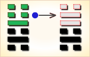

# 解 ䷧

解（䷧ xiè）卦的代号是`2:4`。主卦是`2`卦，**坎**卦；客卦是`4`卦，**震**卦。**解**卦，雷水解，柔道致治。**解**卦，阐释解除困难的法则。发生困难，就应当设法解除。原则上，应当采用柔和平易的方法，才能得到群众的支持；而且应当快速，立即恢复平静，以免扰民。当困难开始之初，就应当刚柔相济，顺应情势，立即解除。应当坚持中庸正直的原则；任用得当，名实相符，不可敷衍了事，徒然增加困难。而且除恶务尽，不惜断然采取严厉的手段。小人势消，然君子势长，才能得到正义力量的信任与支持，使困难消除于无形。

> 目下月令如过关，千辛万苦受熬煎，时来恰相有人救，任意所为不相干。

这个卦是异卦（下**坎**上**震**）相叠。**震**为雷、为动；**坎**为水、为险。险在内，动在外。严冬天地闭塞，静极而动。万象更新，冬去春来，一切消除，是为解。

图中，红色表示当位的爻，天蓝色表示不当位的爻，箭头表示有应。

- 卦序：40

> 解，利西南，无所往，其來復吉。有攸往，夙吉。
>《彖》曰：解，險以動，動而免乎險，解。解，利西南，往得眾也；其來復吉，乃得中也；有攸往夙吉，往有功也。天地解而雷雨作，雷雨作而百果草木皆甲坼，解之時大矣哉。
>《象》曰：雷雨作，解。君子以赦過宥罪。

> 初六，无咎。
>《象》曰：剛柔之際，義无咎也。

> 九二，田獲三狐，得黃矢，貞吉。
>《象》曰：九二貞吉，得中道也。

> 六三，負且乘，致寇至，貞吝。
>《象》曰：負且乘，亦可醜也，自我致戎，又誰咎也。
>《繫辭》：子曰：作易者，其知盜乎！易曰：「負且乘，致寇至。」負也者，小人之事也。乘也者，君子之器也。小人而乘君子之器，盜思奪之矣。上慢下暴，盜思伐之矣。慢藏誨盜，冶容誨淫。易曰「負且乘，致寇至」，盜之招也。

> 九四，解而拇，朋至斯孚。
>《象》曰：解而拇，未當位也。

> 六五，君子維有解，吉，有孚于小人。
>《象》曰：君子有解，小人退也。

> 上六，公用射隼于高墉之上，獲之，无不利。
>《象》曰：公用射隼，以解悖也。
>《繫辭》：易曰：「公用射隼于高墉之上，獲之，无不利。」子曰：隼者禽也，弓矢者器也，射之者人也，君子藏器於身，待時而動，何不利之有。動而不括，是以出而有獲，語成器而動者也。

>《象传》：春雷大作，大地解冻，喻冬去春来生机再现。

> 宜把握良机，快速处理身边困境，更宜出外求谋，因贵人在远方，以西南为吉方。

- 事业：元气初复，宜休养生息，安静平易为佳，宜宽宜和。当准备就绪则应立即行动，争取主动，不可拖廷，所往必有功利，但切勿贪得无厌。克勤克俭，刚柔相济，以柔为主。远避小人，团结君子，相互依托，共成事业。
- 经商：行动贵神速，积极而为，方可摆脱险境。行商宜循正道，切勿招摇过市，此乃愚蠢行动，必自招灾祸。
- 求名：初出茅庐，应继续充实自己。待机行动。尤应远小人，近君子和有才德的人，以期迅速提高自己。
- 婚恋：应适时进行。夫妻和衷共济，可家庭和睦，免除灾难。
- 决策：稳妥为宜，亦不应冒险，因一切尚在元气初复阶段。为争取大发展，务必宽以待人，以柔致治，广交贤者，遣散小人，以中庸、正直的方式，张驰结合的手段，开拓方兴未艾的事业。

**解**卦，震上坎下，为[震宫二世卦](../jing/zhen.md#40)。震为动，坎为险，遇险而动，为即将脱险走出困境之兆，因此多主吉。艰难化散，排难解纷；把握时机，趁早进行。得此卦者，能解脱先前之困难，宜把握良机，求谋事业，出外谋事者更佳。

- 时运：灾难已解，声名大起。
- 财运：天时地利，人和为贵。
- 家宅：祈祷解厄；婚姻吉祥。
- 身体：药到病除。

> 解：表示解决之象，先苦后甜之象，冬雪春化之意。冰冻三尺非一日之寒，事出有因、但已是到该解决的尽头了！只是化解之日还很长，要抓住重点方向，好好努力坚持下去，还是有可能再成功的。

> 解释：解冻。

> 特性：耐性差，爱变化，喜热闹场合，多学不精，思想兴趣不稳定，易受外界影响。一生多为他人排解事务，自己却少有他人之助。

> 运势：顺势而行，速把握良机、坚持努力，快速处理可成。贵人在远方，有助，宜出外营谋。大运在西南。

- 家运：初有困难，但难关已过。开花结实之兆。
- 疾病：久病可治愈，注意肝、肾、足疾。
- 胎孕：孕安。
- 子女：初时因子女牵累而劳苦，但其子女越长运越好，故苦后得甘，已可得到幸福。
- 周转：速进行可成，延迟不利。
- 买卖：即速交易，可名利双收。
- 等人：一定来。
- 寻人：北方寻之可见。
- 失物：遗失之物似有被支解破坏的可能，故寻回的机会不大。
- 外出：一旦准备充分，立即行动，捷足先登必有所获。
- 考试：题榜在望。
- 诉讼：一般纠纷皆可解决，宜当机立断，不可拖延。
- 求事：有贵人相助。
- 改行：速改有利。
- 开业：开业者有很大的展望。

### 初六：无咎。《象》曰：刚柔之际，义无咎也。

筮遇此爻，没有灾难。《象传》：初六与九二相接，为刚柔相应之象，喻君臣、夫妻和衷共济，其义自无灾难。

平：得此爻者，经营者吉，未婚者配。做官的德位相称，晋升有望，读书人会取得好成绩。

- 时运：困难初解，不可妄动。
- 财运：没有损失，即是幸事。
- 家宅：平安度日。
- 身体：一切无恙。

初六爻动变得[第54卦：雷泽归妹](e5bd92e5a6b9guimei.md)。

雷泽归妹䷵是异卦，下兑上震，相叠。震为动、为长男；兑为悦、为少女。以少女从长男，产生爱慕之情，有婚姻之动，有嫁女之象，故称归妹。

### 九二：田获三狐，得黄矢，贞吉。《象》曰：九二贞吉，得中道也。

畋猎获得三只狐狸，猎物身上带着铜箭头。卜问得吉兆。《象传》：九二爻辞讲的卜问得吉兆，因为九二之爻居下卦中位，像其人行事遵循正道。

吉：得此爻者，正当好运，财利可获。做官的会荣华富贵，读书人会取得佳绩。

- 时运：避邪归正，功名有望。
- 财运：努力经营，可得厚利。
- 家宅：防范作祟；得到正室。
- 身体：防有邪念邪病。

九二爻动变得[第16卦：雷地豫](e8b1abyu.md)。

雷地豫䷏是异卦，下坤上震，相叠。坤为地，为顺；震为雷，为动。雷依时出，预示大地回春。因顺而动，和乐之源。此卦与谦卦互为综卦，交互作用。

### 六三：负且乘，致寇至，贞吝。《象》曰：负且乘，亦可丑也；自我致戎，又谁咎也。

带着许多财物，又是背负，又是车拉，招摇惹盗，自然招致盗寇抢劫，卜问有灾祸之象。《象传》：带着许多财物，又是背负，又是车拉，招摇惹盗，这是愚蠢可耻之事，由于自己慢藏诲盗，招致盗寇，又能谴责谁呢？

凶：得此爻者，须防窃盗，是非诉讼。做官的谨防被贬之忧。

- 时运：素行不端，自取其辱。
- 财运：小心防盗，以免损失。
- 家宅：盗窃难防；富而不仁。
- 身体：乱服成药，自找麻烦。

### 六三变卦：雷水解 变卦 雷风恒

六三爻动变得[第32卦：雷风恒](e68192heng.md)。

雷风恒䷟是异卦，下巽上震，相叠。震为男、为雷；巽为女、为风。震刚在上，巽柔在下。刚上柔下，造化有常，相互助长。阴阳相应，常情，故称为恒。

### 九四：解而拇，朋至斯孚。《象》曰：解而拇，未当位也。

赚了钱，而懒怠不想走，结果被人虏去。《象传》：懒怠不想动，说明其人怠于职守，不称其位。

凶：得此爻者，须防小人，或有交友不慎之祸。

- 时运：因人成事，才有机会。
- 财运：获利不多，朋友交心。
- 家宅：不易安居；有力媒人。
- 身体：慢跑健身。

九四爻动变得[第7卦：地水师](e5b888shi.md)。

地水师䷆是异卦，下坎上坤，相叠。“师”指军队。坎为水、为险；坤为地、为顺，喻寓兵于农。兵凶战危，用兵乃圣人不得已而为之，但它可以顺利无阻碍地解决矛盾，因为顺乎形势，师出有名，故能化凶为吉。

### 六五：君子维有解，吉，有孚于小人。《象》曰：君子有解，小人退也。

君子被拘囚后又获释，吉利；小人则将受罚。《象传》：君子解除了小人的职务，说明小人被摒退。

吉：得此爻者，正当好运，君子有利，病者愈。做官的会身居要职。

- 时运：正运亨通，君子有利。
- 财运：自然作去，就有利润。
- 家宅：福宅可居；婚姻吉祥。
- 身体：恢复正气。

六五爻动变得[第47卦：泽水困](e59bb0kun.md)。

泽水困䷮是异卦，下坎上兑，相叠。兑为阴为泽喻悦；坎为阳为水喻险。泽水困，陷入困境，才智难以施展，仍坚守正道，自得其乐，必可成事，摆脱困境。

### 上六：公用射隼，于高墉之上，获之无不利。《象》曰：公用射隼，以解悖也。

在高高的城墙上，王公射中一只鹰，并且抓到了，这没有什么不吉利的。《象传》：王公射鹰，意在除强去暴。

吉：得此爻者，运途顺利，多营谋获利。做官的闲职者会复职，居要位。

- 时运：运途顺利，须防小寇。
- 财运：谨慎防范，有利无损。
- 家宅：防备窃盗。
- 身体：户外运动。

上六爻动变得[第64卦：火水未济](e69caae6b58eweiji.md)。

火水未济䷿是异卦，下坎上离，相叠。离为火，坎为水。火上水下，火势压倒水势，救火大功未成，故称未济。《周易》以乾坤二卦为始，以既济、未济二卦为终，充分反映了变化发展的思想。

# [Xiè ䷧](../en/e8a7a3xie.md)
