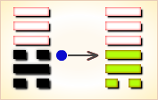
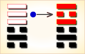

# 讼 ䷅

讼（䷅ sòng）卦的代号是`2:7`。主卦是`2`卦，坎卦，卦象是水，阳数是`2`，特性是危险和困难；客卦是`7`卦，乾卦，卦象是天，阳数是`7`，特性是强健。“讼”，上卦为乾，下卦为坎。在法庭上争辨是非曲直，打官司：讼事。处境困难的主方在威力强大的客方面前，受到客方的强力限制和压迫，不得已时只好求之于诉讼，寻求法律保护。讼卦，天水讼，慎争戒讼。这个卦是异卦，下坎上乾，相叠。讼卦䷅和需卦䷄卦爻排布相反，互为“综卦”。乾为刚健，坎为险陷。刚与险，健与险，彼此反对，定生争讼。争讼非善事，务必慎重戒惧。

图中，红色是当位的爻，天蓝色是不当位的爻，箭头表示有应。

- 卦序：6

> 訟，有孚窒惕，中吉，終凶。利見大人，不利涉大川。
>《彖》曰：訟，上剛下險，險而健，訟。訟有孚窒惕中吉，剛來而得中也。終凶，訟不可成也。利見大人，尚中正也。不利涉大川，入于淵也。
>《象》曰：天與水違行，訟。君子以作事謀始。

> 初六，不永所事，小有言，終吉。
>《象》曰：不永所事，訟不可長也。雖小有言，其辯明也。

> 九二，不克訟，歸而逋其邑，人三百戶，无眚。
>《象》曰：不克訟，歸逋，竄也。自下訟上，患至掇也。

> 六三，食舊德，貞厲，終吉。或從王事，无成。
>《象》曰：食舊德，從上吉也。

> 九四，不克訟，復即命渝，安貞吉。
>《象》曰：復即命渝，安貞不失也。

> 九五，訟，元吉。
>《象》曰：訟元吉，以中正也。

> 上九，或錫之鞶帶，終朝三褫之。
>《象》曰：以訟受服，亦不足敬也。

> 讼（䷅ sòng）卦是异卦，下坎上乾，相叠。 讼卦䷅同䷄需卦相反，互为“综卦”。乾为刚健，坎为险陷。刚与险，健与险，彼此反对，定生争讼。争讼非善事，务必慎重戒惧。

>《象传》：乾天升于上，坎水降于下，相背而行而起讼。

> 事与愿违，凡事不顺，小人加害，宜防陷阱。

- 事业：起初顺利，有利可图，继而受挫，务必警惕，慎之又慎，不得固执已见，极力避免介入诉讼纠纷的争执之中。与其这样，不如退而让人，求得化解，安于正理，可免除意外之灾。陷入争讼，即使获胜，最后还得失去，得不偿失。
- 经商：和气生财，吃亏是福，切勿追求不义之财。商业谈判应坚持公正、公平、互利的原则，尽量避免发生冲突。这样便会有好结果。
- 求名：不利。自己尚缺乏竞争实力，应坚守纯正，隐忍自励，自强自勉，切莫逞强。依靠有地位的人的帮助，及早渡过难关。
- 婚恋：虽不尽人意，倒也般配，彼此理解，未尝不可。双方应以温和的方式处理生活。
- 决策：争强好胜，不安于现状，为改变命运和超越他人而奋斗。头脑聪颖，反应敏捷，有贵人相助。但缺乏持之以恒的毅力，容易露出锋芒，得罪他人，带来诉讼之灾。宜承认现实，顺其自然，知足，适可而止。接受教训，引以为戒，可功成名就。

讼卦，乾上坎下，为[离宫游魂卦](jing/li.md#6)。上乾为刚，下坎为险，一方刚强，一方阴险，必然产生争论，因此多有不吉。天高水深，达远不亲；慎谋退守，敬畏无凶。得此卦者，身心不安，事多不顺，与他人多争诉之事，宜修身养性，谨慎处事。

- 时运：功名受阻，不宜树敌。
- 财运：开始谨慎，终可获利。
- 家宅：君子必求淑女。
- 身体：预防胜于治疗。

> 讼：表示诉讼、争端之象。主大凶象。事情冲突到必须见官上法院，可能必须以法律途径来解决了。凡事皆不利，而且已引起很大口舌是非争持，而必须摊牌互相攻击的程度了。

> 解释：官司缠讼。

> 特性：不服输，好竞争辩论，反应快，口才佳，易得罪他人，是自立自强之人。

> 运势：百事闭塞不通，伤害频繁，受中伤而又易陷于奸计，不如意之运也。得饶人处且饶人，得过且过，莫再争讼，否则皆不利也。

- 家运：家庭内部不和，有口舌争端之害，并有散离之象。
- 疾病：病情严重，为腰、血液、泌尿系统、头部疾患。
- 胎孕：生产无惊阻，安也。
- 子女：父子之间存有歧见，无法沟通之象。子女生来劳碌，与父母缘薄，多辛劳忧苦也。
- 周转：不得要领，难成。
- 买卖：因处理不当，有冲突争端，常招损失，不利也。
- 等人：不会来。就算会来，双方必有争执事情发生。
- 寻人：此人因争执事由负气出走，并有生命危险，又寻找不易，尽量往西北与北方寻找。
- 失物：不会出现。
- 外出：途中多有变故，宜改日出行。
- 考试：不理想。
- 诉讼：两败俱伤，宜找中间人调解，久争无益。
- 求事：难成。
- 改行：不利。
- 开业：不宜。

### 初六：不永所事，小有言，终吉。《象》曰：不永所事，讼不可长也；虽小有言，其辩明也。

做事不能持之以恒，稍有过错，最后还是吉利的。《象传》：做事不能持之以恒，说明官司不可能长久打下去。虽然稍有过错，但争讼双方的是非曲直终将辨别清楚。

吉：得此爻者，会生起是非，但终吉。有病者，不药而愈。做官的会遭诽谤，但会不辩自明。

- 时运：不会久困，终可出名。
- 财运：及时售出，口舌无碍。
- 家宅：有些争议，分辨明白即可。
- 身体：初病可愈，久病则凶。

初六爻动变得[第10卦：天泽履](e5b1a5lv_cn.md)。

天泽履䷉是异卦，下兑上乾，相叠。乾为天，兑为泽，以天喻君，以泽喻民，原文：“履（踩）虎尾，不咥（咬）人”。因此，结果吉利。君上民下，各得其位。兑柔遇乾刚，所履危。履意为实践，卦义是脚踏实地的向前进取的意思。

### 九二。不克讼，归而逋，其邑人三百户无眚。《象》曰：不克讼，归而逋也；自下讼上，患至掇也。

讼事失败，归到采邑，三百户奴隶逃亡。没有大的灾祸。《象传》：讼事失败，逃窜回家，这是躲避反讼。小官与大官争讼，败讼而归，势在必然。幸好灾难没有进一步扩大。

平：得此爻者，平安无事。做官的会有食邑之荣。

- 时运：退而隐居，可保无害。
- 财运：小有耗损，不必多虑。
- 家宅：不宜婚嫁。
- 身体：在外染病，回家调养。

九二爻动变得[第12卦：天地否](e590a6pi_cn.md)。

天地否䷋是异卦，下坤上乾，相叠。其结构同泰卦相反，系阳气上升，阴气下降，天地不交，万物不通。它们彼此为“综卦”，表明泰极而否，否极泰来，互为因果。

### 六三：食旧德，贞厉，终吉。或从王事，无成。《象》曰：食旧德，从上吉也。

依赖先人遗业过活。卜问得险兆，但最后是吉利的。但是，如果服务于王事，谋取利禄，却不会成功。《象传》：依赖先人遗业过活，因为六三爻象表明，居于九四之下，只有凭借祖上余荫才获吉利。

平：得此爻者，宜保持常态，则无灾难。做官的宜谨守常职，晋升无望。

- 时运：谨守旧业，求仕无成。
- 财运：固守家产，终可得利。
- 家宅：不宜另建新居。
- 身体：按原医师指示为宜。

六三爻动变得[第44卦：天风姤](e5a7a4gou_cn.md)。

天风姤䷫是异卦，下巽上乾，相叠。乾为天，巽为风。天下有风，吹遍大地，阴阳交合，万物茂盛。姤（gòu）卦与夬卦相反，互为“综卦”。姤即媾，阴阳相遇。但五阳一阴，不能长久相处。

### 九四：不克讼，复即命，渝安贞，吉。《象》曰：复即命，渝安贞，吉，不失也。

讼事失败，败讼回家，服从判决。卜问平安，得吉利之兆。《象传》：败讼回家，服从判决，安守本分，不失正道。

吉：得此爻者，会转危为安。做官的会闲中复职。

- 时运：转危为安。
- 财运：合作不成，反是好事。
- 家宅：改婚不失其道。
- 身体：有凶险，改变生活方式则吉。

九四爻动变得[第59卦：风水涣](e6b6a3huan_cn.md)。

风水涣䷺是异卦，下坎上巽，相叠。风在水上行，推波助澜，四方流溢。涣，水流流散之意。象征组织和人心涣散，必须用积极的手段和方法克服，战胜弊端，挽救涣散，转危为安。

### 九五：讼，元吉。《象》曰：讼，元吉，以中正也。

争讼，筮遇此爻，大吉大利。《象传》：争讼而大吉大利，因为九五之爻居上卦的中位，像人守中正之道。

吉：得此爻者，经营、谋事、求财皆大吉。做官的会受到重用。读书人会获得佳绩。

- 时运：以正求进，必可大显。
- 财运：公平经营，取得正财。
- 家宅：与富贵人结婚。
- 身体：吐纳之术保健康。

九五爻动变得[第64卦：火水未济](e69caae6b58eweiji_cn.mdop)。

火水未济䷿是异卦，下坎上离，相叠。离为火，坎为水。火上水下，火势压倒水势，救火大功未成，故称未济。《周易》以乾坤二卦为始，以既济、未济二卦为终，充分反映了变化发展的思想。

### 上九：或锡之鞶带，终朝三褫之。《象》曰：以讼受服，亦不足敬也。

王侯赐予人以绅带，但不满一天，三次赐予三次革夺。《象传》：某人因为讼事而得到赐予绅带的殊荣，这不是值得尊敬的事。

平：得此爻者，会有争诉之忧，宜修德养身，化大为小。做官的会有成有败，患得患失。读书人认真学习，必可获佳绩。

- 时运：患得患失，殊为不值。
- 财运：不是正财，得不偿失。
- 家宅：不易安居。
- 身体：病势时好时坏，恐凶。

上九爻动变得[第47卦：泽水困](e59bb0kun_cn.md)。

泽水困䷮是异卦，下坎上兑，相叠。兑为阴为泽喻悦；坎为阳为水喻险。泽水困，陷入困境，才智难以施展，仍坚守正道，自得其乐，必可成事，摆脱困境。

# [Sòng ䷅](e8aebcsong.md)
