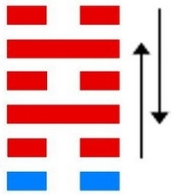
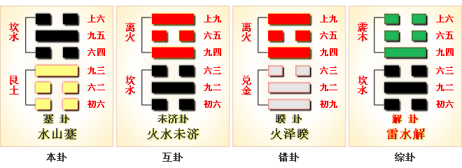
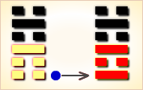
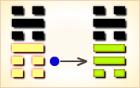
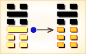
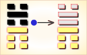
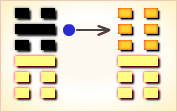
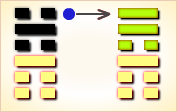

# 蹇 ䷦

蹇（䷦ jiǎn）卦的代号是`1:2`。主卦是艮卦，卦象是山，阳数是`1`；客卦是坎卦，卦象是水，阳数是`2`。“蹇”是跛的意思。主客双方都消极被动，主方稍弱于客方，主方应当采取适当主动，与客方沟通，有可能获得某些利益。

图中，红色表示当位的爻，天蓝色表示不当位的爻，箭头表示有应。

- 卦序：39

> 蹇，利西南，不利東北。利見大人，貞吉。
>《彖》曰：蹇，難也，險在前也。見險而能止，知矣哉。蹇，利西南，往得中也；不利東北，其道窮也。利見大人，往有功也；當位貞吉，以正邦也。蹇之時用大矣哉。
>《象》曰：山上有水，蹇，君子以反身脩德。

> 初六，往蹇，來譽。
>《象》曰：往蹇來譽，宜待也。

> 六二，王臣蹇蹇，匪躬之故。
>《象》曰：王臣蹇蹇，終无尤也。

> 九三，往蹇來反。
>《象》曰：往蹇來反，內喜之也。

> 六四，往蹇來連。
>《象》曰：往蹇來連，當位實也。

> 九五，大蹇朋來。
>《象》曰：大蹇朋來，以中節也。

> 上六，往蹇來碩，吉，利見大人。
>《象》曰：往蹇來碩，志在內也；利見大人，以從貴也。

> 蹇（䷦ jiǎn）卦是异卦，下艮上坎，相叠。坎为水，艮为山。山高水深，困难重重，人生险阻，见险而止，明哲保身，可谓智慧。蹇，跋行艰难。

>《象传》：前路险陷，后有高山，进退维谷，如跛者举步为艰。

> 多灾多难，进退两难，此时宜守正道，不可轻举妄动，动反招祸。

- 事业：诸事开头难，坚持下去，会有好的结果。人生不易，首先得求助自己，修德养性。志高自信，奋勇进取。逢到困难，得求友人相助，行动不可冒险，要以柔克刚，待机候时，量力而行。
- 经商：逐步起业，冒险行事，自寻苦恼。宜加强商业道德，真诚同他人合作，陷入困境时，不得见死不救，而应奋不顾身。联合行动，可活跃于市场竞争之中。
- 求名：循序渐进，加强自身修道。居静观动，待变，伺机而动，能进则进。内心坦然，不可为追逐名利而冒险。与贤能结合，追随高人，必能转危为安。
- 婚恋：不很顺利，不得急，宜慎重选择。但应有自知之明。
- 决策：艰难不利。但可视为考验。奋进向前，充满信心，切勿自寻苦恼，交结贤人，相互帮助，坚守中正之道，可遇难呈祥，结得善果。

蹇卦，坎上艮下，为[兑宫四世卦](../jing/dui.md#39)。此卦利于向西南方向行，不利于向东北方向，又利见大人。踏步难行，艰辛万苦；进退维谷，容忍待时。得此卦者，身心忧苦，举步维艰，宜守正道，不可妄动，涉险境者会有灾难。

- 时运：处于艰困，更加奋勉。
- 财运：财不流通，难以得利。
- 家宅：防水冲损；婚姻有悔。
- 身体：足部有疾，小心保养。

> 蹇：表示寒足之意，主凶象，四大难卦第三卦。冰天雪地中赤足而行，表示现在处境多么的艰辛困苦，却又不能放守不管，只能硬撑到底。此时虽是无奈，但也总有苦尽甘来的时刻。人事均很为难之时，事业、感情均有骑虎难下的困境。

> 解释：跛足，执行困难。

> 特性：幻想多，重情调，喜新厌旧，有设计研发才能，追求理想化的生活，不切实际，故内心易有挫折感。

> 运势：衰运，多灾难，进退两难之处境，要自重而不可妄动，此时应守正道待时也。凡事杂乱，更防小人之害，绝不可涉险境，否则灾害必至。

- 家运：六亲无情，有贫困、不幸之象，运差者，其险难脱，善者宜致力克服挽救。宜注意家人有重病、血光之厄运。
- 疾病：病重，不可疏忽医治，注意肾、胃、手部四肢损伤。
- 胎孕：胎不安，孕有灾。
- 子女：子女手足情薄，六亲少靠，劳碌之命也。
- 周转：难调，多不成也。
- 买卖：失利，交易不成。
- 等人：不会来。
- 寻人：速报警帮寻，得贵人则可回。
- 失物：搜索有困难阻滞而停止，不能寻回。
- 外出：出门可能有难，利于西南行。如外出遇难，可得救助，转危为安。
- 考试：落榜。
- 诉讼：终必有险，更防血光。不宜起讼，动则招咎。
- 求事：眼前毫无希望。
- 改行：不宜。执意强行并非良策。
- 开业：开业者不宜，有是非、损耗之象。

### 初六：往蹇来誉。《象》曰：往蹇来誉，宜待也。

出门艰难，归来安适。《象传》：出门艰难，归来安适，知难而退，坐待时机。

平：得此爻者，宜守旧安常。做官的稳步进取，好运将至。

- 时运：暂时退守，以待好运。
- 财运：不可冒险，守本为宜。
- 家宅：迁居不利；婚姻宜待。
- 身体：有病初起，退而自养。

初六爻动变得[第63卦：水火既济](e697a2e6b58ejiji.md)。

水火既济䷾是异卦，下离上坎，相叠。坎为水，离为火。水火相交，水在火上，水势压倒火势，救火大功告成。既，已经；济，成也。既济就是事情已经成功，但终将发生变故。

### 六二：王臣蹇蹇，匪躬之故。《象》曰：王臣蹇蹇，终无尤也。

王臣之所以屡犯艰难，并不是为自身私利。《象传》：王臣出以公心屡犯艰难，其自身始终没有过失。

凶：得此爻者，涉艰历险，营谋有阻。做官的宜保持忠贞，报效国家。

- 时运：劳碌不已，避开险难。
- 财运：中途受阻，人财两失。
- 家宅：方向不利；夫恐有难。
- 身体：过劳之厄。

六二爻动变得[第48卦：水风井](e4ba95jing.md)。

水风井䷯是异卦，下巽上坎，相叠。坎为水；巽为木。树木得水而蓬勃生长。人靠水井生活，水井由人挖掘而成。相互为养，井以水养人，经久不竭，人应取此德而勤劳自勉。

### 九三：往蹇来反。《象》曰：往蹇来反，内喜之也。

出门困难重重，归来笑逐颜开。《象传》：出门困难重重，归来笑逐颜开，这是发自内心的喜悦。

平：得此爻者，不宜进取，或有妻子之喜。做官的位高者会晋升。

- 时运：前进不易，且先退守。
- 财运：货物不畅，转销内地。
- 家宅：团聚之喜；重逢有缘。
- 身体：多加保养。

九三爻动变得[第8卦：水地比](e6af94bi.md)。

水地比䷇是异卦，下坤上坎，相叠。坤为地，坎为水。水附大地，地纳河海，相互依赖，亲密无间。此卦与师卦完全相反，互为综卦。它阐述的是相亲相辅，宽宏无私，精诚团结的道理。

### 六四。往蹇来连。《象》曰：往蹇来连，当位实也。

出门步履艰难，归来时却有车可乘。《象传》：出门步履艰难，归来时却有车可乘，因为六四阴爻居阴位，像人才正当其位，德符其名。

凶：得此爻者，不良者会有争诉。做官的进升有机，求名望利皆有实而不虚。

- 时运：同心协力，可以过关。
- 财运：客人皆来，当然有利。
- 家宅：比邻而居；亲上加亲。
- 身体：久病缠身，一时难愈。

六四爻动变得[第31卦：泽山咸](e592b8xian.md)。

泽山咸䷞是异卦，下艮上兑，相叠。艮为山；泽为水。兑柔在上，艮刚在下。水向下渗，柔上而刚下，交相感应。感则成。

### 九五：大蹇朋来。《象》曰：大蹇朋来，以中节也。

经历了很多艰难困苦，终予获得大利。《象传》：大难当前，得到友人相助，因为九五之爻居上卦中位，像人节操贞正自能获救。

吉：得此爻者，会得到贵人提举，无往不利。

- 时运：转危为安，另图发展。
- 财运：货物太多，不易脱手。
- 家宅：不宜居家。
- 身体：众医会诊，才可治好。

九五爻动变得[第15卦：地山谦](e8b0a6qian.md)。

地山谦䷎是异卦，下艮上坤，相叠。艮为山，坤为地。地面有山，地卑（低）而山高。是为内高外低，比喻功高不自居，名高不自誉，位高不自傲。这就是谦。

### 上六：往蹇来硕，吉。利见大人。《象》曰：往蹇来硕，志在内也；利见大人，以从贵也。

出门困难重重，归来欢喜跳跃。筮遇此爻，吉利，利于会见贵族王公。《象传》：出门困难重重，归来欢喜跳跃，说明志气高昂，奋勇取胜。爻辞说：利于会见贵族王公，说明追随贵人，必获福利。

吉：得此爻者，好运来到，营谋遂意。做官的会身居要职，读书人进取成名。

- 时运：大运将至，名利皆实。
- 财运：货价高涨，保本获利。
- 家宅：贵人相助；婚姻主贵。
- 身体：良医出手。

上六爻动变得[第53卦：风山渐](e6b890jian.md)。

风山渐䷴是异卦，下艮上巽，相叠。艮为山，巽为木。山上有木，逐渐成长，山也随着增高。这是逐渐进步的过程，所以称渐，渐即进，渐渐前进而不急速。

# [Jiǎn ䷦](../en/e8b987jian.md)
