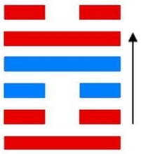
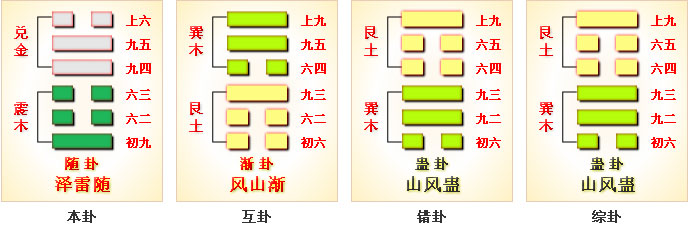
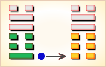
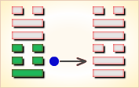
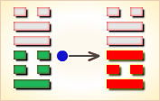
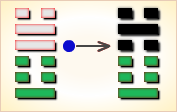
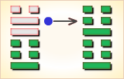
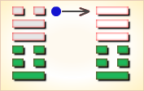

# 随 ䷐

随（䷐ suí）卦的代号是`4:6`。主卦是`4`卦，震卦，卦象是雷，特性是运动，阳数是`4`；客卦是`6`卦，兑卦，卦象是泽，阳数是`6`。“随”，跟随的意思，用于“随便”、“随从”、“跟随”、“随后”、“随意”等等。主方跟随客方在这生气盈然的河泽地区积极主动地探索。随卦，泽雷随，随时变通。随，元亨利贞，无咎。天下的事物都要随时而动。这是随卦的本质含义。

泥里步踏这几年，推车靠崖在眼前，目下就该再使力，扒上崖去发财源。

这个卦是异卦（下震上兑）相叠，震为雷、为动；兑为悦。动而悦就是“随”。**随**指相互顺从，己有随物，物能随己，彼此沟通。随必依时顺势，有原则和条件，以坚贞为前提。

图中，红色表示当位的爻，天蓝色表示不当位的爻，箭头表示有应。

- 卦序：17

> 隨，元亨利貞，无咎。
>《彖》曰：隨，剛來而下柔，動而說，隨。大亨貞，无咎，而天下隨時，隨時之義大矣哉。
>《象》曰：澤中有雷，隨。君子以嚮晦入宴息。
>《繫辭》：「服牛乘馬，引重致遠，以利天下，蓋取諸隨。」

> 初九，官有渝，貞吉，出門交有功。
>《象》曰：官有渝，從正吉也；出門交有功，不失也。

> 六二，係小子，失丈夫。
>《象》曰：係小子，弗兼與也。

> 六三，係丈夫，失小子，隨有求得，利居貞。
>《象》曰：係丈夫，志舍下也。

> 九四，隨有獲，貞凶。有孚在道以明，何咎？
>《象》曰：隨有獲，其義凶也；有孚在道，明功也。

> 九五，孚于嘉，吉。
>《象》曰：孚于嘉吉，位正中也。

> 上六，拘係之，乃從維之，王用亨于西山。
>《象》曰：拘係之。上窮也。

> 随（䷐ suí）卦是异卦，下震上兑，相叠。震为雷，为动；兑为悦，动而悦就是“随”。随，相互顺从，己有随物，物能随己，彼此沟通。随必依时顺势，有原则和条件，以坚贞为前提。

>《象传》：震木在兑泽之下，木必随水漂荡，随者，顺也。

> 有去旧迎新之吉象，宜与人合作，可获厚利，忌三心两意，或独断独行。

- 事业：对社会和人生有正确的估价，重视人际关系，善于同他人合作，事业会很顺利。为了保证取得更进一步的成功，不得贪图小利，向比自己优秀的人学习，择善而从，心存诚信、努力开拓事业。
- 经商：顺利。在与他人的真诚合作下，能够达到预期的目的。在竞争中应保持清醒头脑，从大处、长远考虑，遵守商业道德，保持至诚的态度对待顾客和同行，会保持竞争优势。
- 求名：在自己刻苦钻研的基础上，虚心向有德有才的师长学习，借助外界的力量，促使自己更快的进步，实现个人的理想。
- 婚恋：双方情投意合可以成功，家庭和睦，但若迷恋于情爱，会影响双方的事业，务必注意。
- 决策：个人成长道路并不十分顺利，但由于谦虚、随和，人际关系好，尤其能够得到长辈的器重，各种事都能在他人的帮助和关心下成功。但务必注意追随他人应有的立场和原则，不可趋炎附势，招致祸凶。

随卦，兑上震下，为[震宫归魂卦](../jing/zhen.md#17)。随即顺从、随时之意，占得此卦，凡事顺心，吉无不利。随顺和同，贞固自持;随从机运，不能专横。得此卦者，宜随大势，其事可成。凡事与他人多沟通交流，可名利双收。切不可坚持己见，专横者事不成。

- 时运：明年运行，五年方展。
- 财运：堆积存货，明春有利。
- 家宅：防止惊惧。
- 身体：休养为宜;牢狱之灾。

> 随：表示随遇而安，一切随缘、随和。主吉象。事事均可依随着自己的心思计划来执行，会顺利地达成。事业、投资、理财、感情，均会有令人满意的发展和收获。

> 解释：跟随上司主意行事。

> 特性：交际佳，贵人运多，
善谋略，为辅佐良才，保守，被动。

> 运势：物事均有去旧迎新之吉象，凡事与他人互相通达、协商，可名利双收。倘若三心二意，或独立单行，不听人言劝，有自招灾祸之虞。

- 家运：本身有相当不错的收入，富有之象。但不可过于放纵，守操节为宜。
- 疾病：病重，须长期治疗，注意口腔、肝、足患等症。
- 胎孕：无碍，无惊险。
- 子女：亲情融洽，与六亲和睦，幸福之象。
- 周转：和气相商有利，意气用事则难成。
- 买卖：勿顽强固执，则交易有利。否则失之，有阻。
- 等人：会迟到。
- 寻人：不必去找了，过些时日会自己回来，勿急。
- 失物：即将疏忽之时，会突然察觉。
- 外出：吉利。可以改变处境。
- 考试：成绩理想。
- 诉讼：宜决意和解，目前无忧，但不久须防有祸。
- 求事：虽吉，然若能谦逊待人，多接受别人意见，会得人提拔。
- 改行：有充份计划者可行。
- 开业：吉利。

### 初九：官有渝，贞吉。 出门交有功。《象》曰：官有渝，从正吉也;出门交有功，不失也。

馆舍时里发生事故，筮遇此爻则吉，出门同行都得好处。《象传》：官吏把事情办坏了，归从正道则吉利。出门同行都得好处，这是不失正道的缘故。

吉：得此爻者，多获利。做官的正当好运，有升迁之机。

- 时运：交运之时，利于变动。
- 财运：货物外售，可以得利。
- 家宅：装修迁居。
- 身体：改变用药，远方求医。

初九爻动变得[第45卦：泽地萃](e89083cui.md)。

泽地萃䷬是异卦，下坤上兑，相叠。坤为地、为顺;兑为泽、为水。泽泛滥淹没大地，人众多相互斗争。危机必四伏，务必顺天任贤，未雨绸缪，柔顺而又和悦，彼此相得益彰，安居乐业。
萃，聚集、团结。

### 六二：系小子，失丈夫。《象》曰：系小子，弗兼与也。

抓住了未成年的奴隶，跑了成年的奴隶。《象传》：抓住了小的，跑了大的，意思是两者不能兼得。

凶：得此爻者，不安宁，或受小人的暗算，是非不断。当官的宜退守，进取者要有自知之明。

- 时运：形势颠倒，最好谨慎。
- 财运：贪小失大，显然不利。
- 家宅：家主受累;婚嫁不妥。
- 身体：顾此失彼。

六二爻动变得[第58卦：兑为泽](e58591dui.md)。

兑为泽䷹是同卦，下兑上兑，相叠。泽为水。两泽相连，两水交流。上下相和，团结一致，朋友相助，欢欣喜悦。兑为悦也。同秉刚健之德，外抱柔和之姿，坚行正道，导民向上。

### 六三：系丈夫，失小子。随有求，得，利居贞。《象》曰：系丈夫，志舍下也。

抓住了成年奴隶，跑了未成年奴隶。希望无失不如现得。筮遇此爻，卜问居处则吉利。《象传》：抓了大的，跑了小的，其志在于追逐大的，舍弃小的。

平：得此爻者，营谋遂意，但宜走正道，才能得利。做官的会得到保举而升迁有望。

- 时运：求财求名，皆为正运。
- 财运：小往大来，利益可期。
- 家宅：积蓄有成，关心子女。
- 身体：大人无妨，小孩不利。

六三爻动变得[第49卦：泽火革](e99da9ge.md)。

泽火革䷰是异卦，下离上兑，相叠。离为火、兑为泽，泽内有水。水在上而下浇，火在下而上升。火旺水干；水大火熄。二者相生亦相克，必然出现变革。变革是宇宙的基本规律。

### 九四：随有获，贞凶。有孚，在道以明，何咎?《象》曰：随有获，其义凶也。有孚在道，明功也。

追名逐利，贪多务获，卜问得凶兆。押送俘虏上路，明于约束，没有灾难。《象传》：追名逐利，贪多务获，这种人遭遇凶险是应该的。谨守信用，严守正道，这是明察事功的结果。

平：得此爻者，会得到好人的抬举，化凶为吉。做官的会身居要职，努力进取者可成事，可获得名利。

- 时运：吉凶互见，明年吉祥。
- 财运：虽有获利，小心意外。
- 家宅：置屋不宜。
- 身体：先凶后吉。

九四爻动变得[第3卦：水雷屯](e5b1afzhun.md)。

水雷屯䷂是异卦，下震上坎，相叠。震为雷，喻动;坎为雨，喻险。雷雨交加，险象丛生，环境恶劣。“屯”原指植物萌生大地。万物始生，充满艰难险阻，然而顺时应运，必欣欣向荣。

### 九五：孚于嘉，吉。《象》曰：孚于嘉吉，位正中也。

俘虏了不少嘉人，吉利。《象传》：信守中正之道，诸事吉利，因为九五之爻居上卦中位，像人守中正之道。

吉：得此爻者，营谋遂意，多喜庆之事，做官的会升职，或多喜事。

- 时运：正当好运，诸事皆吉。
- 财运：货物上品，得利不少。
- 家宅：积善之家;婚嫁可喜。
- 身体：无须担心。

九五爻动变得[第51卦：震为雷](e99c87zhen.md)。

震为雷䷲是同卦，下震上震，相叠。震为雷，两震相叠，反响巨大。可消除沉闷之气，亨通畅达。平日应居安思危，怀恐惧心理，不敢有所怠慢，遇到突发事变，也能安然自若，谈笑如常。

### 上六：拘系之，乃从维之;王用亨于西山。《象》曰：拘系之，上穷也。

将俘虏拘禁起来，紧紧捆绑，周文王将他们作为人牲在西山祭祀神灵。《象传》：被捆绑拘禁，因为上六居一卦之尽头，像人处于穷困之境地。

凶：得此爻者，苦难多多，不很如意，重病者会有生命之忧。做官的须防止小人的谗言。

- 时运：困难重重，难以如意。
- 财运：稳扎稳打，未能伸展。
- 家宅：家人抱怨;嫁娶有缘。
- 身体：诚心祷告;可能归魂。

上六爻动变得[第25卦：天雷无妄](e697a0e5a684wuwang.md)。

天雷无妄䷘是异卦，下震上乾，相叠。乾为天为刚为健；震为雷为刚为动。动而健，刚阳盛，人心振奋，必有所得。但唯循纯正，不可妄行。无妄必有获，必可致福。

# [Suí ䷐](../en/e99a8fsui.md)
