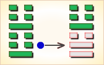

# 震 ䷲

震（䷲ zhèn）卦的代号为`4:4`。主卦和客卦都是`4`卦。主客双方都处于事物发展初始阶段，素质不佳，态度随和；双方都在震动，合在一起，还是震动。双方的力量有时相互抵消，而有时相互加强。震为雷（震卦）临危不乱，震为雷，两震相叠，反响巨大，可消除沉闷之气，亨通畅达。平日应居安思危，怀恐惧心理，不敢有所怠慢，遇到突发事变，也能安然自若，谈笑如常。《震》卦的震，是借雷震的震，但自不当仅指雷震的震，它有一种震动、震撼、震惊、震慑综合的意思，也即指超过一般人承受压力而造成的骇异局面。 

- 卦序：51

> 震，亨，震來虩虩，笑言啞啞。震驚百里，不喪匕鬯。
>《彖》曰：震，亨。震來虩虩，恐致福也；笑言啞啞，後有則也；震驚百里，驚遠而懼邇也，出可以守宗廟社稷，以為祭主也。
>《象》曰：洊雷震，君子以恐懼脩省。

> 初九，震來虩虩，後笑言啞啞，吉。
>《象》曰：震來虩虩，恐致福也；笑言啞啞，後有則也。

> 六二，震來厲，億喪貝，躋于九陵，勿逐，七日得。
>《象》曰：震來厲，乘剛也。

> 六三，震蘇蘇，震行无眚。
>《象》曰：震蘇蘇，位不當也。

> 九四，震遂泥。
>《象》曰：震遂泥，未光也。

> 六五，震往來厲，億无喪，有事。
>《象》曰：震往來厲，危行也。其事在中，大无喪也。

> 上六，震索索，視矍矍，征凶。震不于其躬，于其鄰，无咎。婚媾有言。
>《象》曰：震索索，中未得也；雖凶无咎，畏鄰戒也。

> 震（䷲ zhèn）卦是同卦，下震上震，相叠。震为雷，两震相叠，反响巨大，可消除沉闷之气，亨通畅达。平日应居安思危，怀恐惧心理，不敢有所怠慢，遇到突发事变，也能安然自若，谈笑如常。

>《象传》：重雷发向，千里传声，有惊无险之象，亦有变动之意。

> 表面昌盛风光，内里正处多事之秋，动荡不安之境。

- 事业：处于不顺利、甚至面临危险的局面，对此务必提高警惕，有备方可无患，一旦出现突发事件，可以泰然处之，并且可以由此引吸取教训，一方面使损失减少，另一方面可以迅速复原，使事业迈上新的高度。
- 经商：在激烈的商场竞争中，随时可能出现问题，陷入困境。冷静、从容地应付到来的现实，坚持不偏不激的中正原则，以刚毅的态度，从容不迫地去战胜困难。经过一番危机后，一定可以获得巨大利益。
- 求名：很可能会遭到挫折。不必灰心，而应自我反省，找出问题的症结所在。
- 婚恋：恋爱和家庭都可能出现变故，应以冷静态度处理，会有理想的结果。
- 决策：处于人生的转折关头。应正确地总结过去，为开拓新的事业奠定基础。在前进的道路上应随时心怀恐惧，勤勤恳恳，坚持正确原则，在困难中前进，命运亨通。

震卦，震上震下，为[震宫本位卦](../jing/zhen.md#51)。震即雷，空闻其响，不见其形。主求谋难遂，官爵难成。重雷发响，奋发图强；先难后易，先苦后甜。得此卦者，奋发振作，大可有为，但表面风光，内恐有难，宜谨言慎行，以免损失。

- 时运：运势正强，谨慎免咎。
- 财运：所积财物，皆得售出。
- 家宅：保护宅基，祭祷为宜；佳偶。
- 身体：肝火太盛，不宜劳累。

> 震：雷。表示奋发、震动有冲动不安稳的现象。六冲纯卦，主大好大坏之卦象。此卦要注意意外血光，有被惊吓之情形发生，运动比赛可为吉论。雷通常表示，声势浩大，却是有声无形虚象之意。与人交往最忌此卦，表面热心却只是虚应一番，无诚心，不能用真诚来对待，否则会很失望。

> 解释：受惊，害怕。

> 特性：心直口快，喜怒形于色，缺乏耐性，工作不稳定，爱变化，理财能力差，自立自强。

> 运势：表面似盛泰，但正处于多事之秋，宜慎重，勿自视过高，无益也。有动荡、不安、惊惧之象耳。

- 家运：家中常有变动惊惧、不平等、多争吵，影响家运进展，宜审慎处理家务事也。
- 疾病：注意肝、神经系统、足疾，病情反复。
- 胎孕：临产妇得之无碍。
- 子女：子女多有性刚者，但皆争气，奋发，并有少年劳苦老来福之象，有成有福。
- 周转：抱持可有可无之心态，因此卦有被反悔之象。
- 买卖：不可有始无终，否则难成。
- 等人：会来，而且会提早到。
- 寻人：此人临时起意而出走，但亦会马上回来。
- 失物：可能是受某些事惊吓而遗失，令你惊惶失措，尝试于会发声的东西或电器处寻找。
- 外出：大胆出行，不必理会小的灾祸。
- 考试：可榜登科甲。
- 诉讼：反覆难平，宜收敛脾气，心平气和。
- 求事：不利。
- 改行：改行吉利，为变动之时机也。
- 开业：吉利，可依计划而行。

### 初九：震来虩虩，后笑言哑哑，吉。《象》曰：震来虩虩，恐致福也。笑言哑哑，后有则也。

雷声传来，吓得浑身发抖，后来听到雷声，仍谈笑如常，吉利。《象传》：雷声传来，吓得浑身发抖，是因为相信敬畏重大的天象可以免罪得福。后来听到雷声仍能谈笑如常，是说后来对这类事情有了些经验。

吉：得此爻者，好运到来，先惊后喜。

- 时运：好运新来，先苦后乐。
- 财运：用心经营，得利可乐。
- 家宅：谨慎为宜；先忧后喜。
- 身体：先危后安。

初九爻动变得[第16卦：雷地豫](e8b1abyu_cn.md)。

雷地豫䷏是异卦，下坤上震，相叠。坤为地，为顺；震为雷，为动。雷依时出，预示大地回春。因顺而动，和乐之源。此卦与谦卦互为综卦，交互作用。

### 六二：震来厉，亿丧贝。跻于九陵，勿逐，七日得。《象》曰：震来厉，乘刚也。

雷电交加，十分危险，惊慌之中丢失了钱币，翻山越蛉，走了很远的路程去寻找也没有找到。筮者告诉他：“不必追寻了，七八日内，这损失可得补偿。”《象传》：雷电交加之时，翻越九重山，爻象显示其人触犯雷电，处境危险。

凶：得此爻者，多难之时，或有争诉，小心为妙。做官的有遭奸邪之辈陷害之忧。

- 时运：患得患失，不必过虑。
- 财运：有得有失，危机意识。
- 家宅：注意防盗；夫妻不睦。
- 身体：病势可忧，七日可愈。

六二爻动变得[第54卦：雷泽归妹](e5bd92e5a6b9guimei_cn.md)。

雷泽归妹䷵是异卦，下兑上震，相叠。震为动、为长男；兑为悦、为少女。以少女从长男，产生爱慕之情。有婚姻之动，有嫁女之象，故称归妹。

### 六三：震苏苏，震行无眚。《象》曰：震苏苏，位不当也。

出门时遇到电闪雷鸣，感到疑惧不安。继续前进，不会有灾祸。《象传》：出门时遇到电闪雷鸣，感到疑惧不安，因为六三阴爻而居阳位，像人处境不利。

凶：得此爻者，多忧愁，多灾难，宜谨慎，可免祸。做官的不宜进取。

- 时运：加倍谨慎，可以免咎。
- 财运：销路不佳，另行设法。
- 家宅：小心地震；门户不当。
- 身体：由危而安。

六三爻动变得[第55卦：雷火丰](e4b8b0feng_cn.md)。

雷火丰䷶是异卦，下离上震，相叠。电闪雷鸣，成就巨大，喻达到顶峰，如日中天。告戒：务必注意事物向相反方面发展，盛衰无常，不可不警惕。

### 九四：震遂泥。《象》曰：震遂泥，未光也。

雷电下击，接触到地面。《象传》：其人猝闻惊雷，吓得坠入泥中，说明其人见识不广，胆量不大。

凶：得此爻者，一筹莫展，前进有阻。做官的有被贬职之危。

- 时运：欲振乏力，退而自保。
- 财运：挥金如土，难有积蓄。
- 家宅：阳气阻塞；辛苦成家。
- 身体：腹部积滞，宜泄除之。

九四爻动变得[第24卦：地雷复](e5a48dfu_cn.md)。

地雷复䷗是异卦，下震上坤，相叠。震为雷、为动；坤为地、为顺。动则顺，顺其自然。动在顺中，内阳外阴，循序运动，进退自如，利于前进。

### 六五：震往来厉，亿无丧，有事。《象》曰：震往来厉，危行也。其事在中，大无丧也。

巨雷轰鸣，危险在前。只要小心谨慎，不至于酿成灾祸，亦无损于事。《象传》：巨雷轰鸣，危险在前，喻指人的行动将有危险。但是其事合符义理，故能没有大的损失。

凶：得此爻者，不吉之时，或有手足受损之忧。做官的守常者无忧。

- 时运：患难已过，可成大事。
- 财运：小损大利，不必多忧。
- 家宅：祭祷防祟。
- 身体：修身养性。

六五爻动变得[第17卦：泽雷随](e99a8fsui_cn.md)。

泽雷随䷐是异卦，下震上兑，相叠。震为雷，为动；兑为悦，动而悦就是“随”。随指相互顺从，己有随物，物能随己，彼此沟通。随必依时顺势，有原则和条件，以坚贞为前提。

### 上六。震索索，视矍矍，征凶。震不于其躬，于其邻，无咎。婚媾有言。《象》曰：震索索，未得中也。虽凶无咎，畏邻戒也。

雷电交加，其人行动谨慎，警戒四顾，因为行路艰难，危险四伏。但是雷电不会击在他身上，而是落在邻人的头上。因为他本人没有什么过错，而其他邻人却犯有罪责。《象传》：雷电交加，行动谨慎，因为内心虚空，精神紧张。虽然凶险但毕竟没有灾祸，因为对于邻人的遭遇有所警戒，从而能远恶近善。

凶：得此爻者，须谨防意外，或夫妻有刑克，亲邻遭难。做官的要谨防被贬职之忧。

- 时运：位高必危，静守为宜。
- 财运：须防过贪，谨守小成。
- 家宅：邻居有事；近时媒来。
- 身体：安心养目。

上六爻动变得[第21卦：火雷噬嗑](e599ace59791shike_cn.md)。

火雷噬嗑䷔是异卦，下震上离，相叠。离为阴卦；震为阳卦。阴阳相交，咬碎硬物，喻恩威并施，宽严结合，刚柔相济。噬嗑为上下颚咬合，咀嚼。

# [Zhèn ䷲](e99c87zhen.md)
