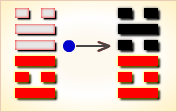

# 革 ䷰

革（䷰  gé）卦的代号是`5:6`卦。主卦是`5`卦，离卦 ，离卦的卦象是火，阳数是`5`；客卦是`6`卦，兑卦，兑卦的卦象是泽，阳数是`6`。主方像是一名改革者，以火样的热情，来到客方，客方像富饶的鱼米之乡，愉快地欢迎主方，给予主方所需要的资源。主方可以从客方受益，改善自己不佳的素质，完成自己本身状态的改革。革卦，泽火革，顺天应人。这个卦是异卦，下离上兑，相叠。离为火、兑为泽，泽内有水。水在上而下浇，火在下而上升。火旺水干；水大火熄。二者相生亦相克，必然出现变革。变革是宇宙的基本规律。

图中，红色表示当位的爻，天蓝色表示不当位的爻，箭头表示有应。

- 卦序：49

> 革，已日乃孚，元亨，利貞，悔亡。
>《彖》曰：革，水火相息，二女同居，其志不相得，曰革。已日乃孚，革而信之，文明以說，大亨以正，革而當，其悔乃亡。天地革而四時成，湯武革命，順乎天而應乎人，革之時大矣哉。
>《象》曰：澤中有火，革，君子以治曆明時。

> 初九，鞏用黃牛之革。
>《象》曰：鞏用黃牛，不可以有為也。

> 六二，已日乃革之，征吉，无咎。
>《象》曰：已日革之，行有嘉也。

> 九三，征凶，貞厲。革言三就，有孚。
>《象》曰：革言三就，又何之矣。

> 九四，悔亡，有孚，改命吉。
>《象》曰：改命之吉，信志也。

> 九五，大人虎變，未占有孚。
>《象》曰：大人虎變，其文炳也。

> 上六，君子豹變，小人革面，征凶，居貞吉。
>《象》曰：君子豹變，其文蔚也；小人革面，順以從君也。

> 革（䷰  gé）卦是异卦，下离上兑，相叠。离为火、兑为泽，泽内有水。水在上而下浇，火在下而上升。火旺水干，水大火熄。二者相生亦相克，必然出现变革。变革是宇宙的基本规律。

>《象传》：兑为金，被离火所烧，变革之象。

> 凡事均在变动之中，宜去旧立新，以应革新之象。

- 事业：正处在转折的关键时刻，必须密切注意各种信息，认真思考。首先巩固自己的地位，完善个人的行为。时机成熟后，立即行动，积极进行变革。但应注意动机纯正，手段正当，不保守也不妄进，事业必定发达。
- 经商：市场竞争十分激烈。为了立于不败之地，一定要敢于大胆求新，适时改变自己的经营方向，受到挫败，马上总结经验，重新奋起，拓展商业活动，但要注意竞争方式。
- 求名：首先要努力提高自己，完善个人的学识和品德。同时，服从上级指挥搞好工作，二者的关系一定要得到妥善处理。
- 婚恋：可能会出现一些节外生枝的麻烦事，应冷静处理，感情专注。
- 决策：十分吉利、顺利。以自己的聪明才智，顺应形势，根据时代特点，依理而动，变革渐合时宜的事物，壮大自己的事业。但应谨慎，时机不成熟不可妄动，尤忌急功近利。行动之前应三思而行。

革卦，兑上离下，为[坎宫四世卦](../jing/kan.md#49)。革就是需要变革，提醒占筮者需要变革才会更进一步。事多变动，坚守正道；顺天应人，实施变革。得此卦者，凡事均在变动之中，宜去旧立新，以应革新之象，则会吉祥。

- 时运：改变之时，顺时而动。
- 财运：消耗过多，迁地贸易。
- 家宅：小心防火；改娶之象。
- 身体：肾水干枯，肝火上升。

> 革：表示该改革、革新之时候了。主是个状况卦，吉凶未定。事事情况虽不稳定、明朗，但只要有心改变，重新再来则成功机会大。一切不可固执不化、不变通。

> 解释：革旧布新。

> 特性：性急，反传统，爱改变现象，创新事物，旅行，变换工作，口齿伶俐。

> 运势：不稳定，多变化之际，凡事均有所变动，故需弃腐朽而立新者，宜下决心改革。但仍须谨慎改革之道，善改则吉，恶改则凶。

- 家运：多事之秋。慎重改变自己的生活方式，方能建立新的气象。
- 疾病：病情多变，宜改换求医方法，注意心脏，眼目和咽喉之疾。
- 胎孕：胎安。
- 子女：子女与母亲有缘薄之象。
- 周转：要及时改变方针。
- 买卖：改变经营方式为宜。
- 等人：因中途变卦不会来。
- 寻人：速改变方向，向西、南方寻找。
- 失物：因有弃旧迎新之意，故相信不能寻回。
- 外出：十分顺利，积极活动，扩大人际关系。
- 考试：越来越好。
- 诉讼：要改变旧有对策，才可圆满解决。
- 求事：不可守旧，改变职事有利之时机也。宜速把握良机。
- 改行：大吉大利。
- 开业：大吉大利。

### 初九：巩用黄牛之革。《象》曰：巩用黄牛，不可以有为也。

用黄牛的皮革束紧加固（战车）。《象传》：用黄牛的皮革束紧加固，说明其人被紧紧束缚不能有作为。

平：得此爻者，宜谨守常规，不可存非分之想。做官的不宜进取，切不可怀出位之念。

- 时运：最好固守，再等几年。
- 财运：先立基础，勿图更张。
- 家宅：新造之屋；待婚三年。
- 身体：中腹胀硬，消积健脾。

初九爻动变得[第31卦：泽山咸](e592b8xian.md)。

泽山咸䷞是异卦，下艮上兑，相叠。艮为山；泽为水。兑柔在上，艮刚在下。水向下渗，柔上而刚下，交相感应。感则成。

### 六二：己日乃革之。征吉，无咎。《象》曰：己日革之，行有嘉也。

祭祀的日期要改变。随之要重新卜问征战的日期，结果卜得吉兆，没有灾难。《象传》：祭祀的日期要改变，大概是因为将有喜庆之事。

吉：得此爻者，多喜庆之事，做官的会升迁。

- 时运：配合吉日，建立功名。
- 财运：择吉开张，生意畅旺。
- 家宅：择日修宅；可称佳偶。
- 身体：即将痊愈。

六二爻动变得[第43卦：泽天夬](e5a4acguai.md)。

泽天夬䷪是异卦，下乾上兑，相叠。乾为天为健；兑为泽为悦。泽气上升，决注成雨，雨施大地，滋润万物。五阳去一阴，去之不难，决（去之意）即可，故名为夬（guài），夬即决。

### 九三：征凶，贞厉。革言三就，有孚。《象》曰：革言三就，又何之矣。

出征，吃了败仗，卜问得凶兆。但是，只要振奋精神，整顿装备，重新开战，则能转败为胜，生擒强敌。《象传》：犯人屡次推翻供辞，只得反复进行审讯，这说明抵赖无用，只能招出实情。

凶：得此爻者，多事之时，谨慎而行。做官的有躁动失政之忧。

- 时运：再三考虑，可免后患。
- 财运：信用良好，才可获利。
- 家宅：三迁为宜；三人为媒。
- 身体：三日可愈。

九三爻动变得[第17卦：泽雷随](e99a8fsui.md)。

泽雷随䷐是异卦，下震上兑，相叠。震为雷，为动；兑为悦，动而悦就是“随”。随指相互顺从，己有随物，物能随己，彼此沟通。随必依时顺势，有原则和条件，以坚贞为前提。

### 九四：悔亡，有孚，改命，吉。《象》曰：改命之吉，信志也。

没有悔恨。至于占问战争，则小有战果，如果改帅易将，则将大吉。《象传》：九四爻辞讲改帅易将之所以吉利，因为这样能使有才德的人施展抱负。

平：得此爻者，会有转变，有收获。做官的会有升迁之机。

- 时运：转换跑道，好运自来。
- 财运：重兴旧业，可以得利。
- 家宅：整建有利；再婚有利。
- 身体：改求良医。

九四爻动变得[第63卦：水火既济](e697a2e6b58ejiji.md)。

水火既济䷾是异卦，下离上坎，相叠。坎为水，离为火，水火相交，水在火上。水势压倒火势，救火大功告成。既，已经；济，成也。既济就是事情已经成功，但终将发生变故。

### 九五：大人虎变，未占有孚。《象》曰：大人虎变，其文炳也。

九五：王公大人赫然斯怒，化柔弱为威猛，不用卜占，即知将大获胜仗。《象传》：王公赫然斯怒，威猛如虎，说明其人仪表威严，光采照人。

吉：得此爻者，时运转好，多吉利之事。做官的晋升有望。

- 时运：大运来到，得意非凡。
- 财运：订好价钱，自可获利。
- 家宅：不利迁动；须防不贞。
- 身体：肝火浮动，不药可愈。

九五爻动变得[第55卦：雷火丰](e4b8b0feng.md)。

雷火丰䷶是异卦，下离上震，相叠。电闪雷鸣，成就巨大。喻达到顶峰，如日中天。告戒：务必注意事物向相反方面发展，盛衰无常，不可不警惕。

### 上六：君子豹变，小人革面。征凶，居贞吉。《象》曰：君子豹变，其文蔚也。小人革面，顺以从君也。

君子精神振奋，但基层官兵一反常态。筮遇此爻，占问征伐，则凶险。卜问居处则吉利。《象传》：君子精神振奋，说明其仪态清朗雍容。小人洗心革面，说明小人去恶从善，服从君上。

平：得此爻者，安分守己则是非不扰。做官的进取者会晋升，离退休者会功成身退。

- 时运：守成为宜，功成身退。
- 财运：名利兼收，知足常乐。
- 家宅：居之得安；多求必应。
- 身体：静养修心。

上六爻动变得[第13卦：天火同人](e5908ce4babatongren.md)。

天火同人䷂是异卦，下离上乾，相叠。乾为天，为君；离为火，为臣民百姓。上天下火，火性上升，同于天，上下和同，同舟共济，人际关系和谐，天下大同。

# [Gé ䷰](e99da9ge.md)
