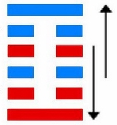

# 颐 ䷚

颐（䷚ yí）卦的代号为`4:1`。主卦是**震**卦，卦象是雷，阳数是`4`；客卦是**艮**卦，卦象是山，阳数是`1`。“颐”指面颊，腮。客方的消极被动给了主方积极发展的机会，客方像山，只要不触及客方利益，主方就可以在广阔原野上尽情发展，不过，主方也不能指望从客方得到什么，主方必须着力于“自求口实”。

> 太公独钓渭水河，手执丝杆忧愁多，时来又遇文王访，自此永不受折磨。

这个卦是异卦（下**震**上**艮**）相叠。**震**为雷，**艮**为山。山在上而雷在下，外实内虚。春暖万物养育，依时养贤育民。阳实阴虚，实者养人，虚者为人养。自食其力。

图中，红色表示当位的爻，天蓝色表示不当位的爻，箭头表示有应。

- 卦序：27

> 頤，貞吉，觀頤，自求口實。
>《彖》曰：頤，貞吉，養正則吉也。觀頤，觀其所養也；自求口實，觀其自養也。天地養萬物，聖人養賢以及萬民，頤之時大矣哉。
>《象》曰：山下有雷，頤，君子以慎言語，節飲食。

> 初九，舍爾靈龜，觀我朵頤，凶。
>《象》曰：觀我朵頤，亦不足貴也。

> 六二，顛頤，拂經。于丘頤，征凶。
>《象》曰：六二征凶，行失類也。

> 六三，拂頤，貞凶，十年勿用，无攸利。
>《象》曰：十年勿用，道大悖也。

> 六四，顛頤，吉，虎視眈眈，其欲逐逐，无咎。
>《象》曰：顛頤之吉，上施光也。

> 六五，拂經，居貞吉，不可涉大川。
>《象》曰：居貞之吉，順以從上也。

> 上九，由頤，厲吉，利涉大川。
>《象》曰：由頤厲吉，大有慶也。

>《象传》：形如口腔之象，取其饮食之道，须慎言，注重日常生活。

> 处事欠缺周详考虑，不宜心怀阴谋，要守正道而善方吉。

- 事业：凡事得靠个人追求，自己奋斗，而不能依赖他人。更不得用不光彩的手段谋求财物。只要遵循正道，自食其力，谨言慎行，一定会有好的机遇。这时，经过一番艰苦奋斗，能够成功。
- 经商：不得急于求成，应谨慎小心，循序渐进，诚以待人，真诚与他人合作，因时制宜，不断追求新的开拓方向，必要时可适当冒险。
- 求名：以丰富自身知识为目的，知足安乐，刻苦努力，成功的希望极大。
- 婚恋：不可急于求成，关键在于加强自己的修养。一旦选中应全力追求，尤其不可三心二意。
- 决策：注意道德修养，乐于尽力而为地去帮助他人，救人急难，不贪求不应得到的财物。因此，能受到他人的尊重，也能不断得到外来的援助，个人事业十分顺利，成功的可能性很大。尤其不可粗心大意，牢记成就大阻力也大的道理。

颐卦，艮上震下，为[巽宫游魂卦](../jing/xun.md#27)。颐为修养、调养，雷震于山，为春来之兆，万物开始生养，因此颐卦为发展之兆，多主吉。养正养育，谨言节食；观察实务，自知审慎。得此卦者，对于言语及饮食，均须谨慎。宜守正道，谨言慎行，心怀阴谋者会招灾祸。

- 时运：生机显达，谨言慎行。
- 财运：内外升降，未必流通。
- 家宅：小心防火；贤妇从夫。
- 身体：上寒下热，五日乃愈。

> 颐：表示养也，主小吉带一点凶。养跟饮食有关，也表示养育、教育的意思，对情势需要充分了解，不要贸然的就下任何的决定。颐，又与口有关，故需慎防小人口舌之灾。

> 解释：静卧，不向前冲。

> 特性：有欠缺考虑、鲁莽妄动之害。若有怀阴谋，与人互相猜疑或争端者更不利。要守正道而善行之，凡事切忌任性非为。

> 运势：先苦后甜，失败后成功型，物质金钱运佳，乐善好施，贵人多助。不断提升修养自己，容易得到社会好的名声。

- 家运：陷于痛苦深渊，有身败名裂之象，宜改进言行，冷静反省，力求幸福才是。
- 疾病：占病为凶，久病者险，为肠胃、咽喉、手足之疾。
- 胎孕：宜求香火保佑。
- 子女：过份溺爱反有害。尤其须注意儿女健康，以免日后因身体虚弱而不能获福。
- 周转：是否成功，要看自己是否有诚心。
- 买卖：守旧为宜，不宜谋求新事，否则不利。
- 等人：难来，中途有碍。
- 寻人：不久相逢。东北或东之向。
- 失物：尽快去找，似被物件上下夹着。
- 外出：应慎重，不宜过多外出。如无充分准备，仓促出行，将可能会遇到凶险。
- 考试：尚可。
- 诉讼：我告他人终不能成，宜速和解。
- 求事：不成。
- 改行：不宜，勿勉强。
- 开业：开业者不利，须再待时。

### 初九：舍尔灵龟，观我朵颐，凶。《象》曰：观我朵颐，亦不足贵也。

自己储藏着大量的财宝，还要羡嫉人家的财物，必遭凶险之事。《象传》：羡嫉人家的财物，这不是高尚的行为。

凶：得此爻者，为争夺财利而起祸，大凡心底善良守正道者可无忧。做官的会受贿，失其廉。

- 时运：舍己观人，徒慕虚名。
- 财运：经营不顺，别人获利。
- 家宅：六神无主；婚姻不谐。
- 身体：饮食致病。

初九爻动变得[第23卦：山地剥](e589a5bo.md)。

山地剥䷖是异卦，下坤上艮相叠。五阴在下，一阳在上，阴盛而阳孤；高山附于地。二者都是剥落象，故为“剥卦”。此卦阴盛阳衰，喻小人得势，君子困顿，事业败坏。

### 六二：颠颐，拂经；于丘颐，征凶。《象》曰：六二征凶，行失类也。

为了糊口，就得在山坡上开荒种地。为了生计而去抢劫别人，这是凶险之事。《象传》：六二爻辞说抢劫则凶，因为这种行径违反道义。

凶：得此爻者，大起大落，是非不一，凶者病致死。做官的须防被贬职。

- 时运：侥幸得成，终究是凶。
- 财运：不合常理，难免耗损。
- 家宅：未得其正；妇道可议。
- 身体：头昏眼花，小心调养。

六二爻动变得[第41卦：山泽损](e68d9fsun.md)。

山泽损䷨是异卦，下兑上艮，相叠。艮为山；兑为泽。上山下泽，大泽浸蚀山根。损益相间，损中有益，益中有损。二者之间，不可不慎重对待。损下益上，治理国家，过度会损伤国基。应损则损，但必量力、适度。少损而益最佳。

### 六三：拂颐，贞凶。十年勿用，无攸利。《象》曰：十年勿用，道大悖也。

违背养生正道，靠歪门邪道过活，占问得凶兆。十年都得倒霉，永无好处。《象传》：十年都得倒霉，因为这种行为大有悖于道义。

凶：得此爻者，运势低迷，荒诞无稽，甚至有生死离别之伤。做官的有丧名失节之患。

- 时运：无路可走，闭门思过。
- 财运：久难成事，无利可图。
- 家宅：家宅不安；十年方婚。
- 身体：痼疾难治。

六三爻动变得[第22卦：山火贲](e8b4b2bi.md)。

山火贲䷕是异卦，下离上艮，相叠。离为火为明；艮为山为止。文明而有节制。贲卦论述文与质的关系，以质为主，以文调节。贲，文饰、修饰。

### 六四。颠颐，吉。虎视眈眈，其欲逐逐，无咎。《象》曰：颠颐之吉，上施光也。

所求不过糊口，害人之心不可存，吉利。虎视眈眈，防人之心不可无。这样就可以安享天年，悠然自得，无灾祸。

《象传》：所求不过餬口，之所以吉利，因为君上施舍甚广，足以养民。

吉：得此爻者，会得到好人的帮助，营谋遂意。做官的会得到祖上的恩惠，幸宠有加。

- 时运：养精蓄锐，可图功名。
- 财运：看清市场，买卖获利。
- 家宅：尚可称正。
- 身体：少欲则安。

六四爻动变得[第21卦：火雷噬嗑](e599ace59791shike.md)。

火雷噬嗑䷔是异卦，下震上离，相叠。离为阴卦；震为阳卦。阴阳相交，咬碎硬物。喻恩威并施，宽严结合，刚柔相济。噬嗑为上下颚咬合，咀嚼。

### 六五：拂经，居贞吉。不可涉大川。《象》曰：居贞之吉，顺以从上也。

开荒种地，平居度日，占问得吉兆。筮遇此爻，不可涉水渡河。《象传》：平居守正，之所以吉利，因为其人安份循道，服从君上。

吉：得此爻者，会有依靠，事可成，但不可乘船涉险。做官的会因人而功可成，位可保。

- 时运：固守为宜，急进难成。
- 财运：行商不利，可以做贾。
- 家宅：山居较宜；从一为吉。
- 身体：安居静养，劳累难治。

六五爻动变得[第42卦：风雷益](e79b8ayi.md)。

风雷益䷩是异卦，下震上巽，相叠。巽为风；震为雷。风雷激荡，其势愈强，雷愈响，风雷相助互长，交相助益。此卦与损卦相反。它是损上以益下，后者是损下以益上。二卦阐述的是损益的原则。

### 上九：由颐，厉吉。利涉大川。《象》曰：由颐厉吉，大有庆也。

遵循生活正道，先艰难而终吉利。筮遇此爻，有利于涉水渡河。《象传》：遵循生活正道，先艰难而终吉利，因为善良之人终得善报。

吉：得此爻者，营谋有成，无往不利。做官的爵禄荣重。读书人会取得佳绩。

- 时运：谨慎努力，可以成功。
- 财运：辛苦经营，才有收获。
- 家宅：合家平安。
- 身体：虽危无碍。

上九爻动变得[第24卦：地雷复](e5a48dfu.md)。

地雷复䷗是异卦，下震上坤，相叠。震为雷、为动；坤为地、为顺。动则顺，顺其自然。动在顺中，内阳外阴，循序运动，进退自如，利于前进。

# [Yí ䷚](../en/e9a290yi.md)
