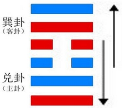
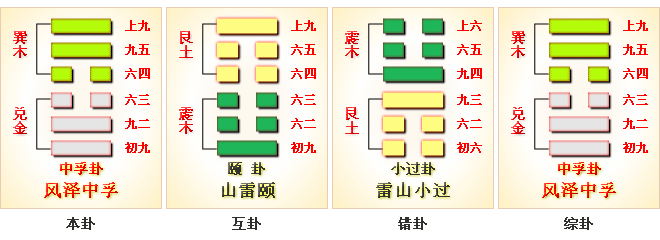

# 中孚 ䷼



中孚（zhōng fú）卦，风泽中孚，诚信立身。

这个卦是异卦（下兑上巽）相叠。
孚（fú）本义孵，孵卵出壳的日期非常准确，有信的意义。
卦形外实内虚，喻心中诚信，所以称中孚卦。这是立身处世的根本。

中孚：豚鱼吉，利涉大川，利贞。
《中孚卦》象征诚信：诚信施及到愚钝无知的小猪、小鱼身上，从而感化了它们，因此获得吉祥，利于涉越大河大川，利于坚守中正之道。

中孚卦是别卦，其代号是`6:3`。中孚的意思是双方应当诚恳相待。
主卦是`6`卦兑卦，卦象是泽，特性是愉快；客卦是`3`卦巽卦，卦象是风，特性是顺从。

主方愉快地享受成功的喜悦，客方具有良好素质，顺从主方，可以和谐合作。
双方都不需要损害对方，诚恳地相互支持，互利共赢。
图中，红色表示当位的爻，天蓝色表示不当位的爻，箭头表示有应。

- 卦象：泽上有风
- 象征：诚信
- 卦序：61

## 总述

中孚卦的结构与卦爻辞的图中，有两个箭头，表示两种有应，除此之外，第二爻与第五爻之间不有应。
第二爻与第五爻是主卦和客卦的中爻，代表主方和客方素质，都是阳爻，表示双方素质都良好，
比如说，双方资本都充裕。如果相互攻击，则可能两败俱伤；如果互相协作，则可能互利共赢。是相互攻击还是相互协作呢？
客卦上爻与中爻都是阳，表明客方力量非常强大，而主卦中爻是阳，上爻是阴，表明主方力量强但不是很强，
因此，如果互相攻击，主方将受损失。所以，主方应当力求互利共赢，避免相互攻击。
同时，主卦与客卦的下爻既当位又有应，是对主方有利因素，做到互利共赢的可能性很大。

不过，图中也显示出对主方不利因素，主卦与客卦上爻既不当位而又有应，是对主方不利因素，客方有可能过于傲慢与粗暴。
主方应当谨慎，诚恳地对待客方，取得客方信任，避免冲突。如果主客双方能够相互信任，做到“中孚”，则形势对主方有利。

第五爻爻辞中有“有孚挛如”，意思是有了信任就如同孪生兄弟，“中孚”卦指出在当前双方关系形势下，需要相互信任。
为了做到相互信任，需要有安定环境，“虞吉”；需要利益共享，“吾与尔靡之”；
需要协调配合，“或泣或歌”；需要持久，“月几望，马匹亡”。

注意，客方的傲慢态度对主方有凶险，“翰音登于天，贞凶”。
把六条爻辞作为一个整体，可以看出，这实际上是一首围绕主题“中孚”的散文诗。

下面是其译文：
```
安乐则吉利，要求过多就不安乐。
鹤在树荫下鸣叫，另一只鹤附和：我有好酒，我与你共享。
相互交往，一会儿打，一会儿停，一会儿哭泣，一会儿欢歌。
（久会不散）月亮几乎圆了，甚至马匹也累死了，无所怪咎。
有了信任相互结合，无所怪罪。
（要是）如高空宏亮的声音，相处下去有凶险。
```

卦辞形象地用“豚鱼”比喻当前双方关系，鼓励主方，“利涉大川，利贞”。下面逐条说明卦爻辞。

## 卦辞
```
〖卦辞原文〗豚鱼吉，利涉大川，利贞。

〖译文〗用豚和鱼祭祀先祖吉利，利于涉越大河大川，利于坚持下去。

〖解说〗这是中孚卦卦辞，说明当前主客双方关系的状况。“豚”指猪。
主客双方像生活在陆地的猪和生活在水中的鱼，互不侵犯，都吉利；
不过，应当互相交流，“利涉大川”。“贞”，应当解释为“坚持”。
“利贞”指利于坚持当前状态。这卦辞明确地指出了主方应当与客方和谐共处。
```

### 象传
```
泽上有风，中孚；
君子以议狱缓死。

〖译文〗
《象辞》说《中孚卦》的卦象是兑（泽）下巽（风）上，
为泽上有风，风吹动着泽水之表象，
比喻没有诚信之德施及不到的地方，说明极为诚信；
君子应当效法“中孚”之象，
广施信德，慎重地议论刑法讼狱，宽缓死刑。
```

### 彖传
```
中孚，柔在内而刚得中，
说而巽，孚乃化邦也。
豚鱼吉，信及豚鱼也。
利涉大川，乘木舟虚也。
中孚以利贞，乃应乎天也。

〖译文〗
中孚卦，柔顺者在内而刚强者取得中位。
喜悦而随顺，诚信才可感化邦国。
猪与鱼吉祥，是说诚信及于猪与鱼。
适宜渡过大河，是说乘坐木船还有空位。
内心诚信而适宜正固，则是顺应天之道。
```

### 爻辞

### 一阳
```
〖原文〗虞吉，有它不燕。

〖译文〗安守诚信可获吉利，但是另有他求就不安宁。

〖解说〗“虞”（yú），古同“娱”，安乐。
“燕”（yàn），古同“宴”，安闲，安乐。
第一爻是主卦下爻，代表主方行动，
阳，表示主方积极主动地谋取和扩大自己的利益，比如说，
创新、创业、投资、进攻、求职、示爱，等等。
客方行动是阴，消极被动。
积极主动的主方和消极被动的客方正好相互配合，
形成安乐环境，这种安乐环境对于主方是吉利的。
如果主方的积极主动行动，超越了客方可以接受的程度，
则可能破坏当前安乐环境而不安乐。
这爻辞虽然有个“吉”字，
实际上否定了主方过分主动的行动。
初九，要全心全意地，没有一点私心地，
平稳、平安地守住这个诚信，那就会吉祥了，
如果有一点点的其他需求，那就不诚信了。
初九，能安守诚信，可以获得吉祥，
如果另有他求的话就会得不到安宁。

〖结构分析〗
第一爻位置是阳位，这条爻是阳爻，
阳爻在阳位，当位，并且与四阴有应。
当位表明主方积极主动是潜在的对主方有利的因素，
由于主方积极进取，主方有机会从双方关系中获益；
有应表明主方积极主动没有遇到客方阻扰，
双方和谐相处，那潜在因素成为真正的对主方有利因素，“虞吉”。
从全局看，由于存在第三爻与第六爻之间不当位而有应的不利因素，
主方的积极主动应当有度，不能过分，
过分了就难以保持当前的安定环境，“有它不燕”。

【象传】初九“虞吉”，志未变也。

〖译文〗《象辞》说：
《中孚卦》的第一爻位（初九）
“能安守诚信，可以获得吉祥”，
是因为其没有他求的志向没有改变。
```

### 二阳
```
〖原文〗鹤鸣在阴，其子和之；
我有好爵，吾与尔靡之。
〖译文〗鹤在树荫（另有译作‘北方’）下鸣叫，
小鹤应声附和：我有美酒一爵，愿与你共享其乐。

〖解说〗这是古代一首诗歌。
“爵”指古代的酒器。
“靡”是分散的意思，引申为分享。
“吾与尔靡之”，我与你共享。
这是第二爻爻辞，这是条阳爻，表示主方素质良好，比如说，
主方有资金、有地位、有权力、有实力、有技术，等等。
而对应的第五爻表示客方素质也良好。
这条爻爻辞建议双方互利双赢。

〖结构分析〗
二爻和五爻同为阳爻，隔二阴相呼应，
好似大鹤和小鹤用鸣声交流，也像有好友拿美酒共同品尝。
第二爻位置是阴位，这条爻是阳爻，
阳爻在阴位，不当位，并且与五阳不有应。
不当位表明主方素质良好，
有可能受到损失，是潜在的对主方不利因素；
不有应表示客方素质也良好，不需要使主方受损失，
那潜在因素没有成为真正的对主方不利因素。
双方素质都良好，谁都不需要使对方受到损失，
需要相互协作，互利共赢，“我有好爵，吾与尔靡之”。

【象传】其子和之，中心愿也。

〖译文〗《象辞》说：
“鹤的那些同类们一声声地应和着它”，
说明它们表露出了内心的意愿。

【系辞传】子曰：“君子居其室，出其言善，
则千里之外应之，况其迩者乎；
居其室，出其言不善，则千里之外违之，况其迩者乎。
言出乎身，加乎民；行发乎迩，见乎远。
言行，君子之枢机，荣辱之主，可不慎乎。”

〖译文〗孔子说：“君子处在自己的家中，
发出言论之后，如果言论是美好的，
那么千里之外都能得到回应，何况是近处的呢？
处在自己的家中，发出言论之后，
如果不是美好的，那么千里之外也会背弃它，
何况那近处的呢？言论从他本身发出来，影响到民众；
行动发生在近处，却显现在远处；
言论和行动，
对君子来说好比是门户的转轴或弓箭上的机关一样重要，
门轴和机关的发动，关系到得到的是称赞还是羞辱。
言论和行为，是君子能够感天动地的因素，怎能不慎重呢？” 
```

### 三阴
```
〖原文〗得敌，或鼓或罢，或泣或歌。
〖译文〗双方遭遇强大敌手，有时击鼓奋进，
有时疲惫不前，有时悲愤哭泣，有时慷慨高歌。

〖解说〗这是第三爻爻辞，是阴爻，
表示主方态度随和，而第六爻表示客方态度强硬，
主客双方可能相互配合，共同应对面临的问题。
然而，双方素质都良好，为了自己的利益，有时也可能有冲突。

〖结构分析〗
第三爻位置是阳位，这条爻是阴爻，
阴爻在阳位，不当位，并且与六阳有应。
不当位，表明主方态度随和，可能受到客方的制约，
是潜在的对主方不利因素；
有应，表明客方态度强硬，主方接受客方制约，
那潜在因素成了真正的对主方不利因素。
主方有积极的行动控制客方，
有“鼓”有“歌”，主方又受客方制约，有“罢”有“泣”。
双方素质都良好，共同对敌。
于是如爻辞所说，“得敌，或鼓或罢，或泣或歌”。

〖另译〗
六三，面临强劲的敌人，
或者敲起战鼓发动进攻，
或者兵疲将乏而致败退，
或因为惧怕敌人的反击而哭泣，
或由于敌人不加侵害而高兴地歌唱。

【象传】“或鼓或罢”，位不当也。

〖译文〗《象辞》说：
“或者敲起战鼓发动进攻，或者兵疲将乏而致败退”，
均是因为六三爻居位不正的缘故。
```

### 四阴
```
〖原文〗月几望，马匹亡，无咎。
〖译文〗月中的时候，马匹丢失了，
但无大的灾祸，无所咎怪。

〖解说〗
这条爻是阴爻，它表示客方行动被动。
而第一爻表示主方行动积极，尽管客方消极被动，
不过由于双方素质都良好，
主方需要长期与客方保持联系，这样才能受益。
交往时间拖得很长，月亮几乎圆了，甚至马匹也累死了，
主方尽力保持正常关系，无所咎怪。

〖结构分析〗
第四爻位置是阴位，
这条爻是阴爻，阴爻在阴位，
当位，并且与一阳有应。
当位，表明客方消极被动是潜在的对主方有利因素，
主方有可能控制客方；
有应，表明客卦消极被动正好适应了主方的积极主动，
那潜在因素成了真正的对主方有利因素。
不过由于客方具有强大的实力，
并不是可以轻易受主方控制的，可能需要很长时间，
以致“月几望，马匹亡”。
客方消极被动是客方现实情况，不必怪罪主方，“无咎”。

〖另译〗六四，月亮将圆而未盈，
好马失掉了匹配，不会有什么祸害。

【象传】“马匹亡”，绝类上也。

〖译文〗《象辞》说：“好马失掉了匹配”，
是指六四爻诚信专一，断绝与同类之间的交往，而专心事奉君主。
```

### 五阳
```
〖原文〗有孚挛如，无咎。
〖译文〗胸怀诚信有了信任相互结合，无所怪罪。

〖解说〗“挛”（luán），互相牵系。
这是第五爻爻辞，这条爻是阳性，表示客方素质良好。
由于客方和主方素质都好，而且客方态度比主方强硬，
主方应当诚恳对待客方。
有了相互信任，就能亲如孪生兄弟，“有孚挛如”。
主客双方互相配合，对主方就无所咎怪。
换句话说，如果不能取得客方信任，
不能与客方紧密结合，主方就应当受到怪罪。

〖结构分析〗
第五爻位置是阳位，这条爻是阳爻，
阳爻在阳位，当位，然而与二阳不有应。
当位，表明客方良好素质有可能对主方有益；
不当位，表明主方不需要从客方良好素质受益，
那潜在因素没有成为真正的对主方有利因素。
主方与客方素质都很好，都不需要损伤对方，
双方应当互相信任，互相协作，共同发展，“有孚挛如”。
客方良好素质决定于客方自己，主方不应当受到怪罪，“无咎”。

〖另译〗九五，具有诚信之德并以其牵系天下人心，
天下的人也以诚信相和应，所以没有祸患。

【象传】“有孚挛如”，位正当也。

〖译文〗《象辞》说：
“具有诚信之德并以其牵系天下人心”，
是指居位中正适当，
说明中心诚信这种教化作用可以施及整个邦国。
```

### 六阳
```
〖原文〗翰音登于天，贞凶。
〖译文〗高亢宏亮的声音响彻天空，坚持下去有凶险。

〖解说〗这是第六爻爻辞，
爻性为阳，表示客方态度强硬，
如高空宏亮的声音，而主方态度随和。
这种情况下，坚持下去有凶险。
也就是说，主方的随和态度要适当，
如果客方过分强硬了，主方就得设法改变现在的状态。

〖结构分析〗
第六爻位置是阴位，这条爻是阳爻，
阳爻在阴位，不当位，并且与三阴有应。
不当位，表明客方强硬态度是潜在的对主方不利因素，
客方可能制约主方；
有应，表明客方强硬态度迫使主方随和地接受，
那潜在因素成了真正的对主方不利因素。
第六爻是客卦上爻，是对其中爻的补充，
表示客方素质非常好，实力非常强大，
以致其态度过分强硬，表现得傲慢和粗暴，如同“翰音登于天”。
如果这种状态持续下去，主方受到客方制约，
主方的发展有凶险，“贞凶”。
因此，主方应当谨慎而诚恳地对待客方，
及时诚恳地指出客方傲慢与粗暴的不当态度，
维护相互信任的良好形势。

〖另译〗上九，鸟高飞着，
鸣叫声响彻天空，有可能出现凶险。

【象传】“翰音登于天”，何可长也！

〖译文〗《象辞》说：“鸟高飞着，鸣叫声响彻天空”，
这种声音虚而不实，声高于情，怎么可能长久保持呢？
```

## 象征
### 风泽中孚（中孚卦）诚信立身
### 下下卦

《象》曰：路上行人色匆匆，急忙无桥过薄冰。小心谨慎过得去，一步错了落水中。

这个卦是异卦（下兑上巽）相叠。孚（fú）本义孵，孵卵出壳的日期非常准确，有信的意义。卦形外实内虚，喻心中诚信，所以称中孚卦。这是立身处世的根本。
事业：以诚实忠信的态度对待事业，获得重大的成就，发展顺利。必须继续遵循正道的原则，不可掉以轻心，也不可过分地相信人，尤其不可以孤傲的性格自我封闭。否则事业将走向失败。

### 中孚精神

盖烈夫信奉“中孚”精神，他说：“中孚”表达内心诚信，《易经》认为，诚信是立身处世的根本，一切道德的根源。中孚卦的精神，后来被孔子和儒家发扬光大。《中庸》把“中孚” 视为思想体系的最高范畴，说：“诚者，天之道也；诚之者，人之道也。”认为：“诚”是宇宙大道；实行“诚”则是为人之天道。至诚，可以感天化物，感地化人。诸葛亮之所以领导成功，就得力于他的“开诚心，布公道，善待人”。松下幸之助集一生之经验，凝聚了四个字，就是“至诚如神”。因此，盖烈夫崇尚“中孚”，迷信“中孚”，奉行“中孚”，于是，盖烈夫把职业精神定义为“中孚精神”。



### 《断易天机》解

中孚卦巽上兑下，为艮宫游魂卦。中孚即忠信之意，主利涉大川，厄难消除。

### 北宋易学家 邵雍 解

信而有实，诚恳诚信；知己协助，谋望克遂。
得此卦者，正直诚信者吉利，会得到朋友的帮助，谋事可成；心存邪念者则凶。

### 台湾国学大儒 傅佩荣 解

- 时运：风波难免，小心诉讼。
- 财运：谨慎行事，可免灾祸。
- 家宅：诉讼之灾；婚姻致讼。
- 身体：有惊无险。

### 传统解卦
```
这个卦是异卦（下兑上巽）相叠。孚本义孵，孵卵出壳的日期非常准确，有信的意义。
卦形外实内虚，喻心中诚信，所以称中孚卦。这是立身处世的根本。
大象：中孚为诚信意，风吹在泽水之上，泽水必相应而起波浪，为共鸣之象。
```

运势：凡事以「诚」待人，以「信」处事则诸事皆吉，心存邪念则凶。

- 事业：以诚实忠信的态度对待事业，获得重大的成就，发展顺利。必须继续遵循正道的原则，不可掉以轻心，也不可过分地相信人，尤其不可以孤傲的性格自我封闭。否则事业将走向失败。
- 经商：处理得很好，符合市场的要求。小心谨慎地经营，讲究信义，优质服务，可有满意的结果，甚至冒险犯难也不会出问题。
- 求名：必须在道德修养的基础上，刻苦学习知识和本领，不断提高自己。同时，不要惧怕困难，努力向前。
- 婚恋：双方以诚信的态度相互对待，幸福美满。
- 决策：以诚信为立身处世的基石，真诚待人，信守制度，坚持原则，和悦谦虚，可以战胜任何困难，即使出现了问题也可以亡羊补牢。但务必增强对人的观察能力，提高分辨是非的水平。

### 台湾 张铭仁 解卦
```
中孚：表示诚信、实在。若为人处事一切以诚信为重，则事事皆可顺利而行。
解释：得人缘，孚众望。
特性：心地善良，富同情心，朋友多助，为人风趣，口才佳，反应快，桃花运早。
重罗曼蒂克情调，讲气氛感觉。
```

运势：如三月之春花，似锦大地，与人谋事均得利。诚者，立业之本也，若存邪曲之念则破吉运，须认清善恶。得此卦诚者佳，尤利他乡财路。

- 家运：有突发大利，平安幸福之吉象。
- 疾病：金木交战之象，注意胸腹脾胃等病。
- 胎孕：安。
- 子女：父母慈且诚信，故子女必孝，忠信门第也。
- 周转：不成问题。
- 买卖：可成亦有利。
- 等人：必定来。
- 寻人：不寻自来。
- 失物：可失而复得，但需要一段时间。
- 外出：非常顺利，根据工作的需要可以经常外出。
- 考试：必定上榜。
- 诉讼：为突发事件，宜把握第一时间处理，迟则反凶。
- 求事：有利。
- 改行：可按照计划行事。
- 开业：开业者吉利，先苦后乐之象。

## 初九爻详解

### 初九爻辞

初九。虞吉，有它不燕。

《象》曰：初九虞吉，志未变也。

### 白话文解释

初九：行安神之礼，吉利。有这样的变故，自然不行讌礼。

《象辞》说：初九爻辞讲行安神之礼，吉利，因为慕恋先人的心愿未变。

### 北宋易学家 邵雍 解

吉：得此爻者，得贵人提举，谋事有成，但喜中有忧，宜行正道，修身养性，不可逸乐。做官的会受到举荐，能居要职。

### 台湾国学大儒 傅佩荣 解

- 时运：用心专一，有志竟成。
- 财运：安于本业，久之必得。
- 家宅：不必迁居；从一而终。
- 身体：谨防病变，变则危险。

### 初九变卦：风泽中孚 变卦 风水涣


初九爻动变得[第59卦：风水涣](e6b6a3huan_cn.md)。

这个卦是异卦（下坎上巽）相叠。
风在水上行，推波助澜，四方流溢。

涣，水流流散之意，象征组织和人心涣散。

必须用积极的手段和方法克服，战胜弊端，挽救涣散，转危为安。

## 九二爻详解

### 九二爻辞

九二。鸣鹤在阴，其子和之。我有好爵，吾与尔靡之。

《象》曰：其子和之，中心愿也。

### 白话文解释

九二：老鹤在树荫下鸣叫，小鹤在旁边附和。我有美酒，与你共享用。

《象辞》说：小鹤和应老鹤，这是心灵相通的表现。

### 北宋易学家 邵雍 解

吉：得此爻者，无往不利，多进钱财，或生子。做官的会晋升。

### 台湾国学大儒 傅佩荣 解

- 时运：此唱彼和，正合我意。
- 财运：主客同心，交相获利。
- 家宅：家贵子孝；夫唱妇随。。
- 身体：传染之疾。

### 九二变卦：风泽中孚 变卦 风雷益


九二爻动变得[第42卦：风雷益](e79b8ayi_cn.md)。

这个卦是异卦（下震上巽）相叠。
巽为风；震为雷。

风雷激荡，其势愈强，雷愈响，风雷相助互长，交相助益。

此卦与损卦相反。它是损上以益下，后者是损下以益上。
二卦阐述的是损益的原则。

## 六三爻详解

### 六三爻辞

六三。得敌，或鼓或罢，或泣或歌。

《象》曰：或鼓或罢，位不当也。

### 白话文解释

六三：击败了敌人，有的击鼓追击，有的凯旋报捷；消息传来，有的高兴得热泪盈眶，有的放声高歌。

《象辞》说：有的人击鼓追击，有的凯旋报捷，但从爻象看来，六三阴爻而处于阳位，胜利之中，恐怕隐伏着不测之祸。

### 北宋易学家 邵雍 解

凶：得此爻者，喜中有忧，事多反复。做官的同僚不睦，先进后退。

### 台湾国学大儒 傅佩荣 解

- 时运：运势颠倒，荣辱随之。
- 财运：忽成忽败，缺乏主见。
- 家宅：谨防离奇；反复未成。
- 身体：时好时坏，求神保佑。

### 六三变卦：风泽中孚 变卦 风天小畜


六三爻动变得[第9卦：风天小畜](e5b08fe7959cxiaoxu_cn.md)。

这个卦是异卦（下乾上巽）相叠，
乾为天，巽为风。

喻风调雨顺，谷物滋长，故卦名小畜（蓄）。

力量有限，须待发展到一定程度，才可大有作为。

## 六四爻详解

### 六四爻辞

六四。月既望，马匹亡，无咎。

《象》曰：马匹亡，绝类上也。

### 白话文解释

六四：月中的时候，马匹丢失了，但无大的灾祸。

《象辞》说：马匹丢失了，此后要加倍警惕，防止再发生类似事情。

### 北宋易学家 邵雍 解

平：得此爻者，能得到提拔，但有失去配偶或财产之忧。做官的会晋升，身居要位。

### 台湾国学大儒 傅佩荣 解

- 时运：持盈保泰，先公后私。
- 财运：谋事顺利，财源亦丰。
- 家宅：阴气过盛；可能丧偶。
- 身体：可渐复元。

### 六四变卦：风泽中孚 变卦 天泽履


六四爻动变得[第10卦：天泽履](e5b1a5lv_cn.md)。

这个卦是异卦（下兑上乾）相叠，
乾为天，兑为泽，以天喻君，以泽喻民，
原文：“履（踩）虎尾，不咥（咬）人”。

因此，结果吉利。君上民下，各得其位。

兑柔遇乾刚，所履危。
履意为实践，卦义是脚踏实地的向前进取的意思。

## 九五爻详解

### 九五爻辞

九五。有孚挛如，无咎。

《象》曰：有孚挛如，位正当也。

### 白话文解释

九五：俘虏成群，串连捆绑。没有灾难。

《象辞》说：存心诚信，始终如一，正如九五爻象所显示的，其人行事与其地位相合。

### 北宋易学家 邵雍 解

吉：得此爻者，人情和合，谋事有成，无往不利。做官的君臣一心，会得到上司的赞赏。

### 台湾国学大儒 傅佩荣 解

- 时运：运势中正，有求必应。
- 财运：同心协力，经营有成。
- 家宅：和乐之家；百年好合。
- 身体：手足不便，带病延年。

### 九五变卦：风泽中孚 变卦 山泽损


九五爻动变得[第41卦：山泽损](e68d9fsun_cn.md)。

这个卦是异卦（下兑上艮）相叠。
艮为山；兑为泽。上山下泽，大泽浸蚀山根。

损益相间，损中有益，益中有损。
二者之间，不可不慎重对待。

损下益上，治理国家，过度会损伤国基。
应损则损，但必量力、适度。少损而益最佳。

## 上九爻详解

### 上九爻辞

上九。翰音登于天，贞凶。

《象》曰：翰音登于天，何可长也。

### 白话文解释

上九：鸡飞到天空。卜问得凶兆。

《象辞》说：鸡飞到天空，它怎能长久飞翔呢？

### 北宋易学家 邵雍 解

凶：得此爻者，多虚少实，前路凶险。经商者会有损失。做官的有近颜之喜。

### 台湾国学大儒 傅佩荣 解

- 时运：虚而不实，令人担心。
- 财运：外强中干，未来可忧。
- 家宅：家业难保；恐难偕老。
- 身体：病状甚苦。

### 上九变卦：风泽中孚 变卦 水泽节


上九爻动变得[第60卦：水泽节](e88a82jie_cn.md)。

这个卦是异卦（下兑上坎）相叠。
兑为泽，坎为水。

泽有水而流有限，多必溢于泽外。
因此要有节度，故称节。

节卦与涣卦相反，互为综卦，交相使用。
天地有节度才能常新，国家有节度才能安稳，个人有节度才能完美。

# [Zhōng Fú ䷼](e4b8ade5ad9azhongfu.md)
