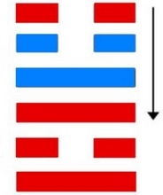
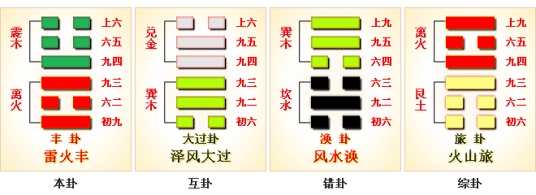
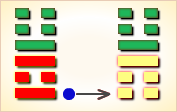
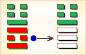
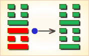
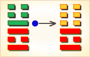
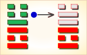
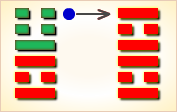

# 丰 ䷶



丰（䷶ fēng）卦的代号是`5:4`。主卦是`5`卦，离卦，卦象是火，光明而依附。客卦是`4`卦震卦，卦象是雷，运动而乏力。震卦和离卦的下爻和中爻都相同，区别在上爻：离卦的上爻，阳；震卦的上爻，阴。丰卦的爻辞中，主方被比喻为日食时的太阳，客方被比喻为日食中的月亮。这个卦的爻辞用全日食过程作比喻，说明主方在客方的激烈挑战前，应当抓住机遇，创造对主方更有利的新局面。

图中，红色表示当位的爻，天蓝色表示不当位的爻，箭头表示有应。

- 卦序：55

> 豐，亨，王假之，勿憂，宜日中。
>《彖》曰：豐，大也。明以動，故豐。王假之，尚大也；勿憂，宜日中，宜照天下也。日中則昃，月盈則食，天地盈虛，與時消息，而況於人乎？況於鬼神乎？
>《象》曰：雷電皆至，豐，君子以折獄致刑。

> 初九，遇其配主，雖旬无咎。往有尚。
>《象》曰：雖旬无咎，過旬災也。

> 六二，豐其蔀，日中見斗，往得疑疾，有孚發若，吉。
>《象》曰：有孚發若，信以發志也。

> 九三，豐其沛，日中見沬，折其右肱，无咎。
>《象》曰：豐其沛，不可大事也；折其右肱，終不可用也。

> 九四，豐其蔀，日中見斗，遇其夷主，吉。
>《象》曰：豐其蔀，位不當也；日中見斗，幽不明也；遇其夷主，吉行也。

> 六五，來章，有慶譽，吉。
>《象》曰：六五之吉，有慶也。

> 上六，豐其屋，蔀其家，闚其戶，闃其无人，三歲不覿，凶。
>《象》曰：豐其屋，天際翔也；闚其戶，闃其无人，自藏也。



```
丰（䷶ fēng）卦是异卦，下离上震，相叠。电闪雷鸣，成就巨大，喻达到顶峰，如日中天。
告戒：务必注意事物向相反方面发展，盛衰无常，不可不警惕。

《象传》：雷电交加，声势壮大，又离日动于天际，普照大地，皆为盛大之象。
```

运势：运势极强，为收获之时，但不宜贪得无厌，须知足常乐，要防是非、损财甚至火险。

- 事业：处于十分顺利的鼎盛时期，各方面都很顺利，成就很大。但务必注意开始出现的衰败症状，防微杜渐，严防骄傲自满。同时，不必盲目追求不切实际的事情，全力保持当前状况的延长。
- 经商：由于准确地把握了市场动态，商情对自己十分有利，可以大胆发展，但一定要密切注意行情，分析信息，稍有不慎，破产可能在一夜间。一旦破产应立即总结教训寻求真诚的合作者，早日走出困境。
- 求名：经过努力和奋斗，已获得成就，应注意保持和稳步发展，切勿追求虚名。
- 婚恋：可以成功，也会美满幸福，但若一方自持条件变化而动摇，则会导致不利。
- 决策：由于个人天资聪颖，条件好，因此各方面十分顺利。但务必深刻认识人生无常的真理，一切应保持适度，切记物极必反。更不应自我封闭，陷入困境，切莫灰心。

丰卦震上离下，为坎宫五世卦。丰即为盛大，本是吉兆，但盛极必衰，丰盛中也藏着隐忧，需小心谨慎。

盛大丰满，进财获利；谋望克遂，必有喜庆。

得此卦者，运势正强，谋事可成，名利双收。但不宜过贪，要知足常乐，谨防乐极生悲，损财甚至火险。

- 时运：气势正旺，谨慎小心。
- 财运：获利甚丰，须防诉讼。
- 家宅：宜向东南；天作之合。
- 身体：肝火上升，静养为宜。

```
丰：表示丰收之象。凡事积极奋发可成，有兴致高昂，
一时天雷勾动地火，闪电迅速达成之意，
此卦最利于短期投资理财，感情方面，情投意合则可速成。

解释：丰富，丰收。

特性：随和谦虚，懒散但内心急躁，被动，拖延，须人催促，
多偏财运或意外之好处，多异性之帮助。
```

运势：运势极强，为收获之时，但不宜贪得无厌，须知足常乐，要防是非，损财甚至火险。

- 家运：繁华幸福，但为人处事宜守分寸为要。
- 疾病：病况重，注意肝足疾及血压，心脏等疾。
- 胎孕：无碍。
- 子女：对子女宜多加教养，免招不幸。
- 周转：耐心应对，则可在短时间内达成。利在寅午未申日。
- 买卖：正直经营可获利。贪则有失。
- 等人：会来。亦会因故而很快离去。
- 寻人：此人会自觉不安而自己回来。
- 失物：尽快找寻，可失而复得。
- 外出：十分顺利。但应提高警惕，防止乐极生悲。
- 考试：及格有望。
- 诉讼：自己虽势如破竹，胜券在握，但也应提高警惕。
- 求事：有利。
- 改行：改行不可三心二意。
- 开业：开业者吉利。

### 初九：遇其配主，虽旬无咎；往有尚。《象》曰：虽旬无咎，过旬灾也。

旅途之中受到一位女主人的接待，与这位寡居的女人结成夫妻。占卜结果显示：不会遭人议论，而且能得到人们的赞同。《象传》说：十日之内没有灾难，意思是超过一旬就有灾了。

平：得此爻者，得贵人提拔，谋望有成，不良者有大过，必招灾殃。做官的会遇到明主，得以晋升。

- 时运：贵人相助，十年好运。
- 财运：货物正巧，十日有利。
- 家宅：可以安居；婚姻宜速。
- 身体：良医十日可愈，久则不治。



初九爻动变得[第62卦：雷山小过](e5b08fe8bf87xiaoguo_cn.md)。

雷山小过䷽是异卦，下艮上震，相叠。艮为山，震为雷。过山雷鸣，不可不畏惧。阳为大，阴为小，卦外四阴超过中二阳，故称“小过”，小有越过。

### 六二：丰其蔀，日中见斗。往得疑疾。有孚发若，吉。《象》曰：有孚发若，信以发志也。

将小席拼缀起来，躺下休息。正午时分，有人说看见北斗星。看来旅伴之中有人精神错乱。对他加以刺激，或许可以使他清醒。《象传》说：存心诚信，一言一行都能表现出来，因为这是坦白直率地表达了自己的心愿。

吉：得此爻者，有久困发财之美，有讼者不辩自明，有病者会愈。做官的忠言多阻于邪议，先失后得。

- 时运：坚守正道，逢凶化吉。
- 财运：以诚待人，拨云见月。
- 家宅：明亮为宜；始疑终谐。
- 身体：狭心之症，需要开导。



六二爻动变得[第34卦：雷天大壮](e5a4a7e5a3aedazhuang_cn.md)。

雷天大壮䷡是异卦，下乾上震，相叠。震为雷；乾为天。乾刚震动。天鸣雷，云雷滚，声势宏大，阳气盛壮，万物生长。刚壮有力故曰壮。大而且壮，故名大壮。四阳壮盛，积极而有所作为，上正下正，标正影直。

### 九三：丰其沛，日中见昧。折其右肱，无咎。《象》曰：丰其沛，不可大事也。折其右肱，终不可用也。

将铺草加厚，躺下休息。正午时分，此人又说看见鬼魅。将他的右臂折断。经此一吓，或许他能清静。《象传》说：将铺草加厚，这起不了什么大的作用。将其右臂折断，那他就终身残废了。

平：得此爻者，营谋难遂，或明而受蔽，争诉日起，或手足有疾，难于做事。做官的有告休之兆。

- 时运：气运颠倒，须防灾难。
- 财运：涨跌难测，颇有损耗。
- 家宅：只可暂居。
- 身体：右臂受伤。



九三爻动变得[第51卦：震为雷](e99c87zhen_cn.md)。

震为雷䷲是同卦，下震上震，相叠。震为雷，两震相叠，反响巨大，可消除沉闷之气，亨通畅达。平日应居安思危，怀恐惧心理，不敢有所怠慢，遇到突发事变，也能安然自若，谈笑如常。

### 九四：丰其蔀，日中见斗。遇其夷主，吉。《象》曰：丰其蔀，位不当也。日中见斗，幽不明也。遇其夷主，吉，行也。

将小席拼缀起来，躺下休息。正午时分，此人还在说看见北斗星，看来还未恢复正常。幸好遇着了他的老店主，把他托付给老店主，这一下可清静平安了。《象传》说：将小席拼缀起来，随地休息，是所处不得当，正如九四阳爻而处于阴位一样。正午时分看见北斗，也许天空迷暗不明的缘故。遇着他的老店主，这是吉利之行。

平：得此爻者，明而受蔽，得人解释而吉。做官的受到领导和同僚的猜忌，位不安。

- 时运：际遇不佳，由暗向明。
- 财运：走出暗昧，找到买主。
- 家宅：成败在人；巧遇良缘。
- 身体：眼疾待良医。



九四爻动变得[第36卦：地火明夷](e6988ee5a4b7mingyi_cn.md)。

地火明夷䷣是异卦，下离上坤，相叠。离为明，坤为顺；离为日；坤为地。

日没入地，光明受损，前途不明，环境困难，宜遵时养晦，坚守正道，外愚内慧，韬光养晦。

### 六五：来章，有庆誉，吉。《象》曰：六五之吉，有庆也。

赚得美玉，大家都庆贺夸奖他。这是吉利之兆。《象传》说：六五爻辞所讲的吉利，是因为有吉庆之事。

吉：得此爻者，会得好人提举，谋望称意。读书人会取得佳绩。

- 时运：实至名归，自然吉祥。
- 财运：经商有成，利名并至。
- 家宅：名门正户；天作之合。
- 身体：名医治之。



六五爻动变得[第49卦：泽火革](e99da9ge_cn.md)。

泽火革䷰是异卦，下离上兑，相叠。离为火、兑为泽，泽内有水。水在上而下浇，火在下而上升。火旺水干，水大火熄。二者相生亦相克，必然出现变革。变革是宇宙的基本规律。

### 上六。丰其屋，蔀其家，窥其户，阒其无人，三岁不见，凶。《象》曰：丰其屋，天际翔也。窥其户，阒其无人，自藏也。

房子空荡荡的，屋顶上散乱盖着草席，从门缝里探视，寂无一人。看样子这里多年未住人了。这是不祥之兆。《象传》说：增修扩建房屋，看来此人如鸟飞蓝天，志得意满，发财不小。从门缝里探视，寂无一人，看来财多害身，横遭灾祸，他逃生去了。

凶：得此爻者，骨肉相残，离祖成家，难免口舌之争。做官的位高者有危。

- 时运：有命无人，不堪设想。
- 财运：无人经营，一筹莫展。
- 家宅：没落之家；婚姻不详。
- 身体：大限将至。



上六爻动变得[第30卦：离为火](e7a6bbli_cn.md)。

离为火䷝是同卦，下离上离，相叠。离者丽也，附着之意，一阴附丽，上下二阳，该卦象征火，内空外明。离为火、为明，太阳反复升落，运行不息，柔顺为心。

# [Fēng ䷶](e4b8b0feng.md)
