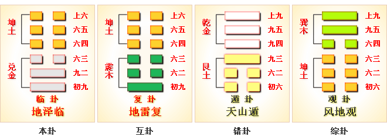

# 临 ䷒ lín

- No. 19

> 臨，元亨利貞，至于八月有凶。
>《彖》曰：臨，剛浸而長，說而順，剛中而應，大亨以正，天之道也；至于八月有凶，消不久也。
>《象》曰：澤上有地，臨。君子以教思无窮，容保民无疆。

> 初九，咸臨，貞吉。
>《象》曰：咸臨貞吉，志行正也。

> 九二，咸臨，吉，无不利。
>《象》曰：咸臨吉无不利，未順命也。

> 六三，甘臨，无攸利。既憂之，无咎。
>《象》曰：甘臨，位不當也，既憂之，咎不長也。

> 六四，至臨，无咎。
>《象》曰：至臨无咎，位當也。

> 六五，知臨，大君之宜，吉。
>《象》曰：大君之宜，行中之謂也。

> 上六，敦臨，吉，无咎。
>《象》曰：敦臨之吉，志在內也。

阳长阴消悦而顺，金土应候刚柔分。震入兑，二阳刚，本体阴柔降入临，临者大也。阳爻健顺，阳交退散。《易》曰：“君子之道”。《易》云：“至于八月凶。”
> 建丑至未也。

阳长，六爻反复，吉凶之道可见矣。
> 至于八月入遁。

与兑为飞伏，
> 丁卯木，乙巳火。

九二大夫立世，六五至尊应上位。建始丙申至辛丑，
> 立秋，大寒。

七月积气至六月，吉凶随爻考污隆。
> 旺则隆，衰则污。

积筭起辛丑至庚子。
> 积筭起金土入卦，推休咎于六爻。

五星从位起荧惑，
> 荧惑火星，入卦用事。

翼宿从位在丁卯，
> 二十八宿，翼宿入卦九二爻木上。

分气候三十六。
> 定阴阳之数，起于三十六积筭。

坤下见兑，悦泽临。阳升阴降，入三阳，乾象入坤，即泰卦。
> 临卦内象先阳长，逼阴成乾为泰象。

外坤积阴，内兑亦为阴，二阳合体，柔顺之道，不可贞。吉凶以时，配于六位，用于阳长之爻，成临之义。

六三将变阳爻，至次降入泰卦。
> 次入地天泰卦。

# [Lín ䷒](e4b8b4lin.md)
