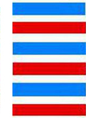

# ䷀ Qián

* Heaven, Strength

> Chinese: qián 乾 ䷀

<a id="p-57"/>

**䷀ Qián** (represents) what is great and originating, penetrating, advantageous, correct and firm.

1. In the first (or lowest) `NINE`, undivided, (we see its subject as) the dragon lying hid (in the deep). It is not the time for active doing.

> **䷀** changing to [**䷫**](e5a7a4gou.md#44.1)

> Matching Line 1 in Adjacent Hexagram: [**䷁**](e59da4kun.md#2.1)

2. In the second `NINE`, undivided, (we see its subject as) the dragon appearing in the field. It will be advantageous to meet with the great man.

> **䷀** changing to [**䷌**](e5908ce4babatongren.md#13.2)

> Matching Line 2 in Adjacent Hexagram: [**䷁**](e59da4kun.md#2.2)

3. In the third `NINE`, undivided, (we see its subject as) the superior man active and vigilant all the day, and in the evening still careful and apprehensive. (The position is) dangerous, but there will be no mistake.

> **䷀** changing to [**䷉**](e5b1a5lv.md#10.3)

> Matching Line 3 in Adjacent Hexagram: [**䷁**](e59da4kun.md#2.3)

4. In the fourth `NINE`, undivided, (we see its subject as the dragon looking) as if he were leaping up, but still in the deep. There will be no mistake.

> **䷀** changing to [**䷈**](e5b08fe7959cxiaoxu.md#9.4)

> Matching Line 4 in Adjacent Hexagram: [**䷁**](e59da4kun.md#2.4)

5. In the fifth `NINE`, undivided, (we see its subject as) the dragon on the wing in the sky. It will be advantageous to meet with the great man.

> **䷀** changing to [**䷍**](e5a4a7e69c89dayou.md#14.5)

> Matching Line 5 in Adjacent Hexagram: [**䷁**](e59da4kun.md#2.5)

<a id="p-58"/>

6. In the sixth (or topmost) `NINE`, undivided, (we see its subject as) the dragon exceeding the proper limits. There will be occasion for repentance.

> **䷀** changing to [**䷪**](e5a4acguai.md#43.6)

> Matching Line 6 in Adjacent Hexagram: [**䷁**](e59da4kun.md#2.6)

7.(The lines of this hexagram are all strong and undivided, as appears from) the use of the number `NINE`. If the host of dragons (thus) appearing were to divest themselves of their heads, there would be good fortune.

> **䷀** changing to [**䷁**](e59da4kun.md)

## Notes

The Text under each hexagram consists of one paragraph by [king Wén](https://en.wikipedia.org/wiki/King_Wen_of_Zhou), explaining the figure as a whole, and of six (in the case of hexagrams 1 and 2, of seven) paragraphs by the [duke of Zhōu](https://en.wikipedia.org/wiki/Duke_of_Zhou), explaining the individual lines. The explanatory notices introduced above to this effect will not be repeated. A double space will be used to mark off the portion of [king Wén](https://en.wikipedia.org/wiki/King_Wen_of_Zhou) from that of his son.

Each hexagram consists of two of the trigrams of [Fú Xī](https://en.wikipedia.org/wiki/Fuxi), the lower being called the `inner`, and the one above the `outer`. The lines, however, are numbered from one to six, commencing with the lowest. To denote the number of it and of the sixth line, the terms for `commencing` and `topmost` are used. The intermediate lines are simply `second`, `third`, &c. As the lines must be either whole or divided, technically called `strong` and `weak`, `yáng` and `yīn`, this distinction is indicated by the application to them of the numbers `nine` and `six`. All whole lines are `nine`, all divided lines, `six`.

Two explanations have been proposed of this application of these numbers. The trigram **Qián**, it is said, contains 3 strokes (**☰**), and the **Kūn** 6 (**☷**). But the `yáng` contains the `yīn` in itself, and its representative number will be 3 + 6 = 9, while the `yīn`, not containing the `yáng`, will only have its own number or 6. This explanation, entirely arbitrary, is new deservedly abandoned. The other is based on the use of the '[four `Xiàng`](https://image.slidesharecdn.com/random-150428005651-conversion-gate02/95/-15-638.jpg?cb=1430200687),' or emblematic figures (**⚌** the great or old `yáng`, **⚎** the young `yáng`, **⚏** the old `yīn`, and **⚍** the young `yīn`). To these are assigned (by what process is unimportant for our present purpose) the numbers 9, 8, 7, 6. They were 'the old `yáng`,' represented by 9, and 'the old `yīn`,' represented by 6, that, in the manipulation of the stalks to form new diagrams, determined the changes of figure; and so 9 and 6 came to be used as the [names](e59da4kun.md#p-59) of a `yáng` line and a `yīn` line respectively. This explanation is now universally acquiesced in. The nomenclature of first nine, nine two, &c., or first six, six two, &c., however, is merely a jargon; and I have preferred to use, instead of it, in the translation, in order to describe the lines, the names 'undivided' and 'divided.'

Does [king Wén](https://en.wikipedia.org/wiki/King_Wen_of_Zhou) ascribe four attributes here to **䷀ Qián**, or only two? According to [Appendix IV](appendix04s1.md), always by Chinese writers assigned to Confucius, he assigns four, corresponding to the principles of benevolence, righteousness, propriety, and knowledge in man's nature. [Zhū Xī](https://en.wikipedia.org/wiki/Zhu_Xi) held that he assigned only two, and that we should translate, 'greatly penetrating,' and 'requires to be correct and firm,' two responses in divination. Up and down throughout the Text of the 64 hexagrams, we often find the characters thus coupled together. Both interpretations are possible. I have followed what is accepted as the view of Confucius. It would take pages to give a tithe of what has been written in justification of it, and to reconcile it with the other.

'The dragon' is the symbol employed by the [duke of Zhōu](https://en.wikipedia.org/wiki/Duke_of_Zhou) to represent 'the superior man' and especially 'the great man,' exhibiting the virtues or attributes characteristic of heaven. The creature's. proper home is in the water, but it can disport itself on the land, and also fly and soar aloft. It has been from the earliest time the emblem with the Chinese of the highest dignity and wisdom, of sovereignty and sagehood, the combination of which constitutes 'the great man.' One emblem runs through the lines of many of the hexagrams as here.

But the dragon appears in the sixth line as going beyond the proper limits. The ruling-sage has gone through all the sphere in which he is called on to display his attributes; it is time for him to relax. The line should not be always pulled tight; the bow should not be always kept drawn. The [unchanging use of force](e59da4kun.md#p-60) will give occasion for repentance. The moral meaning found in the line is that 'the high shall be abased.'

The meaning given to the supernumerary paragraph is the opposite of that of paragraph 6. The 'host of dragons without their heads' would give us the next hexagram, or [**䷁ Kūn**](e59da4kun.md), made up of six divided lines. Force would have given place to submission, and haughtiness to humility; and the result would be good fortune. Such at least is the interpretation of the paragraph given in a narrative of the [Zuǒ Zhuàn](https://en.wikipedia.org/wiki/Zuo_zhuan) under B. C. 513. For further explanation of the [duke of Zhōu](https://en.wikipedia.org/wiki/Duke_of_Zhou)'s meaning, see [Appendixes II](appendix02s1.md) and [Appendixes IV](appendix04s1.md).

# [乾 ䷀](e4b9beqian_cn.md)
