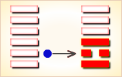

# 乾 ䷀


乾（qián）卦代号是`7:7`，主卦和客卦都是`1`卦乾卦，
三条爻当位，三条爻不当位，不存在有应关系。卦象是天，特性是强健。

《象》曰：天行健，君子以自强不息。卦辞为“元亨利贞”。
乾卦主显，是“显学”，坤卦主隐，是隐学。

两卦不可分割，乃是一个整体，是万物运动最本质的过程。
乾卦讲的是一个事物从发生到繁荣的过程，即春生--夏长，与坤卦相反，坤卦讲秋收冬藏的过程。

主方和客方都很强健，主卦和客卦的阳数比是`1:1`，是二个最大阳数的比，
主客双方势均力敌，双方都有强大的力量，也都有同样的高亢缺点，
可以是强健的竞争者，也可能是双赢的合作者，关键在于主方如何巧妙地处理。

图中，红色表示当位的爻，天蓝色表示不当位的爻。 乾卦的各条爻之间没有有应。

- 卦象：乾下乾上
- 卦辞：元亨利贞。
- 用九：见群龙无首，吉。
- 特征：强健
- 名言：自强不息、潜龙勿用、亢龙有悔。
- 代号：`7:7`
- 卦序：1

## 总述

乾为天，刚健中正。象征龙（德才两全的君子），又象征纯粹的阳和健，表明兴盛强健。乾卦是根据万物变通的道理，以“元、亨、利、贞”为卦辞，示吉祥如意，教导人遵守天道的德行。

乾，天也。也就是形成一切的宇宙世界。它广袤无垠，无穷无尽，幽深玄奥，复杂精妙。依照我们当代天文认为它应该是一个具有一定规律的形式多样的处在不断运动的各大星系和星系团总成。它们之间应该是相互作用的普遍联系的不断发展的不以人意志为转移的客观物质世界。而地球只不过是在这星系、星系团中围绕太阳系自转公转同转的行星之一，由于其特定的位置和引力赋予了人类生命和万物的丛生，从而也芸生了人类对宇宙的起源天体的形成和生命的孕育不断求索的伟大革命。

一直以来，我们对天有着无限敬畏与崇仰，有着无限猜测和假想，更有着无限求知与探索。自从女娲造人的神话故事到《宇宙爆炸论》，从达尔文的《进化论》到现代科学的分子生物技术，我们无不在探索宇宙的起源天体的形成和生命的孕育。我们的一切努力都是在认识世界，改造世界！

但综观天象，旷日持久，展现在人们眼前的总是日月往来，寒暑交替，周而复始。府察地理，展现人们眼前的总是生死往来，老幼更替，生生不息。因此我们的先人说天是一切形成之本，万物生存之源，是以它元始、亨通、吉利、中贞，并对天进行了前所未有的赞美和概叹。

### 应用条件

需要客观地、全面地、准确地分析主方和客方情况，必须至少符合下列条件之一，此卦才有参考价值：

1. 主方与天很相似，客方也与天很相似。
2. 主方阳数是`7`，客方阳数也是`7`。
3. 主方的行动是阳，素质是阳，态度是阳；客方的行动、素质和态度也是阳、阳和阳。

切勿用任何随机数方式起卦，否则此卦不能用作决策工具。

## 爻辞结构

图中，有三条红色的爻，有三条天蓝色的爻。红色的爻在第一、三和五的位置上，这三个位置叫阳位，阳爻在阳位，称作当位，这三条爻都是当位，这是三个对主方有利的潜在因素。卦中，第二、四和六的位置，叫阴位，阴爻在阴位，称作当位，阳爻在阴位，称作不当位，这三个位置上的爻都是阳爻，都不当位，这是三个对主方不利的潜在因素。前面，很多卦的结构图中有箭头，表示阴阳和谐关系，那叫有应，这里，没有有应的爻，这表明主方与客方当前关系中，没有和谐，只有矛盾。换句话说，乾卦中，六条爻所表示出的对主方有利或者不利的因素，都是潜在的，没有真正的，关键在于主方如何处理，利用有利的潜在因素，避免发生不利因素。还要注意，主方不能改变客方的情况，只能使主方自己的情况发生变化。

### 主卦的三条爻

主卦下爻代表主方的行动，当位，这是对主方有利的潜在因素，主方不须要改变自己的积极主动行动，但是，须要耐心地等待客方发生变化，一旦客方有消极被动表现，就是好机会，捕捉这样的良机。主卦的中爻代表主方素质，不当位，表示在与客方相处中，主方的良好素质可能受损失，这是对主方不利的潜在因素。为了避免这种不利的潜在因素成为真正的对主方不利的因素，一方面，主方不能自满，要努力找出自己的不足之处，找到可以从客方的良好素质取得补益的地方；另一方面，要用自己的积极行动和坚定的态度保护自己的良好素质。

上爻代表主方态度，当位，表示这是一个对主方有利的潜在因素，主方可以用强硬态度，不让客方伤害自己的素质。不过，客方态度也强硬，主方应当耐心地从客方的态度发现可以利用的机会，从而抑制客方，保护自己的素质，或者从客方的良好素质获益。这里要注意，上爻是对中爻的补充，中爻与上爻都是阳爻，表示素质非常好，实力非常强大，这就存在傲慢和粗暴的可能，所以，主方在保持强硬态度的同时，要避免强硬过度，避免傲慢，避免粗暴。

乾卦的爻辞描述了龙。在生物进化史中，有过庞大的恐龙，不过，龙不是恐龙，而是一种中华民族塑造出的虚拟动物。爻辞中的龙，能潜于深水，能出现于田野，能跳跃在深渊，又能飞舞在天，君子像龙一样兢兢业业，“终日乾乾”，又高度警惕外来侵犯，“夕惕若”。然而，龙有一个缺点：亢。“亢龙，有悔”。在事物的螺旋线发展规律中，乾卦是发展的顶峰，再往前就将衰落，龙的强健的优点和亢的缺点全面地反映了乾卦在螺旋线发展规律中的位置。删去判断词，六条爻辞就是一首位置的以“乾”为主题的散文诗，下面是其译文。

```
（机会不到时像巨龙或是潜伏深谷，
或是腾跃而起，不会有灾难。
（像）看见龙出现在大地上，
有利于大德大才的人出来治世。
他终日兢兢业业，晚间保持警惕，
（他像）龙有时在深渊中跳跃，
（随时准备跃出去），
（一旦机会到来，他就像）龙在天上飞舞，
表现得（真正）像大人物。
（注意啊）高傲的龙，（会）有悔恨。
```

与别的卦不同，乾卦有一条用阳，用阳突出了克服缺点亢的重要性，没有亢，就“见群龙无首”，就吉。正是由于乾卦的强健性质和亢的缺点，`7:7`卦乾卦，并不是特别对主方有利的卦，在整个卦爻辞中，没有一个“吉”字，只有“亨”、“利”、“悔”和“咎”等比较一般的判断词，仅仅是在用阳中，在“见群龙无首”的情况下，才有“吉”。

下面逐条说明卦爻辞：

### 乾卦译文
```
乾，元，亨，利，贞。

译文：
乾，天下第一卦，俯罩上下与四方，
进退与动静皆利，乃天下正义之所在。

上九：亢龙有悔。
译文：
在正常情况下 你的发展已经到了顶端。
应该要开始重点思考各种禁忌了，什么功高盖主、
权大欺主、才大压主等等等等都要尽可能地避免。
这才是生存之道。

九五：飞龙在天，利见大人。
译文：
你的光芒被比大人物更大的大人物发现了，
并且召见了你。
你得到了信任与重用，
这是你光芒最耀眼的时刻。
若飞龙在天翻云覆雨的时刻。

九四：或跃在渊，无咎。
译文：
有了一展才华的机会。 把握时机，一展身手吧。
放心，不会有啥问题的。

九三：君子终日乾乾，夕惕若厉，无咎。
译文：
不能因为下山了就荒废功课。
要深知功夫不进则退的道理，日夜精进。
必须要具有忧患意识，这样才不会有所差错。

九二：见龙在田，利见大人。
译文：
修炼初成，可以下山初展锋芒了。
如果见到已是大人物的大人物，
以自己的身手是足可以得到其大人物的赏识与重用的。

初九：潜龙勿用。
译文：
生来就不是平凡的人，
这是注定要呼风唤雨笑傲云端的大人物。
但是暂时还处在修炼阶段，不宜出山。
```

## 乾卦卦义
### 乾为天（乾卦）刚健中正
### 上上卦

《象》曰：困龙得水好运交，不由喜气上眉梢，一切谋望皆如意，向后时运渐渐高。

### 乾卦卦辞
```
〖卦辞原文〗元亨利贞。

〖译文〗很顺利，利于坚持下去。

〖解说〗卦辞反映从主方的角度，
考虑主客关系的现状及发展变化。
“亨”，通达，顺利；如，万事亨通。
“通达”和“顺利”都可以表示事物发展和变化的状态。
“贞”，坚持。“元亨”，事情进展很顺利。
主方能否面对挑战取得胜利，
取决于如何发挥自己的优势，克服客方造成的困难。
主方应当努力将当前状态坚持下去，
既不宜在挑战前退却，也不宜不考虑客方的态度而盲动。
《子夏传》说：
元为原始之意；亨为开通之意；利为和谐之意；贞为贞固之意。
“贞”在近现代学者的研究中，更普遍地认为是占卜的意思。
```

### 彖传
```
大哉乾元，万物资始，乃统天。
云行雨施，品物流形。
大明终始，六位时成。
时乘六龙以御天。
乾道变化，各正性命，保合太和，乃利贞。
首出庶物，万国咸宁。

〖注释〗
① 彖（tuàn），《周易正义》：
“彖，断也，断定一卦之义，所以名为彖也。
”古人以《彖》上下、《象》上下、
《系辞》上下凡六篇和《文言》、《说卦》、
《序卦》、《杂卦》凡四篇，合称十翼。
用十翼以释经，故又称《易传》。
② 乾，天。元，始，犹言创始。
③ 资，凭借，依赖。
④ 统。统率。统天，犹言统属于天。
⑤ 品，品类。
这里用如动词，有繁殖义。品物，繁殖万物。
流，这里引申为赋予。流形，赋予形体。
⑥ 大明，高亨说：
“《集解》引侯果曰：‘大明，日也。’甚是。
终，谓日入；始，谓日出。”
⑦ 御，《集解》引苟爽曰：御者，行也。”
上古神话，日乘着六条飞龙拉着的车子，
以羲和为御，运行在天空。
⑧ 保，保持。合，调整。大和，大读为太。
太和，指自然界的一种普遍调顺谐和的关系。
利，施利。贞，中正。
《彖》、《象》释贞多用此意，与经意有出入。
⑨ 庶，众。庶物，犹言万物。
首出庶物，当指天的功德超出万种物类。咸，皆，周遍。

〖译文〗
《彖》辞说：伟大啊，上天的开创之功。
万物依赖于它而获得了资生，所有一切统统属于天。
云在飘行，雨在降洒，繁殖万物，赋予形体。
太阳运行，升上降下，出东没西，
向南朝北，六方位置，依太阳的轨迹而得以确定。
太阳驾驶着六条飞龙在空中有规律的运行。
这种运行变化，形成季节气候，
万物从而在大自然中找到适合生存的地位。
天的运行，保持、调整着全面和谐的关系，
于是达到普利万物，正常循环的境界。
天的功德超出万种物类，给万国带来普遍的康宁。
```

### 象传
```
《象》曰：天行健，君子以自强不息。

〖注释〗
① 象，《易·乾》疏：“圣人设卦以写万物之象。
后人用文字以释万物之所象，故曰象。”
《象》，易传名，十翼之一。
它主要是依据卦象、爻位对卦辞、爻辞进行解释，评价，推衍。
其内容贯穿着儒家政治伦理思想。
② 行，王引之说：“行，道也。天行谓天道也。”
君子，指德才兼备的人。
② 行，王引之说：“行，道也。天行谓天道也。”
君子，指德才兼备的人。
《象辞》释卦辞，通常将卦象所表示的自然现象，
与人的品德行为勉强地联系起来加以阐发。

〖译文〗
《象》辞说：天行刚健、永恒不息、生生存在，
它“不为尧存，不为桀亡，”浑然天成。
因此君子观此当博击于这个无限神奇的世界，
自强不息、奋进不已！
```

### 哲学解读

元亨讲的内卦，利贞讲的外卦。乾卦主显，是“显学”，坤卦主隐，是隐学。
两卦不可分割，乃是一个整体，是万物运动最本质的过程。
乾坤二卦也是六十四卦的纲要，因为乾坤二卦变化的过程当中，包涵了其他所有的卦。
乾卦讲的是一个事物从发生到繁荣的过程，即春生 --- 夏长，坤卦则相反，讲的是秋收 --- 冬藏的过程。

“元亨利贞”为乾之四德，是天道的本质，核心就是一个生字。《系辞》说：“天地之大德曰生。”生是一个动态的过程，可以区为分四个层次历然的阶段，元者，万物之始；亨者，万物之长；利者，万物之遂；贞者，万物之成。与四时相配，元为春生，亨为夏长，利为秋收，贞为冬藏。这个动态的过程发展到贞的阶段并未终结，而是贞下起元，冬去春来，开始又一轮的循环，因而生生不息，变化日新，永葆蓬勃的生机。
“首出庶物，万国咸宁。”这两句是指把天道运行的规律应用于人事所创造的业绩。“首出庶物”是就物质生产的管理而言的，“万国咸宁”是就社会政治的管理而言的。

《周易》认为，天地无心而成化，鼓万物而不与圣人同忧，无思虑，无目的，尽管通过自然的运行“保合太和”，却不会有什么自觉的管理行为，管理行为是人类所特有的，必须设定一个价值取向和管理目标，自觉地经营谋划，合理安排。天地无心，人类有心，天地无为，人类有为，这是宇宙的自然史与人类的文明史的根本区别所在。管理之所以必要，是因为天能生物而不能辨物，地能载人而不能治人，天与人各有不同的分职。管理之所以可以，是因为人类可以推天道以明人事，顺应自然界的和谐规律来参赞天地之化育，促进事物的发展，在物资生产方面可以“首出庶物”，促进物产丰富，经济繁荣，在社会政治方面可以“万国咸宁”，促进政通人和，天下太平。

### 乾卦易象

乾卦的易象为上，中，下三爻皆阳爻，为全阳之卦。故代表天（即其大象）。就广范意义之象（即广象）乃为天，强，高大，宽广，尊贵，运动不止，明亮，纯净，健全等。

## 爻辞解释
### 用九
```
〖原文〗见群龙无首，吉。

〖注释〗① 用九，《乾》卦特有的爻题。
汉帛书《周易》作“迥九”。
迥，通。用九即为通九，犹言六爻皆九。
属阳性，表示全阳爻将尽变为阴爻。

〖译文〗出现龙群，看不出首领，吉利。

〖解说〗用阳为乾卦所特有，
说明如何使用阳的概念。
阳代表天的性质，龙是阳的鲜明形象，
乾卦的六条爻辞具体描述了龙的特性，
潜、惕、跃、飞，都表现出了龙的强健，
然而，龙也有“亢”的缺点，这个缺点使得龙爱争霸。
主客双方关系中，如果主方具有龙的特点，
又克服了“亢”的缺点，就能够与客方一起；
如果客方也如此，双方都不争霸，
就出现“群龙无首”的局面，
这局面对于主方来说是吉利的。
在此，“吉”，仍然是针对主方说的，
因为别卦是以主方为观察情况的基点。
乾卦加了这条用阳，
特别强调运用阳的强健性质的时候，
不要忽略其“亢”缺点。
用九，即首尾交接，天人合一。
《易经》中，只有两卦是有七个卦辞——乾卦与坤卦。
周文王在乾卦的用九中写道：“见群龙无首，吉。”
为什么呢？
一般形容群龙无首，多是贬义词，
但周文王却说群龙无首是吉。
其实确实如此，
如果大家已成为龙，或成为成熟的领导者，
每个人都可以做好自己的工作，
那当然是吉，这就是群龙的境界。
在此，人人都可以成长，人人都可以成为领导者，
每个人都能够在自己的岗位上成为出类拔萃的领导者。
最高的领导者不以领袖自居，
不是每天在提醒人家：别忘记我还是局长、市长或书记。
不用提醒，人家自然会尊敬你，
都能够自然而然地把工作做好。
如果能够达到这种境界，那就是一种忘我的理想状态。
群龙：人人如龙。无首：每个人都能有自己的精神世界。

【象传】用九，天德不可为首也。

〖译文〗《象辞》说：
六爻全阳，纯阳纯刚正是天道之性，
至高无上，不可能再有别的首领。

〖注释〗① 用九天德，因《乾》卦六爻皆为九，
属纯阳纯刚之性，这正是天的品德的最为集中的反映。

〖解说〗现群龙相互平等和谐亲善没有首领，十分吉祥。
“用九”的爻象说明，天虽生万物，但却不居首、不居功。
原因是天下是天下人的天下，
并不是靠某一个人的善举和能力能匡正。
因此每个人当通乎已之不足，
而礼上敬下尊贤使能不自居其功。
见群龙无首并不是说不要首领，
而是要讲究互为的合作，要讲究相互的尊重，
要讲究彼此的平等，故君当以天下为公。
同勉共进、互为博长、默契配合，
唯此必将营造出一个和谐的社会和繁荣的世界，
催生出多姿多彩的百花齐放的现代文明。
历史唯物主义认为人民才是历史的主体。
因此作为君子必须要树立群众观点，
坚持群众路线、为人民群众的利益而奋斗。
因此作为党和派必须是群众，
而不是个体也不属于某一阶级，
又怎能自我为首呢。
```

### 上九
```
〖原文〗亢龙有悔。

〖注释〗① 亢，王肃说：“穷高曰亢。”
子夏《传》：“亢，极也。”
悔，《系辞》：“悔吝者，忧虞之象也。”
亢龙有悔，以升腾到极高处的龙，
喻指身居崇高地位的统治者，
脱离臣民，孤高无辅，必遭灾祸。
因为上九之爻，居全卦之尽头，
在本卦系统中，乃是孤立无援之象。

〖译文〗高傲的龙，有悔恨。

〖解说1〗亢龙，龙飞过高，就叫亢，
刚过易折也是这个意思。
这一爻秉持了一个自然宇宙的规律，
就是阴阳的相互变化，
一种事物从来没有无限制的兴盛下去。
生的另一面就预示着死亡。
乾卦从初九累积发展到上九，已经达到一个极致，
所谓阳极生阴，此时乾卦中生出一丝坤元来，
这就是坤卦的初六：履霜，坚冰至。
他这是在告诉我们，坤元开始凝聚了。
“亢龙有悔”的悔就是指的这一丝坤元。
用九：见群龙无首，吉。

〖解说2〗这是乾卦第六爻爻辞，代表客方态度。
这个爻是阳爻，象征客方态度强硬。
主方为了显示自己的能力和成绩，
又不大爱听别人意见，就有可能一意孤行，
从而可能招致由态度强硬的客方来的麻烦、使自己受到损失，
为自己的高傲态度后悔，正如爻辞告诫“亢龙有悔”。
所以，“亢龙有悔”这句话不是针对客方说的，
而是针对主方说的。
客方态度是客观存在的条件，
主方需要适应这个条件约束自己的行为。
如果主方谨慎从事，为龙而不亢，则不致有悔。
“亢”(kàng)，高，高傲：高亢。

〖结构分析〗第六爻位置是阴位，
这条爻是阳爻，阳爻在阴位，
不当位，并且和三阳不有应。
不当位表明客方的态度强硬，
是对主方不利的潜在因素，
主方有可能受到客方的压抑；
不有应表明主方态度也强硬，不接受客方压抑，
这不利的潜在因素并没有成为真正的对主方不利的因素。
然而，第六爻是对第五爻的补充，第五爻和第六爻都是阳爻，
表示客方素质非常好，实力非常强大，
因此，客方可能强硬过分，显得傲慢与粗暴；
另一方面，第三爻是对第二爻的补充，
主方态度也可能强硬过度，也表现得傲慢和粗暴。
主方和客方都是“亢龙”，
主方的傲慢与粗暴有可能激励傲慢的客方更粗暴，
从而使主方受到损失，主方为之悔恨，“有悔”。

【象传】亢龙有悔，盈不可久也。

〖译文〗《象辞》说：
升腾到极限的龙会有灾祸之困，
这是警戒人们崇高、盈满是不可能长久保持的。
亢是亢奋的意思。
亢奋自傲而忘忧患势必局限自我，而坐井观天与时势落伍。
有什么值得自傲的呢。
“世移则事移，事异则备变”，天下没有永恒的主题。
```

### 九五
```
〖原文〗飞龙在天，利见大人。

〖注释〗①飞龙在天，喻君子处尊贵之位。
〖译文〗龙在天上飞舞，利于表现得像大人物。

〖解说1〗龙、乾元本属天道，九四返回九五，
进入天道，就像人回到家一般自由自在，如鱼得水。
真是“天高任鸟飞，海阔任鱼游”。
这时候，无论是地位、才智，
都达到了成熟阶段，正是大展拳脚的时候。
而那片天空就是你要找的“大人”所提供给你。

〖解说2〗这是乾卦第五爻爻辞，
代表客方的素质。
这条爻是阳爻，象征客方素质良好。
这里的“龙”指主方。
这条爻辞深刻地表达了客方的良好素质有利于主方，
开辟了任主方这条“蛟龙”腾飞的广阔“天空”，
主方应当利用良好的机遇，充分发挥自己的聪明才智，
“飞龙在天，利见大人”。

〖结构分析〗第五爻位置是阳位，
这条爻是阳爻，阳爻在阳位，当位，然而与二阳不有应。
当位表明客方的良好素质是对主方有利的潜在因素，
不有应表明在素质方面不存在主方和客方的阴阳和谐关系，
不存在主方自然从客方素质得益的可能，
主方应当积极主动地从客方的良好素质夺取利益，
“飞龙在天”，并且展现出自己的全部威力，“利见大人”。

【象传】飞龙在天，大人造也。

〖注释〗① 造，朱熹说：“造，犹作也。”
大人造，犹言，
〖注释〗① 造，朱熹说：“造，犹作也。”
大人造，犹言，
（九五爻象表明）尊贵的君子大有所为，大有造化。
九五之爻，居阳位，又处于上卦中位，可谓性象相合，
所处得当，喻指君子处世得意，其事业如日中天。

〖译文〗《象辞》说：龙飞腾在空中，意味着君子大有所为。

〖解说〗虽然创造历史的是人民，
改造历史的是人民，
但不可否定满怀才德的君子，
起着真正富有生命力的先进阶级的先锋作用，
真正领导全体群众前进的作用。
他们如蜻蜓点水可洪荡四海，
以点带面能达善天下，怎能不为万民所敬仰呢？
是以大人造也。
龙是比喻有才德有上进心的先进人物，
是人民群众的领头雁和规划师，
是真正为人民谋福祉建功德的人，
因此人民是不会忘记他的，总是把他放在首位。
```

### 九四
```
〖原文〗或跃在渊，无咎。

〖注释〗① 或跃在渊，九四阳爻居上卦下位，
根据《系辞》“二与四，同功而异位，其善不同。
二多誉，四多惧”的理论，可见本卦九四之爻，
象征着处于进可取誉，退可免难的转折时期。
爻辞以龙跃深渊为喻，龙跃入深潭，退可藏身于千仞之下，
进可升腾于云天之外，进退有据，潜跃由心，
喻指君子处境从容，故无灾难。

〖译文〗龙可能一跃成天龙，也可能还在深渊，无所怪罪。

〖解说1〗九三的累积壮大，
终于到了人道的繁荣时刻。
无论是资历还是才能都到了。
这个时候刚来到上卦的九四，
由于自身乾元、龙性的影响，自己又不甘落后了，
一门心思，想攀上新的高峰，即是九五、上九的天道。
所谓人都求一个发展的极致，这里也是一样。
“或跃在渊”的或在这里可以理解为一种尝试，
九四尝试着上跃，上跃不行，则暂居渊中，以待时、位。
为什么占语是无咎？
因为九四在人道的才能、经验的累积将足未足，
尝试性的上跃，是没有错误的。

〖解说2〗第四爻是客卦下爻，
代表客方行动，阳，
表示客方积极主动地谋取和扩大自己的利益，
比如说，创新、创业、投资、进攻、求职、示爱，等等。
爻辞中暗示的“龙”指主方。
虽然，代表客方的经卦也是乾卦，
但是由于这是从主方的角度看双方关系，
在“或跃在渊”中的主语是“龙”，
与第一、二爻中的“龙”的意思是一致的，
代表主方，不代表客方。
这个爻辞中的“渊”象征客方的行动，
主方只能在客方限定的范围内行动，“或跃在渊”。
如果主方按客方要求行动，则无所罪怪，
这是一条界限，“或跃在渊，无咎”。
如果主方行动超越了客方规定的范围，就可能受到罪怪。

〖结构分析〗第四爻位置是阴位，这条爻是阳爻，
不当位，并且和一阳不有应。
不当位表明客方的积极主动可能损害主方的利益，
是对主方不利的潜在因素；
不有应表明客方的积极主动与主方的积极主动有矛盾，
由于这矛盾的存在，这潜在因素不能成为事实。
因此，主方必须谨慎行动，“或跃在渊”，
这是客观形势的需要，不要怪罪主方，“无咎”。

【象传】或跃在渊，进无咎也。

〖译文〗《象辞》说：龙也许跳进深潭，
表示可以有所作为而没有灾难。

〖解说〗或是也许的意思。从辩证哲学看，
不存在一成不变的绝对的神圣的东西，
世界也不是由一成不变的事物构成的，
而是过程的集合体，都处在生存和灭亡的不断变化之中。
因此，在活生生的生活事实中是不可能都处在一帆风顺的。
“如果处处一帆风顺那么创造世界也未必太容易了”。
而人类社会达到今天的文明与发展，
是人类经过长期的不断努力的结果，
是不断发展与改造所得来的产物，
是量到质的不断转变的渐进的过程。
因此“也许跳跃在深渊”并不表示没有进展，
只是小小的不顺而已，是以进又何咎。”
```

### 九三
```
〖原文〗君子终日乾乾，夕惕若厉，无咎。

〖注释〗
① 乾乾，勤奋努力。
② 惕，警惕。若，助词，无义。厉，危险。
无咎，没有灾难。本爻为阳位，居下卦之极。
根据《系辞》“三与五，同功而异位，三多凶，五多功”的理论，
可见本卦九三之爻，象征着君子处于既可大有作为，
而又充满凶险的处境之中，如能倍加勤勉戒惧，可以没有灾难。

〖译文〗有才德的君子始终是白天勤奋努力，
夜晚戒惧反省，虽然处境艰难，但终究没有灾难。

〖解说1〗“乾乾”是奋斗不息的意思，
好比那句“天行健，君子以自强不息”，就是这里来的。
爻辞的意思是：君子终日劳累奋斗不息，朝夕警惕忧患，
感觉前行的道路困难重重。占语是:这是没有错误的。
九二升至人道之初，刚从地道中突破出来，
于人于己，都是人道的开始，也是需要累积学习的，
加上乾元本身具有奋斗不息的品德，从初九到九三，内卦结束，
一直秉持乾元之德，乾为日，固有终日乾乾之象。
“夕惕若厉”，是因为九三处在内外变化之际。
或内或外，或上或下，三爻的努力全在于此。

〖解说2〗第三爻是主卦上爻，代表主方态度，
阳表示主方态度强硬。同时，第三爻是对第二爻的补充，
第二爻是阳，第三爻也是阳，这表示主方素质很好。
在强硬态度中，可能表现出傲慢、粗暴等缺点。
“君子”指品性好的人，传统上“君子”多指男性。
这里，“君子”指主方。主方应当克服自己的缺点，
勤勤恳恳地工作，“君子终日乾乾”，“夕惕若”。
在客方挑战前，如果主方不虚心听取客方意见，
过于表现自己，对主方自己来说是危险的，“厉”。
如果主方注意克服自己的缺点，
只要尽力而为，虚心谨慎，努力工作，即可“无咎”。
“厉无咎”，意为即使处在危险的境地，也能顺利度过，
“虽处危地而无咎也。”

〖结构分析〗第三爻位置是阳位，
这条爻是阳爻，阳爻在阳位，
当位，然而与六阳不有应。
当位表明主方强硬态度是正确的，
主方需要强硬态度以保护自己的利益，
并且在与客方的较量中取得优势，
这是对主方有利的潜在因素。
然而，客方态度也强硬，客方并不接受主方压抑，
这潜在的有利因素没有成为现实。
由此，主方须要继续努力增强自己的素质，
“君子终日乾乾”，切不可盲目自满，
要保持对客方的警惕，“夕惕若，厉无咎”。

【象传】终日乾乾，反复道也。

〖译文〗《象辞》说：
君子整日里勤奋努力，意思是反复行道，坚持不舍。

〖解说〗乾乾，奋进不已也；惕若，戒惧反省也。
君子终日里奋进不已还不到夜里就戒惧反省了，
那么哪怕前进的道路有多艰难也不会有什么灾咎。
其实“只要不是闭着眼睛，事情总是可以得到解决的。
”关键是我们要学会思考、学会借鉴、学会深入运动，
并反反复复地去验证道路。
脱离实际的具体的历史环境，
就会盲目从事和招到意想不到的危险，
因此君子当“终日乾乾，反复其道”，决不胡为。
```

### 九二
```
〖原文〗见（xiàn）龙在田，利见大人。

〖注释〗① 见，读若现，出现。
见龙，系“龙见”的倒装，犹言龙出现。
在田，犹言出现在大地上。
王弼说，“出潜离隐，故曰‘见龙’，处于地上，故曰‘在田’。
德施周普，居中不偏，虽非君位，君之德也。初则不彰。
三则乾乾，四则或跃，上则过亢。利见大人，唯二五焉。”
王弼对于《乾》卦整体结构的解说颇为有理。
本卦阳爻，由初爻而升到上位，爻辞以龙在地下，
人间，天空各个层次的变化来比拟这一爻象，
从而附会出人在人生的不同际遇中的自我作用和命运。
见龙在田，爻辞以龙出潜在田，
表示初九阳爻升进一步，居于下卦中位。
此位象极佳，比喻君子挣脱了压抑的处境，
开始步予社会生活，创造建功立业的条件。

〖译文〗龙在田野里出现了，利于表现为大人物。

〖解说1〗初九、九二爻同为地道，
九二爻乃是地道之中乾元累积足够，
即将冲出地道，彰显乾元之德的时候。
因而爻辞有“见龙在田”，“见”是出现的意思。
“利见大人”的“见”是拜见等意思。
当然，这里的拜见肯定不是所谓的“九五”爻。
因为在九五爻也有“利见大人”，不然，九五到哪里见大人去？
因此，九二爻所见的大人，相当于今天我们所说的“贵人”，
就像一个初出校门的学生，无论你有怎样的才华，
还需要有伯乐和慧眼者啊。
这里初九通过累积学习到了九二，自然有初露锋芒之象。

〖解说2〗第二爻是主卦中爻，
代表主方素质，这条爻是阳爻，象征主方素质良好，比如说，
主方有资金、有地位、有权力、有实力、有技术，等等。
龙是力量的象征，中国人被称为龙的传人。在这里，龙代表主方。
“见龙在田”，爻辞中的“见”有“现”的意思。
主方应当充分显示自己的能力，
把自己表现为一个对客方有重要作用的“大人”，“利见大人”。
如果主方不能把自己的才华和能力充分显示出来，
不“见龙在田”，不把自己表现为一个对客方有重要作用的“大人”，
情况就不一定对主方有利。

〖结构分析〗第二爻位置是阴位，
这条爻是阳爻，阳爻在阴位，
不当位，并且与五阳不有应。
不当位表明这是对主方不利的潜在因素，
一方面，主方可能为自己的良好素质而自满，
缺乏从客方吸取补益的要求；
另一方面，主方的良好素质可能被客方窃取，遭受损失。
不有应表明客方素质也良好，客方没有窃取主方利益的要求，
这主方的良好素质还不是真正的对主方不利的因素。
不过，主方还是应当保护自己的利益，避免不利因素发生。
“见龙在田”，田是出庄稼的地方，龙不驻守海底龙宫，
也不上天造雨，而在田野守卫庄稼，
并且守卫庄稼时展示出巨大的威力，
“利见大人”，这些都强调保护主方自己利益的重要。

【象传】见龙在田，德施普也。

〖译文〗《象辞》说：
龙出现在大地上，
喻指君子走出了压抑的低谷，
正开始谋取能够广泛施予德泽的社会地位。

〖解说〗见者现也，
人只有充分展现自已，
从而才能功德建而大人造。
因此君子当现于田而入于事，
不断奋战于各个领域之中，
去充分发挥应有的作用和造就成伟人的品格，
而不是等候伟大的日子到来。
列宁说过：“走在运动的前列，就会占据一个光荣的地位”。
因此我们要不断地去开创，去实践。
只有不断地开创和不断地实践才能实现自己的理想，
成就自己的功业。如消靡斗志不怀功德不去实践自己创造自己，
而是敢于惰落而碌碌无为岂非与生和未生一样。
我们来这世上不容易，不要虚图自己、捆绑自己、欺骗自己。
我们来这世上的日子不是很充足，
迟疑、等待、眺望转眼之间灰飞烟灭何等悲哀，
而如果我们能展现自己树立功德为人民服务，
则必为万民所爱戴而功垂名朽矣。
```

### 初九
```
〖原文〗潜龙勿用。

〖注释〗① 初九：爻题。易卦的爻题，
以“九”标示阳爻，以“六”标示阴爻。
又以初、二、三、四、五、上标示从下至上各爻的顺序。
就各爻在全卦中的关系而言，
初、三、五为阳位，二、四、上为阴位；
而二、五又分为下卦与上卦的中位，
初、四分为下卦与上卦的下位，
三、上分为下卦与上卦的上位。
《文言》还将二看作地位，五看作天位，三看作人位。
阴爻、阳爻在这些位置上的分布构成了一定的爻位关系。
爻位关系是分析各爻意义的一种重要依据(详见各爻分析)。
② 潜龙勿用，比喻君子压抑予下层，不能有所作为。

〖译文〗潜藏的龙，不要施展威力。

〖解说1〗龙隐地道，便称作“潜龙”，
龙性乃是阳性，是向上的。
初九爻本来自坤卦。
为地道中一阳元初生。
因时因地，皆还不能有所作为。故爻辞为“勿用”。

〖解说2〗这是乾卦第一爻的爻辞，
第一爻是主卦下爻，代表主方的行动，
这条爻是阳爻，象征主方积极主动地谋取和扩大自己的利益，
比如说，创新、创业、投资、进攻、求职、示爱，等等。
龙是富有活力和强健的象征，常言“龙腾虎跃”。
在这里，龙代表主方。
主方积极主动，努力进取，是正确的行动。
但是这种行动与客方有抵触。
“潜龙”，把活力和才能适当第潜藏起来；“勿用”，不要用。
但是，不是说完全不要用，而是说在“潜藏”意义上的不要用，
而是说要适当地用，避免和客方抵触，遇有抵触，就要设法避让。
只要注意避让抵触，主动积极的行动是正确的。
主方应当尽量做好客方希望和要求做的，
避免做客方不希望、或者没有要求做的事。
如果不“潜”，不“勿用”，则可能遇到麻烦，
情况可能会变得不利于主方。

〖结构分析〗第一爻位置是阳位，
这条爻是阳爻，阳爻在阳位，当位，然而与四阳不有应。
当位表明主方的积极主动是对主方有利的潜在因素；
不有应表明这种有利的潜在因素并不是真正的对主方有利的因素。
主方不可盲目行动，应当耐心地等待时机，
“潜龙，勿用”，在发现有机可乘的时候，立即行动。

【象传】潜龙勿用，阳在下也。

〖译文〗《象辞》说：潜藏的龙，无法施展，
因为初九阳爻处在一卦的下位，所以压抑难伸。

〖解说〗潜是潜伏，是隐藏。
潜伏隐藏着的龙有什么用呢，等待着的只能是消亡和毁灭。
因此君子不可不弘其毅，当全力以赴奋进不已。
原因是只有全力以赴奋进不已才能创造功绩成就辉煌。
故君子当出潜离隐，步入到现实的生活中来，
否则还有什么作为呢。是以这叫“阳在下也。”
```

### 一
```
【原文】《文言》曰①：
元者，善之长也。亨者，嘉之会也②。
利者，义之和也。贞者，事之干也。
君子体仁足以长人，嘉会足以合礼，
利物足以和义，贞固足以干事。
君子行此四德者，
故曰：“乾：元、亨、利、贞。”

【译文】《文言》说：
元，是众善的首领。
亨，是众美的集合。
利，是义理的统一。
贞，是事业的主干主。
君子履行仁义就足够可以号令大众，
众美的结合就足够可以符合礼义，
利人利物就足够可以和同义理，
坚持正道就足够可以成就事业。
君子身体力行这四种美德，
所以说：“《乾》卦具有这四种品德：元、亨、利、贞。”

【注释】
①《文言》，十翼之一，专释乾、坤两卦的义理。
② 嘉，《说文》：“嘉，美也。”
```

### 二
```
【原文】初九曰：“潜龙勿用。”何谓也?
子曰：“龙，德而隐者也。不易乎世，
不成乎名，遯世无闷①，不见是而无闷。
乐则行之，忧则违之，确乎其不可拔，潜龙也。”
九二曰：“见龙在田，利见大人。”何谓也?
子曰：“龙，德而中正者也。庸言之信，庸行之谨②，
闲邪存其诚③，善世而不伐④，德博而化。
《易》曰：‘见龙在田，利见大人。’君德也。”
九三曰：“君子终日乾乾，夕惕若，厉，无咎。”何谓也?
子曰：“君子进德修业。忠信，所以进德也。
修辞立其诚，所以居业也。知至至之⑤，
可与言几也⑥。知终终之⑦，可与存义也。
是故居上位而不骄，在下位而不忧。
故乾乾因其时而惕，虽危无咎矣。”
九四曰：“或跃在渊，无咎。”何谓也?
子曰：“上下无常，非为邪也。进退无恒，非离群也。
君子进德修业，欲及时也。故无咎。”
九五曰：“飞龙在天，利见大人。”何谓也?
子曰：“同声相应，同气相求。
水流湿，火就燥。云从龙，风从虎。
圣人作而万物睹。
本乎天者亲上，本乎地者亲下。则各从其类也。”
上九曰：“亢龙有悔。”何谓也?
子曰：“贵而无位，高而无民，
贤人在下位而无辅，是以动而有悔也。”

【译文】初九爻辞说：“潜藏的龙，无法施展。”
这是什么意思？
孔子说：“龙是比喻有才德而隐居的君子。
操行坚定不为世风所转移，
不求虚名，隐居避世而没有苦闷，
言行不为世人所赏识而没有烦恼。
乐意的事就施行它，忧患的事就避开它，
坚定而不可动摇，这是潜龙的品德。”
九二爻辞说：“龙出现在大地上，
有利于会见贵族王公。”这是什么意思？
孔子说：“龙是比喻有德行而秉性中正的君子。
日常言论讲究诚信，日常行为讲究谨慎，
防止邪恶的侵蚀，保持忠诚的秉性，
引导世人向善而不夸耀，德行博大而能感化人民。
《易经》上说：‘龙出现在大地上，有利于会见贵族王公。’
就是说民间出现了有才德的君子。”
九三爻辞说：“君子始终是白天勤奋努力，夜晚戒惧反省，
虽然处境艰难，终究没有灾难。”这是什么意思?
孔子说：“君子致力于培育品德，增进学业。
以忠信来培养品德，以修饰言辞来建立诚信，
这是操持自己事业的立足点。
知道事业可以发展就发展它，
从而努力去捕捉一瞬即逝的时机；
知道事业应该终止就终止它，从而保持行为的道义。
所以处于尊贵的地位而不骄傲，处于卑微的地位而不忧愁。
所以君子勤奋努力，随时提高警惕，虽然处境危险也没有灾害。”
九四爻辞说：“也许跳进深潭，没有灾难。”
这是什么意思？
孔子说：“有时处在上位，有时处在下位，
本来就是变动无常的，不是什么行为邪恶的缘故。
有时奋进，有时退隐，
本来就是应时变化的，不是什么喜爱离群索居的缘故。
君子致力于培养品德增进学业，
随时准备着抓住时机全力以赴，所以没有灾难。”
九五爻辞说：“龙飞腾在天，有利于会见贵族王公。”
这是什么意思？
孔子说：“声息相同就互相应和，气味相投就互相求助。
水向低湿的地方流动，火向干燥的地方漫延。
云萦绕着龙，风追随着虎。
圣人兴起，万物景仰。根基在天上的附丽于天空，
根基在地上的依附着大地，万物都归属于各自的类别当中。”
上九爻辞说：“升腾到极限的龙，将有灾祸之困。”
这是什么意思？
孔子说：“身份显贵而没有根基，地位崇高而没有人民，
有才德的压抑在下层，不能获得他们的辅助，
因此有所行动必招祸殃。”

【注释】
① 遯，本作遁，逃遁。闷，烦闷。
遯世无闷，犹言甘心隐居，无所烦闷。
② 两庸字，李鼎祚说：
“庸，常也。”庸言、庸行，犹言日常的言行。
③ 闲，《集解》引宋衷曰：“闲，防也.”
④ 善世而不伐，善，这里用如动词。
善世，獬青明导世人向善。
伐，夸耀。不伐，犹言不自称其能。
⑤ 知至至之，前至字，名词，发展。后至字用如动诃。
⑥ 今本无“言”字。阮元曰：“古本足利本与下有言字。”
《集解》本亦有言字。依文意有言字是。今据补。
几，《系辞》下曰：“几者，动之微，吉凶之先见者也。”
即今所言事机、征兆。
⑦ 知终终之，前终字，名词，结果。后终字，用如动词。
```

### 三
```
【原文】“潜龙勿用”，下也①。“见龙在田”，时舍也。
“终日乾乾”，行事也。“或跃在渊”，自试也。
“飞龙在天”，上治也。“亢龙有悔”，穷之灾也②。
“乾元”“用九”，天下治也。

【译文】“潜伏的龙，无法施展”，
是说有才德的君子压抑于底层。
龙出现在大地上”，是说君子暂时隐伏等待时机。
“终日里勤奋努力”，是讲君子刻苦修身自强不息。
“也许跳进深潭”，是讲君子投身社会自我考验。
“龙腾飞在天”，是讲君子获得地位治国治民。
“升腾到极限的龙将有灾殃”，是讲事业极盛必由盛转衰。
“天的美德”“纯阳全盛”，是讲天下政治安定。

【注释】
① 沙少海先生说：“‘下也’二字，意不完整；
且与下文‘时舍也’、‘行事也’等句结构方式不同；
‘下’字上疑脱‘处’，字。
王弼注：‘潜龙勿用何乎?必穷处于下也。’
似王本原有‘处’字。”
② 穷，极限，穷极。
穷之灾，犹盲事物发展到极限，必遭穷困之灾。
```

### 四
```
【原文】
“潜龙勿用”，阳气潜藏。
“见龙在田”，天下文明①。
“终日乾乾"，与时偕行。“或跃在渊”，乾道乃革②。
“飞龙在天”，乃位乎天德③。
“亢龙有悔”，与时偕极④。
“乾元”“用九”，乃见天则⑤。

【译文】“潜伏的龙，无法施展”，
初九阳爻居下位，象征万物蛰伏，阳气潜藏。
“龙出现在大地上”，阳爻上升一位，
象征万物发生，大地锦绣，风光明媚。
“终日里勤奋努力”，阳爻再进一位，
象征万物蓬勃，与时俱进。
“也许跳进深潭”，阳爻又升上一位，
象征阳气更盛，天道发生变化。
“龙飞腾在天空”，阳爻上升到崇高的地位，
象征时值金秋，天的功德已圆满完成。
“升腾到极限的龙将有灾殃”，阳爻上升到极限，
象征阳气极盛，将由盛转衰。
“天的美德”“纯阳全盛”，阳爻依位次而上升，
阳气依时节面旺盛，
六爻全阳，将尽变为阴爻，
从而体现了天道运行的原则。

【注释】
① 文，纹章，此处讲草木生发，
大地锦织有文采。明，明媚。
② 革，变化。乾道，天道。
③ 位乎天德，九五之爻，处于上卦中位，此位又称天位。
此爻是全卦之主爻，集中体现了天的品德属性。
④ 偕，《说文》：“偕，俱也。”
与时偕极，犹言阳爻依次上升，阳气依时旺盛，一同达到了极限。
⑤ 天则，天的法则。’
```

### 五
```
【原文】乾元亨者①，始而亨者也，利贞者，性情也。
乾始能以美利天下，不言所利，大矣哉！
大哉乾乎！刚健中正，纯粹精也。
六爻发挥，旁通情也②。
时乘六龙，以御天也。云行雨施，天下平也。

【译文】《乾》卦的卦辞：
元、亨，是讲天具有生成之功，和谐之美。
利、贞，是讲天具有恩惠之情，永恒之性。
乾为天，只有天才能把美满的利益施予天下，
而且从不提起它的恩德，伟大呀！伟大的上天！
真正是刚强、劲健、适中、均衡，达到了纯粹精妙的境地。
六个阳爻发挥舒展，广通天道、地道、人道。
阳气的结晶——太阳，驾驶着六条飞龙在空中飞行，
分布着云彩，降洒着雨露，普天之下同享和平。

【注释】
① 王念孙说：“乾元下亦当有亨字。”
此说是，今据补。
② 六爻发挥，旁通情也，
犹言周流错综于六个爻位之问的阴阳之爻，
发动舒展，沟通反映出天道、地道、人道的情状。
```

### 六
```
【原文】君子以德为行，日可见之行也。
“潜”之为言也，隐而未见，
行而未成，是以君子弗“用"也。
君子学以聚之，问以辩之，宽以居之，仁以行之。
《易》曰：“见龙在田，利见大人。”君德也。
九三，重刚而不中，上不在天，下不在田①，
故“乾乾”因其时而“惕”，虽危“无咎”矣。
九四，重刚而不中，上不在天，
下不在田，中不在人②，故“或”之。
或之者，疑之也。故“无咎”。
夫“大人”者，与天地合其德，与日月合其明，
与四时合其序，与鬼神合其吉凶③；
先天而天弗违，后天而奉天时。
天且弗违，而况于人乎?况于鬼神乎?“亢”之为言也，
知进而不知退，知存而不知亡，知得而不知丧。
其唯圣人乎！知进退存亡而不失其正者，其唯圣人乎！

【译文】君子以养成自身的品德作为行为的目的，
每天应该落实在行动上。
“潜”的意义在于，隐伏而不显露，
当自身修养尚未达到成熟的程度，所以君子不能有所作为。
君子通过学习来积累知识，通过诘疑来辨明是非，
以远大作为内心的目标，以仁义作为履行的责任。
《易经》说：“飞龙出现在大地上，有利于会见贵族王公。”
这就是说出现了有才德的君子。
九三爻辞的含义是指，
九三阳爻处在重叠的阳爻之上，没有处在上、下卦的中位，
既没有占据天位，也没有占据地位，还须勤奋努力，
随时提高警惕，不过处境虽然险恶，还没有灾难。
九四阳爻处在重叠的阳爻之上，没有处在上、下卦的中位，
既没有占据天位，又没有占据地位，
也没有占据人位，所以有“也许”的说法。
“也许”这个词就是表示迟疑。但没有灾难。
九五爻辞所讲的“大人”，他的德行与天地相配合，
生成万物，他的光明与日月相配合，普照一切；
他的政令与四季相配合，井然有序；
他的赏罚与鬼神相配合，吉凶一致。
他的行动先天而发，但上天不会背弃他，
他的行动后天而发，那是依奉天时行事。
上天尚且不背弃他，更何况人呢？更何况鬼神呢？
“亢奋”这个词意思是，自以为自己的事业只会发展不会衰败，
只会存在不会消亡，只会胜利不会失败。
也许只有圣人才能了解进退存亡的相互联系，
恰当地把握它们互相转化的关系，做到这一点，恐怕只有圣人吧！

【注释】
① 重刚而不中，九二阳爻为刚，九三阳爻为刚，
所以说“重刚”。
九三不在上下卦的中位，所以说“不中”。
上不在天，下不在田，
上卦中位即第五爻为天位，下卦中位第二爻为地位，
九三之爻即不处上卦中位，又不处下卦中位，
所以说，“上不在天，下不在田”。田，即指地位。
② 中不在人位，下卦上位，
即第三爻，为人位，九四之爻固不在人位。
③ 合，配合，一致。
```


### 《断易天机》解

乾象征天，六阳爻构成乾卦，为《易经》六十四卦之首。纯阳刚建，其性刚强，其行劲健，大通而至正，兆示大通而有利，但须行正道，方可永远亨通。

### 北宋易学家 邵雍 解

刚健旺盛，发育之功；完事顺利，谨防太强。

得此卦者，天行刚健，自强不息，名利双收之象，宜把握机会，争取成果。女人得此卦则有过于刚直之嫌。

### 台湾国学大儒 傅佩荣 解

- 时运：临事刚健，自强不息。
- 财运：施比受有福，不利买而利卖。
- 家宅：积善有余庆；女子过刚宜慎重。
- 身体：保健有恒。

### 传统解卦
```
这个卦是同卦（下乾上乾）相叠。
象征天，喻龙（德才的君子），又象征纯粹的阳和健，表明兴盛强健。
乾卦是根据万物变通的道理，以“元、亨、利、贞”为卦辞，表示吉祥如意，教导人遵守天道的德行。

大象：天行刚健，自强不息。
```

运势：飞龙在天，名利双收之象，宜把握机会，争取成果。

- 事业：大吉大利，万事如意，心想事成，自有天佑，春风得意，事业如日中天。但阳气已达顶点，盛极必衰，务须提高警惕，小心谨慎。力戒骄傲，冷静处世，心境平和，如是则能充分发挥才智，保证事业成功。
- 经商：十分顺利，有发展向上的大好机会。但切勿操之过急，宜冷静分析形势，把握时机，坚持商业道德，冷静对待中途出现的困难，定会有满意的结果。
- 求名：潜在能力尚未充分发挥，只要进一步努力，克服骄傲自满情绪，进业修德，以渊博学识和高尚品质，成君子之名。
- 婚恋：阳盛阴衰，但刚柔可相济，形成美满结果。女性温柔者更佳。
- 决策：可成就大的事业。坚持此卦的刚健、正直、公允的实质，修养德行，积累知识，坚定信念，自强不息，必能克服困难，消除灾难。

### 台湾 张铭仁 解卦
```
天：表示极阳之象，为纯卦、六冲卦，是大好、大坏的卦象。
对事一般为吉象，为主管、负责任，可以任用担当大事，或开业当老板，得此卦都属吉象，
只是必须有一个好的助理更佳，升官、考试、升迁都较有利。

解释：刚健稳固。

特性：积极，刚毅，努力，认真，有耐性，坚忍，正派，主动，慷慨，严律，重名誉。
```

运势：有地位擢升、名利双收之象，功名荣显得贵子。六亲和睦，凡事谦和为贵，可吉。

- 家运：繁昌兴隆，须小心口舌之争。
- 疾病：病情恶化，宜细心调养，注意头、脑、骨髓等病变。
- 胎孕：有不安之兆，宜小心保养。
- 子女：儿女健康，幸福有为。
- 周转：虽不成问题，尚宜心平气和来处理。
- 买卖：小利可得，大则勿取，勿太张扬为吉。
- 等人：一定会来。
- 寻人：已远走高飞，不易找到，在西北方向。
- 失物：可望寻回。
- 外出：利于出行，结伴而行更佳。
- 考试：有望取得好成绩。
- 诉讼：宜据理力争。
- 求事：有贵人提拔，可发展，称心。
- 改行：占得此卦不宜改行。
- 开业：开业者需要耐心观望。

## 初九爻详解
### 初九爻辞

初九。潜龙勿用。

《象》曰：潜龙勿用，阳在下也。

### 白话文解释

初九：潜藏的龙，无法施展。

《象辞》说：潜藏的龙，无法施展，因为初九阳爻处在一卦的下位，所以压抑难伸。

### 北宋易学家 邵雍 解

平：得此爻者，宜沉稳待机，若一动作即生灾疾，谋事不利，谨防小人。做官的会有阻力。经商的会有阻滞。女命则兴家业，孕生子。

### 台湾国学大儒 傅佩荣 解

- 时运：培养实力，等待机会。
- 财运：宜守不宜攻。
- 家宅：娶妻小心。
- 身体：保养为宜。

### 初九变卦：乾为天 变卦 天风姤


初九爻动变得[第44卦：天风姤](e5a7a4gou_cn.md)。

这个卦是异卦（下巽上乾）相叠。

乾为天，巽为风。

天下有风，吹遍大地，阴阳交合，万物茂盛。

姤（gǒu）卦与夬卦相反，互为“综卦”。
姤即媾，阴阳相遇。但五阳一阴，不能长久相处。

## 九二爻详解
### 九二爻辞

九二。见龙在田，利见大人。

《象》曰：见龙在田，德施普也。

### 白话文解释

九二：龙出现在大地上，有利于会见贵族王公。

《象辞》说：龙出现在大地上，喻指君子走出了压抑的低谷，正开始谋取能够广泛施予德泽的社会地位。

### 北宋易学家 邵雍 解

吉：得此爻者，会得到贵人的提拔。做官的会遇到明主，身居要职。读书人考试能获得佳绩。经商者获利。女命逢之，则又富又贵。

### 台湾国学大儒 傅佩荣 解

- 时运：得贵人之助，有发展机会。
- 财运：开始涨价，官方采购。
- 家宅：婚姻大吉。
- 身体：运动健身。

### 九二变卦：乾为天 变卦 天火同人



九二爻动变得[第13卦：天火同人](e5908ce4babatongren_cn.md)。

这个卦是异卦（下离上乾）相叠，

乾为天，为君；
离为火，为臣民百姓；

上天下火，火性上升，同于天，上下和同，
同舟共济，人际关系和谐，天下大同。

## 九三爻详解
### 九三爻辞

九三。君子终日乾乾，夕惕若；厉，无咎。

《象》曰：终日乾乾，反复道也。

### 白话文解释

九三：有才德的君子始终是白天勤奋努力，夜晚戒惧反省，虽然处境艰难，但终究没有灾难。

《象辞》说：君子整日里勤奋努力，意思是反复行道，坚持不舍。

### 北宋易学家 邵雍 解

平：得此爻者，会往来不停，财利难获，凡事不认真计划，躁动者会有损失。做官的会身兼重职，且事多繁冗，如果能保持忧虑和谨慎的态度则没有过失。女命逢之，性躁，难成为贤内助。

### 台湾国学大儒 傅佩荣 解

- 时运：功名未显，戒慎免咎。
- 财运：日夜防范，可脱险获利。
- 家宅：勤俭保家；不宜攀结高亲。
- 身体：小心保养。

### 九三变卦 乾为天 变卦 天泽履


九三爻动变得[第10卦：天泽履](e5b1a5lv_cn.md)。

这个卦是异卦（下兑上乾）相叠，
乾为天，兑为泽，以天喻君，以泽喻民。

原文：“履（踩）虎尾，不咥（咬）人”。
因此，结果吉利。君上民下，各得其位。

兑柔遇乾刚，所履危。

履意为实践，卦义是脚踏实地的向前进取的意思。

## 九四爻详解
### 九四爻辞

九四。或跃在渊，无咎。

《象》曰：或跃在渊，进无咎也。

### 白话文解释

九四：龙也许跳进深潭，没有灾难。

《象辞》说：龙也许跳进深潭，表示可以有所作为而没有灾难。

### 北宋易学家 邵雍 解

平：得此爻者，百为艰难。做官的会停缺待职，等待机会。女命逢之，则安乐富贵也。

### 台湾国学大儒 傅佩荣 解

- 时运：一举成名。
- 财运：物价高涨，可保无咎。
- 家宅：有一时振兴之象。
- 身体：继续健身。

### 九四变卦 乾为天 变卦 风天小畜


九四爻动变得[第9卦：风天小畜](e5b08fe7959cxiaoxu_cn.md)。

这个卦是异卦（下乾上巽）相叠，乾为天，巽为风。

喻风调雨顺，谷物滋长，故卦名小畜（蓄）。

力量有限，须待发展到一定程度，才可大有作为。

## 九五爻详解
### 九五爻辞

九五。飞龙在天，利见大人。

《象》曰：飞龙在天，大人造也。

### 白话文解释

九五：龙飞腾在空中，有利于会见贵族王公。

《象辞》说：龙飞腾在空中，意味着君子大有所为。

### 北宋易学家 邵雍 解

吉：得此爻者，会遇到贵人，谋遂志得。做官的会飞黄腾达。女命则兼男权，难免孤独。

### 台湾国学大儒傅佩荣解

- 时运：直上云霄。
- 财运：五谷之类的贸易，物价飞升，有官府支持。
- 家宅：富贵之家。
- 身体：蒙天所召，不吉。

### 九五变卦：乾为天 变卦 火天大有


九五爻动变得[第14卦：火天大有](e5a4a7e69c89dayou_cn.md)。

这个卦是异卦（下乾上离）相叠。

上卦为离，为火；下卦为乾，为天。

火在天上，普照万物，万民归顺，顺天依时，大有所成。

## 上九爻详解
### 上九爻辞

上九。亢龙有悔。

《象》曰：亢龙有悔，盈不可久也。

### 白话文解释

上九：升腾到极限的龙会有灾祸之困。

《象辞》说：升腾到极限的龙会有灾祸之困，这是警戒人们崇高、盈满是不可能长久保持的。

### 北宋易学家 邵雍 解

凶：得此爻者，有过刚取凶之祸，五十以后者不寿。做官的会退职，或遭贬。女命逢之，其性必悍，难成为贤内助。

### 台湾国学大儒 傅佩荣 解

时运：由满招损，退而自省。
- 财运：过盈则必有亏。
- 家宅：婚嫁不利。
- 身体：命在旦夕。

### 上九变卦：乾为天 变卦 泽天夬


上九爻动变得[第43卦：泽天夬](e5a4acguai_cn.md)。

这个卦是异卦（下乾上兑）相叠。

乾为天为健；兑为泽为悦。

泽气上升，决注成雨，雨施大地，滋润万物。

五阳去一阴，去之不难，决（去之意）即可，故名为夬（guài），夬即决。

# [Qián ䷀](e4b9beqian.md)
