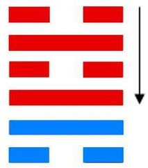

# 井 ䷯ jǐng

- No.48

> 井，改邑不改井，无喪无得，往來井井。汔至，亦未繘井，羸其瓶，凶。
>《彖》曰：巽乎水而上水，井，井養而不窮也。改邑不改井，乃以剛中也；汔至亦未繘井，未有功也；羸其瓶，是以凶也。
>《象》曰：木上有水，井，君子以勞民勸相。

> 初六，井泥不食，舊井无禽。
>《象》曰：井泥不食，下也；舊井无禽，時舍也。

> 九二，井谷射鮒，甕敝漏。
>《象》曰：井谷射鮒，无與也。

> 九三，井渫不食，為我心惻。可用汲，王明，並受其福。
>《象》曰：井渫不食，行惻也；求王明，受福也。

> 六四，井甃无咎。
>《象》曰：井甃无咎，脩井也。

> 九五，井洌，寒泉食。
>《象》曰：寒泉之食，中正也。

> 上六，井收勿幕，有孚元吉。
>《象》曰：元吉在上，大成也。

阴阳通变，不可革者，井也。井道以澄清不竭之象，而成于井之德也。《易》云：“井者，德之基。”又云：“往来井井，见功也。改邑不改井，德不可渝也。”
> 井道以澄清见用为功也。井象德不可渝变也。

与坎为飞伏。
> 戊戌土，庚申金。

九五处至尊，应用见本象。建辛巳至丙戌，
> 小满寒露。

积筭起丙戌至乙酉，周而复始。
> 火土入卦起筭数。

五星从位起岁星，
> 木星入卦，东方用事。

尾宿从位降戊戌。
> 尾宿配戊戌入卦宫。

坎下见风，险于前；内外相资，益于君。
> 井以德立，君正民信，德以其道也。

贤人有位，君子不孤。《传》曰：“德不孤，必有邻。”
> 六爻各处其务，反复阴阳变化，各得其道也。

气候所象，定数于二十八。
> 爻配阴阳，分人事，吉凶其见矣。

天地之数，分于人事；
> 近取诸身，远取诸物。

吉凶之兆，定于阴阳。阴生阳消，阳生阴灭，二气交互，万物生焉。震至于井，阴阳代位，至极则反，与巽为终，退复于本。故曰游魂，为大过。
> 降入大过卦。

# [Jǐng ䷯](e4ba95jing.md)
