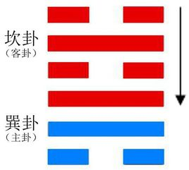
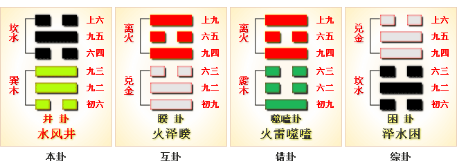
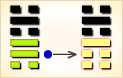

# 井 ䷯



井（jǐng）卦展示在像“井”的形势下各种变化的可能性。

井卦的代号是`3:2`，表示主卦是巽卦，卦象是风，阳数是`3`；客卦是坎卦，卦象是水，阳数是`2`。

风可挡可避，力量巨大，寒风刺骨，象征主方消极被动，实力非常强大，态度强硬；水往低处流，可挡可容，能浮舟能沉舟，象征客方消极被动，实力也强，态度随和。客方受主方制约，由于双方都被动，关系稳定，如同位置固定的井，然而，尽管井的位置不变，井也需要精心维护，才能有甘美的井水饮用。主方必须采取主动，与客方共同维护双方关系，多作对双方都有利的事。

图中，红色表示当位的爻，天蓝色表示不当位的爻，箭头表示有应。

- 解释：君子应教导百姓辛勤劳作。
- 爻辞解释：井水清冽供大家食用。
- 卦序：48

> 井，改邑不改井，无喪无得，往來井井，汔至，亦未繘井，羸其瓶，凶。初六，井泥不食，舊井无禽。九二，井谷射鮒，甕敝漏。九三，井渫不食，為我心惻，可用汲。王明，並受其福。六四，井甃无咎。九五，井洌，寒泉食。上六，井收勿幕，有孚元吉。
>《彖》曰：巽乎水而上水，井，井養而不窮也。改邑不改井，乃以剛中也；汔至亦未繘井，未有功也；羸其瓶，是以凶也。
>《象》曰：木上有水，井，君子以勞民勸相。

## 简介

《序卦》曰：困乎上必反下，故受之以井。
崔觐曰：困极于劓刖，则反下以求安，故言“困乎上必反下”也。

### 水风井 求贤若渴 上上卦

《象》曰：枯井破费已多年，一朝流泉出来鲜，资生济渴人称羡，时来运转喜自然。

这个卦是异卦，下巽上坎，相叠。坎为水；巽为风。井中有风，下而为水。人靠水井生活，水井由人挖掘而成。相互为养，井以水养人，经久不竭，人应取此德而勤劳自勉。

### 全卦涵义

《周易》有蒙、颐、井、艮等专门论述修身的卦象，其中，蒙卦以山下泉水取象，井卦以穴下泉水取象，泉水具有清洁养人、潺潺不断的特性，蒙养以正，井养以正，修身重在养正。不过，蒙卦是对愚昧者进行启蒙，井卦则是对贪欲进行匡正。因此，蒙是教人们知善识恶，重在一个“启”字；井是教人们抑恶扬善，重在一个“修”字。山下出泉，人们的礼教需要开启，朦朦胧胧，需要教育知礼义；井中引泉，人们的礼教需要规范，熙熙攘攘，需要修身践礼法。君子修身养德要始终如一，不可迁移，不可懈怠，要源源不断地滋养成长，要像井水那样，不枯竭也不满盈，我们要像滋养我们的源泉那样，恒常自己的德行。全卦六爻主要描述的是，将一个废旧的井修整为一个全新的井的过程，先将污浊的水源清洁，其次加固井壁，最后取出清冽甜美的井泉给养往来的民众。井卦六爻三阳三阴，三阴皆论井体，三阳则言井泉，阴爻井体坚固，可容纳美德以无尽；阳爻井水洁净，可滋养美德以无穷。井卦六爻，正是社会精神文明建设的行动指南，正是个人从愚昧修身到圣明的方法与过程，井养吾辈，井养天下。

## 结构和卦爻辞

一般，从卦的结构图可以看出在当前形势下，主方应当改变那些因素，保留那些因素，期待那些变化。
应当改变的因素，只能在主卦里面，因为主卦代表主方自己，客卦代表客方。
客方的因素，有利的或者不利的，潜在的或者真实的，主方只能期待它变化，或者适应它，而不能改变它。

主方的因素有三个：行动、素质和态度。主卦下爻代表行动，中爻代表素质，上爻代表态度。
第一爻是主卦下爻，这是阴爻，表示主方消极被动，这有可能导致主方利益受到损失，所以说，不当位，在图中以天蓝色表示，这是一个潜在的对主方不利因素，主方应当改变这个因素，用积极行动维护和扩大自己的利益。

第二爻是主卦中爻，代表主方素质，这是阳爻，表示主方素质良好，比如说，很富有。在图中，这条爻也是天蓝色，也是不当位，就是说，这也是潜在的对主方不利因素。这是潜在因素，并不是真正的不利因素。富有并不是坏事，为什么成了潜在的对主方不利因素呢？这有两点考虑，其一，财富有可能被对方窃取；其二，自己富有了，就不想去谋取更多利益，好比是，吃饱了，不想再吃了。这仅仅是一种潜在因素，如果客方不窃取主方利益，主方不一定受损失，如果主方积极维护和扩张自己的利益，自己的利益仍然可以再增加。所以，这一个潜在的不利因素，不需要直接去改变它，而是需要主方更积极主动。

第三爻是主卦上爻，这是阳爻，表示主方态度强硬，这强硬态度有利于维护和扩张自己的利益，是潜在的对主方有利因素，主方应当保持它，而不是改变它。
至于客卦中的三条爻，全部都是红色，表示客方的三个因素都是对主方有利的。那个在第六爻与第三爻之间的箭头，表示客方的随和态度是真正的对主方有利因素。所以，客方三个因素中，没有对主方不利的，主卦中，只有主卦下爻才是主方应当改变的，也就是说，主方应当极力扭转消极被动状态。然而，从乾卦到巽卦，主方已经发生了从积极主动到消极被动的质变，要完全恢复到当初雷霆万钧似的状态去创新和开拓或者制服客方是很难的，主方应当作的是阴中有阳，在消极被动状态下，采取适当积极措施，与客方沟通和协调，改善双方关系，做到互利双赢。

井卦的卦爻辞中，每一条都有“井”，井象征双方关系，到井口汲水的人象征主方，主方必须精心维护保养井，才能从井中汲出清凉甘美的井水。爻辞指出，主方过于消极被动，使得双方关系不善，“井泥不食”；主方的良好素质不能发挥作用，“井谷射鲋”；如果主方态度过于强硬，即使关系得到改善，主方也不能从中受益，“井渫不食”；客方消极被动，可能跟随主方改善双方关系，“井甃”；主方可以从客方良好素质受益，“井冽”；客方的随和态度有助于把良好的双方关系保持下去，“井收”。六条爻辞是一首完整的围绕主题“井”的散文诗，形象地描述了一个井的维护过程，以井为喻，阐述如何维护良好的双方关系。下面是其译文：

```
井内积淤泥，井水不可饮；
井老旧了，没有鸟来栖息。
井底砸虾和青蛙，瓦罐又旧又漏。
井淘去了污泥而不饮用井水，让人心痛；
汲水饮用，国王贤明，受到国王的福佑。
井中寒凉，（可以）饮用清凉的泉水了。
（维护）井有收益，不要关闭（井）；
有了诚信，就很吉利。
```

卦辞指出尽管当前关系对主方没有损害，“无丧无得”，如果不改善双方关系，则可能出现不良后果，“汔至亦未繘井，羸其瓶”。

### 卦辞解释
```
〖原文〗改邑不改井，无丧无得，往来井井；
汔至亦未繘井，羸其瓶，凶。
〖译文〗村邑改动而井不能迁走，
井水既不会枯竭，也不会满溢，汲水者往来井井有序；
井快要干涸，不能用绳子汲取井水了，井绳缠绕水瓶，有凶险。

〖解说〗主方像风，风顺势而动，当双方关系状态稳定时，维持双方关系，
如同日常去井边汲水，“改邑不改井，无丧无得，往来井井”。
客方像水，像聚积在井中的水，一旦水位低，近于干汔，汲水困难，
这时主方遇到汲水不成的凶险，“汔至亦未繘井，羸其瓶，凶”。
要避免凶险，必须维护双方关系，让井不干汔。“井井”，形容整齐，有条理。
“汔”（qì），水涸。“繘井”，用绳汲取井水。
“羸”（léi）缠绕，困住。

井：
郑玄曰：坎，水也。巽，木，桔槔也。
互体离兑，离外坚中，虚瓶也，兑为暗泽，泉也。
言桔槔引瓶，下入泉，汲水而出，井之象也。井以汲人，水无空竭，
犹人君以政教养天下，惠泽无穷也。

改邑不改井，
虞翻曰：泰初之五也。坤为邑，乾初之五折坤。
故“改邑”。初为旧井，四应甃之，故“不改井”。

无丧无得，往来井井。
虞翻曰：无丧，泰初之五。坤象毁坏，故“无丧”。
五来之初，失位无应，故“无得”。坎为通，故“往来井井”。

往谓之五，来谓之初也。
汔至，亦未繘井，
虞翻曰：巽绳，为繘，汔，几也。谓二也。

几至初改，未繘井，未有功也。
羸其瓶，凶。
虞翻曰：羸钩罗也。艮为手，巽为繘，离为瓶，手繘折其中，故“赢其瓶”。
体兑毁缺，瓶缺漏，故“凶”矣。
干宝曰：水，殷德也。木，周德也，夫井，德之地也。
所以养民性命而清洁之主者也。
自震化行，至于五世，改殷纣比屋之乱俗，而不易成汤昭假之法度也。
故曰“改邑不改井”。

二代之制，各因时宜，损益虽异，括囊则同，
故曰“无丧无得，往来井井”也。
当殷之末，井道之穷，故曰“汔至”。
周德虽兴，未及革正，故曰“亦未繘井”。
井泥为秽，百姓无聊，比者之间，交受涂炭，故曰“羸其瓶，凶”矣。

《彖》曰：巽乎水而上水，井。
荀爽曰：巽乎水，谓阴下为巽也。而上水，谓阳上为坎也。

木入水出，井之象也。
井养而不穷也。
虞翻曰：兑口饮水，坎为通，往来井井，故“养不穷也”。

改邑不改井，乃以刚中也。
荀爽曰：刚得中，故为“改邑”。
柔不得中，故为“不改井”也。

无丧无得。
荀爽曰：阴来居初，有实，为“无丧”。
失中，为“无得”也。
往来井井，
荀爽曰：此本泰卦。阳往居五，得坎为井；
阴来在下，亦为井，故“往来井井”也。

汔至亦未繘，
荀爽曰：汔至者，阴来居初下。
至汔，竟也。
繘者，所以出水通井道也。
今乃在初，未得应五，故“未繘”也。
繘得，绠汲之具也。

未有功也。
虞翻曰：谓二未变应五，故“未有功也”。
羸其瓶，是以凶也。
荀爽曰：井，谓二。瓶，谓初。
初欲应五，今为二所拘羸，故 “凶”也。
孔颖达曰：计覆一瓶之水，何足言凶？
但此喻人德行不恒，不能善始令终，故就人言之凶也。

《象》曰：木上有水，井。
王弼曰：木上有水，上水之象也。水以养而不穷也。
君子以劳民劝相。
虞翻曰：君子谓泰乾也。
坤为民；初上成坎，为劝，故“劳民劝相”。
相，相助也。谓以阳助坤矣。
```

井卦是综合取象的典范：外卦为坎，既象征水又象征穴，水在人们开凿出来的井穴中；内卦为巽，既象征木又象征绳。井由两个部分组成，一个是井体，一个是汲水的辘轳，随着辘轳的旋转，水顺着井绳提升到地面，这就是井卦卦象所描述的过程。井水洁净、清澈，给养万民而不枯竭，故井卦通过修井讲解道德修养方法。城乡可以改迁，但水井不可迁移，井水并不因汲取而枯竭，有水注入也不盈满。古井字与今井字相同，只是之间多一点：四边两横两竖代表四根方正的石条，中间那一点代表井水在其中，也代表汲水的水瓶在其中。这里有极强的象征意义：人的修身要像井养一样，只有达到一定的水平，才能给养自己；修养如同井字那样要把自己匡正在道德规范之中；四个石条代表修身目标要坚定虚静，中间的一点代表修身的滋养源泉要永不枯竭。井水给养往来民众，教导我们要修身养贤，勿毁道德纲常。提升水瓶快至井沿时，打翻了水瓶，功败垂成，必有凶险。这说明，修身不仅不能半途而废，即使修到接近圆满，也要精心护理，千万不要功亏一篑。所以修身要有始有终，与生命一样久长，任何时候放弃修身，都意味着失败的人生。君子应教导百姓辛勤劳作，鼓励百姓相互帮助，这样可以改善生活，提高品德修养。

## 爻辞
### 一阴
```
〖原文〗井泥不食，旧井无禽。
〖译文〗井内淤泥淤积，井水已经不可饮用；
井枯树死了，飞鸟也不来栖息。

〖解说〗第一爻是主卦下爻，
代表主方的行动，阴，表示主方消极被动，
比如说，防守、退却、不想冒险，
不想探索或开辟新的发展领域、只求保持现状，等等。
由于主方消极被动，主方与客方缺少沟通，双方联系少，
主方不能从双方关系获益，出现“井泥不食，旧井无禽”状态。

〖结构分析〗第一爻位置是阳位，这条爻是阴爻，
阴爻在阳位，不当位，并且四阴不有应。
不当位，表明主方消极被动，有可能让主方的利益蒙受损失，
这是潜在的对主方不利因素；
不有应，表明客方也消极被动，主方的利益没有受到侵害，
那潜在因素没有成为真正的对主方不利因素，
所以爻辞中没有判断辞，
只是描述“井泥不食”的现象，建议主方采取积极行动。
```

### 二阴
```
〖原文〗井谷射鲋，瓮敝漏。
〖译文〗井底虾蟆窜游，瓦罐又旧又漏。

〖解说〗第二爻是主卦中爻，代表主方素质，阳，表示素质良好，
比如说，主方有资金、有地位、有权力、有实力、有技术，等等。
同时，第五爻也是阳爻，客方素质也良好，
主方的良好素质难以在双方关系中发挥作用。
双方关系仍然保持着，不过主方的收益不多，
“井谷射鲋，瓮敝漏”，这是现实情况，主方难以改变。
在爻辞中只有形象比喻，没有具体建议，没有判断辞。
“鲋”（fù），虾蟆。
“蟆”，蛙类动物。
“瓮”（wèng），一种盛水或酒等的陶器：水瓮。
“敝”（bì），破旧，坏：敝旧。

〖结构分析〗第二爻位置是阴位，这条爻是阳爻，
阳爻在阴位，不当位，并且和五阳不有应。
不当位，表明主方的良好素质有可能遭受客方侵害，
是潜在的对主方不利因素；
不有应，表明客方素质也良好，
客方不需要窃取主方利益，
那潜在因素没有成为真正的对主方不利因素。
所以，爻辞中没有判断辞。主方的阳的素质对主方少许不利。
```

### 三阳
```
〖原文〗井渫不食，为我心恻；可用汲，王明并受其福。
〖译文〗枯井已经淘净了淤泥仍然没有人取用井水，
让人心中凄凉悲伤；水已经能够饮用，
君王圣明，受到君王的福佑，与臣民共享恩泽。

〖解说〗第三爻是主卦上爻，代表主方态度，
阳，表示主方态度强硬。
同时，第三爻是对第二爻的补充，
第二爻是阳，第三爻也是阳，这表示主方素质很好。
而第六爻是阴爻，表示客方态度随和。
客方随和主方的强硬态度，双方关系有好的发展，“井渫”。
如果主方态度过于强硬，则有可能不利双方关系的发展，
从而失去此良机，“井渫不食”，这是痛心的。
“王”比喻客方，由于客方随和的态度，使得主方能够收益，
这是客方明智，主方受福于客方的明智。
“渫”（xiè），除去，淘去污泥。“恻”（cè），悲痛：恻隐。

〖结构分析〗第三爻位置是阳位，这条爻是阳爻，当位，又与六阴有应。
当位而又有应，表明主方的强硬态度对主方有利。
```

### 四阴
```
〖原文〗井甃，无咎。
〖译文〗以砖修井，无所怪罪。

〖解说〗第四爻是客卦下爻，代表客方的行动，
阴，表示客方消极被动，比如说，防守、退却、不想冒险、
不想探索或开辟新的发展领域、只求保持现状，等等。
如果主方采取积极主动改进双方关系，主方就不应当受到怪罪。
这里，客方是消极被动的，跟随主方，修井的人是主方和客方。
“甃”（zhòu），以砖修井。

〖结构分析〗第四爻位置是阴位，这条爻是阴爻，
阴爻在阴位，当位，然而与一阴不有应。
当位，表明客方消极被动有可能被积极主动的主方利用，
是潜在的对主方有利因素；
不有应，表明主方也消极被动，
主方不能利用客方消极被动的机会获利，
那潜在因素没有成为真正的对主方有利因素。
由于客方的行动决定于客方自己，不能怪罪主方，“无咎”。
```

### 五阳
```
〖原文〗井冽，寒泉食。
〖译文〗井中清洌，洁净清凉的泉水可以食用。

〖解说〗第五爻是客卦中爻，代表客方素质，
阳，表示客方素质良好，
主方可以从客方的良好素质获益。
联系以上各条爻辞可知，
主方必须作出一定努力，才能获益。
“冽”（liè），寒冷：凛冽。

〖结构分析〗第五爻位置是阳位，这条爻是阳爻，阳爻在阳位，
当位，然而与二阳不有应。
当位，表明客方的良好素质有可能让主方获益，
这是一个潜在的对主方有利因素，
爻辞以“井冽，寒泉食”描述这种潜在的有利因素；
不有应，表明主方素质也良好，不需要从客方的良好素质获益，
那潜在因素没有成为真正的对主方有利因素，
形象地说，主方并没有来饮“寒泉”,爻辞中没有判断辞。
```

### 六阴
```
〖原文〗井收，勿幕；有孚，元吉。
〖译文〗井修整完毕，无需盖上井口；心怀诚信，大吉大利。

〖解说〗第六爻是客卦上爻，代表客方态度，
阴，表示客方态度随和。
客方随和的态度，使得双方关系改善，
应当保持这种状态，“井收，勿幕”。
达到这种状态必须是主方的态度真诚，取得客方信任，“有孚”。
有了客方对主方的信任，双方关系才对于主方很吉利，“有孚，元吉”。

〖结构分析〗第六爻位置是阴位，这条爻是阴爻，
阴爻在阴位，当位，又与三阳有应。
当位，表明客方的随和态度有可能方便主方，是潜在的对主方有利因素；
有应，表明主方态度强硬，恰好遇到客方态度随和，
主方可以按照自己的意图行事，所以爻辞说，“元吉”。
不过主方不能强硬过度，不能对客方傲慢和粗暴，
须要尊重客方，因此在“元吉”前加了“有孚”。
```

井卦，在周易中是第48卦。

### 解释
```
井①：改邑不改井②，无丧无得③。
往来井井④，汔至⑤，亦未繘井⑥，羸其瓶⑦，凶。
初六，井泥不食⑧；旧井无禽⑨。
九二，井谷射鲋⑩；瓮敝漏⑪。
九三，井渫不食⑫，为我心测⑬；可用汲⑭，王明并受其福⑮。
六四，井甃⑯，无咎。
九五，井洌⑰，寒泉食⑱。
上六，井收⑲，勿幕⑳；有孚，元吉。

【注释】
① 井：六十四卦卦名之一。改革之卦之一。
乃借井为例言谈革除旧弊之卦。
② 改邑不改井：“改邑” 有上承《益》卦的“迁国”之义。
此句为只知占领别的邦国，
却不知改变被占领国的颓败的“井”况。
③ 无丧无得：没有失去什么；但也没有得到什么。
④ 往来井井：指往来找水的人群。
⑤ 汔至：“汔”（qì 气），靠近，接近。“汔至”指已到井边。
⑥ 亦未繘井：“繘”（jú 桔），古指井绳；也指汲水。
此句为到了井边，也未用绳索来打水。
⑦ 羸其瓶：气愤地把瓶罐摔掉了。
⑧ 井泥不食：井水混浊，不能食用。
⑨ 旧井无禽：指颓败的井边无有生命。
⑩ 井谷射鲋：“射”，此处指追逐，捕捉。
“鲋”（fù 付），本指鲫鱼，
此处孔颖达引子夏传云“井底是虾（虫+麻）呼为鲋鱼”。
“井谷射 鲋”谓井底到处都是蛤蟆。
⑪ 瓮敝漏：指住家户的盛水的瓮也破漏不能用。
此两句实指“虚邑”的一派破败景象。
⑫ 井渫不食：“渫”（xiè 屑），污秽不堪。
此句为井水脏臭，不能食用。
⑬ 为我心恻：心中感到伤痛，不忍再看。
⑭ 可用汲：“汲”（jí 饥），打水。指井水可以打来食用。
⑮ 王明并受其福：贤明的君王和大家一块享受井水的福泽。
⑯ 井甃：“甃”（zhòu 咒），用石头或砖块修缮井壁。
此句为用石头或砖块重新把井修缮一下。
⑰ 洌（liè 裂）：清澈。
⑱ 寒泉食：“寒泉”，甘甜、凉爽。
此句为井水甘甜凉爽可以食用。
⑲ 井收：指井已修好。
⑳ 勿幕：不要遮盖。
```

### 升虚邑的含义
```
“初六”爻辞的“井泥不食；旧井无禽”，
实接卦辞的“羸其瓶”而来，
是说为什么人们走近井边不汲水却气愤地将瓶罐摔掉了，
这是因为井里的水太混浊不能食用；
再看看破败的井周围，连一些飞禽也没有。
“六二”爻辞的 “井谷射鲋，瓮敝漏”，
是说看看井底，到处都是蛤蟆；
再到人们的住房看看，房屋里的翁缸也是漏的，不能盛水。
“九三”爻辞的“井渫不食，为我心测；可用汲，王明并受其福”，
上半句是说看到井水不堪，连我君王看了也要感到内心伤痛；
下半句是说若把井修缮并淘干净，井水可以食用，
这不是君王连百姓一同共受井水的福泽吗。
“六四”爻辞的“井甃，无咎”，
是说用石块或砖块将井壁从新修缮好，
这样将不会有什么凶险。
这里有一个民以井以生，君以民而存的道理。
“九五”爻辞的“井洌，寒泉食”，
是说当井修缮并淘干净之后，
清澈甘甜的井水可以食用了。
“上六”爻辞的“井收，勿幕；有孚，元吉”，
前半句是说当井修好之后，
不要用井盖把它盖上，要供民众使用；
后半句是说这样做有助于君侯的信用威望能布及天下，
它将是一种很大的吉祥。
```

### 爻辞释义

1. 初六：开始整修旧井，井底堆积着污浊不堪的淤泥，不宜汲取食用，连禽鸟也不来光顾，此井已被舍弃不用。此爻提示我们，如果人们久不修身，终会被社会舍弃。修身重在勤洗污染，去除私欲，如果经久失修，必将拥有对社会毫无贡献的悲凉人生。井养第一步当发愿修身，坚固志向。
2. 六二：二刚中，但上无正应，因此难以上行完成井养之功。奔涌出水的井穴只是用来钓取小鱼，水瓶破漏无法汲水。此爻提示领导人切忌大材小用；也不要用人失当；注意培育养正人才。修身要有远大理想，要有能使自己不断精进的修身手段。
3. 九三：井水洁净清澈，仍未被汲取养民，这使我感到隐隐心痛。赶快汲取吧，明君贤臣百姓都会受福泽。此爻提示忠臣不可弃用。如果忠臣长久怀才不遇，说明上级自私偏执，终会导致事业衰败。
4. 六四：进一步修治水井，用砖石砌壁，使之齐整完备，没有祸凶。修养之道讲求积累渐成，坚实可靠，这样才可长久滋养民众。 此爻强调随着美德不断提升，还要坚固容纳美德的井体。修养之道，美德和心胸要不断地同步扩充。
5. 九五：为中正明君，井水清冽供大家食用。此爻提示领导人用中正美德提拔贤能，自己身体力行，成为仁德楷模，此为井卦大义。
6. 上六：修井成功，请勿盖上井盖，信服天下，广济民众，大吉大利。修井成功，就要诚信于社会，井养之道重在教化天下，成就清明盛世。

### 白话解析
```
井：改①邑不改井，无亡无得，往来井，
井汔②，至亦未汲井，累其刑垪③，凶。
【白话】筮得井卦，改变城市而不改变水井，
既不丢失什么也不获得什么，
人们往来于井中取水，井水干涸了，
即使去井里也取不了水，用瓶子去打水，危险。
【注释】
① 改：读为改。
② 汔：读为汔。汔，水涸。
③ 垪：读为瓶。

【讲解】井卦下体筭卦为木，上体赣卦为水，
筭木器（水桶水瓶）提取赣水而上行，便形成了井卦的卦象。
井卦的中四爻互体为夺卦与罗卦。
罗卦上下两阳爻刚坚于外，
中间一阴爻空虚于内，有水瓶的形象。
夺卦为暗泽，象水井的出口。
水井是供人饮水用的，源源不断地流出来，
水井就象领导人用政治教化群众一样，惠泽无穷无尽。

初六：井泥不食，旧井①无禽。
【白话】筮得井卦，占得初六爻，
泥巴水喝不得，陈旧的陷阱捕不到野兽。
【注释】① 旧井：旧陷阱。

【讲解】干宝说：“在《井》之下体，本土爻，故曰‘泥’也，
井而为泥，则不可食，故曰‘不食’。
此托纣之秽政不可以养民也。旧井，谓殷之未丧师也。
亦皆清洁，无水禽之秽，又况泥土乎！故‘旧井无禽’矣。”

九二：井渎①射付②，唯敝句。
【白话】筮得井卦，占得九二爻，
捕捞井边水沟里的小鱼，只需要破网片就行了。
【注释】
① 井渎：井边小水沟。渎：小水沟。
② 射付：捕鱼。付，读为鲋。

【讲解】虞翻说：“《巽》为谷。为鲋。
鲋，小鲜也。《离》为瓮。
瓮瓶毁缺，羸其瓶凶，故‘瓮敝漏’也。”
井的特点是从下往上提水，
今九二爻阳刚与九五爻阳刚相敌无应，
而与初六爻相亲比，违背了从下往上提水的规律，
象水沟向低下流注，唯及于鱼，所以说“井渎射付”。

九三：井渫①不食，为我心塞②，可③用汲？王明并受其福。
【白话】筮得井卦，占得九三爻，把井遮盖起来不让人饮用，
以便集中精神祭祀，何必急急忙忙汲水呢？
先王神明，一定会给祭祀过它的人带来幸福。
【注释】
① 渫：遮迣。
② 心塞：集中精神祭祀。塞：通赛，酬神祭。
③ 可：通何，何必，为什么。

【讲解】渫，通行本作“渫”。
荀爽说：“渫去秽浊，清洁之意也。三者得正，故曰‘井渫’。
不得据阴，喻不得用，故曰‘不食’。道既不行，故‘我心恻’。”
干宝说：“此托殷之公侯。
时有贤者，独守成汤之法度，而不见任，谓微、箕之伦也。”

六四：井椒①，无咎。
【白话】筮得井卦，占得爻四爻，用砖砌井壁，没有灾害。
【注释】
① 椒：假借为甃。甃，用砖砌井壁。

【讲解】九三爻在内卦，把井遮起来以洁其内。
六四爻在外卦，用瓦砖把井壁修好以防止外界的污染。
告诫人们既要注意内部的自我修养，又要防止外界的影响。

九五：井戾①寒湶②，食。
【白话】筮得井卦，占得九五爻，井水清凉，可以饮用。
【注释】
① 戾：假借为洌。洌，水清洁。
② 湶：读为泉。

【讲解】这是人们对地下水的粗浅认识，
认为好的井水，既清洁又寒冷。
这样的井水就可以喝。

尚六：井收①勿幕②，有复，元吉。
【白话】筮得井卦，占得尚六爻，
让人们从井中汲水饮用而不要把井封闭不用，
有诚意为民造福，必定大吉大善。
【注释】
① 收：汲水。
② 勿幕：不要封闭。

【讲解】国以民为本，民以食为天。
水是人民生活中不可缺少的重要成份。
因此，专设井卦。
而六十四卦大多以第六爻（上爻）为终极为变，
唯独井卦与鼎卦的第六爻爻辞称“元吉”“大吉”。
井向人们提供饮水，鼎向人们提供熟食。
井、鼎是人们生活所必须的。
《易》作者深深认识了这一点。
懂得了井水是人们生活不可缺少的东西。
```

### 《象》曰
```
木上有水，井；
君子以劳民劝相。
井泥不食，下也。
旧井无禽，时舍也。
井谷射鲋，无与也。
井渫不食，行恻也。
求王明，受福也。
井甃无咎，修井也。
寒泉之食，中正也。
元吉在上，大成也。
```

### 《彖》曰
```
巽乎水而上水，井。
井，养而不穷也。
改邑不改井，乃以刚中也。
汔至亦未繘井，未有功也。
羸其瓶，是以凶也。
```



### 《断易天机》解

井卦坎上巽下，为震宫五世卦。井不可移动，象征静止，此卦也是提示占卦者要安身守道，不可贪求。

### 北宋易学家 邵雍 解

静水通源，气运平静；不变所守，维持现状。

得此卦者，宜修身养性，顺其自然，泰然处之，静有利，动则凶。

### 台湾国学家 傅佩荣 解

- 时运：木水相生，功名有望。
- 财运：利大于本，自然可喜。
- 家宅：修屋防水；阴阳得正。
- 身体：肾水过胀，立即调治。

### 传统解卦
```
这个卦是异卦，下巽上坎，相叠。坎为水；巽为木。
树木得水而蓬勃生长。人靠水井生活，水井由人挖掘而成。
相互为养，井以水养人，经久不竭，人应取此德而勤劳自勉。

大象：水被植物吸收，滋养树身又象征汲器入井取水，有节约重覆之意。
```

运势：井为静物，不能移动，故凡事不能进取主动，又缺乏冲劲，不如处之泰然更有利。

- 事业：处于平稳状态。既不宜贸然前进，也不必后退，而应以积极的态度努力进修，提高自己，充实个人实力，待机而起，将大有成就。最怕的是停顿不前，否则将会因不合时宜而被淘汰。
- 经商：市场情况良好，可继续按照原来的方针。同时，继续本着勤劳、奋进的精神，诚心诚意地开拓市场，特别注意与人的合作，相互协助，在实践活动中丰富和积累经验。
- 求名：本着正当的目的，为社会做贡献，因此而努力学习。应特别注意向贤德的人求教，以便被发现而受到推荐。
- 婚恋：不必过急，会有般配的伴侣。
- 决策：聪明、机敏、乐于助人。同时，也会有机会充分施展个人的才能。只要能学习“水井”的精神，真诚奉献，不断丰富自己的才能，一定会受到社会的重视。

### 台湾 张铭仁 解卦
```
井：表示小水之源，
有格局小却能过活之心态，主小吉象。
井水虽不能种植、畜养，
却能养人度日，显示心力之有限，不能做太大的计划。
也另表示视野没有很宽广，比较短视，保守心态重。

解释：井底之蛙。

特性：积极，主动，创新，改革，反应快，口才佳，
组织能力强，有领导才能，贵人多助，社会名誉佳。
```

运势：缺乏衡力，因井为静而不能移之物。故凡事已无法进取，不如守之泰然。

- 家运：诸事宜心平气和处理，守其井水，供来往人用，为守旧之义。诸事宜防有变。
- 疾病：病情较重且拖延，可能复发。
- 胎孕：宜防有不成之兆。防产母有灾，作福祈保可平安。
- 子女：儿女有顺良之象，宜防血光。
- 周转：无望，再待时另调。
- 买卖：尚可，但不可大作为。小交易有利。
- 等人：迟来。
- 寻人：东南或北方可寻。
- 失物：不能寻回。
- 外出：没有十分的必要和充分的把握不可随意出行。
- 考试：尚可。
- 诉讼：有刑罚之象，且受人牵连，及防房地产之诉讼。
- 求事：安于本份，换新的工作也是小工作。
- 改行：不利，守之尚可。
- 开业：开业者不宜，此卦有破损之象。

### 初六爻辞

初六。井泥不食，旧井无禽。

《象》曰：井泥不食，下也。旧井无禽，时舍也。

### 白话文解释

初六：井水混浊不可食用。墤塌的陷阱已关不住野兽。

《象辞》说：井水混浊不可食用，因为泥土落入其中。墤塌的陷阱已关不住野兽，是说人们已将这陷阱舍弃不用了。

### 北宋易学家 邵雍 解

凶：得此爻者，谋事有阻。做官的会退居闲职，求名者不遂。

### 台湾国学家 傅佩荣 解

- 时运：时过运衰，年老无用。
- 财运：货物陈旧，难以售出。
- 家宅：荒芜难居；婚姻不成。
- 身体：旧症不治。

### 初六变卦：水风井 变卦 水天需


初六爻动变得[第5卦：水天需](e99c80xu_cn.md)。

这个卦是异卦，下乾上坎，相叠。

下卦是乾，刚健之意；上卦是坎，险陷之意。

以刚逢险，宜稳健之妥，不可冒失行动，观时待变，所往一定成功。

### 九二爻辞

九二。井谷射鲋，瓮敝漏。

《象》曰：井谷射鲋，无与也。

### 白话文解释

九二：在井口张弓射井中小鱼。瓮瓶又破又漏。

《象辞》说：在井口张弓射井中小鱼，如此谋食求生，可见其人无依无靠。

### 北宋易学家 邵雍 解

凶：得此爻者，宜谨守以避祸。做官的宜退以自保。

### 台湾国学家 傅佩荣 解

- 时运：得小失大，徒有虚名。
- 财运：贪财失利，得不偿失。
- 家宅：水不可饮；婚姻不佳。
- 身体：下漏之症，求医难治。

### 九二变卦：水风井 变卦 水山蹇



九二爻动变得[第39卦：水山蹇](e8b987jian_cn.md)。

这个卦是异卦，下艮上坎，相叠。

坎为水，艮为山。

山高水深，困难重重，人生险阻，见险而止，
明哲保身，可谓智慧。
蹇，跋行艰难。

### 九三爻辞

九三。井渫不食，为我心恻。可用汲，王明，并受其福。

《象》曰：井渫不食，行恻也。求王明，受福也。

### 白话文解释

九三：君上看见井水污浊不能食用，为我们感刭伤心。淘洗干净，就可汲饮。君上英明，众人都获得他们的好处。

《象辞》说：井水污浊不能食用，这是触景生情的感叹。盼求君王英明，是企望获得好处。

### 北宋易学家 邵雍 解

平：得此爻者，安分守己为吉，不良者或有灾。做官的难逢明主，需另觅良机。

### 台湾国学家 傅佩荣 解

- 时运：有才无命，须待两年。
- 财运：贩运不当，无利可图。
- 家宅：洗井可饮；二年可成。
- 身体：心神不安，井泉可愈。

### 九三变卦：水风井 变卦 坎为水


九三爻动变得[第29卦：坎为水](e59d8ekan_cn.md)。

这个卦是同卦，下坎上坎，相叠。

坎为水、为险，两坎相重，险上加险，险阻重重。

一阳陷二阴。所幸阴虚阳实，诚信可豁然贯通。
虽险难重重，却方能显人性光彩。

### 六四爻辞

六四。井甃，无咎。

《象》曰：井甃无咎，修井也。

### 白话文解释

六四：用砖石垒筑井壁，进行顺利。

《象辞》说：用砖石垒筑井壁，进行顺利，这是讲修井之事。

### 北宋易学家 邵雍 解

平：得此爻者，宜安分守己，或有迁居之喜。做官清廉者，修身立命，可望上进。

### 台湾国学家 傅佩荣 解

- 时运：修身立名，可望上达。
- 财运：整理旧业，应有利润。
- 家宅：修整为宜；尚须待时。
- 身体：运动健身。

### 六四变卦：水风井 变卦 泽风大过


六四爻动变得[第28卦：泽风大过](e5a4a7e8bf87daguo_cn.md)。

这个卦是异卦，下巽上兑，相叠。

兑为泽、为悦，巽为木、为顺，泽水淹舟，遂成大错。

阴阳爻相反，阳大阴小，行动非常，有过度形象，内刚外柔。

### 九五爻辞

九五。井冽，寒泉食。

《象》曰：寒泉之食，中正也。

### 白话文解释

九五：水洁泉寒，清凉可口，可以食用。

《象辞》说：九五爻辞讲水洁泉寒，清凉可口，因为九五之爻居上卦中位，象征人得中正之道。

### 北宋易学家 邵雍 解

吉：得此爻者，营谋遂意。做官的品行端正，会得到上司的赞赏。

### 台湾国学家 傅佩荣 解

- 时运：品行中正，可望进用。
- 财运：财源长远，可以获利。
- 家宅：谦让有礼；同甘共苦。
- 身体：外寒内热，寒剂可解。

### 九五变卦：水风井 变卦 地风升


九五爻动变得[第46卦：地风升](e58d87sheng_cn.md)。

这个卦是异卦，下巽上坤，相叠。

坤为地、为顺；巽为木、为逊。

大地生长树木，逐渐成长，日渐高大成材，
喻事业步步高升，前程远大，故名“升”。

### 上六爻辞

上六。井收勿幕，有孚元吉。

《象》曰：元吉在上，大成也。

### 白话文解释

上六：陷阱下宽上窄，十分隐蔽，甚至可以不加伪装。果然捕获了野兽，大吉大利。

《象辞》说：上六爻辞讲大吉大利，因为上六之爻处一卦之首位，说明其人爵位高登，大有成就。

### 北宋易学家 邵雍 解

吉：得此爻者，谋事顺利，财用充足。做官的功高德厚，能得升迁。

### 台湾国学家 傅佩荣 解

- 时运：功德在世，大受推崇。
- 财运：利益汇集，可大可久。
- 家宅：积善旺家；两姓好合。
- 身体：即日可愈。

### 上六变卦：水风井 变卦 巽为风


上六爻动变得[第57卦：巽为风](e5b7bdxun_cn.md)。

这个卦是同卦，下巽上巽，相叠。

巽为风，两风相重，长风不绝，无孔不入，

巽亦为顺、谦逊的态度和行为，可无往不利。

# [Jǐng ䷯](e4ba95jing.md)
