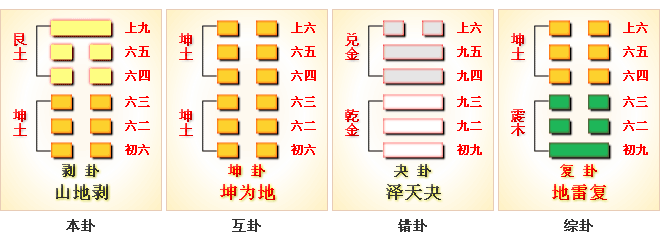

# 剥 ䷖ bō

- No.23

> 剝，不利有攸往。
>《彖》曰：剝，剝也，柔變剛也。不利有攸往，小人長也。順而止之，觀象也。君子尚消息盈虛，天行也。
>《象》曰：山附于地，剝，上以厚下安宅。

> 初六，剝牀以足，蔑貞，凶。
>《象》曰：剝床以足，以滅下也。

> 六二，剝牀以辨，蔑貞，凶。
>《象》曰：剝床以辨，未有與也。

> 六三，剝之无咎。
>《象》曰：剝之无咎，失上下也。

> 六四，剝牀以膚，凶。
>《象》曰：剝床以膚，切近災也。

> 六五，貫魚，以宮人寵，无不利。
>《象》曰：以宮人寵，終无尤也。

> 上九，碩果不食，君子得輿。小人剝廬。
>《象》曰：君子得輿，民所載也，小人剝廬，終不可用也。

柔长刚减，天地盈虚。
> 建戌至建亥。

体象金为本，随时运变，水土用事。成剥之义，出于上九。《易》云：“硕果不食，君子得舆，小人剥庐。”
> 君子全得剥道，安其位，小人终不可安也。

与艮为飞伏。
> 丙子水，壬申金。

天子治世，反应大夫。建甲戌至己卯，阴阳定候。
> 寒露至春分。

积筭起己卯木至戊寅木，周而复始。
> 吉凶之兆见于有象。

纯土配金用事。五星从位起镇星，
> 土星入卦。

张宿从位降丙子。
> 张宿入天子宫。

金土分气三十六。
> 积筭六位起吉凶，天地盈虚气候。 

《易象》云：“山附于地，剥。”君子俟时，不可苟变，存身避害，与时消息。春夏始生，天气盛大；秋冬严杀，天气消灭。故当剥道已成，阴盛不可逆，阳息阴专。升降六爻，反为游魂，荡入晋。
> 积阴反入晋卦。

# [Bō ䷖](e589a5bo.md)
