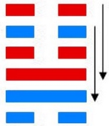
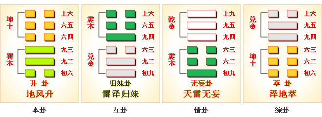
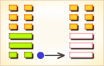
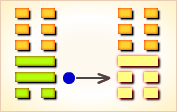
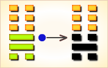
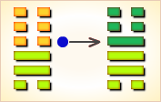
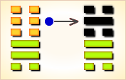
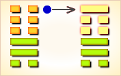

# 升 ䷭



升（shēng）卦展示“升”形势下各种变化的可能性。

“升”指提升。升卦的代号是 `3:0`，主卦三个巽卦，卦象是风，阳数是`3`；客卦是坤卦，卦象是地，阳数是`0`。
主方在消极被动状态下，应当阴中有阳，适时采取主动，利用客方对自己的依赖，更强地控制客方，维护和增加自己的利益。

图中，红色表示当位的爻，天蓝色表示不当位的爻，箭头表示有应。
《升》卦谈的是上升之卦，亦犹其爻辞所说的“升阶”之义。
但是，从此卦卦辞的“南征吉”和爻辞的“升虚邑”以及其它爻辞的用语来看，此卦仍属用兵侵伐之卦。
也即是说，此卦谈的是在兼并时期侵伐其它邦国时所应该注意到的一些问题。

- 结构：上坤下巽
- 卦序：46

> 升，元亨，用見大人，勿恤，南征吉。
>《彖》曰：柔以時升，巽而順，剛中而應，是以大亨；用見大人，勿恤，有慶也；南征吉，志行也。
>《象》曰：地中生木，升。君子以順德，積小以高大。

> 初六，允升大吉。
>《象》曰：允升大吉，上合志也。

> 九二，孚乃利用禴，无咎。
>《象》曰：九二之孚，有喜也。

> 九三，升虛邑。
>《象》曰：升虛邑，无所疑也。

> 六四，王用亨于岐山，吉，无咎。
>《象》曰：王用亨于岐山，順事也。

> 六五，貞吉，升階。
>《象》曰：貞吉升階，大得志也。

> 上六，冥升，利于不息之貞。
>《象》曰：冥升在上，消不富也。

### 全卦内容

升卦由风下地上组成。
卦辞的“升：元亨，用见大人；勿恤，南征吉”，是说作为侵伐兼并它国的《升》卦，它有极大的亨通，
它可用于显现君侯这些“大人”们；请君侯们勿要忧愁，发兵向南征进，去征服那里的邦国，这样很吉祥。
1. “初六”爻辞的“允升，大吉”，是说要发兵侵吞它国，这时若能受到公众的认可，那自然是吉祥无比。这里的公众当包括本国臣民和一些附属国的臣民以及被侵吞国家的臣民，这里有一个王师伐无道的意思。
2. “九二”爻辞的“孚，乃利用禴，无咎”，是说王师在侵吞它国时，为了建立自己的威信，当利用“禴”这一种祭祀，这样没有灾祸。对于此一爻的“孚，乃利用禴”，我们绝不能把它当作一种政治骗局或迷信骗局，应该说，这乃是建立信用和束缚君王规范的一种形式。
3. “九三”爻辞的“升虚邑”，是说发兵进入到一个颓败荒废的邑国里。关于“升虚邑”是什么样子和怎么办，这就是《颐》卦所说的“丘颐”和《井》卦蕴藏的“革故而井新”。
4. “六四”爻辞的“王用亨于岐山，吉，无咎”，是说国君在侵伐吞并了别的邑国之后，在回国之后，应当到岐山上去进行郊祭，这样将会获得吉祥，也不会有什么祸患。这里的祭祀不能纯粹看作一种迷信成份，也有收揽人心和庆贺性质的成份。
5. “六五”爻辞的“贞吉，升阶”，是说当此时运昌顺之时，应该顺势进取，这有如乘势拾阶而上，千万不要错过时机。此乃用兵常识。
6. “上六”爻辞的“冥升，利于不息之贞”，是说由于王师侵伐的顺势发展，自然有看不见的冥暗中的余波仍在发挥作用，如果在这种冥暗中升进，那它亦当利于不停息的积极进取，利于王师进取之贞正。

### 结构和卦爻辞

升卦下面的三条爻是主卦，代表主方；上面的三条爻是客卦，代表客方。
六条爻中有天蓝色的，有红色的。天蓝色表示该爻不当位，也就是说，位置不恰当，对主方不利，主方应当考虑改变该爻所代表的要素的情况；
红色表示该爻当位，也就是说位置恰当，对主方有利，主方应当考虑保持该爻所代表的要素的情况。

图中有两个箭头，表示和谐关系。一个箭头从第五爻指向第二爻，这两条爻分别代表主方素质和客方素质，箭头表示在素质方面，主客双方是和谐的，这种和谐状态下，素质不佳的客方从素质良好的主方取得补益，对客方有利，对主方不利。尽管对主方不利，主方不能自已损害自己的素质，只能以对客方作贡献，维持和谐稳定的双方关系，从而取得更多利益。另一个箭头从第六爻指向第三爻，这两条爻分别代表客方态度和主方态度，客方态度随和，主方态度强硬，主方可以制约客方，逼使客方按主方意图办事，对主方有利，主方应当努力维持这种和谐状态，主方可以利用这个有利要素，依靠素质上的优势，提升自己的地位，所以卦名为升，卦辞说“元亨”，非常顺利，“用见大人”，利用良好的素质表现为大人物。

剩下的两条爻是不有应的爻，都是阴爻，不和谐而对立。第一爻代表主方的行动，阴爻，表示主方消极被动，有可能不能保护自己的利益免受损失，是潜在的对主方不利因素。第四爻表示客方消极被动，客方并不想损害主方利益，反而是主方谋求发展的好机会，这潜在因素没有成为真正的对主方不利因素，所以卦辞说，“勿恤”。第一爻是关键 ，主方应当努力改变第一爻，然而，要完全扭转消极被动为积极主动很难，主方已经发生了从成长到衰落的质变，从乾卦到巽卦是一个量变到质变的关键点，主方已经不知不觉地越过了这个关键点，要变回去很难，不过，主方可以阴中有阳，在消极被动状态下，适时采取一些积极主动，这对主方有益，所以卦辞说“南征吉”。

图右是爻辞，爻辞与爻一一对应，给完全抽象的爻作少许具体的说明。就像卦是一个整体一样，六条爻辞也是一个整体，阐述“升”这个主题，同时针对爻在卦中的地位，加了判断辞。如果删去判断辞，可以看出，六条爻辞就是一首完整的围绕“升”这个主题的散文诗，下面是其译文：

```
允许上升了，（上升需要允许）
用祭祀表示诚意吧。
在空虚的城邑上升起来了，（上升是空虚的）
国王到岐山来亨祭祖先。
踏着阶梯上升啊，（逐步上升）
糊里糊涂地上升！（上升是愚昧的）
```

爻辞也表明当前情况对主方不是很有利，主方可以上升，但是必须得到客方允许，而且，没有什么利益可得，是空虚的上升，甚至是糊里糊涂的上升。之所以如此，一方面是主方已经从成长转变为衰落，由积极主动转变为消极被动；另一方面，客方素质太差，没有什么主方能够获取的。所以，卦辞只是说“元亨”，即使有个“吉”，也是“南征吉”，不向南出征就不一定吉利。

### 卦辞
```
〖原文〗元亨，用见大人，勿恤，南征吉。
〖译文〗很顺利，用于表现为大人物，不要担忧，向南方出征吉利。
〖解说〗客方适应于主方，主方的事情可以进展得很顺利。
客方素质不佳，而主方素质良好，
主方应当利用当前的好形势表现得像大人物。
主方也有弱点，不要担心，只要方向对头，往前发展就吉利。
古时候，南方比较温暖，不发达，向南方发展是正确的方向。
```

### 地风升 柔顺谦虚 上上卦

《象》曰：士人来占必得名，生意买卖也兴隆，匠艺逢之交易好，农间庄稼亦收成。

这个卦是异卦相叠（下巽上坤）。坤为地、为顺；巽为木、为逊。
大地生长树木，逐步的成长，日渐高大成材，喻事业步步高升，前程远大，故名“升”。
《升》卦谈的是上升之卦，亦犹其爻辞所说的“升阶”之义。
但是，从此卦卦辞的“南征吉”和爻辞的“升虚邑”以及其它爻辞的用语来看，此卦仍属用兵侵伐之卦。
也即是说，此卦谈的是在兼并时期侵伐其它邦国时所应该注意到的一些问题。

```
升：元亨。用见大人，勿恤。南征吉。
《彖》曰：柔以时升，
巽而顺，刚中而应，是以大亨。
用见大人勿恤，有庆也。
南征吉，志行也。
《象》曰：地中生木，升。
君子以慎德，积小以成高大。
```

## 爻辞
### 一阴
```
〖原文〗允升，大吉。
〖译文〗允许不断长进升起，大为吉利。
〖解说〗第一爻代表主方的行动，阴，表示主方消极被动，
比如说，防守、退却、不想冒险、
不想探索或开辟新的发展领域、只求保持现状，等等。
主方顺应客观形势而动。
客方适应于主方，允许主方发展，主方顺应这种好形势，对主方很吉利。

〖结构分析〗第一爻是主卦下爻，其位置是阳位，
这条爻是阴爻，阴爻在阳位，
不当位，并且和四阴不有应。
不当位，表明主方消极被动，有可能受到客方攻击而遭受损失，
是潜在的对主方不利因素；不有应，表明客方也消极被动，不想攻击主方，
这潜在因素没有成为真正的对主方不利因素。
如果主方阴中有阳，在条件允许的情况下采取一些主动措施，
主方有可能利用客方被动的机会取得发展，所以爻辞说“大吉”。
这个“大吉”的判断辞是以“允升”为条件的，
主方必须有效地利用客方消极被动的机会才“大吉”。
```

### 二阳
```
〖原文〗孚乃利用禴，无咎。
〖译文〗心怀诚信有助于祭祀求福，无所怪罪。
〖解说〗第二爻代表主方素质，阳，表示主方素质良好，
比如说，主方有资金、有地位、有权力、有实力、有技术，等等。
主方利用自己的良好素质对客方作出奉献，
表现出诚信，这是应当的，无所怪罪。
“禴”（yuè），古同“礿”，祭名，
中国夏商两代在春天举行，周代在夏天举行。
这里，“禴”是一种形象比喻，
建议主方对待客方像对待鬼神一样作祭祀，以表达诚意。

〖结构分析〗第二爻是主卦的中爻，
其位置是阴位，这条爻是阳爻，阳爻在阴位，
不当位，不过与五阴有应。
不当位，表明主方的良好素质，
有可能在与客方交往中受到损失，
是潜在的对主方不利因素；
有应，表明客方素质不佳，需要从主方获益，
这潜在因素成了真正的对主方不利因素。
由于存在这种不利因素，主方应当向客方作出贡献，
这是当前的客观情况，主方不应当受到怪罪，
所以爻辞说“无咎”。
```

### 三阳
```
〖原文〗升虚邑。
〖译文〗在空虚的城邑上升起。
〖解说〗第三爻代表主方态度，
阳，表示主方态度强硬。
客方态度随和，可以适应主方，
主方的强硬态度并不妨碍主方取得成功。
不过，客方素质不佳，主方不能得到什么利益。
主方在这个城邑上升起了，然而，这个城邑是空虚的。
“邑”（yì），城市，都城，城邑，古时候有时指诸侯国。

〖结构分析〗第三爻是主卦的上爻，其位置是阳位，
这条爻是阳爻，阳爻在阳位，当位，又与六阴有应。
当位表明主方态度强硬，有可能制约客方，
是潜在的对主方有利因素；
有应，表明客方态度随和，接受主方制约，
这潜在因素成了真正的对主方有利因素。
由于客方素质极差，尽管存在此有利因素，
主方并不能得到实际利益，
所以，爻辞中没有判断辞。
```

### 四阴
```
〖原文〗王用亨于岐山，吉，无咎。
〖译文〗王在岐山祭奉神灵，吉利，无所怪罪。
〖解说〗第四爻代表客方的行动，
阴，表示客方消极被动，
比如说，防守、退却、不想冒险、
不想探索或开辟新的发展领域、只求保持现状，等等。
“王”指周文王，在这里代表主方，
主方应当对客方有所贡献，
“用亨于岐山”，得到客方支持，
从而取得自己的发展，形势对主方吉利。
主方对客方作奉献，有利于主方发展，
是应当的，无所怪罪。
“亨”，献。
古时候，“岐山”在周国，是周文王平常作祭祀的地方。

〖结构分析〗第四爻是客卦的下爻，其位置是阴位，
这条爻是阴爻，阴爻在阴位，当位，然而与一阴不有应。
当位，表明客方消极被动，
有可能是主方发展的好机会，是潜在的对主方有利因素；
不有应，表明主方也消极被动，不能利用这样的好机会，
这潜在因素没有成为真正的对主方有利因素。
由于这只是潜在的有利因素，主方必须对客方有所贡献，
才可能实际上做些有利主方的事，
所以爻辞说“王用亨于岐山，吉”。
对客方作些贡献是应当的，所以“无咎”。
```

### 五阴
```
〖原文〗贞吉，升阶。
〖译文〗坚持下去吉利，顺着阶梯步步上升。
〖解说〗第五爻代表客方素质，阴，表示客方素质不佳，
比如说，资金缺乏、地位底下、实力薄弱、教育程度低，等等。
而与此相反，主方素质良好，主方可以利用此机会，帮助客方，
从而取得自身发展，这样坚持下去，是吉利的。
主方可以像登台阶一样，一步一步地上升。

〖结构分析〗第五爻是客卦中爻，其位置是阳位，
这条爻是阴爻，阴爻在阳位，不当位，然而与二阳有应。
不当位，表明客方素质不佳，有可能损害主方利益，
是潜在的对主方不利因素；
有应，表明客方素质良好；正好可以满足客方需要，
这潜在因素成了真正的对主方不利因素，
这是一种对主方不利的和谐。
尽管这是个不利因素，
由于主方制约客方，主方的损失是有限的，
并且主方可以利用客方对自己的依赖，
更强地控制客方，有利于维护主方的利益，
所以，实际上这里的和谐是对主方有利的，
主方应当坚持下去。
如果主方坚持下去，对客方作适当贡献，
其结果对主方吉利，所以爻辞说“贞吉”。
```

### 六阴
```
〖原文〗冥升，利于不息之贞。
〖译文〗不知不觉中地上升，有利于不停息地坚持。
〖解说〗第六爻代表客方态度，阴，表示客方态度随和。
同时，客方可以适应主方的强硬态度，受主方制约。
可是，客方素质极差，主方不仅不能从客方获取利益，
反而要向客方作贡献，损失利益。
形势如此，主方不得不如此，主方上升了，
例如，地位提高了、名誉更高了，等等，
而实际效果不显，
所以说，这种上升是“冥升”，虚幻地上升。
坚持不懈地做下去，还是有利的。
“冥”（míng），虚幻。
冥幻，暗淡虚幻。冥冥之中，潜意识里，不知不觉中。

〖结构分析〗第六爻是客卦的上爻，其位置是阴位，
这条爻是阴爻，阴爻在阴位，当位，又与三阳有应。
当位，表明客方态度随和，有可能受到主方制约，
是潜在的对主方有利因素；
有应，表明主方态度强硬，正好可以制约客方，
这潜在因素成了真正的对主方有利因素，
所以爻辞说“利于不息之贞”。
第六爻是对第五爻的补充，这两条爻都是阴爻，
表示客方素质极差，实力非常薄弱，
主方不能从客方得到利益，
反而要对客方作贡献，
所以爻辞没有用“吉”之类的对主方更有利的判断辞。
```

### 爻辞解释
```
升①：元亨，用见大人；勿恤；南征吉。
初六，允升②，大吉。
九二，孚，乃利用禴③，无咎。
九三，升虚邑④。
六四，王用亨于岐山⑤，吉，无咎。
六五，贞吉，升阶⑥。
上六，冥升⑦，利于不息之贞。

注释：
①升：六十四卦卦名之一。
乃言谈侵伐，兼并邻邦之卦。
②允升：“允”，参《晋》卦“六二”爻“众允”一辞，
仍当有众人认可之义。
“允升”，指众人认可的对邻邦的侵伐兼并。
③孚，乃利用禴：与前一卦《萃》卦注⑧相同，
亦言用禴祭来取信于天下。
④升虚邑：指拥兵进入废墟的邑国，
亦实有《颐》卦的“丘颐”之义和《井》卦的“井泥不食，
旧井不禽”之义。
⑤岐山：周王朝故址，在今陕西岐山县。
⑥升阶：乘势沿阶而上，指乘势进取。
⑦冥升：在昏暗不明中升进，实犹有“升阶”余波之义。
```

### 白话解析

升：白话中读“登”。
```
登①：元亨，利见大人，勿血②，南正，吉。
【白话】筮得登卦，非常顺通，利于拜见大人，
不用忧虑，南下征伐一定吉善美好！
【注释】
①登：卦名，假借为“升”，上升。通行本作“升”。
②勿血：勿恤。恤，忧虑。
【讲解】登卦描绘阐明了事物顺势上升、积小成大的法则。
登卦下体巽卦，上体坤卦。
巽为谦逊，坤为柔顺，谦逊而又柔顺。
阳刚之爻的九二居于下体之中，
并与上体六五阴柔之爻阴阳相应，所以大吉大利。

初六：允①登，大吉。
【白话】筮得登卦，占得初六爻，不断地进升，大吉。
【注释】①允：继续，前进。
【讲解】初六阴柔之爻居于登卦的开始，为登的开始，
虽然与上体六四阴爻相敌不相应，
但是可以跟从九二爻、九三爻共同上登于上体之卦，
共同居于尊位而得大志。

九二：复乃利用濯①，无咎。
【白话】筮得登卦，占得九二爻，
有诚信就利于祭祀，没有灾难。
【注释】①濯：假借为“礿”，夏祭名。
【讲解】九二阳刚之爻居于阴柔之位，
是不得位，但居于下体之中，
是得中，并且与上体六五阴阳相应，
往必得以任用。因而没有灾咎。

九三：登虚①邑。
【白话】筮得登卦，占得九三爻，登上殷都都城。
【注释】①虚：殷都，殷虚。
【讲解】九三阳刚之爻得阳刚之位，
处于上下二体之际，其上有三阴爻，无所疑惧。
王弼说：“履得其位，以阳升阴。
以斯而举，莫之违距，故若升虚邑也。”

六四：王用亨①于岐山，吉，无咎。
【白话】筮得登卦，占得六四爻，
周王施行祭祀仪式于岐山之上，吉善美好，没有灾难。
【注释】①亨：读为“享”，祭祀。
【讲解】六四阴柔之爻居于阴柔之位，
处上体的开始，顺纳其下，因而吉而亨通无咎。
《象传》说：“王用亨于岐山，顺事也。”
王弼说：“处升之际，下升而进，可纳而不可距也。
距下之进，攘来自专，则殃咎至焉。
若能不距而纳，顺物之情，
以通庶志，则得吉而无咎矣。
岐山之会，顺事之情，无不纳也。”

六五：贞吉，登阶①。
【白话】筮得登卦，
占得六五爻，贞问吉善美好，登上阶梯。
【注释】①阶：阶梯。
【讲解】六五阴柔之爻居于阳刚之位，
是不正位，但是上体坤卦品行柔顺，
并能与九二阴阳相应，若能与九二交换一下位置，
那么两爻就都得到了正位，
所以爻辞为“贞吉，登阶”。

上六：冥①登，利于不息②之贞。
【白话】筮得登卦，占得尚六爻，
黑夜登高，利于在光明的地方贞问。
【注释
①冥：夜。
②不息：光明。息：假借为“熄”。
【讲解】尚六爻居于登卦的终点，
不能继续上升，所以爻辞有“冥登”一词。
```

### 《象》曰
```
地中生木，升；
君子以顺德，积小以高大。
允升大吉，上合志也。
九二之孚，有喜也。
升虚邑，无所疑也。
王用亨于岐山，顺事也。
贞吉升阶，大得志也。
冥升在上，消不富也。
```

### 《彖》曰
```
柔以时升，巽而顺，
刚中而应，是以大亨。
用见大人勿恤，有庆也。
南征吉，志行也。
```



### 《断易天机》解

升卦坤上巽下，为震宫四世卦。升卦的意思就是上升、长进，为出暗向明，积小成大的亨达之象。

### 北宋易学家 邵雍 解

升腾上进，畅行其志；出暗向明，遂渐升进。

得此卦者，运气升腾，诸事皆积极向上发展，谋事有成，名利双收。

### 台湾国学家 傅佩荣 解

- 时运：大地春回，日益高升。
- 财运：储蓄积财，可成富人。
- 家宅：改造大厦；以妾作嫡。
- 身体：肝火渐旺，早些调养。

### 传统解卦
```
这个卦是异卦，下巽上坤，相叠。
坤为地、为顺；巽为木、为逊。
大地生长树木，逐渐成长，日渐高大成材，
喻事业步步高升，前程远大，故名“升”。

《象传》：树木从地上不断向上，有进升之势。
```

运势：名利双收，发展开运之象，宜向南方发展。

- 事业：十分顺利，不断发展，依时而进，逐步上升，前程远大，但应逐步发展，切莫因顺利而冒进。谨慎小心，修养德行，追随有德行的前辈，真诚对待事业。
- 经商：遵守商业道德，从小处着手，逐渐开拓，通过自己的勤劳，真诚竞争，稳重为好，切莫冒失而成大错。
- 求名：努力学习，加强修养，以自己的聪明才智，必能得志，若有人引荐，前途更为广阔。但应注意节制。
- 婚恋：双方以诚相待，逐步培养情感，一定可以成功。
- 决策：如意随愿。聪明、灵活、具有良好的成功基础，严格要求自己，谦虚和顺，虚心向长辈求教，逐步、稳健地发展自己的事业，将犹如树木的成长，终于会成栋梁之才。但在成长过程中，务必处处谨慎，坚持真诚和正直，大胆前进。

### 台湾 张铭仁 解卦
```
升：表示一种情势有如乘风而起，会越来越旺。
树木从地上不断向上，有进升之势。

解释：逐渐高升。

特性：有计划安排自己的人生，做事考虑周详，
待人谦和，追求新的知识。
喜欢多彩人生，重生活品味。
```

运势：诸事向上发展，开运之象，南方有吉庆，可名利双收也。

- 家运：渐进而升至繁荣，积小以成大之吉运。
- 疾病：病情重，注意腹部，胆管之疾。
- 胎孕：不宜修造动土，修造必犯产母。
- 子女：子女渐有成功之象，可贺。
- 周转：勿太过急，可成。
- 买卖：多有利，应于亥卯日。
- 等人：迟到。
- 寻人：动身则见，但恐自身有阻，与他人同去可，宜向北方。会自己回来。
- 失物：不易寻回，失物有被束之高阁的可能。
- 外出：十分顺利，尤其是南行，不会有灾祸。
- 考试：进步，进取有利。
- 诉讼：宜持平和态度处理，可争取主动，胜算在握。
- 求事：有利。
- 改行：吉利。
- 开业：吉利，渐渐获利。

### 初六爻辞

初六。允升，大吉。

《象》曰：允升大吉，上合志也。

### 白话文解释

初六：前进发展，大吉大利。

《象传》说：前进发展，大吉大利，是说尚能契合心意。

### 北宋易学家 邵雍 解

吉：得此爻者，名利双收，营谋遂心。做官的晋升有望。

### 台湾国学家 傅佩荣 解

- 时运：名利双收，所求皆遂。
- 财运：货价涨升，大可获利。
- 家宅：乔迁之喜；两姓好合。
- 身体：有病即治，不可拖延。

### 初六变卦：地风升 变卦 地天泰



初六爻动变得[第11卦：地天泰](e6b3b0tai_cn.md)。

这个卦是异卦，下乾上坤，相叠。

乾为天，为阳；坤为地，为阴。

阴阳交感，上下互通，天地相交，万物纷纭。

反之则凶，万事万物，皆对立，转化，
盛极必衰，衰而转盛，故应时而变者泰（通）。

### 九二爻辞

九二。孚乃利用禴，无咎。

《象》曰：九二之孚，有喜也。

### 白话文解释

九二：春祭宜用俘虏作为人牲，则无灾祸。

《象传》说：九二爻辞讲祭祀鬼神必以忠信，从而将有喜庆之事。

### 北宋易学家 邵雍 解

平：得此爻者，常人有喜，病者安，谋事可成。做官的有升迁之机。

### 台湾国学家 傅佩荣 解

- 时运：正当好运，喜事临门。
- 财运：诚信经营，可保获利。
- 家宅：必有喜事；阴阳合德。
- 身体：最好祈神。

### 九二变卦：地风升 变卦 地山谦



九二爻动变得[第15卦：地山谦](e8b0a6qian_cn.md)。

这个卦是异卦，下艮上坤，相叠。

艮为山，坤为地。

地面有山，地卑（低）而山高，是为内高外低。

比喻功高不自居，名高不自誉，位高不自傲。这就是谦。

### 九三爻辞

九三。升虚邑。

《象》曰：升虚邑，无所疑也。

### 白话文解释

九三：登临于建立在大丘之上的城邑。

《象传》说：登临于建立在大丘之上的城邑，登高望远，所见甚明，故无所疑惑。

### 北宋易学家 邵雍 解

平：得此爻者，营谋遂意。做官的会身居要位，读书人可成名。

### 台湾国学家 傅佩荣 解

- 时运：越来越好，不必担心。
- 财运：货物集散，财力可期。
- 家宅：先虚后实；空房独守。
- 身体：虚弱之症。

### 九三变卦：地风升 变卦 地水师



九三爻动变得[第7卦：地水师](e5b888shi_cn.md)。

这个卦是异卦，下坎上坤，相叠。

“师”指军队。
坎为水、为险；坤为地、为顺，喻寓兵于农。

兵凶战危，用兵乃圣人不得已而为之，
但它可以顺利无阻碍地解决矛盾，
因为顺乎形势，师出有名，故能化凶为吉。

### 六四爻辞

六四。王用亨于岐山，吉，无咎。

《象》曰：王用亨于岐山，顺事也。

### 白话文解释

六四：周王在岐山祭祀鬼神。筮遇此爻，吉利，并无灾祸。

《象传》说：周王在岐山祭祀鬼神，之所以吉而无灾祸，因为这是顺乎天理之事。

### 北宋易学家 邵雍 解

吉：得此爻者，得山林之利，隐者有山林之乐。做官的会升迁，身居要职。

### 台湾国学家 傅佩荣 解

- 时运：升迁在即，感谢神明。
- 财运：货物充裕，财神相助。
- 家宅：祭告宅神。
- 身体：虔诚祷告。

### 六四变卦：地风升 变卦 雷风恒



六四爻动变得[第32卦：雷风恒](e68192heng_cn.md)。

这个卦是异卦，下巽上震，相叠。

震为男、为雷；巽为女、为风。

震刚在上，巽柔在下。

刚上柔下，造化有常，相互助长。
阴阳相应，常情，故称为恒。

### 六五爻辞

六五。贞吉，升阶。

《象》曰：贞吉升阶，大得志也。

### 白话文解释

六五：占得吉兆，所占之事将逐步发展。

《象传》说：信守正道，自然吉利，其事业必然逐步发展，说明其志愿得伸，目的达到。

### 北宋易学家 邵雍 解

吉：得此爻者，正行好运，大愿可成。做官的会高升。

### 台湾国学家 傅佩荣 解

- 时运：大愿可成，功名皆吉。
- 财运：经营得中，利益不断。
- 家宅：步步高升；攀结高亲。
- 身体：病情升高。

### 六五变卦：地风升 变卦 水风井



六五爻动变得[第48卦：水风井](e4ba95jing_cn.md)。

这个卦是异卦，下巽上坎，相叠。

坎为水；巽为木。

树木得水而蓬勃生长。

人靠水井生活，水井由人挖掘而成。
相互为养，井以水养人，经久不竭，人应取此德而勤劳自勉。

### 上六爻辞

上六。冥升，利于不息之贞。

《象》曰：冥升在上，消不富也。

### 白话文解释

上六：深夜不眠，勤勉不息地工作则符合此吉兆。

《象传》说：上六爻辞讲深夜不眠，因为上六之爻据一卦之首，爻位孤悬，其人虽处高位，但环境不利，不过，勤于职守则可以消灾得福。

### 北宋易学家 邵雍 解

平：得此爻者，有贪得无厌之祸。做官的会告休。

### 台湾国学家 傅佩荣 解

- 时运：好运已过，预备退路。
- 财运：经营困难，人财两失。
- 家宅：难免中落；难以偕老。
- 身体：可能归天。

### 上六变卦：地风升 变卦 山风蛊



上六爻动变得[第18卦：山风蛊](e89b8agu_cn.md)。

这个卦是异卦，下巽上艮，相叠。与随卦互为综卦。

蛊本意为事，引申为多事、混乱。

器皿久不用而生虫称“蛊”，喻天下久安而因循、腐败。

必须革新创造，治理整顿，挽救危机，重振事业。

# [Shēng ䷭](e58d87sheng.md)
