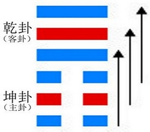

# Pǐ ䷋

* Distress, Obstruction

> Chinese: 否 ䷋ pǐ

<a id="p-83"/>



In **Pǐ ䷋** there is the want of good understanding between the (different classes of) men, and its indication is unfavourable to the firm and correct course of the superior man. We see in it the great gone and the little come.

<a id="p-84"/>

1.<a name="12.1"></a> The first `SIX`, divided, suggests the idea of grass pulled up, and bringing with it other stalks with whose roots it is connected. With firm correctness (on the part of its subject), there will be good fortune and progress.

> **䷋** changing to [**䷘**](e697a0e5a684wuwang.md)

> Matching Line 1 in Adjacent Hexagram: [**䷊**](e6b3b0tai.md#11.1)

2.<a name="12.2"></a> The second `SIX`, divided, shows its subject patient and obedient. To the small man (comporting himself so) there will be good fortune. If the great man (comport himself) as the distress and obstruction require, he will have success.

> **䷋** changing to [**䷅**](e8aebcsong.md)

> Matching Line 2 in Adjacent Hexagram: [**䷊**](e6b3b0tai.md#11.2)

3.<a name="12.3"></a> The third `SIX`, divided, shows its subject ashamed of the purpose folded (in his breast).

> **䷋** changing to [**䷠**](e981afdun.md)

> Matching Line 3 in Adjacent Hexagram: [**䷊**](e6b3b0tai.md#11.3)

4.<a name="12.4"></a> The fourth `NINE`, undivided, shows its subject acting in accordance with the ordination (of Heaven), and committing no error. His companions will come and share in his happiness.

> **䷋** changing to [**䷓**](e8a782guan.md)

> Matching Line 4 in Adjacent Hexagram: [**䷊**](e6b3b0tai.md#11.4)

5.<a name="12.5"></a> In the fifth `NINE`, undivided, we see him who brings the distress and obstruction to a close, -- the great man and fortunate. (But let him say), 'We may perish! We may perish!' (so shall the state of things become firm, as if) bound to a clump of bushy mulberry trees.

> **䷋** changing to [**䷢**](e6998bjin.md)

> Matching Line 5 in Adjacent Hexagram: [**䷊**](e6b3b0tai.md#11.5)

6.<a name="12.6"></a> The sixth `NINE`, undivided, shows the overthrow (and removal of) the condition of distress and obstruction. Before this there was that condition. Hereafter there will be joy.

> **䷋** changing to [**䷬**](e89083cui.md)

> Matching Line 6  in Adjacent Hexagram: [**䷊**](e6b3b0tai.md#11.6)

## Notes

The form of **Pǐ ䷋**, it will be seen, is exactly the opposite of that of [**Tài ䷊**](e6b3b0tai.md). Much of what has been said on the interpretation of that will apply to this, or at least assist the student in making out the meaning of its symbolism. **Pǐ ䷋** is the hexagram of the seventh month. Genial influences have done their work, the processes of growth are at an end. Henceforth increasing decay must be looked for.

Naturally we should expect the advance of the subject of the first of the three weak lines to lead to evil; but if he set himself to be firm and correct, he will bring about a different issue.

Patience and obedience are proper for the small man in all circumstances. If the great man in difficulty yet cherish these attributes, he will soon have a happy issue out of the distress.

The third line is weak. Its place is odd, and therefore for it incorrect. Its subject would vent his evil purpose, but has not strength to do so. He is left therefore to the shame which he ought to feel without a word of warning. Does the ming of the fourth line mean 'the ordination of Heaven,' as [Zhū Xī](https://en.wikipedia.org/wiki/Zhu_Xi) thinks; or the orders of the ruler, as [Guǎn Zǐ](https://en.wikipedia.org/wiki/Guanzi_(text)) says? Whichever interpretation be taken (and some critics unite the two), the action of the subject of the line, whose strength is tempered by the even position, will be good and correct, and issue in success and happiness.

The strong line in the fifth, (its correct), place, brings the distress and obstruction to a close. Yet its subject -- the ruler in the hexagram - is warned to continue to be cautious in two lines of rhyme: --

```
'And let him say, "I die! I die I"
So to a bushy clump his fortune he shall tie.'
```

There is an end of the condition of distress. It was necessary, that condition should give place to its opposite; and the strong line in the topmost place fitly represents the consequent joy.

# [否 ䷋](e590a6pi_cn.md)
